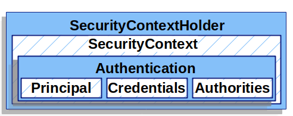

# 权限验证（Authentication）

## 核心组件

- `SecurityContextHolder`：保存验证者的详细信息
  - 保存上下文有三种策略
    - `org.springframework.security.core.context.SecurityContextHolder#MODE_THREADLOCAL`：默认，保存在`ThreadLocal`中，同个线程共享
    - `org.springframework.security.core.context.SecurityContextHolder#MODE_INHERITABLETHREADLOCAL`：
    - `org.springframework.security.core.context.SecurityContextHolder#MODE_GLOBAL`：全局公用一个
- `SecurityContext`：Security上下文， 包含验证信息
- `Authentication`：验证信息

## 用户名/密码 身份验证

- 读取用户名/密码
  - 表单登录
  - Basic验证
  - Digest验证
- 存储机制
  - [In-Memory Authentication](https://docs.spring.io/spring-security/site/docs/5.4.2/reference/html5/#servlet-authentication-inmemory)：内存存储
  - [JDBC Authentication](https://docs.spring.io/spring-security/site/docs/5.4.2/reference/html5/#servlet-authentication-jdbc)：关系型数据库
  - [UserDetailsService](https://docs.spring.io/spring-security/site/docs/5.4.2/reference/html5/#servlet-authentication-userdetailsservice)：自定义数据结构存储
  - [LDAP Authentication](https://docs.spring.io/spring-security/site/docs/5.4.2/reference/html5/#servlet-authentication-ldap)：LDAP存储

