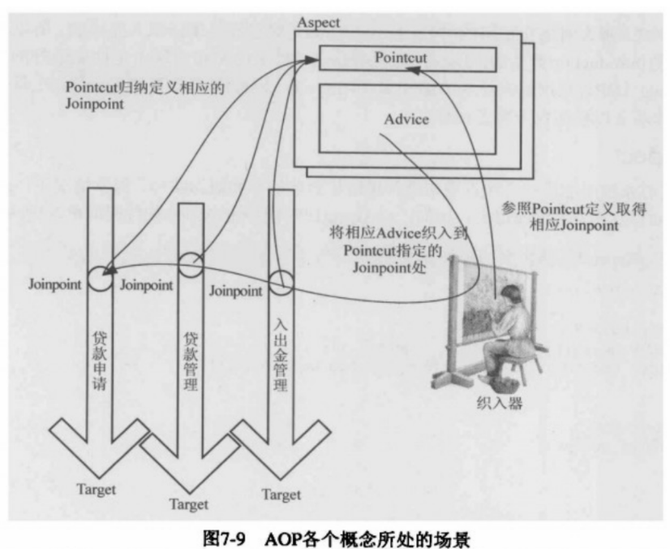

# Spring 

spring的前世今生

不仅仅是框架，成为了一个生态


# IOC容器

## 容器构建

### XML形式构建

applicationContext.xml：

```xml
<?xml version="1.0" encoding="UTF-8"?>
<beans xmlns="http://www.springframework.org/schema/beans"
       xmlns:xsi="http://www.w3.org/2001/XMLSchema-instance" xmlns:aop="http://www.springframework.org/schema/aop"
       xsi:schemaLocation="http://www.springframework.org/schema/beans
        https://www.springframework.org/schema/beans/spring-beans.xsd http://www.springframework.org/schema/aop https://www.springframework.org/schema/aop/spring-aop.xsd">


    <bean id="testBean" class="com.core.TestBean" />

    <bean id="exceptionAspect" class="com.config.aop.ExceptionAspect"/>

    <aop:aspectj-autoproxy />
</beans>
```

构建容器：

```java
package com.core;


import org.springframework.beans.factory.xml.XmlBeanDefinitionReader;
import org.springframework.context.ApplicationContext;
import org.springframework.context.annotation.ComponentScan;
import org.springframework.context.support.ClassPathXmlApplicationContext;
import org.springframework.context.support.GenericApplicationContext;

//@ComponentScan(basePackages = {"com.config"})
public class IOCContainerTest {

    public static void main(String[] args) {
        //方式一
        /*ApplicationContext context =
                new ClassPathXmlApplicationContext("classpath:/applicationContext.xml");*/

        //方式二，更具拓展性
        GenericApplicationContext context = new GenericApplicationContext();
        new XmlBeanDefinitionReader(context).loadBeanDefinitions("classpath:/applicationContext.xml");
        context.refresh();

        System.out.println(context.getBean("testBean"));
        TestBean testBean = (TestBean)context.getBean("testBean");
        testBean.throwException();

    }


}
```


## Bean工厂

### BeanFactory（Bean工厂）

​	用于创建Bean对象的工厂需实现的顶层接口，定义了一些方法，具体实现交给了子类。IOC容器使用的默认实现类是`DefaultListableBeanFactory`，其相关的UML类图如下：


需注意的类或接口：

​	AutowireCapableBeanFactory：定义Bean的自动装配规则

​	HierarchicalBeanFactory ：表示实现这个接口的具体实现类是有继承关系的

​	ListableBeanFactory：表示Bean是可列表化的（举例：循环去获得Bean）


### BeanDefinition（Bean定义）

​	BeanDefiniton是用于描述Spring中的Bean而抽象出来的统一接口，常用实现类是RootBeanDefinition，继承结构如下：


### BeanDefinitionReader（读取Bean）

​	BeanDefinitionReader实现类是用于解析Spring配置文件，即读取配置文件来去创建Bean，来源可以是classPath、fileSystem、网络资源、servletContext等，如XmlBeanDefinitionReader就是用于解析XML文件结构的，其UML类图如下：


## Spring上下文，具体的IOC容器

​	ApplicationContext接口：这是各种类型的上下文都需实现的顶层接口，其结构：

```java
/*
 * Copyright 2002-2014 the original author or authors.
 *
 * Licensed under the Apache License, Version 2.0 (the "License");
 * you may not use this file except in compliance with the License.
 * You may obtain a copy of the License at
 *
 *      http://www.apache.org/licenses/LICENSE-2.0
 *
 * Unless required by applicable law or agreed to in writing, software
 * distributed under the License is distributed on an "AS IS" BASIS,
 * WITHOUT WARRANTIES OR CONDITIONS OF ANY KIND, either express or implied.
 * See the License for the specific language governing permissions and
 * limitations under the License.
 */

package org.springframework.context;

import org.springframework.beans.factory.HierarchicalBeanFactory;
import org.springframework.beans.factory.ListableBeanFactory;
import org.springframework.beans.factory.config.AutowireCapableBeanFactory;
import org.springframework.core.env.EnvironmentCapable;
import org.springframework.core.io.support.ResourcePatternResolver;
import org.springframework.lang.Nullable;

/**
 * Central interface to provide configuration for an application.
 * This is read-only while the application is running, but may be
 * reloaded if the implementation supports this.
 *
 * <p>An ApplicationContext provides:
 * <ul>
 * <li>Bean factory methods for accessing application components.
 * Inherited from {@link org.springframework.beans.factory.ListableBeanFactory}.
 * <li>The ability to load file resources in a generic fashion.
 * Inherited from the {@link org.springframework.core.io.ResourceLoader} interface.
 * <li>The ability to publish events to registered listeners.
 * Inherited from the {@link ApplicationEventPublisher} interface.
 * <li>The ability to resolve messages, supporting internationalization.
 * Inherited from the {@link MessageSource} interface.
 * <li>Inheritance from a parent context. Definitions in a descendant context
 * will always take priority. This means, for example, that a single parent
 * context can be used by an entire web application, while each servlet has
 * its own child context that is independent of that of any other servlet.
 * </ul>
 *
 * <p>In addition to standard {@link org.springframework.beans.factory.BeanFactory}
 * lifecycle capabilities, ApplicationContext implementations detect and invoke
 * {@link ApplicationContextAware} beans as well as {@link ResourceLoaderAware},
 * {@link ApplicationEventPublisherAware} and {@link MessageSourceAware} beans.
 *
 * @author Rod Johnson
 * @author Juergen Hoeller
 * @see ConfigurableApplicationContext
 * @see org.springframework.beans.factory.BeanFactory
 * @see org.springframework.core.io.ResourceLoader
 */
public interface ApplicationContext extends EnvironmentCapable, ListableBeanFactory, HierarchicalBeanFactory,
		MessageSource, ApplicationEventPublisher, ResourcePatternResolver {

	/**
	 * Return the unique id of this application context.
	 * @return the unique id of the context, or {@code null} if none
	 */
	@Nullable
	String getId();

	/**
	 * Return a name for the deployed application that this context belongs to.
	 * @return a name for the deployed application, or the empty String by default
	 */
	String getApplicationName();

	/**
	 * Return a friendly name for this context.
	 * @return a display name for this context (never {@code null})
	 */
	String getDisplayName();

	/**
	 * Return the timestamp when this context was first loaded.
	 * @return the timestamp (ms) when this context was first loaded
	 */
	long getStartupDate();

	/**
	 * Return the parent context, or {@code null} if there is no parent
	 * and this is the root of the context hierarchy.
	 * @return the parent context, or {@code null} if there is no parent
	 */
	@Nullable
	ApplicationContext getParent();

	/**
	 * Expose AutowireCapableBeanFactory functionality for this context.
	 * <p>This is not typically used by application code, except for the purpose of
	 * initializing bean instances that live outside of the application context,
	 * applying the Spring bean lifecycle (fully or partly) to them.
	 * <p>Alternatively, the internal BeanFactory exposed by the
	 * {@link ConfigurableApplicationContext} interface offers access to the
	 * {@link AutowireCapableBeanFactory} interface too. The present method mainly
	 * serves as a convenient, specific facility on the ApplicationContext interface.
	 * <p><b>NOTE: As of 4.2, this method will consistently throw IllegalStateException
	 * after the application context has been closed.</b> In current Spring Framework
	 * versions, only refreshable application contexts behave that way; as of 4.2,
	 * all application context implementations will be required to comply.
	 * @return the AutowireCapableBeanFactory for this context
	 * @throws IllegalStateException if the context does not support the
	 * {@link AutowireCapableBeanFactory} interface, or does not hold an
	 * autowire-capable bean factory yet (e.g. if {@code refresh()} has
	 * never been called), or if the context has been closed already
	 * @see ConfigurableApplicationContext#refresh()
	 * @see ConfigurableApplicationContext#getBeanFactory()
	 */
	AutowireCapableBeanFactory getAutowireCapableBeanFactory() throws IllegalStateException;

}

```

​	ApplicationContext继承了ListableBeanFactory和HierarchicalBeanFactory，满足is a的关系，即它就是一个Bean工厂，可认为是一种包装器模式。

​	其他继承的类的作用：

- MessageSource：支持信息源，可以实现国际化
- ResourcePatternResolver：访问资源
- ApplicationEventPublisher：支持事件应用


DispatherServlet

init方法开始


AbstractApplicationContext的refresh方法


以ClassPathXmlApplicationContext为例了解IOC容器的定位、加载、注册的过程。


# Spring DI

DI（Dependence Injection），即依赖注入，依赖注入发生在两个时间段：一是用户第一次调用BeanFactory的getBean()方法时，二是当配置了lazy-init=false时，IOC容器初始化时就会执行DI。


## BeanFactory和FactoryBean

- BeanFactory： 顶层接口规范，只定义了getName()方法，是管理容器中Bean的工厂

- FactoryBean：一个负责创建Bean的工厂Bean，在Spring中，一般Bean都是通过IOC容器获得的，但FactoryBean本身就是一个工厂，它可以产生其他实例。在BeanFactory中定义了如下代码：

  ```java
  /**
  	 * Used to dereference a {@link FactoryBean} instance and distinguish it from
  	 * beans <i>created</i> by the FactoryBean. For example, if the bean named
  	 * {@code myJndiObject} is a FactoryBean, getting {@code &myJndiObject}
  	 * will return the factory, not the instance returned by the factory.
  	 */
  	String FACTORY_BEAN_PREFIX = "&";
  ```

  它用来标识FactoryBean，即如果myJndiObject 是一个Bean实例，则&myJndiObject 就是FactoryBean本身，而不是它生成的Bean。

注：从BeanFactory的getBean()方法实现的源码中去体会


# Spring AOP

AOP(Aspect Oriented Programming)，是OOP的延续，通过预编译和运行时动态代理再不修改源码的情况下给程序动态统一添加功能的一种技术。追求调用者和被调用者之间的解耦。应用场景如：日志、事务、安全等。

> 把与业务无关的重复逻辑抽离出来，通过AOP去处理

## Spring AOP中的概念

- 切面（Aspect）：AOP抽象出来的一个概念，即把多个类类似的方法处理看成一个面，之后对于这个面在之前、之后等。
- 连接点（PointCut）：可添加逻辑处理的地方
- 通知（Advice）：对连接点处理的具体逻辑实现
- 切人点（PointCut）：具体定义的连接点
- 目标对象：被代理的对象
- AOP代理：具体的代理对象，Spring中有两种代理，一是JDK动代理，二是CGLib代理，默认使用JDK代理，可设置<aop-config>的proxy-target-class属性为true来使用CGLib代理



## 示例

通知的示例

```java
package com.aspect;

import org.aspectj.lang.ProceedingJoinPoint;
import org.aspectj.lang.annotation.*;

/**
 * 定义一个切面
 * 
 */
@Aspect
public class Audience {

    private int peopleCount;

    @Pointcut("execution(* com.aspect.Performance.perform(..))")
    public void performace() {}

    @Pointcut("execution(* com.aspect.Performance.countPerson(int)) && args(count)")
    public void performance(int count) {}

    @Before("performace()")
    public void silenceCellPhone(){
        System.out.println("Silencing cell phones");
    }

    @Before("performace()")
    public void takeSeats(){
        System.out.println("taking seats");
    }


    @AfterReturning("performace()")
    public void applause(){
        System.out.println("CLAP CLAP CLAP");
    }

    @AfterThrowing("performace()")
    public void demandRefund(){
        System.out.println("demanding a refund");
    }

    @Around("performace()")
    public void watchPerformance(ProceedingJoinPoint joinPoint){
        try {
            System.out.println("Sliencing cell phone");
            System.out.println("taking seats");
            //proceed不被调用时，将会阻塞对被通知方法的访问
            joinPoint.proceed();
            System.out.println("CLAP CLAP CLAP");
        } catch (Throwable throwable) {
            System.out.println("demanding a refund");
        }
    }

    @Before("performance(count)")
    public void countPerson(int count){
        this.peopleCount += count;
        System.out.println("people count: " + count);
    }

}

```

在不侵入当前设计的情况下为现有的类增加新功能：

```java
package com.aspect;

import org.aspectj.lang.annotation.Aspect;
import org.aspectj.lang.annotation.DeclareParents;

/**
 * 通过AOP为已有的类增加新功能
 * 
 */
@Aspect
public class EncoreableIntroducer {

    @DeclareParents(value = "com.aspect.Performance+",defaultImpl = DefaultEncoreable.class)
    public static Encoreable encoreable;
}

```

```java
import com.aspect.Audience;
import com.aspect.Encoreable;
import com.aspect.Performance;
import com.config.ConcertConfig;
import org.junit.Test;
import org.junit.runner.RunWith;
import org.springframework.beans.factory.annotation.Autowired;
import org.springframework.test.context.ContextConfiguration;
import org.springframework.test.context.junit4.SpringJUnit4ClassRunner;

@RunWith(SpringJUnit4ClassRunner.class)
@ContextConfiguration(classes = ConcertConfig.class)
public class ConcertTest {

    @Autowired
    public Performance performance;

    //@Autowired
    public Encoreable encoreable;

    @Test
    public void testConcert(){
        System.out.println(performance.getClass().getName());
        if(performance instanceof Encoreable){
            encoreable = (Encoreable)performance;
            encoreable.performEncore();
        }
        performance.perform();
        performance.countPerson(10);

    }
}

```

配置

```java
package com.config;

import com.aspect.*;
import org.springframework.context.annotation.Bean;
import org.springframework.context.annotation.ComponentScan;
import org.springframework.context.annotation.Configuration;
import org.springframework.context.annotation.EnableAspectJAutoProxy;

import java.util.Random;

@Configuration
@EnableAspectJAutoProxy //启动apsectj自动代理
@ComponentScan
public class ConcertConfig {

    @Bean
    public Audience audience(){
        return new Audience();
    }

    @Bean
    public EncoreableIntroducer encoreableIntroducer(){
        return new EncoreableIntroducer();
    }

    //@Bean
    public Encoreable encoreable(){
        return new DefaultEncoreable();
    }

    @Bean
    public Performance performance(){
        return new Performance() {
            @Override
            public void perform() {
                System.out.println("performing...");
            }

            @Override
            public int countPerson(int count) {
                return count;
            }
        };
    }
}

```


# Spring MVC（基于spring4.11）

## 搭建Spring mvc

源码：<https://github.com/craZzoy/testdemo>

### 通过java配置DispatherServlet

spring mvc的核心是DispatherServlet这个类，这里使用java配置方式（非web.xml）配置：

```java
package com.config;

import org.springframework.web.servlet.support.AbstractAnnotationConfigDispatcherServletInitializer;

/**
 * 通过java来配置DispatherServlet(使用servlet3的规范，spring3.1以上)，而非web.xml的方式
 * 实现AbstractAnnotationConfigDispatcherServletInitializer的类会自动配置DispatherServlet和Spring应用上下文
 * Spring上下文位于servlet上下文中
 * Created by zwz on 2019/5/13.
 */
public class SpittrWebAppInitializer extends AbstractAnnotationConfigDispatcherServletInitializer{

    /**
     * 指定配置类用于构建root上下文，即Servlet上下文
     * @return
     */
    @Override
    protected Class<?>[] getRootConfigClasses() {
        return new Class<?>[] {RootConfig.class};
    }

    /**
     * 指定配置类用于构建web上下文，即Spring上下文，用于装载
     * @return
     */
    @Override
    protected Class<?>[] getServletConfigClasses() {
        return new Class<?>[] {WebConfig.class};
    }

    /**
     * DispatherServlet的映射，这里映射到“/”
     * @return
     */
    @Override
    protected String[] getServletMappings() {
        return new String[] {"/"};
    }
}

```

​		AbstractAnnotationConfigDispatcherServletInitializer实现了WebApplicationInitializer，在servlet3.0环境中，容器会在类路径查找实现ServletContainerInitializer的类，而spring提供了它的实现SpringServletContainerInitializer，而SpringServletContainerInitializer又会去寻找WebApplicationInitializer的实现类来构建应用，故实现AbstractAnnotationConfigDispatcherServletInitializer接口能用于启用Spring mvc。

#### spring web应用中的上下文

DispatherServlet启动时会创建Spring应用上下文，spring web应用中通常会有两个上下文：

- Spirng应用上下文：上面通过getServletConfigClasses()方法构建，用于加载web组件，如控制器、视图解析器、处理器映射等。
- root上下文：上面通过getRootConfigClasses()方法构建，这个上下文一般用于装在非web组件，如驱动后端的中间层和数据层组件。

#### 上下文配置类

RootConfig.class：

```java
package com.config;

import org.springframework.context.annotation.ComponentScan;
import org.springframework.context.annotation.Configuration;
import org.springframework.context.annotation.FilterType;
import org.springframework.web.servlet.config.annotation.EnableWebMvc;

/**
 * Created by zwz on 2019/5/13.
 */
@Configuration
@ComponentScan(basePackages = {"com"},
excludeFilters = {@ComponentScan.Filter(type = FilterType.ANNOTATION, value = EnableWebMvc.class)}) //过滤掉Webconfig
public class RootConfig {
}

```

WebConfig.class：

```java
package com.config;

import org.springframework.context.annotation.Bean;
import org.springframework.context.annotation.ComponentScan;
import org.springframework.context.annotation.Configuration;
import org.springframework.web.servlet.ViewResolver;
import org.springframework.web.servlet.config.annotation.DefaultServletHandlerConfigurer;
import org.springframework.web.servlet.config.annotation.EnableWebMvc;
import org.springframework.web.servlet.config.annotation.WebMvcConfigurerAdapter;
import org.springframework.web.servlet.view.InternalResourceViewResolver;

/**
 * Created by zwz on 2019/5/13.
 */
@Configuration
@EnableWebMvc //启用mvc
@ComponentScan("com") //启用组件扫描
public class WebConfig extends WebMvcConfigurerAdapter{

    /**
     * 配置视图
     * @return
     */
    @Bean
    public ViewResolver viewResolver(){
        InternalResourceViewResolver resolver = new InternalResourceViewResolver();
        resolver.setPrefix("/WEB-INF/views/");
        resolver.setSuffix(".jsp");
        //使得上下文中的Bean能够作为Attributes
        resolver.setExposeContextBeansAsAttributes(true);
        return resolver;
    }

    /**
     * 配置静态资源的处理
     * 使的对于静态资源的的请求转发到servlet容器默认的上下文，而不是DispatherServlet处理
     * @param configurer
     */
    @Override
    public void configureDefaultServletHandling(DefaultServletHandlerConfigurer configurer) {
        configurer.enable();
    }
}

```


### 简单应用示例

在对表单数据处理中，使用Java Validation API（JSR-303）的支持来进行校验，使用Mockito测试框架进行测试，使用org.apache.commons.lang3包快速实现自己的hashCode()和equals()方法，部分代码如下：

VO：

```java
package com.vo;
import org.apache.commons.lang3.builder.EqualsBuilder;
import org.apache.commons.lang3.builder.HashCodeBuilder;
import javax.validation.constraints.NotNull;
import javax.validation.constraints.Size;


public class NewSpittle {
    private Long id;

    @NotNull
    @Size(min = 5, max = 16)
    private String username;

    @NotNull
    @Size(min = 5, max = 25)
    private String password;

    @NotNull
    @Size(min = 2, max = 30)
    private String firstname;

    @NotNull
    @Size(min = 2, max = 30)
    private String lastname;

    public NewSpittle() {
    }

    public NewSpittle(String username, String password, String firstname, String lastname) {
        this.username = username;
        this.password = password;
        this.firstname = firstname;
        this.lastname = lastname;
    }

    public NewSpittle(Long id, String username, String password, String firstname, String lastname) {
        this.id = id;
        this.username = username;
        this.password = password;
        this.firstname = firstname;
        this.lastname = lastname;
    }

    public Long getId() {
        return id;
    }

    public void setId(Long id) {
        this.id = id;
    }

    public String getUsername() {
        return username;
    }

    public void setUsername(String username) {
        this.username = username;
    }

    public String getPassword() {
        return password;
    }

    public void setPassword(String password) {
        this.password = password;
    }

    public String getFirstname() {
        return firstname;
    }

    public void setFirstname(String firstname) {
        this.firstname = firstname;
    }

    public String getLastname() {
        return lastname;
    }

    public void setLastname(String lastname) {
        this.lastname = lastname;
    }

    @Override
    public int hashCode() {
        return HashCodeBuilder.reflectionHashCode(this,"id","username");
    }

    @Override
    public boolean equals(Object obj) {
        return EqualsBuilder.reflectionEquals(this,obj,"id","username");
    }
}

```

Controller：

```java
package com.controller;

import com.vo.NewSpittle;
import com.dao.inte.SpittleRepository;
import org.springframework.beans.factory.annotation.Autowired;
import org.springframework.stereotype.Controller;
import org.springframework.ui.Model;
import org.springframework.validation.Errors;
import org.springframework.web.bind.annotation.PathVariable;
import org.springframework.web.bind.annotation.RequestMapping;
import org.springframework.web.bind.annotation.RequestMethod;

import javax.validation.Valid;

/**
 * Created by zwz on 2019/5/18.
 */
@Controller
@RequestMapping("/spittles")
public class SpittleController {

    public SpittleController() {
    }

    private SpittleRepository spittleRepository;

    @Autowired
    public SpittleController(SpittleRepository spittleRepository) {
        this.spittleRepository = spittleRepository;
    }

    /**
     * model 可用Map类型替换
     * @param model
     * @return
     */
    @RequestMapping(method = RequestMethod.GET)
    public String spittles(Model model){
        model.addAttribute(spittleRepository.findSpittle(Long.MAX_VALUE,20));
        return "spittles";
    }

    /**
     * 返回注册表单视图名
     * @return
     */
    @RequestMapping(value = "/register", method = RequestMethod.GET)
    public String register(){
        return "registerForm";
    }

    /**
     * 注册
     * 搭配@Valid对spittle数据进行校验
     * @param spittle
     * @return
     */
    @RequestMapping(value = "/register", method = RequestMethod.POST)
    public String processRegistration( @Valid NewSpittle spittle,Errors errors){

        /**
         * 校验有误重新填写
         */
        if(errors.hasErrors()){
            return "registerForm";
        }

        spittleRepository.save(spittle);

        return "redirect:/spittles/" + spittle.getUsername();
    }

    /**
     *
     * @return
     */
    @RequestMapping(value = "/{username}",method = RequestMethod.GET)
    public String showSpittleProfile(@PathVariable String username,Model model){
        NewSpittle spittle = spittleRepository.findByUsername(username);
        model.addAttribute(spittle);
        return "profile";
    }

}

```


## 视图

### 简单原理

​	前面的WebConfig类中的viewResolver()配置了视图解析器，返回ViewResolver类型，这是Spring定义的视图解析器，可以通过它的实现类来配置各种想要的视图，如InternalResourceViewResolver，其表示将视图解析为WEB应用中的内部资源，一般是JSP。

ViewResolver接口：返回的是View类型

```java
//
// Source code recreated from a .class file by IntelliJ IDEA
// (powered by Fernflower decompiler)
//

package org.springframework.web.servlet;

import java.util.Locale;

public interface ViewResolver {
    /**
    * 传入视图名，以及Locale对象
    */
    View resolveViewName(String var1, Locale var2) throws Exception;
}
```

View接口：

```java
//
// Source code recreated from a .class file by IntelliJ IDEA
// (powered by Fernflower decompiler)
//

package org.springframework.web.servlet;

import java.util.Map;
import javax.servlet.http.HttpServletRequest;
import javax.servlet.http.HttpServletResponse;

public interface View {
    String RESPONSE_STATUS_ATTRIBUTE = View.class.getName() + ".responseStatus";
    String PATH_VARIABLES = View.class.getName() + ".pathVariables";
    String SELECTED_CONTENT_TYPE = View.class.getName() + ".selectedContentType";

    String getContentType();

    void render(Map<String, ?> var1, HttpServletRequest var2, HttpServletResponse var3) throws Exception;
}
```

​	通过render方法来对视图惊醒渲染，传入三个参数：模型数据、request、respose。这里可以解释为什么Model类型可以用map类型替换。

​	Spring中提供了13个视图解析器：


### 标签库

​	Spring提供了两种标签库，一是用于渲染html标签（JSP标签），二是工具类标签

#### JSP标签 

使用需引入：<%@taglib prefix="s" uri="http://www.springframework.org/tags/form" %>


​	一些通用的标签：

使用需引入：<%@taglib prefix="sf" uri="http://www.springframework.org/tags" %>


#### 通过<s:message>标签实现国际化

在WebConfig.class文件中配置信息源：

```java
 /**
     * 配置信息源
     * @return
     */
    @Bean
    public MessageSource messageSource(){
        ResourceBundleMessageSource messageSource = new ResourceBundleMessageSource();
        //设置文件基础名字
        messageSource.setBasename("message");
        //解决中文乱码
        messageSource.setDefaultEncoding("UTF-8");
        return messageSource;
    }
```

可重新加载的信息源：

```java
/**
 * 配置信息源(可重新加载)
 * @return
 */
//@Bean
public MessageSource messageSourceForReload(){
    ReloadableResourceBundleMessageSource messageSource = new ReloadableResourceBundleMessageSource();
    //设置文件基础名字
    messageSource.setBasename("classpath:message");
    messageSource.setCacheSeconds(10);
    //解决中文乱码
    messageSource.setDefaultEncoding("UTF-8");
    return messageSource;
}
```

在类的根路径中创建message文件：


message_en_US.properties:

```properties
spittr.welcome=Welcome to Spitter 
```

message_zh_CN.properties:

```properties
spittr.welcome=欢迎来到Spitter 
```

jsp文件中引用：

```jsp
<%--
  Created by IntelliJ IDEA.
  User: zwz
  Date: 2019/5/15
  Time: 22:05
  To change this template use File | Settings | File Templates.
--%>
<%@ page contentType="text/html;charset=utf-8" language="java" session="false" %>
<%--<%@ taglib prefix="c" uri="http://java.sun.com/jsp/jstl/core" %>--%>
<!--使用Spring的jsp标签-->
<%@taglib prefix="sf" uri="http://www.springframework.org/tags/form" %>
<!--使用Spring的通用标签-->
<%@taglib prefix="s" uri="http://www.springframework.org/tags" %>
<html>
<head>
    <title>Spittr</title>
    <link rel="stylesheet" type="text/css" href="<c:url value="resources/style.css">"/>
</head>
<body>
    <h1><s:message code="spittr.welcome" /></h1>
    <a href="<c:url value="/spittles"/>">spittles</a>
    <a href="<c:url value="/spitter/register"/>">register</a>
</body>
</html>
```

效果：

中文环境：


#### <s:url>标签

​	s:url标签用来创建一个url，它会接收一个相当于Servlet应用上下文的URL，如：

```html
<s:url value="/spitter/register" var="registerUrl"/>
    <a href="${registerUrl}">register</a>
```

实际会渲染为：上下文/spitter/register

```html
<a href="<s:url href="/spitter/register"/>">register</a>
```

带参数和转义：

```html
<s:url value="/spittles" htmlEscape="true">
    <s:param name="max" value="60" />
    <s:param name="count" value="20" />
</s:url>
```

在javascript中转移

```html
<s:url value="/spittles" htmlEscape="true" javaScriptEscape="true">
    <s:param name="max" value="60" />
    <s:param name="count" value="20" />
</s:url>
```

```javascript
<script>
    //渲染为：上下文\/spittles\/?max=60&count=20
    var registerUrl = "{registerUrl}";
</script>
```


类似的可以使用s:escapeBody 将其包含的内容进行转义：

```html
<s:escapeBody htmlEscape="true" javaScriptEscape="true">
    <h1>Hello</h1>
</s:escapeBody>
```


### Apache Tiles视图定义布局

​	Spring中定义的用于布局的视图框架，略


### ThyMeleaf视图解析器

使用参考官网：<https://www.thymeleaf.org/doc/tutorials/3.0/thymeleafspring.html>

简单配置：

```java
@Bean
public SpringResourceTemplateResolver templateResolver(){
    SpringResourceTemplateResolver templateResolver = new SpringResourceTemplateResolver();
    templateResolver.setApplicationContext(this.applicationContext);
    templateResolver.setPrefix("/WEB-INF/templates");
    templateResolver.setSuffix(".html");
    templateResolver.setTemplateMode(TemplateMode.HTML);
    templateResolver.setCacheable(true);
    return templateResolver;
}

@Bean
public SpringTemplateEngine templateEngine(){
    SpringTemplateEngine templateEngine = new SpringTemplateEngine();
    templateEngine.setTemplateResolver(templateResolver());
    templateEngine.setEnableSpringELCompiler(true);
    return templateEngine;
}


@Bean
public ThymeleafViewResolver viewResolver(){
    ThymeleafViewResolver viewResolver = new ThymeleafViewResolver();
    viewResolver.setTemplateEngine(templateEngine());
    viewResolver.setOrder(1);
    viewResolver.setViewNames(new String[]{".html",".xhtml"});
    return viewResolver;
}
```


## Spring MVC高级技术

### Spring中配置DispatherServlet的方式（参考官方**4.3.24.RELEASE**文档）

​	像许多web MVC framework框架一样，Spring也是通过一个核心的Servlet类去处理请求，在Spring中是DispatherServlet，它实现了HttpServlet，也就是前置处理器。请求处理的过程如图：


#### 基于WebApplicationInitializer配置

​	在Servlet3.0+的环境中，典型的JAVE EE Servlet的配置如下，通过下面配置后，以/example开头的请求都会被名为example的`DispatcherServlet` 实例：

```java
public class MyWebApplicationInitializer implements WebApplicationInitializer {

    @Override
    public void onStartup(ServletContext container) {
        ServletRegistration.Dynamic registration = container.addServlet("example", new DispatcherServlet());
        registration.setLoadOnStartup(1);
        registration.addMapping("/example/*");
    }
}
```

以上等同的xml配置方式：

```xml
<web-app>
    <servlet>
        <servlet-name>example</servlet-name>
        <servlet-class>org.springframework.web.servlet.DispatcherServlet</servlet-class>
        <load-on-startup>1</load-on-startup>
    </servlet>

    <servlet-mapping>
        <servlet-name>example</servlet-name>
        <url-pattern>/example/*</url-pattern>
    </servlet-mapping>

</web-app>
```

​	`WebApplicationInitializer`是Spring提供的一个基于java配置的用于初始化任何Servlet3容器的接口，即通过实现它的onStartup方法：

```java
//
// Source code recreated from a .class file by IntelliJ IDEA
// (powered by Fernflower decompiler)
//

package org.springframework.web;

import javax.servlet.ServletContext;
import javax.servlet.ServletException;

public interface WebApplicationInitializer {
    void onStartup(ServletContext var1) throws ServletException;
}
```


​	在Spring中，`ApplicationContext`实例是可以设置作用域的。在Spring MVC架构中，每一个`DispatherServlet`拥有它自己的`WebApplicationContext`，它继承了所有在root `WebApplicationContext`中定义的Bean。root `WebApplicationContext`中定义的Bean应该包括所有的基础设施类（？），并且这些Bean可以被其他Context和Servlet实例共享。可以在特定于servlet的范围中重写这些继承的bean，并且您可以为给定的Servlet实例定义新的特定于范围的bean。

在Spring MVC中，典型的上下文等级如下：


​	DispatcherServlet初始化时，spring mvc会在WEB_INF目录中寻找一个名为【servlet-name】-servlet.xml的文件，创建在此文件中定义的bean，如果全局中有相同名字的Bean，会覆盖。如下面文件定义，寻找的时golfing-servlet文件。

```xml
<web-app>
    <servlet>
        <servlet-name>golfing</servlet-name>
        <servlet-class>org.springframework.web.servlet.DispatcherServlet</servlet-class>
        <load-on-startup>1</load-on-startup>
    </servlet>
    <servlet-mapping>
        <servlet-name>golfing</servlet-name>
        <url-pattern>/golfing/*</url-pattern>
    </servlet-mapping>
</web-app>
```

除了上面的上下文等级结构，Spring Web MVC中还存在一种单个Root Context的上下文等级结构：


这种结构可以通过设置一个空的contextConfigLocation servlet初始化参数类配置：

```xml
<web-app>
    <context-param>
        <param-name>contextConfigLocation</param-name>
        <param-value>/WEB-INF/root-context.xml</param-value>
    </context-param>
    <servlet>
        <servlet-name>dispatcher</servlet-name>
        <servlet-class>org.springframework.web.servlet.DispatcherServlet</servlet-class>
        <init-param>
            <param-name>contextConfigLocation</param-name>
            <param-value></param-value>
        </init-param>
        <load-on-startup>1</load-on-startup>
    </servlet>
    <servlet-mapping>
        <servlet-name>dispatcher</servlet-name>
        <url-pattern>/*</url-pattern>
    </servlet-mapping>
    <listener>
        <listener-class>org.springframework.web.context.ContextLoaderListener</listener-class>
    </listener>
</web-app>
```

我们可以通过基于java类来配置同样上下文等级的结构：

```java
public class GolfingWebAppInitializer extends AbstractAnnotationConfigDispatcherServletInitializer {

    @Override
    protected Class<?>[] getRootConfigClasses() {
        // GolfingAppConfig defines beans that would be in root-context.xml
        return new Class<?>[] { GolfingAppConfig.class };
    }

    @Override
    protected Class<?>[] getServletConfigClasses() {
        // GolfingWebConfig defines beans that would be in golfing-servlet.xml
        return new Class<?>[] { GolfingWebConfig.class };
    }

    @Override
    protected String[] getServletMappings() {
        return new String[] { "/golfing/*" };
    }
}
```


`WebApplicationContext`是对`ApplicationContext` 的延申，如图，每一个WebApplicationContext都会与一个ServletContext绑定 ，可通过getServletContext()获得当前上下文绑定的servlet上下文。

```java
//
// Source code recreated from a .class file by IntelliJ IDEA
// (powered by Fernflower decompiler)
//

package org.springframework.web.context;

import javax.servlet.ServletContext;
import org.springframework.context.ApplicationContext;

public interface WebApplicationContext extends ApplicationContext {
    String ROOT_WEB_APPLICATION_CONTEXT_ATTRIBUTE = WebApplicationContext.class.getName() + ".ROOT";
    String SCOPE_REQUEST = "request";
    String SCOPE_SESSION = "session";
    String SCOPE_GLOBAL_SESSION = "globalSession";
    String SCOPE_APPLICATION = "application";
    String SERVLET_CONTEXT_BEAN_NAME = "servletContext";
    String CONTEXT_PARAMETERS_BEAN_NAME = "contextParameters";
    String CONTEXT_ATTRIBUTES_BEAN_NAME = "contextAttributes";

    ServletContext getServletContext();
}
```


注：`RequestContextUtils` 工具类可获得一些相关的配置信息，如`WebApplicationContext`，更多相关信息请查看RequestContextUtils类。下面是其中一些方法摘录（Spring4.2）

```java
 @Deprecated
    public static WebApplicationContext getWebApplicationContext(ServletRequest request, ServletContext servletContext) throws IllegalStateException {
        WebApplicationContext webApplicationContext = (WebApplicationContext)request.getAttribute(DispatcherServlet.WEB_APPLICATION_CONTEXT_ATTRIBUTE);
        if(webApplicationContext == null) {
            if(servletContext == null) {
                throw new IllegalStateException("No WebApplicationContext found: not in a DispatcherServlet request?");
            }

            webApplicationContext = WebApplicationContextUtils.getRequiredWebApplicationContext(servletContext);
        }

        return webApplicationContext;
    }

    public static WebApplicationContext findWebApplicationContext(HttpServletRequest request, ServletContext servletContext) {
        WebApplicationContext webApplicationContext = (WebApplicationContext)request.getAttribute(DispatcherServlet.WEB_APPLICATION_CONTEXT_ATTRIBUTE);
        if(webApplicationContext == null) {
            if(servletContext != null) {
                webApplicationContext = WebApplicationContextUtils.getWebApplicationContext(servletContext);
            }

            if(webApplicationContext == null) {
                webApplicationContext = ContextLoader.getCurrentWebApplicationContext();
            }
        }

        return webApplicationContext;
    }
```

​	如findWebApplicationContext()所示，查找WebApplacation过程如下（第一个找到为准）：

1. 在request属性中查找
2. servletContext为不为空时（废弃的方法getWebApplicationContext()中，servletContext一定不能为空），就在servletContext的属性中寻找
3. 通过ContextLoader寻找


#### 基于AbstractAnnotationConfigDispatcherServletInitializer配置

一种更简单的配置Spring MVC的方式是通过一个实现了`WebApplicationInitializer`的抽象类`AbstractAnnotationConfigDispatcherServletInitializer`去配置，这种方式也是Spring推荐的配置方式：

```java
public class MyWebAppInitializer extends AbstractAnnotationConfigDispatcherServletInitializer {

    @Override
    protected Class<?>[] getRootConfigClasses() {
        return null;
    }

    @Override
    protected Class<?>[] getServletConfigClasses() {
        return new Class<?>[] { MyWebConfig.class };
    }

    @Override
    protected String[] getServletMappings() {
        return new String[] { "/" };
    }

}
```


#### 基于AbstractDispatcherServletInitializer配置

如果应用的Spring配置是基于xml的，可以通过以下方式构建应用：

```java
public class MyWebAppInitializer extends AbstractDispatcherServletInitializer {

    @Override
    protected WebApplicationContext createRootApplicationContext() {
        return null;
    }

    @Override
    protected WebApplicationContext createServletApplicationContext() {
        XmlWebApplicationContext cxt = new XmlWebApplicationContext();
        cxt.setConfigLocation("/WEB-INF/spring/dispatcher-config.xml");
        return cxt;
    }

    @Override
    protected String[] getServletMappings() {
        return new String[] { "/" };
    }

}
```

其中，AbstractDispatcherServletInitializer提供了一个便利的方式去添加Filter实例，并且会自动把这Filter映射到DispatherServlet，Filter的默认名字是它基于它的具体实现类型

```java
public class MyWebAppInitializer extends AbstractDispatcherServletInitializer {

    // ...

    @Override
    protected Filter[] getServletFilters() {
        return new Filter[] { new HiddenHttpMethodFilter(), new CharacterEncodingFilter() };
    }

}
```

如果想更多的客户化自己的Spring MVC配置，可以重写AbstractDispatcherServletInitializer中的`createDispatcherServlet` 方法

```java
protected DispatcherServlet createDispatcherServlet(WebApplicationContext servletAppContext) {
    return new DispatcherServlet(servletAppContext);
}
```


### 自定义DispatherServlet配置

​	SpittrWebAppInitializer类配置了DispatherServlet，它是通过实现AbstractAnnotationConfigDispatcherServletInitializer类来完成的，当我们需要拓展一些功能时，可重写一些方法就可以了。如添加Filter:

```java
/**
 * 注册Filter，所有的Filter都会映射到DispatherServlet上
 * @return
 */
@Override
protected Filter[] getServletFilters() {
    return super.getServletFilters();
}
```

### web.xml中声明DispatherServlet：

#### 经典的方式：

```xml
<?xml version="1.0" encoding="utf-8"?>
<web-app version="2.5"
  xmlns="http://java.sun.com/xml/ns/javaee"
  xmlns:xsi="http://www.w3.org/2001/XMLSchema-instance"
  xsi:schemaLocation="http://java.sun.com/xml/ns/javaee 
    http://java.sun.com/xml/ns/javaee/web-app_2_5.xsd">
  
  <display-name>Archetype Created Web Application</display-name>
  <!--<welcome-file-list>
    &lt;!&ndash;<welcome-file>home.jsp</welcome-file>&ndash;&gt;
  </welcome-file-list>-->
  
  <!--设置跟上下文配置文件 ContextLoaderListener加载用于创建根应用上下文-->
  <context-param>
    <param-name>contextConfigLocation</param-name>
    <param-value>classpath:root-context.xml</param-value>
  </context-param>
  
  <listener>
    <listener-class>org.springframework.web.context.ContextLoaderListener</listener-class>
  </listener>
  
  <!--配置DispatcherServlet-->
  <servlet>
    <servlet-name>appServlet</servlet-name>
    <servlet-class>org.springframework.web.servlet.DispatcherServlet</servlet-class>
    <!--是否tomcat启动时就加载-->
    <load-on-startup>1</load-on-startup>
  </servlet>
  
  <servlet-mapping>
    <servlet-name>appServlet</servlet-name>
    <url-pattern>/</url-pattern>
  </servlet-mapping>
  
</web-app>
```

看下ContextLoaderListener接口，可看出它是用于装载WebApplicationContext，即应用的上下文。

```java
//
// Source code recreated from a .class file by IntelliJ IDEA
// (powered by Fernflower decompiler)
//

package org.springframework.web.context;

import javax.servlet.ServletContextEvent;
import javax.servlet.ServletContextListener;

public class ContextLoaderListener extends ContextLoader implements ServletContextListener {
    public ContextLoaderListener() {
    }

    public ContextLoaderListener(WebApplicationContext context) {
        super(context);
    }

    public void contextInitialized(ServletContextEvent event) {
        this.initWebApplicationContext(event.getServletContext());
    }

    public void contextDestroyed(ServletContextEvent event) {
        this.closeWebApplicationContext(event.getServletContext());
        ContextCleanupListener.cleanupAttributes(event.getServletContext());
    }
}
```


#### 基于java配置xml

```xml
<?xml version="1.0" encoding="utf-8"?>
<web-app version="2.5"
  xmlns="http://java.sun.com/xml/ns/javaee"
  xmlns:xsi="http://www.w3.org/2001/XMLSchema-instance"
  xsi:schemaLocation="http://java.sun.com/xml/ns/javaee 
    http://java.sun.com/xml/ns/javaee/web-app_2_5.xsd">
  
  <display-name>Archetype Created Web Application</display-name>
  
  <context-param>
    <param-name>contextClass</param-name>
    <param-value>org.springframework.web.context.support.AnnotationConfigWebApplicationContext</param-value>
  </context-param>

  <!--根配置类-->
  <context-param>
    <param-name>contextConfigLocation</param-name>
    <param-value>com.config.RootConfig</param-value>
  </context-param>

  <listener>
    <listener-class>org.springframework.web.context.ContextLoaderListener</listener-class>
  </listener>


  <servlet>
    <servlet-name>appServlet</servlet-name>
    <servlet-class>org.springframework.web.servlet.DispatcherServlet</servlet-class>
    <init-param>
      <param-name>contextClass</param-name>
      <param-value>org.springframework.web.context.support.AnnotationConfigWebApplicationContext</param-value>
    </init-param>
    <init-param>
      <param-name>contextConfigLocation</param-name>
      <param-value>com.config.WebConfig</param-value>
    </init-param>
    <load-on-startup>1</load-on-startup>
  </servlet>


  <servlet-mapping>
    <servlet-name>appServlet</servlet-name>
    <url-pattern>/</url-pattern>
  </servlet-mapping>
</web-app>
```

​	从上述xml中可以看出，RootConfig.class文件配置了WebApplication上下文；WebConfig.class配置了另一个上下文，这个上下文主要用于与Web相关的Bean，如MessageSource（信息源）、ViewResolver（视图解析器）等。

​	其实DispatcherServlet可以看作一个上下文对象，可认为它对ApplicationContext做了封装，如图，DispatherServlet的父类实现了ApplicationContextAware接口，它的内容如下：

```java
//
// Source code recreated from a .class file by IntelliJ IDEA
// (powered by Fernflower decompiler)
//

package org.springframework.context;

import org.springframework.beans.BeansException;
import org.springframework.beans.factory.Aware;

public interface ApplicationContextAware extends Aware {
    void setApplicationContext(ApplicationContext var1) throws BeansException;
}
```

HttpServletBean对它的实现：可看成是一种包装器模式。

```java
public void setApplicationContext(ApplicationContext applicationContext) {
    if(this.webApplicationContext == null && applicationContext instanceof WebApplicationContext) {
        this.webApplicationContext = (WebApplicationContext)applicationContext;
        this.webApplicationContextInjected = true;
    }

}
```


### 处理Mutipart形式的数据

​	文件上传是表单将数据以二进制的形式提交的，matipart格式的数据会将一个表单拆分为多个部分（part），每一个部分对应一个输入域。

##### 配置mutipart解析器

​	DispatherServlet并没有实现任何解析mutipart请求数据的功能，而是将其委托给Spring中的MutipartResolver策略接口的实现去解析。spring3.1开始，Spring内置了两个MutipartResolver的实现：

- CommonMutipartResolver：使用Jakarta commons Fileupload解析mutipart请求。
- StandardServletMutipartResolver：依赖Servlet3.0对Mutipart请求的支持，优先选择。

###### StandardServletMutipartResolver解析器的配置

可在Spring应用上下文声明MutipartResolver Bean（示例在WebConfig中）：

```java
//@Bean
public MultipartResolver multipartResolver() throws Exception{

    return new StandardServletMultipartResolver();
}
```

但是这个方法并未提供限制文件上传相关的参数，如临时路径、文件限制大小等。如果要配置相关的细节，则不是在Spring中配置multipart，而是在Servlet中指定multipart的配置。

​	**如果采用Servlet初始化类的方式来配置DispatherServlet的话**，这个初始化类应该实现了WebApplicationInitializer，那则可以在ServletRegistration.Dynamic调用setMultipartConfig进行配置：

```java
	DispatherServlet ds = new DispatherServlet();
	ServletRegistration.Dynamic registration = context.addServlet("appServlet",ds);
    registration.setMultipartConfig(
            new MultipartConfigElement("/tmp/spittr/uploads",2097152,4194304,0));

```

​	**如果我们配置DispatherServlet的初始化类继承了AbstractAnnotationConfigDispatcherServletInitializer或者AbstractDispatcherServletInitializer**（例子中是SpittrWebAppInitializer类），我们则可以通过重载customizeRegistration方法来进行配置：

```java
/**
 * 添加额外的配置
 * @param registration
 */
@Override
protected void customizeRegistration(ServletRegistration.Dynamic registration) {
    registration.setMultipartConfig(
            new MultipartConfigElement("/tmp/spittr/uploads",2097152,4194304,0));
}
```

MultipartConfigElement构造方法中四个参数分别是：

- location：临时路径，是文件系统中的一个绝对路径，上传文件将会临时写入该目录必须传入
- maxFileSize：上传文件大小的最大值（byte），上面配置了2m
- maxRequestSize：整个请求的最大容量（byte），上面配置了4m
- fileSizeThreshold：指定一个容量大小（byte），当文件容量达到这个值时就将其存入临时路径，0表示都存入，即都写入磁盘。

MultipartConfigElement类的内容：

```java
//
// Source code recreated from a .class file by IntelliJ IDEA
// (powered by Fernflower decompiler)
//

package javax.servlet;

import javax.servlet.annotation.MultipartConfig;

public class MultipartConfigElement {
    private String location;
    private long maxFileSize;
    private long maxRequestSize;
    private int fileSizeThreshold;

    public MultipartConfigElement(String location) {
        if(location == null) {
            this.location = "";
        } else {
            this.location = location;
        }

        this.maxFileSize = -1L;
        this.maxRequestSize = -1L;
        this.fileSizeThreshold = 0;
    }

    public MultipartConfigElement(String location, long maxFileSize, long maxRequestSize, int fileSizeThreshold) {
        if(location == null) {
            this.location = "";
        } else {
            this.location = location;
        }

        this.maxFileSize = maxFileSize;
        this.maxRequestSize = maxRequestSize;
        this.fileSizeThreshold = fileSizeThreshold;
    }

    public MultipartConfigElement(MultipartConfig annotation) {
        this.location = annotation.location();
        this.fileSizeThreshold = annotation.fileSizeThreshold();
        this.maxFileSize = annotation.maxFileSize();
        this.maxRequestSize = annotation.maxRequestSize();
    }

    public String getLocation() {
        return this.location;
    }

    public long getMaxFileSize() {
        return this.maxFileSize;
    }

    public long getMaxRequestSize() {
        return this.maxRequestSize;
    }

    public int getFileSizeThreshold() {
        return this.fileSizeThreshold;
    }
}

```


###### **CommonMutipartResolver的配置**

​	如何应用时基于非servlet3.0容器的，则可以考虑使用CommonsMultipartResolver，以下配置的内容基本等同于前面通过MultipartConfigElement配置的内容。

```java
@Bean
public MultipartResolver multipartResolver() throws Exception{
    CommonsMultipartResolver multipartResolver = new CommonsMultipartResolver();
    //临时路径
    multipartResolver.setUploadTempDir(new FileSystemResource("/tmp/spittr/uploads"));
    //上传文件大小的最大值
    multipartResolver.setMaxUploadSize(2097152);
    //指定一个容量大小（byte），当文件容量达到这个值时就将其存入临时路径
    multipartResolver.setMaxInMemorySize(0);
}
```

​	与StandardServletMutipartResolver不同的是，CommonsMultipartResolver没有强制配置临时路径，当没配置时临时路径就是servlet容器的临时目录（？），同时，不能配置整个请求的最大容量。


示例前端代码：

```html
<!DOCTYPE html>
<html xmlns="http://www.w3.org/1999/xhtml" xmlns:th="http://www.thymeleaf.org">
<head>
    <meta charset="UTF-8">
    <title>Title</title>
</head>
<body>
    <h2>文件上传</h2>
    <form method="post" action="/spitter/register" th:object="${Spitter}" enctype="multipart/form-data">
        <label>Profile Picture</label>
        <input type="file" name="profilePicture" accept="image/jpeg,image/png,image/gif"/>
        <input type="submit" value="提交"/>
        <br/>
    </form>

</body>
</html>
```

处理文件上传逻辑

```java
/**
 * 每个输入域对应一个part这里有体现，基于Servlet3的容器，使用Part
 * @return
 */
@RequestMapping(value = "/register",method = RequestMethod.POST)
public String processRegistration(
        @RequestPart("profilePicture") Part profilePicture,
        @Valid Spitter spitter,
        Errors errors){
    try {
        profilePicture.write("D:\\user\\"+profilePicture.getSubmittedFileName());
    } catch (IOException e) {
        e.printStackTrace();
    }
    return "register";
}
```


### 异常处理

Spring提供了多种方式将异常转换为响应：

- 特定的Spring异常将会自动映射为指定的**HTTP状态码**
- 可以在异常上加上@ResponseStatus注解，从而将其映射为某一个HTTP状态码
- 在方法上加上@ExceprionHandel注解，使其处理异常

spring中一些会默认映射为HTTP状态码的异常如下图，这些异常会由spring自动抛出，是作为DispatherServlet处理过程中出现问题抛出的。如果DispatherServlet无法找到合适的处理请求的控制器方法，将会抛出NoSuchRequestHandlingMethodException异常，最终结果是404的状态反映。


#### 使用ResponseStatus映射异常到HTTP状态码：

```java
package com.common.exception;

import org.springframework.http.HttpStatus;
import org.springframework.web.bind.annotation.ResponseStatus;

/**
 * Created by zwz on 2019/7/7.
 */
@ResponseStatus(value = HttpStatus.NOT_FOUND,reason = "Spittle Not Found")
public class SpittleNotFoundException extends RuntimeException{
}
```

```java
@RequestMapping(value="/{spittleId}",method = RequestMethod.GET)
public String spittle(@PathVariable("spittleId") Long spitterId, Model model){
    Spitter spittle = repository.findOne();
    if(spittle == null){
        throw new SpittleNotFoundException();
    }
    model.addAttribute(spitterId);
    return "spittle";
}
```

返回效果：


# Spring MVC原理（Spring5.0） 


# Spring 原理

## Bean 注入的实现（DI原理）

### Bean类型

- 编码 BeanDefinition生成的
- XML 配置的
  - 
- 注解标注的
  - org.springframework.beans.factory.annotation.AnnotatedBeanDefinition
- 直接注册的
- FactoryBean 生成的 

### FactoryBean 是如何当做一个 Bean 被注入?

- 返回 Bean 类型
  - getObjectType()
- 返回 Bean 对象
  - getObject() 


### BeanFactory 依赖查找 

- 通过名称查找	
  - getBean(String)
- 通过类型查找
  - getBean(Class)
    - 直接查找 BeanDefinition#getBeanClassName() : String
    - 间接查找 BeanFactory#getObjectType
- 通过名称 + 类型查找
  - getBean(String,Class)
- 通过注解查找
  - getBeansWithAnnotation(Annotation) 


org.springframework.core.env.Environment