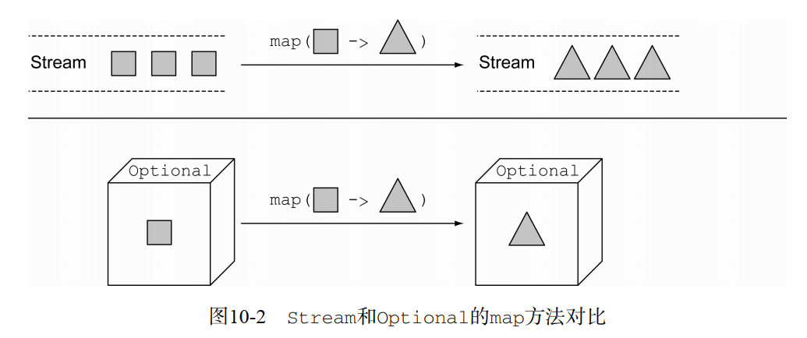

# **Lambda表达式**

```java
package com.base;

public class Invoice {
        private String id;
        private Double  amount;
        private String customer;

    public Invoice(String id, Double amount, String customer) {
        this.id = id;
        this.amount = amount;
        this.customer = customer;
    }

    public String getCustomer() {
        return customer;
    }

    public void setCustomer(String customer) {
        this.customer = customer;
    }

    public Invoice(String id, Double amount) {
        this.id = id;
        this.amount = amount;
    }

    public String getId() {
            return id;
        }

        public void setId(String id) {
            this.id = id;
        }

        public Double getAmount() {
            return amount;
        }

        public void setAmount(Double amount) {
            this.amount = amount;
        }
}
```

## 为什么是Lambda

​	lambda使用了“行为参数化”模式，使的代码更加简洁易懂。比如，如果你想在invoices集合中找到金额大于某个值的元素，可能会定义如下方法：

``` java
List<Invoice> findInvoiceGraterThanAmount(List<Invoice> invoices,double amount){
    List<Invoice> result = new ArrayList<>();
    for(Invoice invoice:invoices){
        if(invoice.getAmount()>amount){
            result.add(invoice);
        }
    }
    return result;
}
```

​	假如还需要找到比某个值小的，或者某个customser为特定值的集合呢，再定义一些方法？此时我们可以定义一个接口，把这种行为参数化：

```java
interface InvoicePredicate{
    boolean test(Invoice invoice);
}
```

```java
List<Invoice> findInvoices(List<Invoice> invoices,InvoicePredicate predicate){
    List<Invoice> result = new ArrayList<>();
    for(Invoice invoice:invoices){
        if(predicate.test(invoice)){
            result.add(invoice);
        }
    }
    return result;
}
```

​	如上述代码，根据不同的需求，我们可以通过传递不同的InvoicePredicate实现去满足，这样的话就把findInvoice的行为参数化了。但是，我们的调用中代码还是很冗长：

```java
List<Invoice> expensiveInvoicesForA = findInvoices(invoices, new InvoicePredicate() {
    @Override
    public boolean test(Invoice invoice) {
        return "a".equals(invoice.getCustomer());
    }
});
```

​	想要更简洁灵活，可以使用Lambda表达式：

```java
List<Invoice> expensiveInvoicesForB = 
        findInvoices(invoices,invoice -> "a".equals(invoice.getCustomer()));
```


## Lambda表达式定义

​	最简单来说，lambda表达式是一个可以出传递的匿名函数，它有以下特性：

- 匿名的：lambda表达式不像一般方法那样有名字，它是匿名的并且没有名字。它有点像匿名类的一种简写方式
- 函数：像一般方法一样，lambda表达式有一序列的参数，方法体，返回类型，抛出异常等，但它没有名字，并且不再一个特定的类中
- 可传递的：lambda可作为参数传递到方法中，并且存储在变量中，可作为结果返回。


## 句法

lambda语句有**两种形式**如下，如果参数生命类型可以推断的化可以省略，此外，如果只有一个参数的化可以省略括号。

1. (paramater) -> expression（如果是简单的表达式）
2. (paramater) -> expression


## 使用场景

​	简而言之，lambda表达式可以在函数式接口的上下文中使用，而函数式接口是指只有一个抽象方法的接口，如Runnable和FileFilter，它们只定义了一个接口，所以可以作为函数式接口使用。

```java
@FunctionalInterface
public interface Runnable {
    public abstract void run();
}
```

```java
@FunctionalInterface
public interface FileFilter {
    boolean accept(File pathname);
}
```

​	假如我想把有定义多个方法的接口作为函数式接口呢？此时必须把把其他方法提供默认实现，只留一个抽象方法，这样Lambda表达式执行时才能去判断去实现哪个方法。

```java
interface InvoicePredicate{
    boolean test(Invoice invoice);

    default boolean test1(Invoice invoice){
        return true;
    };
}
```

### FunctionalInterface注解

​	这个FunctionalInterface注解类似Override注解的使用，它声明了有一个方法要被实现。而这里只是用于文档用于标识这个接口要成为函数式接口，如果未匹配到函数式接口的定义规则，编译器会报错。


## 方法引用

​	方法引用允许重用现有的方法定义并且像lambda一样传递，最简单的理解就是它是一个lambda调用一个特定方法的简写符号。比如：

```java
File[] hiddenFiles = mainDirectory.listFiles(f -> f.isHidden());
//使用方法引用
File[] hiddenFilesa = mainDirectory.listFiles(File::isHidden);
```

方法引用可分为以下几种：

- 静态方法引用：ClassName::methodName
- 实例上实例方法引用：instanceReference::methodName
- 超类上实例方法引用：super::methodName
- 类型上的实例方法引用：ClassName::methodName
- 构造方法引用：Class::new
- 数组构造方法引用：TypeName[]::new

匿名内置类和lambda表达式


# Streams

## 使用的stream的必要

- 使用声明式的方式表示表示典型的数据处理模式（像sql），可以简化代码并且更易理解
- 通过stream更快的处理数据，对于多线程的执行已经默认实现，不需自己编写

## 什么是stream

​	stream可实现类数据库操作，它是一个支持多种聚合操作数据源的中所有元素的序列

- 元素的序列：流提供一个接口，该接口指向一组有特定类型的按顺序排列的值，但是，stream实际不存储值，它是按需计算的
- 数据源：stream的数据源可来自集合、数组、IO资源等
- 聚合操作：stream支持多种聚合操作，比如filter、map、reduce、findFirst、allMatch、sorted等等
- 流水线式：许多stream操作返回Stream类型，这个可以实现链式编程。这种特性实现一些优化，比如惰性、短路和循环融合
- 内迭式：区别于java8以前的显示迭代

## stream操作

​	stream主要有两种类型的操作：

1. 中间操作：执行后依然返回stream，这样可以连接起来形成一个管道，如filter、sorted、map等，这种类型是“懒惰”（惰性加载？）的，经常被优化。
2. 结束操作：执行后从管道中直接返回结果，如collect、findFirst、allmatch等

### filter

```java
package com.base;

import java.util.ArrayList;
import java.util.List;
import java.util.stream.Collectors;

/**
 * Created by zwz on 2019/8/19.
 */
public class StreamDemo {

    public static void main(String[] args) {
        List<Invoice> invoices = new ArrayList<>();
        invoices.add(new Invoice("1",1000.0));
        invoices.add(new Invoice("2",6346.0));
        invoices.add(new Invoice("3",3463.0));
        invoices.add(new Invoice("4",3454.0));
        List<Invoice> expensiveInvoices = invoices.stream().
                skip(2).    //跳过前两个参数
                filter(inv -> inv.getAmount()>1000.0).
                limit(5).
                collect(Collectors.toList());
        for(int i = 0; i < expensiveInvoices.size(); i++){
            System.out.println(expensiveInvoices.get(i).getAmount());
        }
    }


}


```

结果：

`3463.0
3454.0`

### allMatch

```java
package com.base;

import java.util.ArrayList;
import java.util.List;
import java.util.stream.Collectors;

/**
 * Created by zwz on 2019/8/19.
 */
public class StreamDemo {

    public static void main(String[] args) {
        List<Invoice> invoices = new ArrayList<>();
        invoices.add(new Invoice("1",1000.0));
        invoices.add(new Invoice("2",6346.0));
        invoices.add(new Invoice("3",3463.0));
        invoices.add(new Invoice("4",3454.0));
        List<Invoice> expensiveInvoices = invoices.stream().
                skip(2).    //跳过前两个参数
                filter(inv -> inv.getAmount()>1000.0).
                limit(5).
                collect(Collectors.toList());
        System.out.println(invoices.stream().allMatch(inv->inv.getAmount()>500));;

    }


}
```

输出：

`true`

### finding

```java
package com.base;

import java.util.ArrayList;
import java.util.List;
import java.util.Optional;
import java.util.stream.Collectors;

/**
 * Created by zwz on 2019/8/19.
 */
public class StreamDemo {

    public static void main(String[] args) {
        List<Invoice> invoices = new ArrayList<>();
        invoices.add(new Invoice("1",1000.0));
        invoices.add(new Invoice("2",6346.0));
        invoices.add(new Invoice("3",3463.0));
        invoices.add(new Invoice("4",3454.0));
        List<Invoice> expensiveInvoices = invoices.stream().
                skip(2).    //跳过前两个参数
                filter(inv -> inv.getAmount()>1000.0).
                limit(5).
                collect(Collectors.toList());
       	//findAny、findFirst常与一些Stream操作结合，如filter
        Optional<Invoice> invoice = invoices.stream().filter(inv -> inv.getAmount()>1000.0).findAny();
    }

}
```

### mapping

```java
package com.base;

import java.util.ArrayList;
import java.util.List;
import java.util.Optional;
import java.util.stream.Collectors;

/**
 * Created by zwz on 2019/8/19.
 */
public class StreamDemo {

    public static void main(String[] args) {
        List<Invoice> invoices = new ArrayList<>();
        invoices.add(new Invoice("1",1000.0));
        invoices.add(new Invoice("2",6346.0));
        invoices.add(new Invoice("3",3463.0));
        invoices.add(new Invoice("4",3454.0));
        List<Invoice> expensiveInvoices = invoices.stream().
                skip(2).    //跳过前两个参数
                filter(inv -> inv.getAmount()>1000.0).
                limit(5).
                collect(Collectors.toList());
		//让每个值都执行对应的表达式
        List<String> ids = invoices.stream().map(Invoice::getId).collect(Collectors.toList());

        for(int i = 0; i < ids.size(); i++){
            System.out.println(ids.get(i));
        }
    }

}
```

结果：

`1
2
3
4`

### reducing

```java
package com.base;

import java.util.ArrayList;
import java.util.Arrays;
import java.util.List;
import java.util.Optional;
import java.util.stream.Collectors;

/**
 * Created by zwz on 2019/8/19.
 */
public class StreamDemo {

    public static void main(String[] args) {
        int[] numbers = {1,2,3,4,5};
        //reduce用于计算，第一个参数是默认值
        int sum = Arrays.stream(numbers).reduce(0,(a,b)->a+b);
        int product = Arrays.stream(numbers).reduce(1,(a,b)->a*b);
        int max = Arrays.stream(numbers).reduce(Integer.MIN_VALUE,Integer::max);

        System.out.printf("sum:%d  product:%d  max:%d",sum,product,max);
    }


}
```

输出：

`sum:15  product:120  max:5`

### Collectors

```java
package com.base;

import java.util.*;
import java.util.stream.Collectors;

/**
 * Created by zwz on 2019/8/19.
 */
public class StreamDemo {

    public static void main(String[] args) {
        List<Invoice> invoices = new ArrayList<>();
        invoices.add(new Invoice("1",1000.0,"a"));
        invoices.add(new Invoice("2",6346.0,"b"));
        invoices.add(new Invoice("3",3463.0,"a"));
        invoices.add(new Invoice("4",3454.0,"b"));
        //指定一个Collector操作，用于处理返回数据，这里是根据customer分组
        List<String> ids = invoices.stream().map(Invoice::getId).collect(Collectors.toList());

    }

}
```

### 平行的stream

```java
package com.base;

import java.util.*;
import java.util.stream.Collectors;
import java.util.stream.Stream;

/**
 * Created by zwz on 2019/8/19.
 */
public class StreamDemo {

    public static void main(String[] args) {
        List<Invoice> invoices = new ArrayList<>();
        invoices.add(new Invoice("1",1000.0,"a"));
        invoices.add(new Invoice("2",6346.0,"b"));
        invoices.add(new Invoice("3",3463.0,"a"));
        invoices.add(new Invoice("4",3454.0,"b"));
        //方式一
        List<Invoice> expensiveInvoices = invoices.parallelStream().
                skip(2).    //跳过前两个参数
                filter(inv -> inv.getAmount()>1000.0).
                limit(5).
                collect(Collectors.toList());
        //方式二
        Stream<Invoice> invoices1 = invoices.stream().
                skip(2).    //跳过前两个参数
                filter(inv -> inv.getAmount()>1000.0).
                limit(5);
        List<Invoice> results = invoices1.parallel()
                .collect(Collectors.toList());

    }


}
```

​	但是，并不是任何时候使用平行Stream都是合理的，需考虑以下因素：

1. 可分性：如果数据的结构是很容易分为几部分的，如arrays，那么多线程执行将会很方便，但像ListList这种数据结构，拆分反而反而会耗费更多性能
2. 每个元素的开销：如果对于每个元素的处理开销比重比较大，那个用平行Stream能得到更好的效果
3. 包装：使用原生类型由于对象类型，因为它耗费更小内存和更小的缓存局部性
4. 数据大小：数据越大越能体会多线程运行的优势
5. cup数：一般而言，cpu越多，能同时执行的线程越多

### JMH基准测试

入门：<http://tutorials.jenkov.com/java-performance/jmh.html>

官网：<http://openjdk.java.net/projects/code-tools/jmh/>


# 函数式设计

## 理解 @FunctionalInterface 

### @FunctionalInterface 

​	用于函数式接口类型声明的信息注解类型，这些接口的实例被Lambda表达式、方法引用或构造器引用创建。

- 函数式接口只能有一个抽象方法，并排除接口默认方法以及声明中覆盖Object的公开方法的统计。
- @FunctionalInterface不能标注在注解、类以及枚举上（编译器实现？怎么实现？）。

​	违背以上原则，不能视为函数式接口，用注解@FunctionalInterface标注编译器会报错。当一个接口满足以上原则时，无论是否标注了@FunctionalInterface，都会被编译器视为函数式接口。

```java
package charpt4.functional;

import java.io.ObjectInputStream;

/**
 * Created by zwz on 2019/8/24.
 */
public class FunctionInterfaceDemo {

    public static void main(String[] args) {
        Functional f = () -> {
            System.out.println("666");
        };
        f.excute();
    }
}

@FunctionalInterface
interface Functional{

    /**
     * 覆盖的Object方法，不会算入抽象方法计数
     * @param obj
     * @return
     */
    //@Override
    boolean equals(Object obj);

    void excute();
}
```


### 函数式接口类型

- 提供类型-Supplier<T>

  从接口文档说明可以看出这是一个只有输出没有输入的模式，T是返回类型

  ```java
  package charpt4.functional;
  
  import java.io.ObjectInputStream;
  
  /**
   * Created by zwz on 2019/8/24.
   */
  public class FunctionInterfaceDemo {
  
      public static void main(String[] args) {
          //匿名内置类实现
          Functional f = new Functional() {
              @Override
              public void excute() {
  
              }
          };
          //Lambda表达式
          Functional f1 = () -> {
              System.out.println("666");
          };
          f1.excute();
      }
  }
  
  @FunctionalInterface
  interface Functional{
  
      /**
       * 覆盖的Object方法，不会算入抽象方法计数
       * @param obj
       * @return
       */
      //@Override
      boolean equals(Object obj);
  
      void excute();
  }
  ```

  查看`FunctionInterfaceDemo`编译后生成的字节码，可看出f和f1的实现方式是通过不同的jvm指令实现的，invokespecial指令（java.lang.invoke.MethodHandle）是生成了内部类，f1则是通过invokedynamic（java.lang.invoke.InvokeDynamic，since jdk1.7）实现，并未生成内部类。

  ```java
  Compiled from "FunctionInterfaceDemo.java"
  public class charpt4.functional.FunctionInterfaceDemo {
    public charpt4.functional.FunctionInterfaceDemo();
      Code:
         0: aload_0
         1: invokespecial #1                  // Method java/lang/Object."<init>":()V
         4: return
  
    public static void main(java.lang.String[]);
      Code:
         0: new           #2                  // class charpt4/functional/FunctionInterfaceDemo$1
         3: dup
         4: invokespecial #3                  // Method charpt4/functional/FunctionInterfaceDemo$1."<init>":()V
         7: astore_1
         8: invokedynamic #4,  0              // InvokeDynamic #0:excute:()Lcharpt4/functional/Functional;
        13: astore_2
        14: aload_2
        15: invokeinterface #5,  1            // InterfaceMethod charpt4/functional/Functional.excute:()V
        20: return
  }
  ```

- 消费类型-Consumer<T> 接口

  Cousumer是只有输出没有输入的模式，纯消费类型，T为传入的参数类型

  ```java
  package charpt4.functional;
  
  import java.util.function.Consumer;
  
  /**
   * Created by zwz on 2019/8/26.
   */
  public class ConsumerDemo {
      public static void main(String[] args) {
          Consumer consumer = System.out::println;
          consumer.accept(new Object());
          consumer.accept("Hello World");
  
          Consumer<String> consumer1 = ConsumerDemo::echo;
          Consumer<String> consumer2 = ConsumerDemo::echoHasException;
          Consumer<String> consumer3 = ConsumerDemo::echoAddMsg;
  
          //andThen用法，相当一个调用链对同一个参数处理
          //如果某个处理方法中有异常返回，返回异常当前节点的后续将不能执行
          consumer1.andThen(consumer).andThen(consumer3).andThen(consumer2).accept("你好啊！");
      }
  
      private static void echoAddMsg(String s) {
          System.out.println(s+"不好");
      }
  
      private static void echoHasException(String s) {
          throw new RuntimeException("haha");
      }
  
      private static void echo(String msg) {
          System.out.println("echo: " + msg);
      }
  }
  ```

- 转换类型-Function<T,R>接口

  Function是接受一个参数并且返回一个参数的模式，T是参数类型，R是返回类型

  ```java
  package charpt4.functional;
  
  import java.util.function.Function;
  
  /**
   * Created by zwz on 2019/8/26.
   */
  public class FunctionDemo {
      public static void main(String[] args) {
          Function<String,Long> stringLongFunction = FunctionDemo::StringToLong;
          stringLongFunction.apply("67");
  
          Function<Long,String> longStringFunction = FunctionDemo::longToString;
          longStringFunction.apply(7L);
  
          //在执行stringLongFunction之前会执行longStringFunction
          Long value = stringLongFunction.compose(longStringFunction).apply(1L);
          //System.out.println(value);
  
          //apply参数对应integerToString方法入参
          Function<Integer,String> function = FunctionDemo::integerToString;
          Long value1 = stringLongFunction.compose(function).apply(456);
      }
  
  
      public static String longToString(Long l){
          System.out.println("longToString:"+l);
          return String.valueOf(l);
      }
  
      public static Long StringToLong(String s){
          System.out.println("StringToLong:"+s);
          return Long.valueOf(s);
      }
  
      public static String integerToString(Integer i){
          System.out.println("integerToString:"+i);
          return i.toString();
      }
  }
  ```

- 断定类型-Predicate<T>接口

  根据入参T做某些判断的模式

  ```java
  package charpt4.functional;
  
  import java.io.File;
  import java.util.function.Predicate;
  
  /**
   * Created by zwz on 2019/8/26.
   */
  public class PredicateDemo {
      public static void main(String[] args) {
          Predicate<File> filePredicate = File::isFile;
          System.out.println(filePredicate.test(new File("")));
      }
  }
  ```

- 隐藏类型-Action

  即既没有输入也没有输出的模式，一般是Runnable接口

  ```java
  package charpt4.functional;
  
  /**
   * Created by zwz on 2019/8/26.
   */
  public class ActionDemo {
      public static void main(String[] args) {
          Runnable runnable = new Runnable() {
              @Override
              public void run() {
                  System.out.println("内部类实现");
              }
          };
          runnable.run();
  
          Runnable runnable1 = ()->{
              System.out.println("invokedynamic指令");
          };
          runnable1.run();
      }
  }
  ```

## 函数式接口设计

- Supplier<T>接口设计

  - 基本特点：只出不进
  - 作为方法/构造函数、方法返回值
  - 使用场景：数据来源，代码替代接口

  你可能会有个疑问，为什么获取一个值就一个return的事，何必特地搞出一个Supplier接口这么复杂？我们看看下面代码：

  ```java
  package charpt4.functional;
  
  import java.util.function.Supplier;
  
  
  /**
   * Created by zwz on 2019/8/26.
   */
  public class SupplierDesignDemo {
      public static void main(String[] args) {
          //固定参数，固定实现
          echo("Hello,World");
  
          //可变化的实现
          echo(() ->{
              sleep(1000);
              return "Hello World";
          });
      }
  
      private static void echo(String msg) {
          System.out.println(msg);
      }
  
      /**
       * Supplier作为方法参数
       * @param msg
       */
      private static void echo(Supplier<String> msg){
          System.out.println(msg.get());
      }
  
      private static void sleep(long millis) {
          try {
              Thread.sleep(millis);
          } catch (InterruptedException e) {
              throw new RuntimeException(e);
          }
      }
  }
  ```

  在看另一个好处，Supplier可以先保留执行流程，然后在某个特定时间执行：

  ```java
  package charpt4.functional;
  
  import java.util.function.Supplier;
  
  
  /**
   * Created by zwz on 2019/8/26.
   */
  public class SupplierDesignDemo {
      public static void main(String[] args) {
          //及时返回数据
          getMessage();
  
          //待执行的数据获取流程
          Supplier<String> getString = SupplierDesignDemo::getMessage;
          //实际执行
          getString.get();
      }
  
      public static String getMessage() {
          return "Hello,World";
      }
  }
  ```

- Cousumer<T>接口设计

  - 基本特点：只进不出
  - 编程范式：作为方法构造参数
  - 使用场景：执行callback

- Function<T,R>接口设计

  - 基本特点：有进有出
  - 编程范式：作为方法/构造器参数
  - 使用场景：类型转换、业务处理等

  ```java
  package charpt4.functional;
  
  import java.util.function.Function;
  
  /**
   * Created by zwz on 2019/8/26.
   */
  public class FunctionDesignDemo {
      public static void main(String[] args) {
          //Function用于数据转换
          Function function = a -> a;
          Function<Integer,Integer> function1 = a -> a/2;
          System.out.println(function1.apply(90));
      }
  }
  ```

- Predicate<T>接口设计

  - 基本特点：boolean类型判断
  - 编程范式：作为方法/构造器参数
  - 使用场景：过滤、对象比较等

  ```java
  package charpt4.functional;
  
  import java.util.*;
  import java.util.function.Predicate;
  import java.util.stream.Collector;
  import java.util.stream.Collectors;
  import java.util.stream.Stream;
  
  public class PredicateDesignDemo {
  
      public static void main(String[] args) {
          //过滤数据
          List<Integer> numbers = Arrays.asList(1,2,2,3,4,5);
          Collection<Integer> even = filter(numbers,num -> num % 2 == 0);
          Collection<Integer> odd = filter(numbers,num -> num % 2 != 0);
          System.out.println(even);
          System.out.println(odd);
  
          //用Stream操作
          Stream.of(1,2,3,4,5,6).filter(num -> num % 2 == 0).forEachOrdered(System.out::println);
      }
  
      public static <E> Collection<E> filter(Collection<E> source, Predicate<E> predicate){
          //集合操作，最后别直接操作原有数据
          //这里是浅拷贝
          List<E> copy = new ArrayList<E>(source);
          Iterator<E> iterator = copy.iterator();
          while(iterator.hasNext()){
              E element = iterator.next();
              if(!predicate.test(element)){
                  iterator.remove();
              }
          }
          return Collections.umodifiableCollection(copy);
      }
  }
  ```
  
  

## 函数式在框架中的运用

​	函数式在Spring5+，SpringBoot2+，Google guava等框架中都有众多的运用，是趋势所逼。

## Stream API设计

### 基本操作

- 转换：Stream#map(Funtion)
- 过滤：Stream#filter(Predicate)
- 排序
  - Stream#sorted
  - Stream#sorted(Comparator)

```java
package charpt4.stream;

import java.util.Comparator;
import java.util.stream.Stream;

public class StreamDemo {
    public static void main(String[] args) {

        //排序
        sort(4,6,3,7,4,8,8,9,0);
        line();

        //排序，自定义比较器
        sort((x, y) -> (x < y) ? 1 : ((x.equals(y)) ? 0 : -1),
                4,6,3,7,4,8,8,9,0);
        line();

        //并行排序
        parallelSort(4,6,3,7,4,8,8,9,0,90,76,54,200);
        line();

        count(1,2,3,4,5,6,7,8,9,10);
    }


    private static void sort(Integer... numbers) {
        Stream.of(numbers)
                .sorted()
                .forEach(System.out::println);
    }

    private static void sort(Comparator<Integer> comparator, Integer... numbers){
        Stream.of(numbers)
                .sorted(comparator)
                .forEach(System.out::println);
    }

    private static void parallelSort(Integer... numbers) {
        Stream.of(numbers)
                .sorted()
                .parallel()
                .forEach(StreamDemo::println);
    }

    private static void println(Object o){
        System.out.printf("[%s]:%s\n",Thread.currentThread(),o);
    }

    private static void line() {
        System.out.println();
    }

    public static void count(Integer... numbers){
        Stream.of(numbers)
                .reduce(Integer::sum)   //合并操作
                //.map(String::valueOf)
                .ifPresent(System.out::println); //阻塞等待结果
    }
}
```

输出：

```txt
0
3
4
4
6
7
8
8
9

9
8
8
7
6
4
4
3
0

[Thread[main,5,main]]:8
[Thread[ForkJoinPool.commonPool-worker-7,5,main]]:54
[Thread[ForkJoinPool.commonPool-worker-2,5,main]]:3
[Thread[ForkJoinPool.commonPool-worker-1,5,main]]:76
[Thread[ForkJoinPool.commonPool-worker-3,5,main]]:9
[Thread[ForkJoinPool.commonPool-worker-6,5,main]]:4
[Thread[ForkJoinPool.commonPool-worker-5,5,main]]:90
[Thread[ForkJoinPool.commonPool-worker-4,5,main]]:8
[Thread[ForkJoinPool.commonPool-worker-3,5,main]]:6
[Thread[ForkJoinPool.commonPool-worker-1,5,main]]:200
[Thread[ForkJoinPool.commonPool-worker-2,5,main]]:4
[Thread[ForkJoinPool.commonPool-worker-7,5,main]]:7
[Thread[main,5,main]]:0

55
```


### 类型

- 串行Stream：默认

- 并行Stream

  - 转换并行Stream：Stream#parallel()
  - 判断是否为并行Stream：Stream#isParallel()，当一个方法返回Stream时一定要判断是否并行，以使用合适的类型处理。

  

### 高级操作

- Collect操作

  ```java
      /**
       * Collect操作
       */
      public static void collectOperation(){
          List<Integer> numbers = Stream.of(1,2,3,4,5)
                  .collect(Collectors.toList());
          System.out.println(numbers);
          System.out.println(numbers.getClass());
  
          //
          numbers = Stream.of(1,2,3,4,5)
                  .collect(LinkedList::new, List::add, List::addAll);
  
          System.out.println(numbers);
          System.out.println(numbers.getClass());
      }
  ```

  输出：

  ```txt
  [1, 2, 3, 4, 5]
  class java.util.ArrayList
  [1, 2, 3, 4, 5]
  class java.util.LinkedList
  ```

  ```java
  /**
       * Performs a <a href="package-summary.html#MutableReduction">mutable
       * reduction</a> operation on the elements of this stream.  A mutable
       * reduction is one in which the reduced value is a mutable result container,
       * such as an {@code ArrayList}, and elements are incorporated by updating
       * the state of the result rather than by replacing the result.  This
       * produces a result equivalent to:
       * <pre>{@code
       *     R result = supplier.get();
       *     for (T element : this stream)
       *         accumulator.accept(result, element);
       *     return result;
       * }</pre>
       *
       * <p>Like {@link #reduce(Object, BinaryOperator)}, {@code collect} operations
       * can be parallelized without requiring additional synchronization.
       *
       * <p>This is a <a href="package-summary.html#StreamOps">terminal
       * operation</a>.
       *
       * @apiNote There are many existing classes in the JDK whose signatures are
       * well-suited for use with method references as arguments to {@code collect()}.
       * For example, the following will accumulate strings into an {@code ArrayList}:
       * <pre>{@code
       *     List<String> asList = stringStream.collect(ArrayList::new, ArrayList::add,
       *                                                ArrayList::addAll);
       * }</pre>
       *
       * <p>The following will take a stream of strings and concatenates them into a
       * single string:
       * <pre>{@code
       *     String concat = stringStream.collect(StringBuilder::new, StringBuilder::append,
       *                                          StringBuilder::append)
       *                                 .toString();
       * }</pre>
       *
       * @param <R> type of the result
       * @param supplier a function that creates a new result container. For a
       *                 parallel execution, this function may be called
       *                 multiple times and must return a fresh value each time.
       * @param accumulator an <a href="package-summary.html#Associativity">associative</a>,
       *                    <a href="package-summary.html#NonInterference">non-interfering</a>,
       *                    <a href="package-summary.html#Statelessness">stateless</a>
       *                    function for incorporating an additional element into a result
       * @param combiner an <a href="package-summary.html#Associativity">associative</a>,
       *                    <a href="package-summary.html#NonInterference">non-interfering</a>,
       *                    <a href="package-summary.html#Statelessness">stateless</a>
       *                    function for combining two values, which must be
       *                    compatible with the accumulator function
       * @return the result of the reduction
       */
      <R> R collect(Supplier<R> supplier,
                    BiConsumer<R, ? super T> accumulator,
                    BiConsumer<R, R> combiner);
  ```

  

- 分组操作

  ```java
  package charpt4.stream;
  
  import java.util.ArrayList;
  import java.util.LinkedList;
  import java.util.List;
  import java.util.Map;
  import java.util.stream.Collectors;
  import java.util.stream.Stream;
  
  
  public class StreamSeniorOperationDemo {
      public static void main(String[] args) {
          collectOperation();
  
          grouppingOperation();
      }
  
      /**
       * Collect操作
       */
      public static void collectOperation(){
          List<Integer> numbers = Stream.of(1,2,3,4,5)
                  .collect(Collectors.toList());
          System.out.println(numbers);
          System.out.println(numbers.getClass());
  
          //
          numbers = Stream.of(1,2,3,4,5)
                  .collect(LinkedList::new, List::add, List::addAll);
  
          System.out.println(numbers);
          System.out.println(numbers.getClass());
      }
  
      //分组操作
      public static void grouppingOperation(){
          List<People> peoples = new ArrayList<>();
          peoples.add(new People("doctor","jack",1000));
          peoples.add(new People("teacher","marry",2000));
          peoples.add(new People("doctor","tom",3000));
          peoples.add(new People("teacher","joy",5000));
  
          //根据professioin分组
          Map<String,List<People>> map = peoples.stream()
                  .collect(Collectors.groupingBy(People::getProfession));
          System.out.println(map);
  
          //分组汇总
          Map<Object,Integer> map1 = peoples.stream()
                  .collect(Collectors.groupingBy(p->p.getProfession(),
                          Collectors.summingInt(p -> p.getAvgOwn())));
  
          System.out.println(map1);
  
  
      }
  }
  
  class People {
      private String profession;
      private String name;
      private int avgOwn;
  
      public People(String profession, String name, int avgOwn) {
          this.profession = profession;
          this.name = name;
          this.avgOwn = avgOwn;
      }
  
      public People(String profession, String name) {
          this.profession = profession;
          this.name = name;
      }
  
      public String getProfession() {
          return profession;
      }
  
      public void setProfession(String profession) {
          this.profession = profession;
      }
  
      @Override
      public String toString() {
          return "People{" +
                  "profession='" + profession + '\'' +
                  ", name='" + name + '\'' +
                  ", avgOwn=" + avgOwn +
                  '}';
      }
  
      public String getName() {
          return name;
      }
  
      public int getAvgOwn() {
          return avgOwn;
      }
  
      public void setAvgOwn(int avgOwn) {
          this.avgOwn = avgOwn;
      }
  
      public void setName(String name) {
          this.name = name;
      }
  
  }
  ```

  结果：

  ```txt
  {doctor=[People{profession='doctor', name='jack', avgOwn=1000}, People{profession='doctor', name='tom', avgOwn=3000}], teacher=[People{profession='teacher', name='marry', avgOwn=2000}, People{profession='teacher', name='joy', avgOwn=5000}]}
  
  {doctor=4000, teacher=7000}
  ```

  

- 聚合操作

  即是Stream#forEach

- flatMap操作

  可认为是降维操作

  ```java
  public static void flatMapOperation(){
      String[] values = new String[]{"Hello","World"};
      //数组中包含了数组
      List<String[]> list = Arrays.stream(values)
              .map(value -> value.split(""))
              .distinct()
              .collect(Collectors.toList());
      System.out.println(list);
              list.stream().forEach(strings ->Arrays.stream(strings).forEach(System.out::println));
  
  
      List<String> list1 = Arrays.stream(values)
              .map(value -> value.split(""))
              .flatMap(Arrays::stream)
              .distinct().collect(Collectors.toList());
      System.out.println(list1);
  
      String[][] val = new String[2][2];
      val[0][0] = "Hello";
      val[0][1] = "World";
      val[1][0] = "Hello";
      val[1][1] = "Jack";
      List<String> list2 = Arrays.stream(val).flatMap(Arrays::stream).distinct().collect(Collectors.toList());
      System.out.println(list2);
  
  }
  ```

  ```txt
  H
  e
  l
  l
  o
  W
  o
  r
  l
  d
  [H, e, l, o, W, r, d]
  [Hello, World, Jack]
  ```

- reduce操作

构造器模式


# **java面向过程基础**

**核心要素**

- 数据结构：原生类型、对象类型、数组类型、集合类型

原生类型：byte(8)、char(8)应该是16位（‘你’）、short(16)、int(32)、long(64)、float(32)、double(64)、boolean(位数由JVM决定)

- 方法调用：访问性、返回类型、方法参数、异常

访问性（java9之前）

private： 当前类可见

default：包内可见

protected：包内、继承

public：都可见

- 执行流程：赋值、逻辑、迭代（循环）、递归


# **java面向对象基础**

**基本特征**

- 封装性
- 派生性（继承）
- 多态性

参考：<https://www.cnblogs.com/hysum/p/7100874.html>


**⽅法设计**

- 单元：一个类或者一组类（组件）
  - 类采用名词结构
    - 动词过去式+名词
      - ContextRefreshedEvent
    - 动词ing + 名词
      - InitializingBean
    - 形容词 + 名词
      - ConfigurableApplicationContext
- 执行：某个方法
  - 方法命名：动词
    - execute
    - callback
    - run
  - 方法参数：名词
  - 异常：
    - 根（顶层）异常
      - Throwable
        - checked 类型：Exception
        - unchecked类型：RuntimeException
        - 不常见：Error
    - Java 1.4 java.lang.StackTraceElement
      - 添加异常原因（cause）
        - 反模式：吞掉某个异常
        - 性能：注意 fillInStackTrace() 方法的开销，避免异常栈调用深度
        - 方法一：JVM 参数控制栈深度（物理屏蔽）
        - 方法二：logback 日志框架控制堆栈输出深度（逻辑屏蔽）


**StackTraceElement**

stacktrace存放的是方法调用栈的信息，每次调用一个方法就会产生一个栈帧，方法的调用过程信息会保存在这个stacktrace中，通过它可以得到方法的详细调用过程，如调用异常的e.printStackTrace就是将堆栈信息打印到标准异常输出流中（System.***err***）。

StackTraceElement表示stacktrace中的一个对象，一个StackTraceElement代表了一个方法的调用信息，如下所示：

`

```java
package com.base; 
/**  * Created by zwz on 2019/8/18.  */ 
public class StackTraceDemo {   
    public static void main(String[] args) {   
        StackTraceElement[] elements = Thread.currentThread().getStackTrace();         			for(StackTraceElement element:elements){ 
            System.out.println(element);        
        }    
    } 
}
```

` 

输出：

```properties
java.lang.Thread.getStackTrace(Thread.java:1559)
charpt2.StackTraceDemo.main(StackTraceDemo.java:5)
```


java中的四种引用方式

- 强引用：不会回收
- 软引用：SoftReference，内存泄漏前回收
- 弱引用：WeakReference，gc就回收
- 幽灵引用：PhantomReference，gc时虚拟机给一个系统通知


**泛型设计**

java泛型是属于编译时处理，运行时擦写的。


**java函数式基础**

基本特性

- 所有的函数式接口都引用一段执行代码
- 函数式接口没有固定的类型，但有固定的模式
- 利用方法引用来实现模式匹配


**Lambda表达式**

lambda表达式与行为参数化这个模式密切相关

lambda语句有**两种形式**如下，如果参数声明类型可以推断的化可以省略，此外，如果只有一个参数的化可以省略括号。

1. (paramater) -> expression（如果是简单的表达式）
2. (paramater) -> expression


匿名内置类和lambda表达式

声明为FunctionalInterface，default方法


**模块化**

强封装性

基本特性

- 并非所有的 public Class 都可以被运用，需要 exports 来配合
- exports 所配置的 package 下必须要有 Class

负面问题

- 对人的要求就高了（对 Class 透明化）

- - 必须了解相关 module-info.java 语义
  - 需要了解某些类的依赖
  - 需要了解某些类职责

个人观点

- 收益不大，代价不小
- 对团队要求极高，容易出现互喷的情况
- Java 9 之前采用 jar 文件管理，Java 9 模块化之后，编程了 module-info.java 管理，还需要考虑与 Maven 依赖管理组件如何配合


# java面向对象设计

## java接口设计

### 通用设计-类/接口名

模式：（形容词）+名字

举例：

- 单名词：java.lang.String
- 双名词：java.util.ArrayList
- 形容词+名词：java.util.LinkedList

#### 关于String

​	String是对象类型，但又是常量，即对象常量化。java中，String是声明为final的，即不能被继承，这样设计的目的是为了不让破坏其完整性（标准，权威）。String中的成员变量value也是声明为final，一般情况下不会变，但是可以通过反射机制改变它的值，如下述代码

```java
public final class String implements Serializable, Comparable<String>, CharSequence {
    private final char[] value;
    private int hash;
    private static final long serialVersionUID = -6849794470754667710L;
    private static final ObjectStreamField[] serialPersistentFields = new ObjectStreamField[0];
    public static final Comparator<String> CASE_INSENSITIVE_ORDER = new String.CaseInsensitiveComparator();
    ...
    }
```

通过反射改变String的值：

```java
package charpt2;

import java.lang.reflect.Field;

/**
 * Created by zwz on 2019/8/19.
 */
public class StringDemo {

    public static void main(String[] args) throws Exception {

        //原生类型支持常量化
        int a = 1;

        //利用反射修改字符串的值，从java1.5开始对象属性（非类属性）可以通过反射修改
        String str1 = "Hello";//语法特性：对象类型常量化
        //两种情况
        //情况一，利用反射修改后值只改变了str2，此处改变的是堆中对常量的引用
        //String str2 = new String("Hello");
        //情况二，利用反射修改后str1,str2都改变了，此处改变了常量池中的值
        String str2 = "Hello";
        System.out.println("str1:"+str1);
        System.out.println("str2:"+str2);
        char[] chars = "World".toCharArray();
        Field field = String.class.getDeclaredField("value");
        field.setAccessible(true);
        field.set(str2,chars);
        System.out.println("str1:"+str1);
        System.out.println("str2:"+str2);
    }
}
 
```

情况一：

```properties
str1:Hello
str2:Hello
str1:Hello
str2:World
```

情况二：

```properties
str1:Hello
str2:Hello
str1:World
str2:World
```


### 通用设计-可访问性

四种修饰符

- public：公开，包内包外都可访问
- protected：继承、包内可访问
- default：包内可访问，不能修饰最外层class(>=java8）
- private：类私有，不能修饰最外层class(>=java8）


### 通用设计-可继承性

- final：final不具备继承性，仅用于实现类，不能与abstract关键字同时修饰类，因为abstract是需要实现的
  - 举例：java.lang.String
- 非final：最常见/默认的继承手段，可继承性依赖于可访问性
  - 举例：java.io.System

#### 关于final

​	可能会用到final的三种情况：数据、方法、类

##### final数据

- 对于基本类型，final使数值恒定不变；
- 而对于对象引用，final使引用恒定不变。

如下代码，声明为final的类，其引用不可改变，但其成员变量却是可改变的：

```java
package charpt2;

/**
 * Created by zwz on 2019/8/21.
 */
public class FinalDemo {
    public static void main(String[] args) {
        final int a = 1;
        final A aI= new A(1,"Hello");
        //aI = new A(2,"World");
        System.out.println("before:"+aI);
        aI.setValue("World");
        System.out.println("after:"+aI);
    }
}

final class A{
    private int id;
    private String value;

    public A(int id, String value) {
        this.id = id;
        this.value = value;
    }

    public int getId() {
        return id;
    }

    public void setId(int id) {
        this.id = id;
    }

    public String getValue() {
        return value;
    }

    public void setValue(String value) {
        this.value = value;
    }

    @Override
    public String toString() {
        return "A{" +
                "id=" + id +
                ", value='" + value + '\'' +
                '}';
    }
}
```

```properties
before:A{id=1, value='Hello'}
after:A{id=1, value='World'}
```

​	数据恒定不变有两种类型：

- 永不改变的编译时常量：即在编译时就可以确定的数据，如编译时执行计算式：int a = 1+1，java中编译时常量必须是基本数据类型，并且以final修饰。
- 运行时初始化，不能被改变

一个既是static和final的域只占据一段不能改变的存储空间

- static：强调只有一份
- final：说明是常量，强调不变

空白final：指声明处未有初始化逻辑，若是实例变量须在声明域或初始块或构造函数初始化，若是静态变量须在声明域或静态初始块初始化：

```java
final class A{
    //静态变量
    final static int c;

    static{
        c = 3;
    }
    //实例变量
    final int b;
    {
        b = 2;
    }
}
```

final参数：即传入方法中的参数声明为final，方法中只许读不能写（数值不变、引用不变）

##### final方法

​	将方法声明为final的原因：

- 锁定方法，不允许继承类覆盖
- 效率：早期声明为final的方法，编译器会针对该方法的所有调用转换为内嵌调用。这样执行时便省去了方法调用的开销。但是当声明为final的方法很大时，程序代码就会膨胀，因此可能看不到内嵌方法带来的任何性能提升，现在新版本的java对这种情况进行了优化。总之，别用final修饰来达到提升方法执行效率的目的。

final和private关键字

​	类中所有的private方法都被隐式声明为final，所以继承类并不能继承它，看下述代码：

```java
class B{
    private String to(){
        return "i am b";
    }
}

class C extends B{
    private String to(){
        //super.to();
        return "i am c";
    }
}
```

​	乍一看貌似private方法是可以被覆盖的，其实并非如此，private方法只属于当前类的一部分这是毋庸置疑的，当在C中的to方法声明@Override时，编译器会提醒父类中并没有此方法可覆盖，由此可证明不是覆盖。其实，C中的to方法是新生成的，B类对类外的元素隐藏了其有to方法这一细节，继承类C并不知道B有to方法，故无覆盖这一说。

##### final类

​	声明为final的类不允许继承，其中的方法被隐式声明为了final，不允许覆盖，但是成员变量却是可指定为非final的（默认也是非final）。

### 具体类设计

#### 常见场景

- 功能组件
  - HashMap
- 接口/抽象类实现
  - HashMap<-AbstractMap<-Map
- 数据对象
  - POJO
- 工具辅助类
  - *Utils
  - viewHelper
  - Helper

#### 命名模式

- 前缀：“Default”、“Generic”、“Common”、“Basic”
- 后缀：“Impl”


### 抽象类设计

#### 常用场景

- 接口通用实现（模板模式：如JdbcTemple）
  - AbstractList
  - AbstractSet
  - AbstractMap
- 状态行为继承
- 工具类

#### 常见模式

- 抽象类的抽象程度是介于类和接口之间的（java8+可用接口替换，只是接口不能实例化，也就是不能有构造方法）
- 以"Abstract"或“Base”做为前缀
  - java.util.AbstractCollection
  - javax.sql.rowset.BaseRowSet


### 接口设计

#### 常见场景

- 上下游系统（组件）通讯契约
  - API
  - RPC
- 常量定义

举例：

- Serializable

- Cloneable

  ​	Cloneable是个标记性接口，实现它对象才能调用Object对象的clone方法，否则会抛出CloneNotSupportedException异常（java8测试），而clone方法是个本地方法（不同操作系统的底层实现可能不一样）

  ```java
  package charpt2;
  
  /**
   * Created by zwz on 2019/8/20.
   */
  public class ClonableDemo {
      public static void main(String[] args) throws CloneNotSupportedException {
          String desc = "Hello,World";
          Data data = new Data();
          data.setValue(1);
          data.setDesc(desc);
          Data copy = data.clone();
          System.out.println("data == copy:"+(data == copy));
          System.out.println("data == copy:"+(data.getValue() == copy.getValue()));
          System.out.println("data == copy:"+(data.getDesc() == copy.getDesc()));
      }
  }
  
  
  class Data implements Cloneable{
      private int value;
      private String desc;
  
      public Data() {
      }
  
      public int getValue() {
          return value;
      }
  
      public void setValue(int value) {
          this.value = value;
      }
  
      public String getDesc() {
          return desc;
      }
  
      public void setDesc(String desc) {
          this.desc = desc;
      }
  
      /**
       * 通常将protected 访问性提升为public
       * @return
       * @throws CloneNotSupportedException
       */
      @Override
      public Data clone() throws CloneNotSupportedException {
          //默认为浅拷贝，原生类型没有深浅关系
          Data data = (Data) super.clone();
          //对象类型实现深拷贝
          data.desc = new String(this.desc);
          return data;
      }
  }
  ```

  浅拷贝输出：

  ```
  data == copy:false
  data == copy:true
  data == copy:true
  ```

  深拷贝输出：

  ```
  data == copy:false
  data == copy:true
  data == copy:false
  ```

  

  ​	有时我们不想暴露数据给调用者时通常会用到snapshot，即是把数据复制一份返回，例如：

  ```java
  package charpt2;
  
  import java.util.ArrayList;
  import java.util.List;
  
  public class SnapshotDemo {
      private static class Data {
  
          private List<String> value;
  
          // 把内部的状态暴露到外部（外部可以修改）
          public List<String> getValue() {
              return value;
          }
  
          public void setValue(List<String> value) {
              this.value = value;
          }
      }
  
      private static class SnapshotData {
  
          private List<String> value;
  
          public List<String> getValue() {
              return new ArrayList(value);
          }
  
          public void setValue(List<String> value) {
              this.value = value;
          }
      }
  }
  ```

- AutoCloseable

- EventListener

#### 常见模式

- 无状态（Stateless，即无成员变量）
- 完全抽象（<java8，即抽象类里的方法必须是抽象方法）
- 局部抽象（java8+，即抽象类中可有状态，且方法可有默认实现）
- 单一抽象（java8函数式接口）

### 内置类设计

#### 常见场景

- 临时数据存储类：java.lang.ThreadLocal.ThreadLocalMap

- 特殊用途的API实现：java.util.Collections.UnmodifiableCollection

  关于UnmodifiableCollection从源码可以看出它关于一些写的方法都直接抛出了异常，即仅支持读。

  ```java
  /**
   * @serial include
   */
  static class UnmodifiableCollection<E> implements Collection<E>, Serializable {
      private static final long serialVersionUID = 1820017752578914078L;
  
      final Collection<? extends E> c;
  
      UnmodifiableCollection(Collection<? extends E> c) {
          if (c==null)
              throw new NullPointerException();
          this.c = c;
      }
  
      public int size()                   {return c.size();}
      public boolean isEmpty()            {return c.isEmpty();}
      public boolean contains(Object o)   {return c.contains(o);}
      public Object[] toArray()           {return c.toArray();}
      public <T> T[] toArray(T[] a)       {return c.toArray(a);}
      public String toString()            {return c.toString();}
  
      public Iterator<E> iterator() {
          return new Iterator<E>() {
              private final Iterator<? extends E> i = c.iterator();
  
              public boolean hasNext() {return i.hasNext();}
              public E next()          {return i.next();}
              public void remove() {
                  throw new UnsupportedOperationException();
              }
              @Override
              public void forEachRemaining(Consumer<? super E> action) {
                  // Use backing collection version
                  i.forEachRemaining(action);
              }
          };
      }
  
      public boolean add(E e) {
          throw new UnsupportedOperationException();
      }
      public boolean remove(Object o) {
          throw new UnsupportedOperationException();
      }
  
      public boolean containsAll(Collection<?> coll) {
          return c.containsAll(coll);
      }
      public boolean addAll(Collection<? extends E> coll) {
          throw new UnsupportedOperationException();
      }
      public boolean removeAll(Collection<?> coll) {
          throw new UnsupportedOperationException();
      }
      public boolean retainAll(Collection<?> coll) {
          throw new UnsupportedOperationException();
      }
      public void clear() {
          throw new UnsupportedOperationException();
      }
  
      // Override default methods in Collection
      @Override
      public void forEach(Consumer<? super E> action) {
          c.forEach(action);
      }
      @Override
      public boolean removeIf(Predicate<? super E> filter) {
          throw new UnsupportedOperationException();
      }
      @SuppressWarnings("unchecked")
      @Override
      public Spliterator<E> spliterator() {
          return (Spliterator<E>)c.spliterator();
      }
      @SuppressWarnings("unchecked")
      @Override
      public Stream<E> stream() {
          return (Stream<E>)c.stream();
      }
      @SuppressWarnings("unchecked")
      @Override
      public Stream<E> parallelStream() {
          return (Stream<E>)c.parallelStream();
      }
  }
  ```

- Builder模式（接口）：java.util.stream.Stream.Builder

## 枚举设计

### java枚举

#### 基本特性

- 类结构是强类型的

- 继承自java.lang.Enum

- 不可以显式的继承和被继承

  新建一个enum类：

  ```java
  package charpt2;
  
  import java.util.Map;
  import java.util.stream.Stream;
  
  /**
   * Created by zwz on 2019/8/20.
   */
  public class EnumDemo {
      public static void main(String[] args) {
          //思考问题：
          //q1:成员变量定义的顺序
          prinEnumMeta(Season.SPRING);
  
          //q3:为什么枚举会输出成员变量，Enum的toString()
          System.out.println(Season.SPRING);
  
          //q2:能否输出全部成员
          //通过values打印
          printSeasonMerbers();
  
      }
  
      public static void prinEnumMeta(Enum enumeraion){
          System.out.println("enumeraion type:"+enumeraion.getClass());
          //名字
          System.out.println("member:"+enumeraion.name());
          //顺序
          System.out.println("ordinal:"+enumeraion.ordinal());
      }
  
      public static void printSeasonMerbers(){
          Stream.of(Season.values()).forEach(System.out::println);
      }
  }
  
  enum Season{
      SPRING,
      SUMMER,
      AUTUMN,
      WINTER;
  }
  ```

通过javac -v查看编译器生成的字节码：

```
Classfile /D:/projects/learn_projects/gupaocodepersonal/github-syn/2019/java-base-demo/lession1/target/classes/charpt2/Season.class
  Last modified 2019-8-21; size 1008 bytes
  MD5 checksum 55533309de402b365120ad9207cfef02
  Compiled from "EnumDemo.java"
final class charpt2.Season extends java.lang.Enum<charpt2.Season>
  minor version: 0
  major version: 49
  flags: ACC_FINAL, ACC_SUPER, ACC_ENUM
Constant pool:
   #1 = Fieldref           #4.#42         // charpt2/Season.$VALUES:[Lcharpt2/Season;
   #2 = Methodref          #43.#44        // "[Lcharpt2/Season;".clone:()Ljava/lang/Object;
   #3 = Class              #23            // "[Lcharpt2/Season;"
   #4 = Class              #45            // charpt2/Season
   #5 = Methodref          #16.#46        // java/lang/Enum.valueOf:(Ljava/lang/Class;Ljava/lang/String;)Ljava/lang/Enum;
   #6 = Methodref          #16.#47        // java/lang/Enum."<init>":(Ljava/lang/String;I)V
   #7 = String             #17            // SPRING
   #8 = Methodref          #4.#47         // charpt2/Season."<init>":(Ljava/lang/String;I)V
   #9 = Fieldref           #4.#48         // charpt2/Season.SPRING:Lcharpt2/Season;
  #10 = String             #19            // SUMMER
  #11 = Fieldref           #4.#49         // charpt2/Season.SUMMER:Lcharpt2/Season;
  #12 = String             #20            // AUTUMN
  #13 = Fieldref           #4.#50         // charpt2/Season.AUTUMN:Lcharpt2/Season;
  #14 = String             #21            // WINTER
  #15 = Fieldref           #4.#51         // charpt2/Season.WINTER:Lcharpt2/Season;
  #16 = Class              #52            // java/lang/Enum
  #17 = Utf8               SPRING
  #18 = Utf8               Lcharpt2/Season;
  #19 = Utf8               SUMMER
  #20 = Utf8               AUTUMN
  #21 = Utf8               WINTER
  #22 = Utf8               $VALUES
  #23 = Utf8               [Lcharpt2/Season;
  #24 = Utf8               values
  #25 = Utf8               ()[Lcharpt2/Season;
  #26 = Utf8               Code
  #27 = Utf8               LineNumberTable
  #28 = Utf8               valueOf
  #29 = Utf8               (Ljava/lang/String;)Lcharpt2/Season;
  #30 = Utf8               LocalVariableTable
  #31 = Utf8               name
  #32 = Utf8               Ljava/lang/String;
  #33 = Utf8               <init>
  #34 = Utf8               (Ljava/lang/String;I)V
  #35 = Utf8               this
  #36 = Utf8               Signature
  #37 = Utf8               ()V
  #38 = Utf8               <clinit>
  #39 = Utf8               Ljava/lang/Enum<Lcharpt2/Season;>;
  #40 = Utf8               SourceFile
  #41 = Utf8               EnumDemo.java
  #42 = NameAndType        #22:#23        // $VALUES:[Lcharpt2/Season;
  #43 = Class              #23            // "[Lcharpt2/Season;"
  #44 = NameAndType        #53:#54        // clone:()Ljava/lang/Object;
  #45 = Utf8               charpt2/Season
  #46 = NameAndType        #28:#55        // valueOf:(Ljava/lang/Class;Ljava/lang/String;)Ljava/lang/Enum;
  #47 = NameAndType        #33:#34        // "<init>":(Ljava/lang/String;I)V
  #48 = NameAndType        #17:#18        // SPRING:Lcharpt2/Season;
  #49 = NameAndType        #19:#18        // SUMMER:Lcharpt2/Season;
  #50 = NameAndType        #20:#18        // AUTUMN:Lcharpt2/Season;
  #51 = NameAndType        #21:#18        // WINTER:Lcharpt2/Season;
  #52 = Utf8               java/lang/Enum
  #53 = Utf8               clone
  #54 = Utf8               ()Ljava/lang/Object;
  #55 = Utf8               (Ljava/lang/Class;Ljava/lang/String;)Ljava/lang/Enum;
{
  public static final charpt2.Season SPRING;
    descriptor: Lcharpt2/Season;
    flags: ACC_PUBLIC, ACC_STATIC, ACC_FINAL, ACC_ENUM

  public static final charpt2.Season SUMMER;
    descriptor: Lcharpt2/Season;
    flags: ACC_PUBLIC, ACC_STATIC, ACC_FINAL, ACC_ENUM

  public static final charpt2.Season AUTUMN;
    descriptor: Lcharpt2/Season;
    flags: ACC_PUBLIC, ACC_STATIC, ACC_FINAL, ACC_ENUM

  public static final charpt2.Season WINTER;
    descriptor: Lcharpt2/Season;
    flags: ACC_PUBLIC, ACC_STATIC, ACC_FINAL, ACC_ENUM

  public static charpt2.Season[] values();
    descriptor: ()[Lcharpt2/Season;
    flags: ACC_PUBLIC, ACC_STATIC
    Code:
      stack=1, locals=0, args_size=0
         0: getstatic     #1                  // Field $VALUES:[Lcharpt2/Season;
         3: invokevirtual #2                  // Method "[Lcharpt2/Season;".clone:()Ljava/lang/Object;
         6: checkcast     #3                  // class "[Lcharpt2/Season;"
         9: areturn
      LineNumberTable:
        line 12: 0

  public static charpt2.Season valueOf(java.lang.String);
    descriptor: (Ljava/lang/String;)Lcharpt2/Season;
    flags: ACC_PUBLIC, ACC_STATIC
    Code:
      stack=2, locals=1, args_size=1
         0: ldc           #4                  // class charpt2/Season
         2: aload_0
         3: invokestatic  #5                  // Method java/lang/Enum.valueOf:(Ljava/lang/Class;Ljava/lang/String;)Ljava/lang/Enum;
         6: checkcast     #4                  // class charpt2/Season
         9: areturn
      LineNumberTable:
        line 12: 0
      LocalVariableTable:
        Start  Length  Slot  Name   Signature
            0      10     0  name   Ljava/lang/String;

  static {};
    descriptor: ()V
    flags: ACC_STATIC
    Code:
      stack=4, locals=0, args_size=0
         0: new           #4                  // class charpt2/Season
         3: dup
         4: ldc           #7                  // String SPRING
         6: iconst_0
         7: invokespecial #8                  // Method "<init>":(Ljava/lang/String;I)V
        10: putstatic     #9                  // Field SPRING:Lcharpt2/Season;
        13: new           #4                  // class charpt2/Season
        16: dup
        17: ldc           #10                 // String SUMMER
        19: iconst_1
        20: invokespecial #8                  // Method "<init>":(Ljava/lang/String;I)V
        23: putstatic     #11                 // Field SUMMER:Lcharpt2/Season;
        26: new           #4                  // class charpt2/Season
        29: dup
        30: ldc           #12                 // String AUTUMN
        32: iconst_2
        33: invokespecial #8                  // Method "<init>":(Ljava/lang/String;I)V
        36: putstatic     #13                 // Field AUTUMN:Lcharpt2/Season;
        39: new           #4                  // class charpt2/Season
        42: dup
        43: ldc           #14                 // String WINTER
        45: iconst_3
        46: invokespecial #8                  // Method "<init>":(Ljava/lang/String;I)V
        49: putstatic     #15                 // Field WINTER:Lcharpt2/Season;
        52: iconst_4
        53: anewarray     #4                  // class charpt2/Season
        56: dup
        57: iconst_0
        58: getstatic     #9                  // Field SPRING:Lcharpt2/Season;
        61: aastore
        62: dup
        63: iconst_1
        64: getstatic     #11                 // Field SUMMER:Lcharpt2/Season;
        67: aastore
        68: dup
        69: iconst_2
        70: getstatic     #13                 // Field AUTUMN:Lcharpt2/Season;
        73: aastore
        74: dup
        75: iconst_3
        76: getstatic     #15                 // Field WINTER:Lcharpt2/Season;
        79: aastore
        80: putstatic     #1                  // Field $VALUES:[Lcharpt2/Season;
        83: return
      LineNumberTable:
        line 13: 0
        line 14: 13
        line 15: 26
        line 16: 39
        line 12: 52
}
Signature: #39                          // Ljava/lang/Enum<Lcharpt2/Season;>;
SourceFile: "EnumDemo.java"
```

可得出结论：

- 枚举（enum）实际上是final class，继承自java.lang.Enum
- 枚举（enum）成员被修饰为public static final
- 通过字节码提升生成了values方法

注意：虽然enum声明为final，但是其中仍然可以定义abstract方法：

```java
enum Season{
    SPRING {
        @Override
        public String valueAsString() {
            return null;
        }
    },
    SUMMER {
        @Override
        public String valueAsString() {
            return null;
        }
    },
    AUTUMN {
        @Override
        public String valueAsString() {
            return null;
        }
    },
    WINTER {
        @Override
        public String valueAsString() {
            return null;
        }
    };

    public abstract String valueAsString();
}
```

### 枚举类

​	在java为引入枚举之前，java本身的语言特性就可以实现枚举，这种类可称为“枚举类”。参考上述的枚举，可通过“枚举类”实现：

```java
package charpt2;

import java.lang.reflect.Field;
import java.lang.reflect.Modifier;
import java.util.Map;
import java.util.stream.Collectors;
import java.util.stream.Stream;

/**
 * Created by zwz on 2019/8/20.
 */
public class EnumDemo {
    public static void main(String[] args) {
        //思考问题：
        //q1:成员变量定义的顺序
        prinEnumMeta(Season.SPRING);

        //q3:为什么枚举会输出成员变量，Enum的toString()
        System.out.println(Season.SPRING);

        //q2:能否输出全部成员
        //通过values打印
        printSeasonMerbers();
        //自己实现的枚举类
        printSeasonClassMerbers();
    }

    public static void prinEnumMeta(Enum enumeraion){
        System.out.println("enumeraion type:"+enumeraion.getClass());
        //名字
        System.out.println("member:"+enumeraion.name());
        //顺序
        System.out.println("ordinal:"+enumeraion.ordinal());
    }

    public static void printSeasonMerbers(){
        Stream.of(Season.values()).forEach(System.out::println);
    }

    public static void printSeasonClassMerbers(){
        Stream.of(SeasonClass.values()).forEach(System.out::println);
    }
}

enum Season{
    SPRING {
        @Override
        public String valueAsString() {
            return null;
        }
    },
    SUMMER {
        @Override
        public String valueAsString() {
            return null;
        }
    },
    AUTUMN {
        @Override
        public String valueAsString() {
            return null;
        }
    },
    WINTER {
        @Override
        public String valueAsString() {
            return null;
        }
    };

    public abstract String valueAsString();
}

final class SeasonClass{
    public static final SeasonClass SPRING = new SeasonClass("SPRING");
    public static final SeasonClass SUMMER = new SeasonClass("SUMMER");
    public static final SeasonClass AUTUMN = new SeasonClass("AUTUMN");
    public static final SeasonClass WINTER = new SeasonClass("WINTER");
    private String value;

    public SeasonClass(String s) {
        this.value = s;
    }

    @Override
    public String toString() {
        return "SeasonClass{" +
                "value='" + value + '\'' +
                '}';
    }

    public static SeasonClass[] values(){
        Field[] fields = SeasonClass.class.getDeclaredFields();
        return Stream.of(fields)
                .filter(field -> {
                    //获取修饰符
                    int modifiers = field.getModifiers();
                    return Modifier.isPublic(modifiers) && Modifier.isFinal(modifiers) && Modifier.isStatic(modifiers);
                }).map(field -> {
            try {
                return field.get(null);
            } catch (IllegalAccessException e) {
                throw new RuntimeException(e);
            }
        }).collect(Collectors.toList()).toArray(new SeasonClass[0]);

    }
}
```

输出：

```
enumeraion type:class charpt2.Season$1
member:SPRING
ordinal:0
SPRING
SPRING
SUMMER
AUTUMN
WINTER
SeasonClass{value='SPRING'}
SeasonClass{value='SUMMER'}
SeasonClass{value='AUTUMN'}
SeasonClass{value='WINTER'}
```


## java泛型设计

### 泛型使用场景

​	泛型是编译时技巧，编译时辅助

- 编译时强类型检查：即通过泛型，在编译时就限制了类型的约束

- 避免类型强转

  - 如下述代码

    ```java
    package charpt3.generic;
    
    import java.util.ArrayList;
    import java.util.List;
    
    /**
     * D:\projects\learn_projects\gupaocodepersonal\github-syn\2019\java-base-demo\lession1\target\classes\charpt3\generic\ClassCastDemo.class
     * Created by zwz on 2019/8/22.
     */
    public class ClassCastDemo {
    
        public static void main(String[] args) {
            List<String> list = new ArrayList<>();
            list.add("Hello");
            //类型强转（编译器实现）
            String str1 = list.get(0);
    
            List list1 = new ArrayList();
            list1.add("World");
            //需手动强转
            String str2 = (String) list1.get(0);
        }
    }
    ```

  - str1为什么不需要强转？因为制定了泛型的具体类型，编译器已经帮我们做了强转，通过查看反编译后的class文件可证明：

    ```java
    //
    // Source code recreated from a .class file by IntelliJ IDEA
    // (powered by Fernflower decompiler)
    //
    
    package charpt3.generic;
    
    import java.util.ArrayList;
    import java.util.List;
    
    public class ClassCastDemo {
        public ClassCastDemo() {
        }
    
        public static void main(String[] args) {
            List<String> list = new ArrayList();
            list.add("Hello");
            String str1 = (String)list.get(0);
            List list1 = new ArrayList();
            list1.add("World");
            String str2 = (String)list1.get(0);
        }
    }
    ```

- 实现通用算法：如集合Collection的增删改查等


### 泛型类型

- 调用泛型类型
- 实例化类型
- java 7 Diamond语法
  - 如：`List<String> strList3 = new ArrayList<>();`
- 类型参数命名约定
  - E：表示集合类型（element），如Collection
  - V：表示数值（value），如HashMap
  - K：表示键（Key），如HashMap
  - T：表示类型，如Consumer，如有多种类型可参考BiConsumer设计


### 泛型有界类型参数

- 单界限

  - 例子：

  ```java
  package charpt3.generic;
  
  import java.io.Serializable;
  import java.util.ArrayList;
  import java.util.Arrays;
  import java.util.Collection;
  import java.util.Iterator;
  import java.util.function.Consumer;
  
  /**
   * Created by zwz on 2019/8/22.
   */
  public class GenericParameterTypeDemo {
  
      public static void main(String[] args) {
          Container<String> a = new Container("Hello");
          //compile error Integer不属于CharSequence类型
          //Container<Integer> b = new Container<Integer>(3);
  
          //error 编译器提示两边类型不一样
          //Container<StringBuffer> c = new Container<String>("Hi");
          //error 编译器提示不能推断类型
          //Container<StringBuffer> c = new Container<>("Hi");
          
          //编译不报错？
          //diamond语法不报错，即这里没有进行类型推断
          //StringBuffer和String都是CharSequence类型
          Container<StringBuffer> c = new Container("Hi");
          Container<StringBuffer> c1 = new Container("Hi");
          
          //运行时不报错？因为类型被擦写了，都变为Object传入
          System.out.println(c.getElement());
          System.out.println(c.getClass()+" "+c1.getClass());
  
      }
  
  
      /**
       * extends 声明了上限类型为CharSequence
       * @param <E>
       */
      public static class Container<E extends CharSequence>{
  
          private E element;
  
          public Container(E element) {
              this.element = element;
          }
  
          public E getElement() {
              return element;
          }
  
          public boolean setElement(E element) {
              this.element = element;
              return true;
          }
      }
  
  ```

- 多界限

  - 例子：

  ```java
  package charpt3.generic;
  
  import java.io.Serializable;
  import java.util.ArrayList;
  import java.util.Arrays;
  import java.util.Collection;
  import java.util.Iterator;
  import java.util.function.Consumer;
  
  /**
   * Created by zwz on 2019/8/22.
   */
  public class GenericParameterTypeDemo {
  
      //多界限类型参数
      public static class C{
  
      }
  
      public static interface I{
  
      }
  
      public interface I1{
  
      }
  
      /**
       * 第一个参数允许是具体类或是接口类型
       * 第二参数以后只能是接口类型，不允许具体类或是抽象类
       * @param <T>
       */
      public static class Temple<T extends C & I & I1>{
  
      }
  }
  ```

- 泛型方法和有界类型参数

  - 例子：

  ```java
  package charpt3.generic;
  
  import java.io.Serializable;
  import java.util.ArrayList;
  import java.util.Arrays;
  import java.util.Collection;
  import java.util.Iterator;
  import java.util.function.Consumer;
  
  /**
   * Created by zwz on 2019/8/22.
   */
  public class GenericParameterTypeDemo {
  
      public static void main(String[] args) {
          
          add(new ArrayList<>(),"Hello,World");
          add(new ArrayList<>(),256);
          add(new ArrayList<>(),3);
  
          forEach(Arrays.asList(1,2,2,3),System.out::println);
      }
  
  
      /**
       * 声明了两个泛型参数，且第一个参数依赖第二个参数
       * 往集合中添加元素
       * @param target
       * @param element
       * @param <C>
       * @param <E>
       */
      public static <C extends Collection<E>,E extends Serializable> void add(C target,E element){
          target.add(element);
      }
  
      public static <C extends Iterable<E>,E extends Serializable> void forEach(C source, Consumer<E> consumer){
          for(E e : source){
              consumer.accept(e);
          }
      }
  }
  ```


#### 泛型方法中的类型参数推断

​	类型参数推断有时候为我们减少了不少工作，如下述代码：

```java
package charpt3.generic;

import java.util.*;

/**
 * Created by zwz on 2019/8/22.
 */
public class TypeInferDemo {
    public static void main(String[] args) {
        Map<String,List<String>> map = Collections.map();
        List<String> list = Collections.list();
        Set<Integer> set = Collections.set();
        //...
    }
}

class Collections{
    public static <K,V> Map<K,V> map(){
        return new HashMap<K,V>();
    }
    
    public static <E> List<E> list(){
        return new ArrayList<E>();
    }
    
    public static <E> Set<E> set(){
        return new HashSet<E>();
    }
    
    public static <E> Queue<E> queue(){
        return new LinkedList<E>();
    }
    
}
```

​	但类型推断只对赋值操作有效，其他时候并不起作用（java编程思想所写），但在java8版本中测试可行（貌似java8修复了这一特性）：

```java
package charpt3.generic;

import java.util.*;

/**
 * Created by zwz on 2019/8/22.
 */
public class TypeInferDemo {
    public static void main(String[] args) {
        Map<String,List<String>> map = Collections.map();
        List<String> list = Collections.list();
        Set<Integer> set = Collections.set();
        //...

        //编译可以通过
        f(Collections.map());
    }

    static void f(Map<String,List<? extends CharSequence>> map){

    }
}

class Collections{
    public static <K,V> Map<K,V> map(){
        return new HashMap();
    }

    public static <E> List<E> list(){
        return new ArrayList<E>();
    }

    public static <E> Set<E> set(){
        return new HashSet<E>();
    }

    public static <E> Queue<E> queue(){
        return new LinkedList<E>();
    }

}


```

​	若不能推断，可添加显示的类型说明：

```java
package charpt3.generic;

import java.util.*;

/**
 * Created by zwz on 2019/8/22.
 */
public class TypeInferDemo {
    public static void main(String[] args) {
        Map<String,List<String>> map = Collections.map();
        List<String> list = Collections.list();
        Set<Integer> set = Collections.set();
        //...

        f(Collections.map());
        
        //添加显示的类型说明，实现方法this.
        f2(Collections.<String,List<String>>map());
    }

    static void f(Map<String,List<? extends CharSequence>> map){

    }

    static void f2(Map<String,List<String>> map){

    }
}

class Collections{
    public static <K,V> Map<K,V> map(){
        return new HashMap();
    }

    public static <E> List<E> list(){
        return new ArrayList<E>();
    }

    public static <E> Set<E> set(){
        return new HashSet<E>();
    }

    public static <E> Queue<E> queue(){
        return new LinkedList<E>();
    }

}
```

### 泛型通配类型

- 上界通配类型

  - 例子

    ```java
    package charpt3.generic;
    
    import java.util.ArrayList;
    import java.util.Arrays;
    import java.util.List;
    import java.util.function.Consumer;
    
    /**
     * Created by zwz on 2019/8/22.
     */
    public class GenericWildcardsTypeDemo {
        public static void main(String[] args) {
            List<Number> numbers = new ArrayList<>();
            //上界
            upperBoundWildCards(numbers);
        }
    
        /**
         * 反向上限通配符示例
         * @param numbers
         */
        private static void upperBoundWildCards(List<Number> numbers){
            //Number -> Byte Short Integer Long Float Double
            numbers.add(Byte.valueOf((byte)1));
            numbers.add(Short.valueOf((short)2));
            numbers.add(Integer.valueOf(4));
            numbers.add(Float.valueOf(2F));
    
            List<Byte> bytes = Arrays.asList((byte) 5);
            List<Short> shorts = Arrays.asList((short) 10);
            List<Long> longs = Arrays.asList(5L);
    
            numbers.addAll(bytes);  // ? extends Number：List<Byte>
            numbers.addAll(shorts); // ? extends Number：List<Short>
            numbers.addAll(longs); // ? extends Number：List<Long>
    
    
            upperBoundWildCordsDemo(numbers,System.out::println);
    
    
        }
    
        private static void upperBoundWildCordsDemo(List<? extends Number> numbers, Consumer<Object> consumer) {
            for(Number n:numbers){
                consumer.accept(n);
            }
        }
    
       	//对比，界限限定不能写在参数中
       private static <E extends Number> void upperBoundWildCordsDemo1(List<E> numbers, Consumer<Object> consumer) {
            for(Number n:numbers){
                consumer.accept(n);
            }
        }
        
    
    
    }
    ```

- 下界统配类型

  - 示例：

    ```java
    package charpt3.generic;
    
    import java.util.ArrayList;
    import java.util.Arrays;
    import java.util.List;
    import java.util.function.Consumer;
    
    /**
     * Created by zwz on 2019/8/22.
     */
    public class GenericWildcardsTypeDemo {
        public static void main(String[] args) {
            List<Number> numbers = new ArrayList<>();
            //下限
            lowerBoundWildCards(numbers);
        }
    
        private static void lowerBoundWildCards(List<Number> numbers) {
            lowerBoundWildCardsDemo(numbers,numbers);
        }
    
        /**
         * 上限
         * PECS(effictive java)：producer-extends,consumer-super
         * @param producer
         * @param consumer
         */
        private static void lowerBoundWildCardsDemo(List<? extends Number> producer, List<? super Number> consumer) {
            //error：? extends Number 不确定是否为Integer，可能是Float等
            //producer.add(1);
    
            //读取数据，生产-extends
            for(Number n : producer){
                //...
            }
    
            //其实也容易理解，? super Number限定了上限是Number，
            //即传的类型只能是Number实现的接口或类，如Serializable，而Float、Integer等一定是Serializable的
            //操作数据，消费-super
            consumer.add(producer.get(0));
            consumer.add((short)3);
        }
    }
    ```

- 完全通配

  - 示例：

    ```java
    package charpt3.generic;
    
    import java.util.ArrayList;
    import java.util.Arrays;
    import java.util.List;
    import java.util.function.Consumer;
    
    /**
     * Created by zwz on 2019/8/22.
     */
    public class GenericWildcardsTypeDemo {
        public static void main(String[] args) {
            List<Number> numbers = new ArrayList<>();
            //完全统配
            unboundedWildCards(numbers);
        }
        
        private static void unboundedWildCards(List<Number> numbers) {
    
            unboundedWildCardsDemo(numbers);
    
        }
    
        /**
         * 完全统配类型，可以适配任意类型，反而具体类型的泛型会限制类型范围
         * 在运行时与非通配泛型会出现方法签名冲突
         * @param numbers
         */
        private static void printUnboundedWildCards(Iterable<?> numbers) {//泛型擦写原因，与下方法冲突
            for(Object e : numbers){
                System.out.println(e);
            }
        }
    
        /*private static void printUnboundedWildCards(Iterable<Object> numbers) {
            for(Object e : numbers){
                System.out.println(e);
            }
        }*/
    
    }
    ```

### 泛型类型擦写

Generics were introduced to the Java language to provide tighter type checks at compile time and to support
generic programming. To implement generics, the Java compiler applies type erasure to:

- Replace all type parameters in generic types with their bounds or `Object` if the type parameters are unbounded.
The produced bytecode, therefore, contains only ordinary classes, interfaces, and methods.
- Insert type casts if necessary to preserve type safety.（必要编译器会做类型强转操作）
- Generate bridge methods to preserve polymorphism in extended generic types.

Type erasure ensures that no new classes are created for parameterized types; consequently, generics incur no runtime overhead. （不会产生运行时开销）


### 通过反射获取泛型信息

​	泛型的相关信息可以通过反射获取

```java
package charpt3.generic;

import java.io.Serializable;
import java.lang.reflect.Field;
import java.lang.reflect.ParameterizedType;
import java.lang.reflect.Type;
import org.springframework.core.ResolvableType;

import java.lang.reflect.TypeVariable;
import java.time.format.ResolverStyle;
import java.util.List;
import java.util.Map;
import java.util.Collections;

/**
 * Created by zwz on 2019/8/24.
 */
public class GenericTypeInfoDemo<T extends Serializable,E extends CharSequence> {

    private List<Map<String,List<Object>>> values =  Collections.emptyList();

    public static void main(String[] args) throws Exception {
        resolveGenericType();
        System.out.println(resolveGenericClassType(Container.class));
    }

    /**
     * 获取泛型信息
     * 成员变量
     * 类
     * @throws Exception
     */
    public static void resolveGenericType() throws Exception {
        Field field = GenericTypeInfoDemo.class.getDeclaredField("values");
        field.setAccessible(true);

        //SPRING实现的ResolverStyle
        //获取成员变量泛型信息
        ResolvableType resolvableType = ResolvableType.forField(field);
        ResolvableType[] types = resolvableType.getGenerics();
        for (ResolvableType type : types){
            System.out.println(type.getType());
        }
        //System.out.println(resolvableType.getGenerics());

        //类泛型信息
        ResolvableType resolvableType1 = ResolvableType.forClass(GenericTypeInfoDemo.class);
        ResolvableType[] types1 = resolvableType1.getGenerics();
        for (ResolvableType type : types1){
            System.out.println(type.getType()+","+type.resolve().getName());
        }


        //java内部实现
        //获取类泛型类型信息
        TypeVariable[] parameters = GenericTypeInfoDemo.class.getTypeParameters();
        for(TypeVariable typeVariable : parameters){
            System.out.println(typeVariable);
        }

        //具体参数类型
        GenericTypeInfoDemo<String,String> demo = new GenericTypeInfoDemo<String,String>();
        parameters = demo.getClass().getTypeParameters();
        for(TypeVariable typeVariable : parameters){
            System.out.println(typeVariable);
        }


    }

    public static <T> Class<T> resolveGenericClassType(Class<?> declareClass){
        //ParameterizedType parameterizedType = (ParameterizedType) (declareClass.getGenericSuperclass());
        //Type[] types = parameterizedType.getActualTypeArguments();
        //return (Class<T>) types[0];
        Type type = declareClass.getGenericSuperclass();
        System.out.println(type.getClass());
        return null;
    }

}

class Container<T extends CharSequence>{
    private T element;
}
```


## java方法设计

### 方法命名设计

- 动词
  - `Runnable#run()`
  - `Action#execute()`
  - `Callable#call()`
- 动词+形容词
- 副词+动词/形容词
  - `java.util.stream.Stream#forEachOrdered`
  - `java.util.stream.Stream#forEach`
- 动词+名词/副词+（副词）
  - `getValue`
  - `getValuesSynchronously`
  - `renderConcurrently`（同步渲染）
- 动词+副词
  - `java.util.concurrent.locks.ReentrantLock#lockInterruptibly`

### 方法返回类型设计

- 原则一：返回类型需要抽象（强类型约束），除Object，意义在于调用方容易接受，越具体，越难通用。如果返回类型是集合，Collection由于List或Set；如果不考虑写操作，Iterator优于Collection

```java
// 需求返回一个有序的，去重的字符串
public TreeSet<String> getValues() { // 错误范例
    return new TreeSet<>();
}

// 动词 + 形容 + 名词
public SortedSet<String> getSortedValues() { // 正确范例
    return new TreeSet<>();
}
```

- 原则二：尽可能返回java集合框架内的接口，尽量避免数组

  - Collection较[]而言，拥有更多的api，如add
  - Collection接口返回时，可以限制只读，而数组不行

  注意：Arrays.asList返回的是其内置的java.util.Arrays.ArrayList，其中不支持add方法，但支持set方法，所以其长度是不变的，数据可变。

  ```java
  package charpt3.method;
  
  import java.util.Arrays;
  import java.util.List;
  
  /**
   * Created by zwz on 2019/8/23.
   */
  public class MethodReturnTypeDemo {
  
      public static void main(String[] args) {
          List<Integer> nums = getErrorInteger();
          nums.forEach(System.out::println);
          //运行报错
          nums.add(3);
          nums.set(2,8);
          nums.forEach(System.out::println);
      }
  
      public static List<Integer> getErrorInteger(){
          List<Integer> numbers = Arrays.asList(1,2,3,4);
          return numbers;
      }
      
      // 数组尽管确保长度不变的，无法保证只读
      private static Integer[] getNumbersArray() {
          return new Integer[]{1, 2, 3, 4, 5};
      }
  
  }
  ```

- 原则三：确保集合接口返回只读

  ```java
  package charpt3.method;
  
  import java.util.Arrays;
  import java.util.Collections;
  import java.util.List;
  
  /**
   * Created by zwz on 2019/8/23.
   */
  public class MethodReturnTypeDemo {
  
      public static void main(String[] args) {
          List<Integer> unmodifiedNumbers = getNumbers();
          //运行异常
          unmodifiedNumbers.set(1,10);
  
      }
  
      //返回只读
      public static List<Integer> getNumbers(){
          List<Integer> numbers = Arrays.asList(1,2,3,4);
          return Collections.unmodifiableList(numbers);
      }
  
  }
  ```

- 原则四：如果确保需返回非只读集合的话，那么确保返回快照

  ```java
  
      //原则四：如果需要非只读集合返回的话，那么确保返回快照
      //技巧：如果需要返回快照，尽可能地选择 ArrayList
      public static List<Integer> getNumberSnapShot(){
          List<Integer> numbers = Arrays.asList(1,2,3,4);
          return new ArrayList<>(numbers);
      }
  
  ```

### 方法参数类型设计

### 方法参数名称设计

### 方法参数数量设计

​	方法参数名称尽量要有语义，方便别人理解。

```java
package charpt3.method;

import java.util.ArrayList;
import java.util.Collection;

/**
 * Created by zwz on 2019/8/23.
 */
public class MethodArgumentsDemo implements Comparable<MethodArgumentsDemo>{

    public static void main(String[] args) {
        // arguments  通常形容方法参数
        // parameters 通常是指外部媒介传递过来，请求参数

        addElement(new ArrayList<Object>(),new Object(),new Object());
    }

    private int value;

    // 方法参数名称设计
    @Override
    public boolean equals(Object that) {
        return this.value == ((MethodArgumentsDemo) that).value;
    }

//    public boolean equals(Object another) {
//        return this.value == ((MethodArgumentsDemo) another).value;
//    }

    @Override
    public int compareTo(MethodArgumentsDemo another) {
        return 0;
    }

    // 单项传输 - 参数类型对等方式
    public void copy(Object source, Object target) {

    }

    // 单项传输 - 参数类型非对等
    public void add(Collection<Object> collection, Object element) {

    }

    // 多项传输 - 参数类型非对等
    /**
     * @param collection collection
     * @param elements   zero or more elements (0..n)
     */
    public static void addElement(Collection<Object> collection, Object... elements) {
        Object objects[] = elements;
        return;
    }

    // 多项传输 - 参数类型非对等
    /**
     * @param collection collection
     * @param one        one element
     * @param others     more elements (0..n)
     */
    public void add(Collection<Object> collection, Object one, Object... others) {

    }

    // 多项传输 - 参数类型对等
    public void addAll(Collection<Object> destination, Collection<Object> source) {
        destination.addAll(source);
    }

    // Effective Java 建议不要超过四个参数
    // Java 8 Lambda 告诉用户，最多使用三个
    // Runnable(Action) 零个
    // Consumer 一个
    // Function BiConsumer 两个
    // BiFunction 三个
}
```

​	在effivtice java中建议方法参数不超过四个，而在Java 8 Lambda中告诉用户最多三个。


# 访问修饰符问题

- class
  - 最外部
    - public
    - default
  - 内部类
    - 全部都行

- interface：只允许两种访问修饰符
  - public
  - default


JVM指令：

https://en.wikipedia.org/wiki/Java_bytecode_instruction_listings


# Optional

Optional 使用注意事项：https://dzone.com/articles/using-optional-correctly-is-not-optional

## map方法

