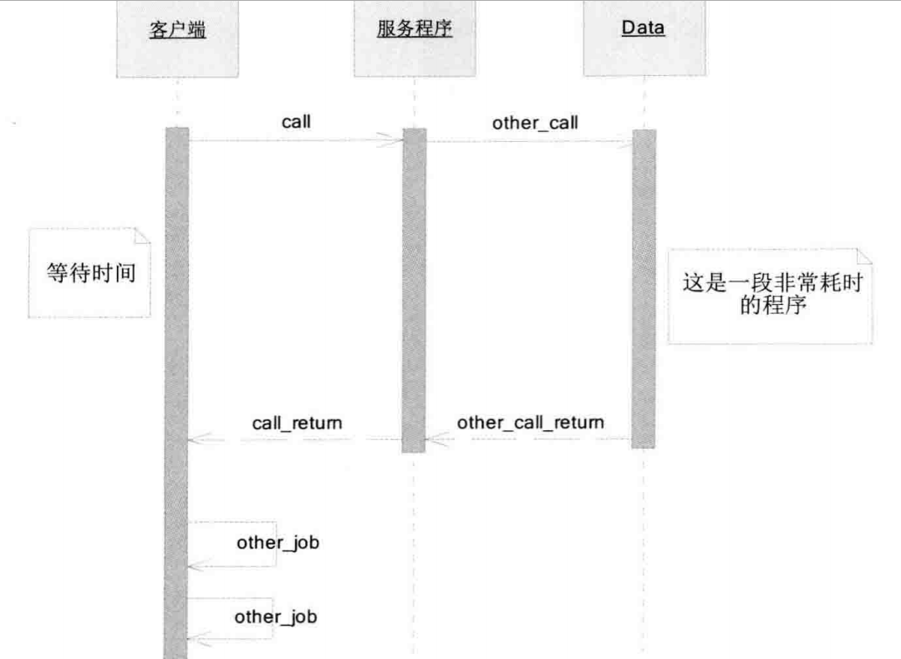
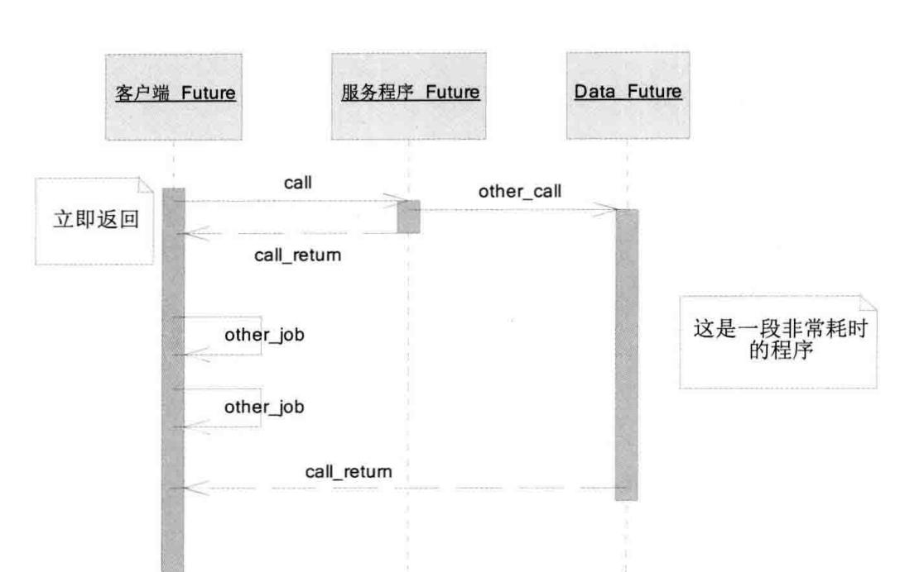
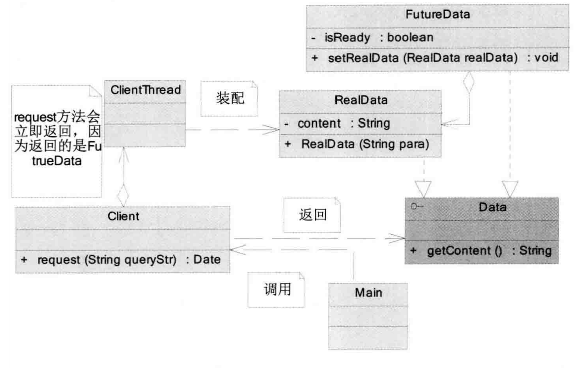
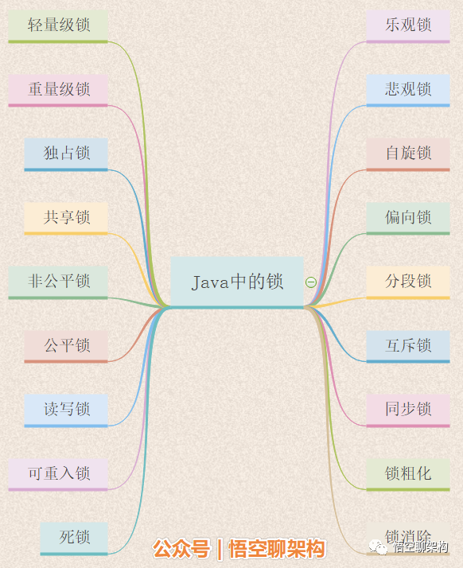

# 并发编程的挑战

## 多线程一定比单线程快吗？

```java
public class ConcurrencyTest {
    
	private static final long count = 10000l;
    
    public static void main(String[] args) throws InterruptedException {
        concurrency();
        serial();
    }
    
    private static void concurrency() throws InterruptedException {
        long start = System.currentTimeMillis();
		Thread thread = new Thread(new Runnable() {
            @Override
            public void run() {
                int a = 0;
                for (long i = 0; i < count; i++) {
                    a += 5;
                }
            }
    	});
        thread.start();
        int b = 0;
        for (long i = 0; i < count; i++) {
            b--;
        }
        long time = System.currentTimeMillis() - start;
        thread.join();
        System.out.println("concurrency :" + time+"ms,b="+b);
	}
    
    private static void serial() {
		long start = System.currentTimeMillis();
		int a = 0;
		for (long i = 0; i < count; i++) {
			a += 5;
		}
        int b = 0;
		for (long i = 0; i < count; i++) {
			b--;
		}
        long time = System.currentTimeMillis() - start;
		System.out.println("serial:" + time+"ms,b="+b+",a="+a);
	}
}
```

测试结果：


> 由测试结果看出，多线程不一定比多线程快。循环次数低的时候单线程速度可能更快。这是因为线程会有**创建和切换上下文的开销**

度量上下文切换带来消耗的工具：

- Lmbench3 ：测量上下文切换的时长

- vmstat ：测量上下文切换的次数

  vmstat  示例：

  

> cs(content switch) 表示上下文切换次数


## 如何减少上下文切换

- 无锁并发编程：多线程竞争锁时，会引起上下文切换，所以多线程处理数据时，可以用一
  些办法来避免使用锁，如将数据的ID按照Hash算法取模分段，不同的线程处理不同段的数据。  
- CAS算法：Java的Atomic包使用CAS算法来更新数据，而不需要加锁。  
- 使用最少线程：避免创建不需要的线程，比如任务很少，但是创建了很多线程来处理，这
  样会造成大量线程都处于等待状态。  
- 使用协程：在单线程里实现多任务的调度，并在单线程里维持多个任务间的切换。  


## 避免死锁常用方法

- 避免一个线程同时获取多个锁。  
- 避免一个线程在锁内同时占用多个资源，尽量保证每个锁只占用一个资源。  
- 尝试使用定时锁，使用lock.tryLock（timeout）来替代使用内部锁机制。  
- 对于数据库锁，加锁和解锁必须在一个数据库连接里，否则会出现解锁失败的情况。  


## 资源限制

资源的限制有时也会影响多线程执行的效率

- 计算机硬件资源：带宽的上传/下载速度，硬盘读写速度，CPU处理速度
- 软件资源：数据库连接、socket限制等


# Java并发机制的底层实现原理

## synchronized原理

锁的3种形式：

- 对于普通方法，锁是实例对象
- 对于静态同步方法，锁是当前类的Class对象
- 对于同步代码块，锁是Synchronized括号里配置的对象


Synchronized用的锁是存在Java对象头里的。


### 锁升级

锁的4中状态（从低到高）：无锁状态、偏向锁、轻量级锁、重量级锁

偏向锁在java6和7中是默认启用的，相关JVM参数：

- 关闭延迟：-XX:BiasedLockingStartupDelay=0  
- 关闭偏向锁（进入轻量级锁状态）：-XX:-UseBiasedLocking=false  

偏向锁初始化流程：


存在锁竞争时，偏向锁状态变化可能情况：

- 依然偏向当前线程或者偏向其他线程
- 进入无锁状态
- 被标记为不适合做偏向锁


在关闭偏向锁后，锁的初始状态是轻量级锁，有竞争（具体什么情况的竞争未明）时锁会膨胀为重量级锁：


因为自旋会消耗CPU，为了避免无用的自旋（比如获得锁的线程阻塞了），一旦锁升级为重量级锁，就不会恢复到轻量级锁状态。在这种情况下，其他线程获取锁时都会被阻塞，当持有锁的线程释放锁后会唤醒这些线程，被唤醒的线程重新进行新的一轮锁竞争。


### 锁的优缺点对比


## 原子操作的实现原理

### 相关CPU术语


### 处理器如何实现原子操作

- 使用总线锁保证原子性：总线锁是指使用处理器提供的一个#LOCK信号，当一个处理器在总线上输出此信号时，其他处理器的请求将被阻塞，那么该处理器将独享共享内存。也就是当一个处理器读写共享变量时，不允许其他处理器操作缓存了该共享变量内存地址的缓存。

  - 缺点：总线锁开销大，锁定区间，其他处理器不能操作其他内存的数据。

  

- 使用缓存锁定保证原子性：缓存锁定是指如上图，所谓“缓存锁定”是指内存区域如果被缓存在处理器的缓存行中，并且在Lock操作期间被锁定，那么当它执行锁操作回写到内存时，处理器不在总线上声言LOCK＃信号，而是修改内部的内存地址，并允许它的缓存一致性机制来保证操作的原子性，因为缓存一致性机制会阻止同时修改由两个以上处理器缓存的内存区域数据，当其他处理器回写已被锁定的缓存行的数据时，会使缓存行无效，  当CPU1修改缓存行中的i时使用了缓存锁定，那么CPU2就不能同时缓存i的缓存行。

但是有两种情况处理器不会使用缓存锁定：

- 当操作的数据不能被缓存在处理器内部，或操作的数据跨多个缓存行（cache line）时，则处理器会调用总线锁定。 
- 有些处理器不支持缓存锁定。对于Intel 486和Pentium处理器，就算锁定的内存区域在处理器的缓存行中也会调用总线锁定。  

针对以上两个机制，我们通过Intel处理器提供了很多Lock前缀的指令来实现。例如，位测试和修改指令：BTS、BTR、BTC；交换指令XADD、CMPXCHG，以及其他一些操作数和逻辑指令（如ADD、OR）等，被这些指令操作的内存区域就会加锁，导致其他处理器不能同时访问它。  


### JAVA如何实现原子操作

1. 使用CAS
2. 使用锁


CAS原子操作问题


# JAVA内存模型


## JMM内存模型抽象示意图


共享变量是指实例域、静态域和数组元素。局部变量、方法定义参数和异常处理参数不会在线程间共享，不会有内存可见性问题。

- 每一个线程拥有私有的本地内存，本地内存存储了该线程已读/写共享变量的副本。
- 主内存（本地内存）是一个抽象的概念，本身不存在。它覆盖了缓存、写缓冲区、寄存器以及其他的硬件以及编译器的优化。


如果线程A与线程B之间要通信的话，必须要经历下面2个步骤。
1）线程A把本地内存A中更新过的共享变量刷新到主内存中去。
2）线程B到主内存中去读取线程A之前已更新过的共享变量。  

线程间通信图


## 重排序

重排序是指编译器和处理器为了优化程序性能而对指令系列进行重新排序的一种手段。

- 编译器重排序

  - 编译器优化的重排序。编译器在不改变单线程程序语义的前提下，可以重新安排语句的执行顺序。
  - 指令级并行的重排序。现代处理器采用了指令级并行技术（Instruction-LevelParallelism，ILP）来将多条指令重叠执行。如果不存在数据依赖性，处理器可以改变语句对应机器指令的执行顺序。

- 处理器重排序

  - 内存系统的重排序。由于处理器使用缓存和读/写缓冲区，这使得加载和存储操作看上去可能是在乱序执行。    

  

JAVA源代码到最终执行的指令系列经历的重排序：


> JMM属于语言级别的内存，它确保在不同的编译器和处理器平台之上，通过禁止特定类型的编译器重排序和处理器重排序，为程序员提供一致的内存可见性保证


常见处理器重排序规则


为了保证内存可见性，JAVA编译器在生成指令系列的适当位置会插入内存屏障指令来禁止特定类型的处理器排序。


​	`StoreLoad Barriers`是一个“全能型”的屏障，它同时具有其他3个屏障的效果。现代的多处理器大多支持该屏障（其他类型的屏障不一定被所有处理器支持）。执行该屏障开销会很昂贵，因为当前处理器通常要把写缓冲区中的数据全部刷新到内存中（Buffer Fully Flush）。  

### 数据依赖性

如果两个操作同时访问一个变量，且其中一个为写操作，则此时两个操作之间存在数据依赖性。数据依赖的分类：


> 由于具有数据依赖操作的命令重排序后悔改变语义，编译器和处理器不会改变存在数据依赖关系的两个操作的执行顺序。

这里所说的数据依赖性仅针对单个处理器中执行的指令序列和单个线程中执行的操作，不同处理器之间和不同线程之间的数据依赖性不被编译器和处理器考虑。  


### as-if-serial

as-if-serial语义的意思是：不管怎么重排序，单线程的执行结果不能被改变。编译器和处理器都必须遵守这个语义。

如下面操作：

```java
double pi = 3.14; // A
double r = 1.0; // B
double area = pi * r * r; // C
```

编译器和处理器在做指令重排需保证：C必须在A和B之后执行，也就是A happen before C，B happen before C，A和B无数据依赖，谁先执行都行。


### 控制依赖

```java
class ReorderExample {
	int a = 0;
	boolean flag = false;
    
	public void writer() {
		a = 1; // 1
		flag = true; // 2
	} 
    
    Public void reader() {
		if (f?lag) { // 3
            int i = a * a; // 4
            ……
        }
    }
    
}
```

3操作和4操作就存在控制依赖性。

在单线程程序中，对存在控制依赖的操作重排序，不会改变执行结果（这也是as-if-serial语义允许对存在控制依赖的操作做重排序的原因）；但在多线程程序中，对存在控制依赖的操作重排序，可能会改变程序的执行结果。  


## 顺序一致性

`JMM`保证正确同步的代码与顺序一致性模型中执行的代码结果一致。


在JSR-133之前的旧内存模型中，一个64位long/double型变量的读/写操作可以被拆分为两个32位的读/写操作来执行。从JSR-133内存模型开始（即从JDK5开始），仅仅只允许把一个64位long/double型变量的写操作拆分为两个32位的写操作来执行，任意的读操作在JSR-
133中都必须具有原子性（即任意读操作必须要在单个读事务中执行）。（为啥？还是没保证对64位变量的原子操作？） 


### 问题

1. 64位JVM的long和double读写是不是原子操作？

   参考官方jdk标准：https://docs.oracle.com/javase/specs/jls/se8/html/jls-17.html#jls-17.7

   For the purposes of the Java programming language memory model, a single write to a non-volatile `long` or `double` value is treated as two separate writes: one to each 32-bit half. This can result in a situation where a thread sees the first 32 bits of a 64-bit value from one write, and the second 32 bits from another write.

   Writes and reads of volatile `long` and `double` values are always atomic.

   Writes to and reads of references are always atomic, regardless of whether they are implemented as 32-bit or 64-bit values.

   Some implementations may find it convenient to divide a single write action on a 64-bit `long` or `double` value into two write actions on adjacent 32-bit values. For efficiency's sake, this behavior is implementation-specific; an implementation of the Java Virtual Machine is free to perform writes to `long` and `double` values atomically or in two parts.

   Implementations of the Java Virtual Machine are encouraged to avoid splitting 64-bit values where possible. Programmers are encouraged to declare shared 64-bit values as `volatile` or synchronize their programs correctly to avoid possible complications.

   简单来说：

   - 实现对普通long与double的读写不要求是原子的（但如果实现为原子操作也OK）
   - 实现对volatile long与volatile double的读写必须是原子的（没有选择余地）

2. 333


## volatile

volatile是轻量级的synchronized，它在多线程开发中保证了共享变量的内存“可见性”。可见性是指当一个线程修改一个共享变量时，另一个线程能读到该共享变量的值。volatile变量修饰符使用恰当的话，它比synchronized的使用和执行成本更低，因为它不使用上下文的切换和调度。

> 注意，volatile是以无锁的方式实现可见性的。

### volatile原理

了解volatile原理之前，先了解CPU的术语定义


先看一段代码：

```java
instance = new Singleton(); // instance是volatile变量
```

转成汇编后：

```
0x01a3de1d: movb $0×0,0×1104800(%esi);
0x01a3de24: lock addl $0×0,(%esp);
```

可见经过volatile修饰后，会多出第二行代码。也就是Lock前缀指令，其作用：

1. **将当前处理器缓存行的数据写到系统内存**。Lock前缀指令导致在执行指令期间，声言处理器的LOCK#信号。在多处理器环境中，LOCK#信号确保在声言该信号期间，处理器可以独占任何共享内存[2]。但是，在最近的处理器里，LOCK＃信号一般不锁总线，而是锁缓存，毕竟锁总线开销的比较大。在8.1.4节有详细说明锁定操作对处理器缓存的影响，对于Intel486和Pentium处理器，在锁操作时，总是在总线上声言LOCK#信号。但在P6和目前的处理器中，如果访问的内存区域已经缓存在处理器内部，则不会声言LOCK#信号。相反，它会锁定这块内存区域的缓存并回写到内存，并使用缓存一致性机制来确保修改的原子性，此操作被称为“缓存锁
   定”，缓存一致性机制会阻止同时修改由两个以上处理器缓存的内存区域数据。  
2. **这个写回内存的操作会使在其他CPU里缓存了该内存地址的数据无效**。IA-32处理器和Intel 64处理器使用MESI（修改、独占、共享、无效）控制协议去维护内部缓存和其他处理器缓存的一致性。在多核处理器系统中进行操作的时候，IA-32和Intel 64处理器能嗅探其他处理器访问系统内存和它们的内部缓存。处理器使用嗅探技术保证它的内部缓存、系统内存和其他处理器的缓存的数据在总线上保持一致。例如，在Pentium和P6 family处理器中，如果通过嗅探一个处理器来检测其他处理器打算写内存地址，而这个地址当前处于共享状态，那么正在嗅探的处理器将使它的缓存行无效，在下次访问相同内存地址时，强制执行缓存行填充。  

> 其中使用缓存一致性协议保证各处理器的缓存是一致的


### volatile内存语义

volatile保证的是原子性吗？仅仅是可见性？

volatile变量自身特性：

- 可见性：对一个volatile变量的读，总是能看到（任意线程）对这个volatile变量最后的写入。
- 原子性：对任意单个volatile变量的读/写具有原子性，但类似于volatile++这种复合操作（先读后写）不具有原子性。


如以下程序：

```java
class VolatileExample {
	int a = 0;
	volatile boolean flag = false;
	public void writer() {
		a = 1; // 1
		flag = true; // 2
	}
    public void reader() {
		if (flag) { // 3
			int i = a; // 4
			……
		}
	}
}
```

> volatile只保证可见性，即对同一个共享变量修改后，其他线程读取同一个共享变量是修改后的值，仅仅保证这点。但实际上线程也可能在flag写之前就获取了值

验证：


## 锁的内存定义

3.5章节


## happen-before

JDK1.5开始，JAVA使用`JSR-133`内存模型。`JSR-133`使用happen-before的概念阐述操作之间的内存可见性。在JMM中，如果一
个操作执行的结果需要对另一个操作可见，那么这两个操作之间必须要存在happens-before关系。这里提到的两个操作既可以是在一个线程之内，也可以是在不同线程之间。  happen-before仅仅要求前一个操作的结果对后一个操作可见。


# 一些重要概念

## 同步和异步

同步和异步一般用来形容一次方法调用，个人认为若最终结果的获取是主动的，则是同步的，若最终结果是被动获取，如基于事件通知机制返回结果，那么可以认为是异步的。

## 并发和并行


 - 并行：充分利用了CPU多核心机制，多个任务真正意义上的“同时运行”。
 - 并发：在单核心CPU中可以实现并发，但不是并行，而是通过上下文切换来完成并发的，同一时刻只有一个任务在执行。

## 临界区
临界区用来表示一种公共资源或者共享资源，可以被多个线程使用，每一次只能有一个线程使用，一旦该资源被某个线程占用，其他线程只能等待。


## 阻塞和非阻塞
阻塞一般用来形容多线程之间的相互影响。比如一个线程占用了一个临界区资源，那么其他需要该临界区资源的线程就需要等待，等待会导致线程挂起，这就是阻塞。非阻塞则与阻塞相反，一个执行的线程未受到其他线程的影响一直运行下去。比如一个用户进程要从操作系统中获取IO资源，假如该IO资源未被内核态取出并且放入用户态中，则会阻塞

## 死锁、饥饿、活锁

- 死锁：都卡在那
- 饥饿：获取不到锁
- 活锁：都谦让锁

## 并发级别
 - 阻塞
 - 无饥饿 
 - 无障碍 CAS
 - 无锁 
 - 无等待

## 并行中的两个重要定律
### Amdahl定律 
amdahl定义了串行系统并行优化后的加速比的计算公式和理论上限
**加速比定义：加速比=优化前系统耗时/优化后系统耗时**
公式推导（n为处理器数量，T1为优化前耗时，T为优化后耗时）：

可见加速比与系统的串行化率成反比，假如系统中有50%的代码串行执行，当n趋于无穷大时（即处理器数为无穷），可得加速比为1/F，即2。可见最终得结果依然受限于程序的串行比例。
结论：根据amdahl定律，使用多核CPU对系统进行优化，优化效果取决于CPU的数量以及系统中的串行化比例。CPU数量越多，串行化比列越低，则优化效果越好。仅提高CPU核数而不降低程序的串行化比重，也无法提高系统功能。

### Guatafson定律
guatafason定律也试图说明处理器个数、串行比列和加速比之间的关系，只是着重的角度不一样。同样，加速比都定义为优化前的系统耗时除以优化后的系统耗时

由公式可知，如果串行比率很小，可认为处理器数量n就是加速比的大小。即只要不断累加处理器数量，就能获得更高的效率。

### amdahl和Guatafson是否矛盾？
其实，从极端的角度看。如果系统没有并行的代码，即F=1，那么加速比都是1。若系统都是并行代码，那么加速比都是n。加速比只是一个权衡值，最终结果两者体现不太一样。
amdahl更关心：当串行比例一定时，加速比有上限，不管加多少CPU都不能突破这个上限
Guatafson更关心：如果可被并行化的代码比重比较大，那么加速比与CPU数量成正比

## JMM
JMM的关键技术点都是围绕多线程的原子性、可见性、有序性进行的，首先先了解下这几个概念：

- 原子性：指一个操作不可中断，即多个线程一起执行时，一旦操作开始就不能被其他线程影响。比如有两个线程对同一个静态变量i=0做i++操作，最后结果值为1而不是2，那么这样就不满足原子性操作。

- 可见性：某个线程修改一个共享变量的值，其他线程能否立即知道知道这个修改。

  

  实际情况中，操作系统或硬件的优化机制可能会使得读取的不是修改后的值而是缓存中的值

- 有序性：操作系统会使用指令重排的技术来提升程序执行的性能，由于指令重排的影响，代码实际的执行顺序可能不是我们所预想的。java虚拟机中对指令重排有一定的规则（Happen-Before），其中的细节并不需要我们关心。

  > 指令重排可以保证串行语义一致，但是没有义务保证多线程之间的语义也一致


# 多线程基础

## 进程和线程

- 进程：系统进行资源分配和调度的基本单位，是线程的容器。如exe程序就是以进程运行的
- 线程：轻量级进程，是程序执行的最小单元。使用多线程去进行并发程序的设计而不是进程，是因为线程间的切换和调度成本远远小于线程

## 线程状态

`java.lang.Thread.State`

```java
 /**
     * A thread state.  A thread can be in one of the following states:
     * <ul>
     * <li>{@link #NEW}<br>
     *     A thread that has not yet started is in this state.
     *     </li>
     * <li>{@link #RUNNABLE}<br>
     *     A thread executing in the Java virtual machine is in this state.
     *     </li>
     * <li>{@link #BLOCKED}<br>
     *     A thread that is blocked waiting for a monitor lock
     *     is in this state.
     *     </li>
     * <li>{@link #WAITING}<br>
     *     A thread that is waiting indefinitely for another thread to
     *     perform a particular action is in this state.
     *     </li>
     * <li>{@link #TIMED_WAITING}<br>
     *     A thread that is waiting for another thread to perform an action
     *     for up to a specified waiting time is in this state.
     *     </li>
     * <li>{@link #TERMINATED}<br>
     *     A thread that has exited is in this state.
     *     </li>
     * </ul>
     *
     * <p>
     * A thread can be in only one state at a given point in time.
     * These states are virtual machine states which do not reflect
     * any operating system thread states.
     *
     * @since   1.5
     * @see #getState
     */
    public enum State {
        /**
         * Thread state for a thread which has not yet started.
         */
        NEW,

        /**
         * Thread state for a runnable thread.  A thread in the runnable
         * state is executing in the Java virtual machine but it may
         * be waiting for other resources from the operating system
         * such as processor.
         */
        RUNNABLE,

        /**
         * Thread state for a thread blocked waiting for a monitor lock.
         * A thread in the blocked state is waiting for a monitor lock
         * to enter a synchronized block/method or
         * reenter a synchronized block/method after calling
         * {@link Object#wait() Object.wait}.
         */
        BLOCKED,

        /**
         * Thread state for a waiting thread.
         * A thread is in the waiting state due to calling one of the
         * following methods:
         * <ul>
         *   <li>{@link Object#wait() Object.wait} with no timeout</li>
         *   <li>{@link #join() Thread.join} with no timeout</li>
         *   <li>{@link LockSupport#park() LockSupport.park}</li>
         * </ul>
         *
         * <p>A thread in the waiting state is waiting for another thread to
         * perform a particular action.
         *
         * For example, a thread that has called <tt>Object.wait()</tt>
         * on an object is waiting for another thread to call
         * <tt>Object.notify()</tt> or <tt>Object.notifyAll()</tt> on
         * that object. A thread that has called <tt>Thread.join()</tt>
         * is waiting for a specified thread to terminate.
         */
        WAITING,

        /**
         * Thread state for a waiting thread with a specified waiting time.
         * A thread is in the timed waiting state due to calling one of
         * the following methods with a specified positive waiting time:
         * <ul>
         *   <li>{@link #sleep Thread.sleep}</li>
         *   <li>{@link Object#wait(long) Object.wait} with timeout</li>
         *   <li>{@link #join(long) Thread.join} with timeout</li>
         *   <li>{@link LockSupport#parkNanos LockSupport.parkNanos}</li>
         *   <li>{@link LockSupport#parkUntil LockSupport.parkUntil}</li>
         * </ul>
         */
        TIMED_WAITING,

        /**
         * Thread state for a terminated thread.
         * The thread has completed execution.
         */
        TERMINATED;
    }
```


线程状态查看命令：

- windows
  - `jps`：查看java进程
  - `jstack pid`：查看线程状态
- linux（linux通过进程实现线程）
  - `ps -ef f`：以属性结构显示
  - `pstree -c`：类似上述

```java
package com.base;

public class ThreadStatusDemo {
    private static Object obj = new Object();
    public static void main(String[] args) throws InterruptedException {
        Thread.sleep(500000);
        /*synchronized (obj){
            //obj.wait();
            obj.wait(3000000);
        }*/
    }
}

```

wait：

```properties
"main" #1 prio=5 os_prio=0 tid=0x0000000002f52800 nid=0x28b8 in Object.wait() [0x0000000002d7f000]
   java.lang.Thread.State: WAITING (on object monitor)
        at java.lang.Object.wait(Native Method)
        - waiting on <0x00000000d6091188> (a java.lang.Object)
        at java.lang.Object.wait(Object.java:502)
        at com.base.ThreadStatusDemo.main(ThreadStatusDemo.java:8)
        - locked <0x00000000d6091188> (a java.lang.Object)
```

wait(time)：

```properties
"main" #1 prio=5 os_prio=0 tid=0x0000000003512800 nid=0x2e1c in Object.wait() [0x00000000033cf000]
   java.lang.Thread.State: TIMED_WAITING (on object monitor)
        at java.lang.Object.wait(Native Method)
        - waiting on <0x00000000d60911a8> (a java.lang.Object)
        at com.base.ThreadStatusDemo.main(ThreadStatusDemo.java:9)
        - locked <0x00000000d60911a8> (a java.lang.Object)
```

sleep(time)：

```properties
"main" #1 prio=5 os_prio=0 tid=0x0000000003432800 nid=0x48f4 waiting on condition [0x000000000321f000]
   java.lang.Thread.State: TIMED_WAITING (sleeping)
        at java.lang.Thread.sleep(Native Method)
        at com.base.ThreadStatusDemo.main(ThreadStatusDemo.java:6)
```

> wait(time)、sleep(time)都会使得线程进入TIMESD_WAITTING状态，但区别是sleep会占用锁资源


## Thread和Runnable

- Thread：Runnable的实现类，其实现方法：

  ```java
      @Override
      public void run() {
          if (target != null) {
              target.run();
          }
      }
  ```

  - 通过重写Thread的run方法修改线程运行逻辑

    ```java
    class ThreadClass extends Thread{
    
        @Override
        public void run() {
            System.out.println(Thread.currentThread().getName()+" is running");
        }
    }
    ```

- Runnable

  ```java
  @FunctionalInterface//java8中已声明为函数式接口
  public interface Runnable {
      /**
       * When an object implementing interface <code>Runnable</code> is used
       * to create a thread, starting the thread causes the object's
       * <code>run</code> method to be called in that separately executing
       * thread.
       * <p>
       * The general contract of the method <code>run</code> is that it may
       * take any action whatsoever.
       *
       * @see     java.lang.Thread#run()
       */
      public abstract void run();
  }
  ```

  ```java
  package com.base;
  
  public class ThreadStatusDemo implements Runnable{
      private static Object obj = new Object();
      public static void main(String[] args) throws InterruptedException {
          //Thread.sleep(500000);
          /*synchronized (obj){
              //obj.wait();
              obj.wait(3000000);
          }*/
  
          new Thread(new ThreadStatusDemo()).start();
  
      }
  
      @Override
      public void run() {
          System.out.println(Thread.currentThread().getName()+" is running");
      }
  }
  
  
  ```

> 都是需要通过new Thread()方法构建线程，只有调用start才会开一个线程运行（native方法），而调用run()方法只是在当前线程执行
>
> 由于java是单继承，所以常用Runnable接口实现，同时也避免了重写`java.lang.Thread#run`方法


## 终止线程和线程中断

### 终止线程

Thread中提供了一个stop方法用于终止线程，不过它是强制使线程终止，并不等线程执行完，这是一种不安全操作，可能会引起数据不一致的问题

#### 示例

使用stop终止线程会引起数据不一致问题

```java
package com.base;

public class ThreadStopDemo {

    public static User u = new User();

    public static void main(String[] args) throws InterruptedException {
        stopThreadUnsafely();


    }


    /**
     * 错误示范的终止线程
     */
    public static void stopThreadUnsafely() throws InterruptedException {
        Runnable readObjectRunnable = ()->{
            while (true){
                synchronized (u){
                    if(u.getId() != Integer.parseInt(u.getName())){
                        System.out.println(u.toString());
                    }
                    //System.out.println(u.toString());
                }
                Thread.yield();
            }
        };
        Runnable changeObjectRunnable = ()->{
            while (true){
                synchronized (u){
                    int v = (int)System.currentTimeMillis()/1000;
                    u.setId(v);
                    try {
                        Thread.sleep(100);
                    } catch (InterruptedException e) {
                        e.printStackTrace();
                    }
                    u.setName(String.valueOf(v));
                }
                Thread.yield();
            }
        };

        Thread readThread = new Thread(readObjectRunnable);
        readThread.start();
        while (true){
            Thread changeThread = new Thread(changeObjectRunnable);
            changeThread.start();
            Thread.sleep(150);
            changeThread.stop();
        }
    }

    public static class User{
        private int id;
        private String name;

        public User() {
            this.id = 0;
            this.name = "0";
        }

        public int getId() {
            return id;
        }

        public void setId(int id) {
            this.id = id;
        }

        public String getName() {
            return name;
        }

        public void setName(String name) {
            this.name = name;
        }

        @Override
        public String toString() {
            return "User{" +
                    "id=" + id +
                    ", name='" + name + '\'' +
                    '}';
        }
    }
}

```

```properties
User{id=-937163, name='-937164'}
User{id=-937163, name='-937164'}
...
```


自行添加标志位实现安全中断线程：

```java
package com.base;

public class ThreadStopDemo {

    public static User u = new User();

    public static void main(String[] args) throws InterruptedException {
        //stopThreadUnsafely();

        stopThreadsafely();
    }


    /**
     * 自行实现终止线程
     */
    public static void stopThreadsafely() throws InterruptedException {
        Runnable readObjectRunnable = ()->{
            while (true){
                synchronized (u){
                    if(u.getId() != Integer.parseInt(u.getName())){
                        System.out.println(u.toString());
                    }
                    //System.out.println(u.toString());
                }
                Thread.yield();
            }
        };


        Thread readThread = new Thread(readObjectRunnable);
        readThread.start();
        while (true){
            WriteObjectSafelyThread changeThread = new WriteObjectSafelyThread();
            changeThread.start();
            Thread.sleep(150);
            changeThread.stopMe();
        }
    }

    public static class WriteObjectSafelyThread extends Thread{
        volatile boolean stopme = false;
        public void stopMe(){
            this.stopme = true;
        }
        @Override
        public void run() {
            while (true){
                if(stopme){
                    System.out.println("i am stop");
                    break;
                }
                synchronized (u){
                    int v = (int)System.currentTimeMillis()/1000;
                    u.setId(v);
                    try {
                        Thread.sleep(100);
                    } catch (InterruptedException e) {
                        e.printStackTrace();
                    }
                    u.setName(String.valueOf(v));
                }
                Thread.yield();
            }
        }
    }

    public static class User{
        private int id;
        private String name;

        public User() {
            this.id = 0;
            this.name = "0";
        }

        public int getId() {
            return id;
        }

        public void setId(int id) {
            this.id = id;
        }

        public String getName() {
            return name;
        }

        public void setName(String name) {
            this.name = name;
        }

        @Override
        public String toString() {
            return "User{" +
                    "id=" + id +
                    ", name='" + name + '\'' +
                    '}';
        }
    }
}

```

> 最终，并未有不一致的信息输出

### 线程中断

线程中断不会是现成立即退出，而是给线程发送一个通知，也就是具体的终止线程逻辑还需目标线程自己处理。

jdk中提供了三个有关中断过的方法：

- `java.lang.Thread#interrupt`：通知目标线程中断，也就是设置中断标志位
- `java.lang.Thread#isInterrupted()`：查看中断标志位，是否中断（true/false）
- `java.lang.Thread#interrupted`：判断是否中断，并清空当前中断状态（也就是下一次获取时是false）

#### 示例

使用线程中断来实现终止线程逻辑：

```java
package com.base;

public class InterruptedDemo {
    public static void main(String[] args) throws InterruptedException {
        Runnable runnable = () ->
        {while(true){
            //线程中断处理逻辑
            if (Thread.currentThread().isInterrupted()){
                System.out.println("thread is interrupted");
                break;
            }
            Thread.yield();
        }};
        Thread thread = new Thread(runnable);
        thread.start();
        Thread.sleep(2000);
        //标志位置为true
        thread.interrupt();
    }
}

```

```properties
thread is interrupted
```

有关sleep的中断处理：

```java
package com.base;

public class InterruptedDemo {
    public static void main(String[] args) throws InterruptedException {

        Runnable runnable1 = ()->{
            while (true){
                //中断处理逻辑
                if(Thread.currentThread().isInterrupted()){
                    System.out.println("thread is interrupted");
                    break;
                }
                try {
                    Thread.sleep(2000);
                } catch (InterruptedException e) {
                    //sleep中断处理逻辑
                    System.out.println("interrupted when sleep");
                    //使下一次循环能走中断逻辑
                    Thread.currentThread().interrupt();
                }
                Thread.yield();
            }
        };

        Thread thread = new Thread(runnable1);
        thread.start();
        Thread.sleep(1000);
        thread.interrupt();
    }
}

```

```properties
interrupted when sleep
thread is interrupted
```


## wait和notify

这两个方法都是Object对象的方法。当一个线程内执行某个对象的wait方法时，表示当前线程进入WAITTING或者TIME_WAITTING状态，同时释放对该对象的监视权（释放锁），等待再次获得锁。

其实等待线程会放进一个等待队列，它可通过notify或者notifyAll唤醒其中的线程

- notify：随机唤醒某个对象锁的等待队列，先进的队列不一定会先唤醒

  

- notifyAll：唤醒某个对象锁的等待队列中的所有线程，让它们一起去竞争获得锁，最终也不确定谁会获得

>  线程优先级没影响？

工作细节：


### 示例

```java
package com.base;

public class WaitDemo {

    private static final Object obj = new Object();

    static class WaitRunnable implements Runnable{

        @Override
        public void run() {
            synchronized (obj){
                System.out.println(Thread.currentThread().getName() +
                        " at "+System.currentTimeMillis() + " start running");
                try {
                    System.out.println(Thread.currentThread().getName()
                            +" at "+System.currentTimeMillis()+" waiting for obj");
                    //立即释放锁
                    obj.wait();
                } catch (InterruptedException e) {
                    e.printStackTrace();
                }
                System.out.println(Thread.currentThread().getName() + " end");
            }
        }
    }

    static class NotifyRunnable implements Runnable{

        @Override
        public void run() {
            synchronized (obj){
                System.out.println(Thread.currentThread().getName() +
                        " at " + System.currentTimeMillis() + " start,notify one Thread");
                //并不立即释放锁
                obj.notify();
                System.out.println(Thread.currentThread().getName()
                +" at "+ System.currentTimeMillis()+" end");
                int i = 5;
                
                while (i > 0){
                    System.out.println(Thread.currentThread().getName() + " is still running");
                    i --;
                }
                obj.notify();
                i = 5;
                while (i > 0){
                    System.out.println(Thread.currentThread().getName() + " is still running");
                    i --;
                }
            }
        }
    }

    public static void main(String[] args) throws InterruptedException {
        Thread t1 = new Thread(new WaitRunnable());
        Thread t2 = new Thread(new NotifyRunnable());
        t1.start();
        Thread.sleep(2000);
        t2.start();
    }
}


```

```properties
Thread-0 at 1571045237680 start running
Thread-0 at 1571045237680 waiting for obj
Thread-1 at 1571045239686 start,notify one Thread
Thread-1 at 1571045239686 end
Thread-1 is still running
Thread-1 is still running
Thread-1 is still running
Thread-1 is still running
Thread-1 is still running
Thread-1 is still running
Thread-1 is still running
Thread-1 is still running
Thread-1 is still running
Thread-1 is still running
Thread-0 end
```

> notify()方法执行后不会立即放弃对象的监视权，即不会立即释放锁，而是会先执行完当前线程逻辑


## suspend和resume

两个方式都是Thread的示例方法，已废弃

- suspend：挂起线程，不会释放锁资源，线程状态还是RUNNABLE状态，区别sleep，其是WAITTING状态
- resume：继续执行线程

假如一个线程的resume发生在supend之前且之后没有resume方法执行，将导致锁资源被永久占用，但状态还是RUNNABLE

### 示例

suspend和resume使用不当造成的永久阻塞（锁资源被永久占用）

```java
package com.base;

public class SuspendDemo {
    private static final Object obj = new Object();

    public static void main(String[] args) throws InterruptedException {
        Thread t1 = new Thread(new BadRunnable());
        Thread t2 = new Thread(new BadRunnable());
        t1.start();
        Thread.sleep(2000);
        t2.start();
        t1.resume();
        //Thread.sleep(2000);
        t2.resume();
        t1.join();
        t2.join();
    }

    public static class BadRunnable implements Runnable{

        @Override
        public void run() {
            synchronized (obj){
                System.out.println(Thread.currentThread().getName() + " is running");
                Thread.currentThread().suspend();
                System.out.println(Thread.currentThread().getName() + " end");
            }
        }
    }
}

```

```properties
Thread-0 is running
Thread-0 end
Thread-1 is running
```

t2线程状态：

```properties
"Thread-1" #13 prio=5 os_prio=0 tid=0x00000000198eb000 nid=0x4254 runnable [0x000000001a75f000]
   java.lang.Thread.State: RUNNABLE
        at java.lang.Thread.suspend0(Native Method)
        at java.lang.Thread.suspend(Thread.java:1032)
        at com.base.SuspendDemo$RunnableThread.run(SuspendDemo.java:24)
        - locked <0x00000000d6091760> (a java.lang.Object)
        at java.lang.Thread.run(Thread.java:748)
```

> t2永久阻塞中

其中发生的情况大致如下图所示，原因就是t2的resume方法发生在了suspend之前


使用wait和notify机制实现线程的挂起和继续执行：

```java
package com.base;

public class SuspendDemo {
    private static final Object obj = new Object();

    public static void main(String[] args) throws InterruptedException {
        /*Thread t1 = new Thread(new BadRunnable());
        Thread t2 = new Thread(new BadRunnable());
        t1.start();
        Thread.sleep(2000);
        t2.start();
        t1.resume();
        //Thread.sleep(2000);
        t2.resume();
        t1.join();
        t2.join();*/

        GoodResume t1 = new GoodResume();
        GoodResume t2 = new GoodResume();
        t1.start();
        t2.start();
        Thread.sleep(3000);
        t1.suspendMe();
        System.out.println("suspend t1 for 2 second");
        Thread.sleep(2000);
        t2.suspendMe();
        Thread.sleep(1000);
        System.out.println("resume thread");
        t1.resumeMe();
        t2.resumeMe();
    }

     /**
     * 正常挂起线程示范
     */
    public static class GoodResume extends Thread{

        volatile boolean isSuspend = false;

        public boolean suspendMe(){
            synchronized (this){
                this.isSuspend = true;
                return isSuspend;
            }
        }

        public void resumeMe(){
            synchronized (this){
                isSuspend = false;
                notify();
            }
        }

        @Override
        public void run() {
            while (true){
                synchronized (this){
                    System.out.println(Thread.currentThread().getName()+ " is running");
                    while (isSuspend){
                        try {
                            this.wait();
                        } catch (InterruptedException e) {
                            e.printStackTrace();
                        }
                    }
                    System.out.println(Thread.currentThread().getName()+ " end");
                    Thread.yield();
                }
            }
        }
    }
}


```

```properties
Thread-1 is running
Thread-1 end
Thread-1 is running
Thread-1 end
Thread-0 is running
Thread-0 end
Thread-0 is running
Thread-0 end
Thread-1 is running
```

> 两个线程能够正常切换


## join和yield

### join

在当前线程中指定某个线程需执行完，即表示需要某个线程执行完的数据

- `java.lang.Thread#join()`：一直等待执行完，相当于wait()
- `java.lang.Thread#join(long)`：等待毫秒时间
- `java.lang.Thread#join(long, int)`：等待毫秒时间，加额外的纳秒时间

相关源码：

```java
    /**
     * Waits at most {@code millis} milliseconds for this thread to
     * die. A timeout of {@code 0} means to wait forever.
     *
     * <p> This implementation uses a loop of {@code this.wait} calls
     * conditioned on {@code this.isAlive}. As a thread terminates the
     * {@code this.notifyAll} method is invoked. It is recommended that
     * applications not use {@code wait}, {@code notify}, or
     * {@code notifyAll} on {@code Thread} instances.
     *
     * @param  millis
     *         the time to wait in milliseconds
     *
     * @throws  IllegalArgumentException
     *          if the value of {@code millis} is negative
     *
     * @throws  InterruptedException
     *          if any thread has interrupted the current thread. The
     *          <i>interrupted status</i> of the current thread is
     *          cleared when this exception is thrown.
     */    
	public final synchronized void join(long millis)
    throws InterruptedException {
        long base = System.currentTimeMillis();
        long now = 0;

        if (millis < 0) {
            throw new IllegalArgumentException("timeout value is negative");
        }

        if (millis == 0) {
            while (isAlive()) {
                wait(0);
            }
        } else {
            while (isAlive()) {
                long delay = millis - now;
                if (delay <= 0) {
                    break;
                }
                wait(delay);
                now = System.currentTimeMillis() - base;
            }
        }
    }
```

> 其实join是通过this.wait方法实现的

### 示例

```java
package com.base;

public class JoinDemo {
    private volatile static int i = 0;

    public static void main(String[] args) throws InterruptedException {
        MyThread t1 = new MyThread();
        t1.start();
        //t1.join();
        t1.joinMe();
        System.out.println(i);
    }

    public static class MyThread extends Thread{
        @Override
        public void run() {
            /*try {
                Thread.sleep(500000);
            } catch (InterruptedException e) {
                e.printStackTrace();
            }*/
            synchronized (this){
                for (i=0; i < 10000; i++);
            }

        }

        /**
         * 自己实现的简单版join()
         * @throws InterruptedException
         */
        public synchronized void joinMe() throws InterruptedException {
            System.out.println(this.getName());
            this.wait(0);
        }
    }
}


```

```properties
Thread-0
10000
```

若t1一直未执行完，main线程一直处于WAITTING状态

```properties
"main" #1 prio=5 os_prio=0 tid=0x0000000002e42800 nid=0x1a40 in Object.wait() [0x0000000002cef000]
   java.lang.Thread.State: WAITING (on object monitor)
        at java.lang.Object.wait(Native Method)
        - waiting on <0x00000000d6094910> (a com.base.JoinDemo$MyThread)
        at com.base.JoinDemo$MyThread.joinMe(JoinDemo.java:30)
        - locked <0x00000000d6094910> (a com.base.JoinDemo$MyThread)
        at com.base.JoinDemo.main(JoinDemo.java:10)
```

> 可理解为：线程示例作为锁对象，main线程使用这个对象作为锁，目标线程执行完后会使用this.notifyAll 方法激活主线程

> 所以不建议线程示例使用wait、notify、notifyAll方法


### yield

使当前线程让出CPU，当前线程让出CPU后还会进行CPU资源的竞争

> 若有一个线程不那么重要，或者优先级非常低，又怕其占用太多的CPU资源，则可以在适当的时候调用yield让出CPU资源


### volatile和JMM

volatile的作用：

- 保证非复合原子操作

  例如下面一个例子：

  ```java
  package com.base;
  
  public class VolatileDemo {
  
      private static long t =0;
  
      private static final Object obj = new Object();
  
      public static void main(String[] args) throws InterruptedException {
  
          new Thread(new ChangeT(111L)).start();
          new Thread(new ChangeT(-999L)).start();
          new Thread(new ChangeT(333L)).start();
          new Thread(new ChangeT(-444L)).start();
          new Thread(new ReadT()).start();
      }
  
      public static class ChangeT implements Runnable{
          private long to;
  
          public ChangeT(long to) {
              this.to = to;
          }
  
          @Override
          public void run() {
              while (true){
                  VolatileDemo.t = to;
                  Thread.yield();
              }
          }
      }
  
      public static class ReadT implements Runnable{
  
          @Override
          public void run() {
              while (true){
                  long tmp = VolatileDemo.t;
                  if(tmp != 111L && tmp != -999L && tmp != 333L && tmp != -444L){
                      System.out.println(tmp);
                  }
                  Thread.yield();
              }
          }
      }
  }
  
  ```

  > 该程序在32位虚拟机中，long类型的数组操作不是原子性的（long是64位的），所以会有出现与赋的值不一样的情况，即long类型中的高32位和低32位未保证同一时刻赋值。
  >
  > 此时使用volatile关键字可解决这个问题

  但是，volitile并不能保证复合的原子操作：

  ```java
  package com.base;
  
  public class VolatileDemo {
      private volatile static int i = 0;
  
      private static long t =0;
  
      private static final Object obj = new Object();
  
      public static void main(String[] args) throws InterruptedException {
  
          Thread[] threads = new Thread[10];
          for(int i = 0; i < 10; i++){
              threads[i] = new Thread(new PlusTask());
              threads[i].start();
          }
  
          for(int i = 0; i < 10; i++){
              threads[i].join();
          }
  
          System.out.println(i);
      }
  
      /**
       * 使用volitile并不能保证复合原子操作
       */
      public static class PlusTask implements Runnable{
  
          @Override
          public void run() {
              //synchronized (obj){
                  for (int k = 0; k < 10000; k++){
                      i++;
                  }
             // }
          }
  
      }
  
  }
  
  
  ```

  ```properties
  52961
  ```

  此时还需通过加锁解决：

  ```properties
  100000
  ```

  > 加锁后可不需要volatile

- 保证可见性

  ```java
  package com.base;
  
  public class VolatileDemo {
      private static boolean ready;
      private static int number;
  
      private static class ReaderThread extends Thread{
          @Override
          public void run() {
              while (!ready){};
              System.out.println(number);
          }
      }
  
      public static void main(String[] args) throws InterruptedException {
  
          new ReaderThread().start();
          Thread.sleep(1000);
          ready = true;
          number = 42;
          Thread.sleep(1000);
      }
  
  }
  
  ```

  > 上述例子中由于主线程修改的值不能被ReaderThread立刻看见，所以导致其一直阻塞在那。
  >
  > 一般由于运行在client端引起的（通过-server JVM参数修改为运行在server端），但实际java8测试两种都一样

  通过对ready变量加入volatile关键字，可解决问题：

  ```properties
  42
  ```

- 保证有序性


## 线程组

```java
package com.base;

public class ThreadGroupDemo implements Runnable{
    public static void main(String[] args) {
        ThreadGroup tg = new ThreadGroup("PrintGroup");
        Thread t1 = new Thread(tg,new ThreadGroupDemo(),"T1");
        Thread t2 = new Thread(tg,new ThreadGroupDemo(),"T2");
        t1.start();
        t2.start();
        //获得活动线程总数，由于线程是动态的，只是一个估计值，无法精确
        System.out.println(tg.activeCount());
        //打印线程组所有信息
        tg.list();

        //不建议使用
        //tg.stop();
    }

    @Override
    public void run() {
        String groupName = Thread.currentThread().getThreadGroup().getName()
                + "-" + Thread.currentThread().getName();
        while (true){
            System.out.println("i am "+groupName);
            try {
                Thread.sleep(3000);
            } catch (InterruptedException e) {
                e.printStackTrace();
            }
        }
    }
}

```

```properties
2
i am PrintGroup-T2
i am PrintGroup-T1
java.lang.ThreadGroup[name=PrintGroup,maxpri=10]
    Thread[T1,5,PrintGroup]
    Thread[T2,5,PrintGroup]
i am PrintGroup-T2
i am PrintGroup-T1
i am PrintGroup-T2
i am PrintGroup-T1
...
```

> 线程组提供了stop方法用于停止线程，但是已被废弃，因为跟Thread的stop方法有同样的问题


## 守护线程Daemon

线程分类：

- 用户线程：系统的工作线程，无特殊操作的情况下会一直执行直至结束
- 守护线程：系统的守护者，即守护用户线程，当用户线程全部执行完后，守护线程无事可做，程序自然结束
  - 垃圾回收线程
  - JIT线程

示例：

```java
package com.base;

public class DaemonDemo {

    public static class DaemonThread extends Thread{
        @Override
        public void run() {
            while (true) {
                System.out.println("i am alive");
                try {
                    Thread.sleep(1000);
                } catch (InterruptedException e) {
                    e.printStackTrace();
                }
            }
        }
    }

    public static void main(String[] args) throws InterruptedException {
        Thread thread = new DaemonThread();
        thread.setDaemon(true);
        thread.start();
        Thread.sleep(2000);
    }
}

```

```properties
i am alive
i am alive
```

> 由于DaemonThread被设置为守护线程，当用户线程Main执行完后，其也会立即停止运行

注意：`thread.setDaemon(true);`必须设在`thread.start();`之前，否则会报错：

```properties
Exception in thread "main" i am alive
java.lang.IllegalThreadStateException
	at java.lang.Thread.setDaemon(Thread.java:1359)
	at com.base.DaemonDemo.main(DaemonDemo.java:22)
i am alive
i am alive
...
```

> 此时虽然DaemonThread线程是以用户线程在执行，故永远不会停止


## 线程优先级

java中的线程可以有自己的优先级，优先级高的线程在竞争资源的时候更有优势，更可能抢占资源，但是这只是概率问题。再加上各操作系统底层实现的不同，高优先级的线程会抢占失败，低优先级的线程也可能一直处于饥饿状态，在要求严格的情况下，还是自己在运用层解决线程问题比较靠谱

Thread中有提供三个优先级参数，其中5是默认的

```java
    /**
     * The minimum priority that a thread can have.
     */
    public final static int MIN_PRIORITY = 1;

   /**
     * The default priority that is assigned to a thread.
     */
    public final static int NORM_PRIORITY = 5;

    /**
     * The maximum priority that a thread can have.
     */
    public final static int MAX_PRIORITY = 10;
```

### 示例

```java
package com.base;

public class PriorityDemo {
    public static void main(String[] args) {
        Thread lowPriorityThread = new Thread(new PriorotyRunnable(),"lowThread");
        Thread highPriorityThread = new Thread(new PriorotyRunnable(),"hignThread");
        lowPriorityThread.setPriority(Thread.MIN_PRIORITY);
        highPriorityThread.setPriority(Thread.MAX_PRIORITY);
        lowPriorityThread.start();
        highPriorityThread.start();
    }

    public static class PriorotyRunnable implements Runnable{
        static int count = 0;
        @Override
        public void run() {
            while (true){
                synchronized (PriorityDemo.class){
                    count ++;
                    if(count > 10000000){
                        System.out.println(Thread.currentThread().getName() + " has completed");
                        break;
                    }
                }
            }
        }
    }
}

```

```properties
lowThread has completed
hignThread has completed
```

```properties
hignThread has completed
lowThread has completed
```

> 有两种运行结果，高优先级的线程大部分情况下是比低优先级先完成的，当然不总是这样，也可能低优先级的线程先执行完


## synchronized

synchronized关键字作用于不同地方，使用的锁会不一样：

- 指定加锁对象：使用给定对象的锁
- 作用于示例方法：使用实例锁
- 作用于静态方法：使用Class对象锁

### 示例

```java
package com.base;

public class SynchronizedDemo implements Runnable{

    static int i = 0;
    public synchronized void increase(){
        i++;
    }


    @Override
    public void run() {
        for(int j = 0; j < 100000; j++){
            increase();
        }
    }

    public static void main(String[] args) throws InterruptedException {
        SynchronizedDemo instance = new SynchronizedDemo();
        Thread t1 = new Thread(instance);
        Thread t2 = new Thread(instance);
        t1.start();
        t2.start();
        t1.join();
        t2.join();
        System.out.println(i);
    }
}

```

```java
200000
```

上述代码正确示范了synchronized实例锁的使用，再看一个例子：

```java
package com.base;

public class SynchronizedDemo implements Runnable{

    static int i = 0;
    public synchronized void increase(){
        i++;
    }


    @Override
    public void run() {
        for(int j = 0; j < 100000; j++){
            increase();
        }
    }

    public static void main(String[] args) throws InterruptedException {
        //SynchronizedDemo instance = new SynchronizedDemo();
        Thread t1 = new Thread(new SynchronizedDemo());
        Thread t2 = new Thread(new SynchronizedDemo());
        t1.start();
        t2.start();
        t1.join();
        t2.join();
        System.out.println(i);
    }
}

```

```java
163132
```

> 虽然加了synchronized关键字，但由于两个线程使用的是两个不同的SynchronizedDemo实例，所以最终还是不能保证所线程操作是原子性的


synchronized作用：

- 保证线程同步，线程安全（原子性）
- 保证可见性：替代了volatile，但使用上没那么方便
- 保证有序性：每次限制只有一个线程可以访问，只要保证串行语义一致，执行结果总是一样的（换言之，被synchronized限制的多个线程是串行执行的）


## 隐蔽的错误

- int类型溢出问题（32位）
- ArrayList线程安全问题
  - 与预期结果一致
  - 与预期结果不一致
  - 程序抛出ArrayIndexOutOfBoundsException异常：在拓容中内部一致性遭到破坏引起
- HashMap线程安全问题
  - 与预期结果一致
  - 与预期结果不一致
  - 程序永远无法结束：java8之前可能会使得链表遍历过程中使得链表成环，jdk8中已经解决，但还是会有并发问题


例子：


# JDK并发包

## 同步控制

### 重入锁

核心API

- `java.util.concurrent.locks.ReentrantLock#lock`：获得锁，若锁被占用，则等待
- `java.util.concurrent.locks.ReentrantLock#lockInterruptibly`：获得锁，但优先响应中断
- `java.util.concurrent.locks.ReentrantLock#tryLock()`：尝试获得锁，成功返回true，失败返回false。该方法不等待，立即返回
- `java.util.concurrent.locks.ReentrantLock#tryLock(long, java.util.concurrent.TimeUnit)`：给定时间内尝试获得锁
- `java.util.concurrent.locks.ReentrantLock#tryLock(long, java.util.concurrent.TimeUnit)`
- `java.util.concurrent.locks.ReentrantLock#unlock`：释放锁

重入锁完全可以替代synchronized关键字，jdk5的早期版本中重入锁性能好于synchronized，但从jdk6开始，synchronized的性能得到优化，是的两者性能相差不大

```java
package com.concurrent;

import java.util.concurrent.locks.Lock;
import java.util.concurrent.locks.ReentrantLock;

public class ReenterLockDemo implements Runnable{
    public static Lock reenterLock = new ReentrantLock();
    public static int i = 0;
    public static void main(String[] args) throws InterruptedException {
        ReenterLockDemo runnable = new ReenterLockDemo();
        Thread t1 = new Thread(runnable);
        Thread t2 = new Thread(runnable);
        t1.start();
        t2.start();
        t1.join();
        t2.join();
        System.out.println(i);
    }

    @Override
    public void run() {
        for(int j = 0; j < 100000; j++){
            reenterLock.lock();
            //可重入，获得一次，关闭一次
            //reenterLock.lock();
            try{
                i++;
            }finally {
                reenterLock.unlock();
                //reenterLock.unlock();
            }
        }
    }
}

```

```java
200000
```


#### 重入锁中避免死锁

##### 中断响应

```java
package com.concurrent;

import java.util.concurrent.locks.Lock;
import java.util.concurrent.locks.ReentrantLock;

public class ReenterLockDemo{
    public static void main(String[] args) throws InterruptedException {
        InterruptLock interruptLock1 = new InterruptLock(1);
        InterruptLock interruptLock2 = new InterruptLock(2);
        Thread t1 = new Thread(interruptLock1);
        Thread t2 = new Thread(interruptLock2);
        t1.start();
        t2.start();
        Thread.sleep(5000);
        t2.interrupt();
    }

    static class InterruptLock implements Runnable{
        public static ReentrantLock lock1 = new ReentrantLock();
        public static ReentrantLock lock2 = new ReentrantLock();
        //控制加锁顺序
        int lockOrder;

        public InterruptLock(int lockOrder) {
            this.lockOrder = lockOrder;
        }

        @Override
        public void run() {
            try{
                if(lockOrder == 1){
                    //可中断
                    lock1.lockInterruptibly();
                    Thread.sleep(2000);
                    lock2.lockInterruptibly();
                }else{
                    lock2.lockInterruptibly();
                    Thread.sleep(2000);
                    lock1.lockInterruptibly();
                }
                System.out.println(Thread.currentThread().getName() + " end");

            } catch (InterruptedException e) {
                e.printStackTrace();
            } finally {
                //当前线程持有这个锁
                if(lock1.isHeldByCurrentThread()){
                    lock1.unlock();
                }
                if(lock2.isHeldByCurrentThread()){
                    lock2.unlock();
                }
                System.out.println(Thread.currentThread().getName() + " exit");
            }
        }
    }


    class DeadLock implements Runnable{

        @Override
        public void run() {

        }
    }
}

```

```properties
java.lang.InterruptedException
	at java.util.concurrent.locks.AbstractQueuedSynchronizer.doAcquireInterruptibly(AbstractQueuedSynchronizer.java:898)
	at java.util.concurrent.locks.AbstractQueuedSynchronizer.acquireInterruptibly(AbstractQueuedSynchronizer.java:1222)
	at java.util.concurrent.locks.ReentrantLock.lockInterruptibly(ReentrantLock.java:335)
	at com.concurrent.ReenterLockDemo$InterruptLock.run(ReenterLockDemo.java:65)
	at java.lang.Thread.run(Thread.java:748)
Thread-1 exit
Thread-0 end
Thread-0 exit
```

> t2线程中断后释放释放了锁，使得t1线程执行完逻辑后退出，但t2线程逻辑是未执行完的

对比普通的死锁：

```java
package com.concurrent;

import com.sun.org.apache.bcel.internal.generic.ObjectType;

import java.util.concurrent.locks.Lock;
import java.util.concurrent.locks.ReentrantLock;

public class ReenterLockDemo{
    
    public static void main(String[] args) throws InterruptedException {
        DeadLock deadLock1 = new DeadLock();
        DeadLock deadLock2 = new DeadLock();
        Thread t1 = new Thread(deadLock1,"t1");
        Thread t2 = new Thread(deadLock2,"t2");
        t1.start();
        t2.start();
        t2.interrupt();
    }


    static class DeadLock implements Runnable{
        public static Object obj1 = new Object();
        public static Object obj2 = new Object();

        @Override
        public void run() {
            if("t1".equals(Thread.currentThread().getName())){
                synchronized (obj1){
                    System.out.println(Thread.currentThread().getName() + " run");
                    try {
                        Thread.sleep(2000);
                    } catch (InterruptedException e) {
                        System.out.println(Thread.currentThread().getName() + " is interrupted");
                        e.printStackTrace();
                    }
                    synchronized (obj2){

                    }
                }
            }else{
                synchronized (obj2){
                    System.out.println(Thread.currentThread().getName() + " run");
                    try {
                        Thread.sleep(2000);
                    } catch (InterruptedException e) {
                        System.out.println(Thread.currentThread().getName() + " is interrupted");
                        e.printStackTrace();
                    }
                    synchronized (obj1){

                    }
                }
            }
            System.out.println(Thread.currentThread().getName() + " end");
        }
    }
}


```

```java
t2 run
t1 run
t2 is interrupted
java.lang.InterruptedException: sleep interrupted
	at java.lang.Thread.sleep(Native Method)
	at com.concurrent.ReenterLockDemo$DeadLock.run(ReenterLockDemo.java:117)
	at java.lang.Thread.run(Thread.java:748)
//之后一直阻塞
```

jstack结果：

```properties
"t2" #13 prio=5 os_prio=0 tid=0x0000000019e11000 nid=0x52ac waiting for monitor entry [0x000000001ac3f000]
   java.lang.Thread.State: BLOCKED (on object monitor)
        at com.concurrent.ReenterLockDemo$DeadLock.run(ReenterLockDemo.java:124)
        - waiting to lock <0x00000000d609c088> (a java.lang.Object)
        - locked <0x00000000d609c098> (a java.lang.Object)
        at java.lang.Thread.run(Thread.java:748)

"t1" #12 prio=5 os_prio=0 tid=0x0000000019df0800 nid=0x2a30 waiting for monitor entry [0x000000001ab3f000]
   java.lang.Thread.State: BLOCKED (on object monitor)
        at com.concurrent.ReenterLockDemo$DeadLock.run(ReenterLockDemo.java:111)
        - waiting to lock <0x00000000d609c098> (a java.lang.Object)
        - locked <0x00000000d609c088> (a java.lang.Object)
        at java.lang.Thread.run(Thread.java:748)
```

> 使用synchronized实现的锁，t2线程中断后，没有一个线程会停止，而都是在阻塞中

##### 锁申请等待限时

```java
package com.concurrent;

import com.sun.org.apache.bcel.internal.generic.ObjectType;

import java.sql.Time;
import java.util.concurrent.TimeUnit;
import java.util.concurrent.locks.Lock;
import java.util.concurrent.locks.ReentrantLock;

public class ReenterLockDemo implements Runnable{

    public static void main(String[] args) throws InterruptedException {
        //限时获得锁
        TimeLock timeLock = new TimeLock();
        Thread t1 = new Thread(timeLock);
        Thread t2 = new Thread(timeLock);
        t1.start();
        t2.start();
    }

    static class TimeLock implements Runnable{
        public static ReentrantLock lock = new ReentrantLock();
        @Override
        public void run() {
            try{
                if(lock.tryLock(5, TimeUnit.SECONDS)){
                    System.out.println(Thread.currentThread().getName() + " get lock successful");
                    Thread.sleep(6000);
                    System.out.println(Thread.currentThread().getName() + " end");

                }else {
                    System.out.println(Thread.currentThread().getName() + " get lock failed");
                }
            } catch (InterruptedException e) {
                e.printStackTrace();
            } finally {
                if(lock.isHeldByCurrentThread()){
                    lock.unlock();
                }
            }
        }
    }
}

```

```properties
Thread-0 get lock successful
Thread-1 get lock failed
Thread-0 end
```

> 由于t2线程在6秒内未获得锁，所以自动退出了（未执行完）

> tryLock当未带参数时，表示没有获得锁立即返回false


#### 公平锁

- 非公平：从等待队列中随机选择一个线程执行
  - synchronized
  - new ReentrantLock()
  - new ReentrantLock(false)
- 公平：按照时间顺序，先进等待队列中先执行，即FIFO，相比非公平锁性能较低
  - new ReentrantLock(true)

示例：

```java
package com.concurrent;

import java.util.concurrent.locks.ReentrantLock;

public class FailLockDemo implements Runnable{

    public static ReentrantLock lock = new ReentrantLock(true);

    public static void main(String[] args) {
        FailLockDemo f = new FailLockDemo();
        Thread t1 = new Thread(f);
        Thread t2 = new Thread(f);
        t1.start();
        t2.start();
    }

    @Override
    public void run() {
        while (true){
            try{
                lock.lock();
                System.out.println(Thread.currentThread().getName()+" get the lock");
            }finally {
                if(lock.isHeldByCurrentThread()){
                    lock.unlock();
                }
            }
        }
    }
}

```

```properties
Thread-0 get the lock
Thread-1 get the lock
Thread-0 get the lock
Thread-1 get the lock
Thread-0 get the lock
Thread-1 get the lock
...
```

> 一般是交替获得锁

非公平锁输出：

```properties
Thread-0 get the lock
Thread-0 get the lock
Thread-0 get the lock
Thread-0 get the lock
Thread-0 get the lock
Thread-0 get the lock
Thread-1 get the lock
Thread-1 get the lock
...
```


#### 重入锁实现的三个要素

- 原子状态：原子状态使用CAS操作来存储当前锁的状态，判断锁是否已经被其他线程持有
- 等待队列：所有没有请求到锁的线程，会进入等待队列中进行等待。待有线程释放锁后，系统从队列中唤醒一个线程继续工作
- 是阻塞原语park()和unpark()，用来挂起和恢复线程。没有得到锁的线程将被挂起


#### Condition条件

Condition对象可通过`java.util.concurrent.locks.Lock#newCondition`方法获得，其核心API如下：

```java
public interface Condition {

    void await() throws InterruptedException;

    void awaitUninterruptibly();

    long awaitNanos(long nanosTimeout) throws InterruptedException;

    boolean await(long time, TimeUnit unit) throws InterruptedException;

    boolean awaitUntil(Date deadline) throws InterruptedException;
    
    void signal();

    void signalAll();
}

```

- await：类似wait()
  - 使当前线程等待，同时释放锁
  - 响应其他线程的signal，后者signalAll重新获得锁执行
  - 线程中断时跳出等待
- awaitUninterruptibly：与await类似，但等待过程中不会响应中断
- signal：类似notify，唤醒一个等待的线程

```java
package com.concurrent;

import java.util.concurrent.locks.Condition;
import java.util.concurrent.locks.ReentrantLock;

public class ConditionDemo implements Runnable{
    public static ReentrantLock lock = new ReentrantLock();
    public static Condition condition = lock.newCondition();

    @Override
    public void run() {
        lock.lock();
        try {
            condition.await();
            System.out.println(Thread.currentThread().getName() + " go on");
        } catch (InterruptedException e) {
            e.printStackTrace();
        } finally {
            if(lock.isHeldByCurrentThread()){
                lock.unlock();
            }
        }

    }

    public static void main(String[] args) throws InterruptedException {
        ConditionDemo conditionDemo = new ConditionDemo();
        Thread t1 = new Thread(conditionDemo);
        t1.start();
        //通知t1线程继续执行
        Thread.sleep(2000);
        lock.lock();
        condition.signal();
        lock.unlock();
    }
}

```

```properties
Thread-0 go on
```


#### 信号量Semaphore

无论内部锁还是重入锁ReentrantLock，一次都只允许一个线程访问一个资源，而信号量可以指定多个线程同时访问一个资源

构造方法：

```java
/**
* 指定许可数
*/
public Semaphore(int permits) {
    sync = new NonfairSync(permits);
}
/**
* 指定许可数，是否公平（争用信号量是否FIFO）
*/
public Semaphore(int permits, boolean fair) {
    sync = fair ? new FairSync(permits) : new NonfairSync(permits);
}
```

核心API：

```java
/**
* 争用许可
*/
public void acquire() throws InterruptedException {
    sync.acquireSharedInterruptibly(1);
}
/**
* 争用许可，不响应中断
*/
public void acquireUninterruptibly() {
    sync.acquireShared(1);
}
/**
* 争用许可，不等待立即返回
*/
public boolean tryAcquire() {
    return sync.nonfairTryAcquireShared(1) >= 0;
}
/**
* 释放许可，需和争用一一对应
*/
public void release() {
    sync.releaseShared(1);
}

```

简单示例：

```java
package com.concurrent;

import java.util.concurrent.ExecutorService;
import java.util.concurrent.Executors;
import java.util.concurrent.Semaphore;

/**
 * 信号量
 */
public class SemaphoreDemo implements Runnable{
    //5个许可
    public static final Semaphore semaphore = new Semaphore(5);
    public static void main(String[] args) {
        ExecutorService executorService = Executors.newFixedThreadPool(20);
        Runnable semaphoreDemo = new SemaphoreDemo();
        for(int i = 0; i < 20; i++){
            executorService.submit(semaphoreDemo);
        }

    }

    @Override
    public void run() {
        try {
            semaphore.acquire();
            //模拟耗时
            Thread.sleep(3000);
            System.out.println(Thread.currentThread().getName() + " done");
            semaphore.release();
        } catch (InterruptedException e) {
            e.printStackTrace();
        }
    }
}

```

```properties
pool-1-thread-4 done
pool-1-thread-3 done
pool-1-thread-5 done
pool-1-thread-2 done
pool-1-thread-1 done
pool-1-thread-7 done
pool-1-thread-8 done
pool-1-thread-10 done
pool-1-thread-6 done
pool-1-thread-9 done
pool-1-thread-12 done
pool-1-thread-14 done
pool-1-thread-11 done
pool-1-thread-13 done
pool-1-thread-15 done
pool-1-thread-18 done
pool-1-thread-16 done
pool-1-thread-17 done
pool-1-thread-19 done
pool-1-thread-20 done
```

> 每3s输出5个线程运行信息，说明信号量为5限制了只能有5个线程同时运行


#### 读写锁

`java.util.concurrent.locks.ReadWriteLock`是JDK5中提供的读写分离锁，读写锁能有效地帮助减少锁竞争，以提升系统性能，在平常的锁实现中，多个线程的读操作都需要互相等待锁资源，这有点浪费性能，读写应运而生。读写锁访问约束如下：

|      | 读     | 写   |
| ---- | ------ | ---- |
| 读   | 不阻塞 | 阻塞 |
| 写   | 阻塞   | 阻塞 |

- 读-读不互斥
- 读-写互斥：读阻塞写，写也会阻塞读
- 写-写互斥

```java
package com.concurrent;

import java.util.ArrayList;
import java.util.List;
import java.util.Random;
import java.util.concurrent.ExecutorService;
import java.util.concurrent.Executors;
import java.util.concurrent.locks.Lock;
import java.util.concurrent.locks.ReentrantLock;
import java.util.concurrent.locks.ReentrantReadWriteLock;

/**
 * 读写锁
 */
public class ReadWriteLockDemo {
    private static ReentrantLock lock = new ReentrantLock();
    private static ReentrantReadWriteLock readWriteLock = new ReentrantReadWriteLock();
    private static Lock readLock = readWriteLock.readLock();
    private static Lock writeLock = readWriteLock.writeLock();
    private int value;

    /**
     * 模拟读操作，读耗时越高，读写锁的优势越明显
     * @param lock
     * @return
     */
    public Object handleRead(Lock lock) throws InterruptedException {
        try {
            lock.lock();
            Thread.sleep(1000);
            return value;
        } finally {
            lock.unlock();
        }
    }

    /**
     * 模拟写操作
     * @param lock
     * @param val
     * @throws InterruptedException
     */
    public void handleWrite(Lock lock,int val) throws InterruptedException {
        try {
            lock.lock();
            Thread.sleep(1000);
            value = val;
        } finally {
            lock.unlock();
        }
    }

    public static void main(String[] args) throws InterruptedException {
        final ReadWriteLockDemo demo = new ReadWriteLockDemo();
        Runnable readRunnable = () -> {
            try {
                //使用读写锁
                //demo.handleRead(readLock);
                //使用普通的重入锁
                demo.handleRead(lock);
            } catch (InterruptedException e) {
                e.printStackTrace();
            }
        };

        Runnable writeRunnable = () ->{
            try {
                //使用读写锁
                //demo.handleWrite(writeLock,new Random().nextInt());
                //使用普通的重入锁
                demo.handleWrite(lock,new Random().nextInt());
            } catch (InterruptedException e) {
                e.printStackTrace();
            }
        };

        long start = System.currentTimeMillis();
        List<Thread> readThreads = new ArrayList<>();
        for(int i = 0; i < 18; i++){
            Thread thread = new Thread(readRunnable);
            readThreads.add(thread);
            thread.start();
        }

        List<Thread> writeThread = new ArrayList<>();
        for(int i = 18; i < 20; i++){
            Thread thread = new Thread(writeRunnable);
            writeThread.add(thread);
            thread.start();
        }

        for(Thread thread:readThreads){
            thread.join();
        }

        for(Thread thread:writeThread){
            thread.join();
        }


        long end = System.currentTimeMillis();

        System.out.println("cost " + (end - start)/1000 + "s");
    }
}

```

使用读写锁结果：

```properties
cost 3s
```

使用普通的重入锁结果：

```properties
cost 20s
```

> 当多读少写的场景，使用读写锁能明显提升效率


#### 倒计时CountDownLatch

可理解为倒计时，如某个任务需要等待countdownLatch计数为0时才继续执行

```java
package com.concurrent;

import java.util.Random;
import java.util.concurrent.CountDownLatch;
import java.util.concurrent.ExecutorService;
import java.util.concurrent.Executors;

public class CountdownLatchDemo implements Runnable{
    private static final CountDownLatch countdownLatch = new CountDownLatch(5);
    @Override
    public void run() {
        try {
            //模拟检查任务
            Thread.sleep(new Random().nextInt(10)*1000);
            System.out.println("complete check");
            countdownLatch.countDown();
        } catch (InterruptedException e) {
            e.printStackTrace();
        }
    }

    public static void main(String[] args) throws InterruptedException {
        CountdownLatchDemo demo = new CountdownLatchDemo();
        ExecutorService executorService = Executors.newFixedThreadPool(10);
        for (int i = 0; i < 5; i++){
            executorService.submit(demo);
        }
        //不中断的情况下，当前线程等待countdownLatch计数为0才继续执行
        countdownLatch.await();
        System.out.println("Fire!");
        executorService.shutdown();
    }
}

```

```properties
complete check
complete check
complete check
complete check
complete check
Fire!
```


#### 循环栅栏CyclicBarrie

与countDownLatch类似，不过其可以循环计数，可指定每次循环结束后的任务

例子：模拟士兵先集合，然后再执行任务，执行完结束的过程

```java
package com.concurrent;

import java.util.Random;
import java.util.concurrent.BrokenBarrierException;
import java.util.concurrent.CyclicBarrier;

public class CyclicBarrierDemo {

    private static class Soldider implements Runnable{
        private String soldirerName;
        //循环栅栏
        private final CyclicBarrier cyclicBarrier;

        public Soldider(String soldirerName, CyclicBarrier cyclicBarrier) {
            this.soldirerName = soldirerName;
            this.cyclicBarrier = cyclicBarrier;
        }

        @Override
        public void run() {
            try {
                //等待所有士兵到齐
                //可能会抛出两个异常
                cyclicBarrier.await();
                //System.out.println(cyclicBarrier.getNumberWaiting());

                //模拟士兵做任务
                Thread.sleep(Math.abs(new Random(10).nextInt()%1000));
                System.out.println(soldirerName + " complete the task");

                //等待所有士兵完成任务
                cyclicBarrier.await();
            } catch (InterruptedException e) {
                e.printStackTrace();
            } catch (BrokenBarrierException e) {
                e.printStackTrace();
            }
        }

    }

    /**
     * 循环栅栏每次倒数完成后执行的任务
     */
    private static class CyclicBarrierRun implements Runnable{

        private int n;
        private boolean hasDone;

        public CyclicBarrierRun(int n, boolean hasDone) {
            this.n = n;
            this.hasDone = hasDone;
        }

        @Override
        public void run() {
            if (hasDone){
                System.out.println("sir: " + n +" soldiers complete the work...");
            } else {
                System.out.println("sir: " + n +" soldiers assembled...");
                hasDone = true;
            }
        }
    }

    public static void main(String[] args) {
        final int n = 10;
        Thread[] allSoldiers = new Thread[10];
        CyclicBarrier barrier = new CyclicBarrier(n,new CyclicBarrierRun(n,false));

        System.out.println("all soldier gather");
        for(int i = 0; i < n; i++){
            System.out.println("soldier " + i + "check");
            allSoldiers[i] = new Thread(new Soldider("solider " + i, barrier));
            allSoldiers[i].start();
        }
    }
}

```

```properties
all soldier gather
soldier 0check
soldier 1check
soldier 2check
soldier 3check
soldier 4check
soldier 5check
soldier 6check
soldier 7check
soldier 8check
soldier 9check
sir: 10 soldiers assembled...
solider 7 complete the task
solider 9 complete the task
solider 1 complete the task
solider 0 complete the task
solider 3 complete the task
solider 2 complete the task
solider 5 complete the task
solider 4 complete the task
solider 8 complete the task
solider 6 complete the task
sir: 10 soldiers complete the work...
```

注意：java.util.concurrent.CyclicBarrier#await()方法可能会引起两个异常：

- `InterruptedException`：响应中断的异常
- `BrokenBarrierException`：表示`CyclicBarrier`已经破损，可能系统无法等待所有线程到齐了

假如加上一段代码：

```properties
if(i == 5){
                allSoldiers[i].interrupt();
          }
```

> 其中一个线程的中断引起其他线程抛出BrokenBarrierException异常，以为此时等待是没有结果的


#### 线程阻塞工具类LockSupport

LockSupport是一个非常方便的线程阻塞工具类。它可以在线程内任意位置阻塞让线程阻塞。

- 相比于Thread.suspend，它弥补了由于resume在其之前发生时会引起线程阻塞
- 和Object.wait相比，它不需要获得某个对象的锁，也不会抛出InterruptedException异常

改写之前的suspend()引起线程阻塞的例子：

```java
package com.concurrent;

import java.util.concurrent.locks.LockSupport;

public class LockSupportDemo {
    private static Object obj = new Object();

    public static class BadRunnable implements Runnable{

        @Override
        public void run() {
            synchronized (obj){
                System.out.println(Thread.currentThread().getName() + " is running");
                LockSupport.park();
                System.out.println(Thread.currentThread().getName() + " end");
            }
        }
    }

    public static void main(String[] args) throws InterruptedException {
        Runnable runnable = new BadRunnable();
        Thread t1 = new Thread(runnable);
        Thread t2 = new Thread(runnable);
        t1.start();
        Thread.sleep(100);
        t2.start();
        LockSupport.unpark(t1);
        LockSupport.unpark(t2);
        t1.join();
        t2.join();
    }
}

```

```properties
Thread-0 is running
Thread-0 end
Thread-1 is running
Thread-1 end
```

之前线程的阻塞问题得到解决，其原理是用信号量实现的，它为每一个线分配了一个许可，park()会在获取到许可

时才会执行，否则阻塞，而unpark会将一个许可变为可用（release许可）


对于park的线程，其线程状态如下：

```properties
"Thread-0" #12 prio=5 os_prio=0 tid=0x0000000019bb2000 nid=0x3f64 waiting on condition [0x000000001a94f000]
   java.lang.Thread.State: WAITING (parking)
        at sun.misc.Unsafe.park(Native Method)
        at java.util.concurrent.locks.LockSupport.park(LockSupport.java:304)
        at com.concurrent.LockSupportDemo$BadRunnable.run(LockSupportDemo.java:14)
        - locked <0x00000000d60920e0> (a java.lang.Object)
        at java.lang.Thread.run(Thread.java:748)
```

> 即线程状态是WAITING，而且明确提示了parking，而不是suspend的线程是RUNNABLE状态


假如指定park(obj)，则还会显示等待的阻塞的对象（等待获得锁）

```properties
"Thread-1" #13 prio=5 os_prio=0 tid=0x000000001a615800 nid=0x33ac waiting for monitor entry [0x000000001b42f000]
   java.lang.Thread.State: BLOCKED (on object monitor)
        at com.concurrent.LockSupportDemo$BadRunnable.run(LockSupportDemo.java:13)
        - waiting to lock <0x00000000d60920e0> (a java.lang.Object)
        at java.lang.Thread.run(Thread.java:748)
```


## 线程池

由于线程的创建和销毁需要花费一定的时间，所以在实际的生产环境中，线程的数量必须得到控制。盲目的大量创建线程对系统是由伤害的。

类似数据库连接池，线程池提供了线程复用的模型，即创建线程编程从线程池获得空闲线程，关闭线程变成了向池子归还线程


### 核心API


- `java.util.concurrent.Executor`：声明了一个执行线程的方法

  ```java
  /*
   * Written by Doug Lea with assistance from members of JCP JSR-166
   * Expert Group and released to the public domain, as explained at
   * http://creativecommons.org/publicdomain/zero/1.0/
   */
  
  package java.util.concurrent;
  
  /**
   * An object that executes submitted {@link Runnable} tasks. This
   * interface provides a way of decoupling task submission from the
   * mechanics of how each task will be run, including details of thread
   * use, scheduling, etc.  An {@code Executor} is normally used
   * instead of explicitly creating threads. For example, rather than
   * invoking {@code new Thread(new(RunnableTask())).start()} for each
   * of a set of tasks, you might use:
   *
   * <pre>
   * Executor executor = <em>anExecutor</em>;
   * executor.execute(new RunnableTask1());
   * executor.execute(new RunnableTask2());
   * ...
   * </pre>
   *
   * However, the {@code Executor} interface does not strictly
   * require that execution be asynchronous. In the simplest case, an
   * executor can run the submitted task immediately in the caller's
   * thread:
   *
   *  <pre> {@code
   * class DirectExecutor implements Executor {
   *   public void execute(Runnable r) {
   *     r.run();
   *   }
   * }}</pre>
   *
   * More typically, tasks are executed in some thread other
   * than the caller's thread.  The executor below spawns a new thread
   * for each task.
   *
   *  <pre> {@code
   * class ThreadPerTaskExecutor implements Executor {
   *   public void execute(Runnable r) {
   *     new Thread(r).start();
   *   }
   * }}</pre>
   *
   * Many {@code Executor} implementations impose some sort of
   * limitation on how and when tasks are scheduled.  The executor below
   * serializes the submission of tasks to a second executor,
   * illustrating a composite executor.
   *
   *  <pre> {@code
   * class SerialExecutor implements Executor {
   *   final Queue<Runnable> tasks = new ArrayDeque<Runnable>();
   *   final Executor executor;
   *   Runnable active;
   *
   *   SerialExecutor(Executor executor) {
   *     this.executor = executor;
   *   }
   *
   *   public synchronized void execute(final Runnable r) {
   *     tasks.offer(new Runnable() {
   *       public void run() {
   *         try {
   *           r.run();
   *         } finally {
   *           scheduleNext();
   *         }
   *       }
   *     });
   *     if (active == null) {
   *       scheduleNext();
   *     }
   *   }
   *
   *   protected synchronized void scheduleNext() {
   *     if ((active = tasks.poll()) != null) {
   *       executor.execute(active);
   *     }
   *   }
   * }}</pre>
   *
   * The {@code Executor} implementations provided in this package
   * implement {@link ExecutorService}, which is a more extensive
   * interface.  The {@link ThreadPoolExecutor} class provides an
   * extensible thread pool implementation. The {@link Executors} class
   * provides convenient factory methods for these Executors.
   *
   * <p>Memory consistency effects: Actions in a thread prior to
   * submitting a {@code Runnable} object to an {@code Executor}
   * <a href="package-summary.html#MemoryVisibility"><i>happen-before</i></a>
   * its execution begins, perhaps in another thread.
   *
   * @since 1.5
   * @author Doug Lea
   */
  public interface Executor {
  
      /**
       * Executes the given command at some time in the future.  The command
       * may execute in a new thread, in a pooled thread, or in the calling
       * thread, at the discretion of the {@code Executor} implementation.
       *
       * @param command the runnable task
       * @throws RejectedExecutionException if this task cannot be
       * accepted for execution
       * @throws NullPointerException if command is null
       */
      void execute(Runnable command);
  }
  
  ```

- `java.util.concurrent.ExecutorService`

  - 提交执行任务（submit）
  - 管理线程的终止
  - 跟踪异步任务的过程（funture）

- `java.util.concurrent.ScheduledExecutorService`：线程调度相关功能

- `java.util.concurrent.Executors`：Executors扮演了线程池工厂的角色，ThreadPoolExecutor类实现了Executor接口，因此通过这个接口可以调度任何Runnable对象

  - `java.util.concurrent.Executors#newFixedThreadPool(int)`：固定线程数量的线程池。即能允许同时执行的线程大小，当超过这一数值时，task任务将被放入一个等待队列中，等待空闲的线程去执行这些任务 

    ```java
    package com.threadpool;
    
    import java.util.concurrent.Executor;
    import java.util.concurrent.ExecutorService;
    import java.util.concurrent.Executors;
    
    public class ThreadPoolDemo {
    
        public static class EchoTask implements Runnable{
    
            @Override
            public void run() {
                System.out.println(System.currentTimeMillis()
                        +" " + Thread.currentThread().getName() + " running");
                try {
                    Thread.sleep(1000);
                } catch (InterruptedException e) {
                    e.printStackTrace();
                }
            }
        }
    
        public static void main(String[] args) {
            EchoTask task = new EchoTask();
            //创建一个容量固定为5的线程池
            ExecutorService executorService = Executors.newFixedThreadPool(5);
            for(int i = 0; i < 10; i++){
                executorService.submit(task);
            }
        }
    }
    ```

    ```properties
    1571407094879 pool-1-thread-1 running
    1571407094879 pool-1-thread-5 running
    1571407094879 pool-1-thread-4 running
    1571407094879 pool-1-thread-3 running
    1571407094879 pool-1-thread-2 running
    1571407095881 pool-1-thread-3 running
    1571407095881 pool-1-thread-1 running
    1571407095881 pool-1-thread-2 running
    1571407095881 pool-1-thread-5 running
    1571407095881 pool-1-thread-4 running
    ```

    > 线程池容量为5，10个线程任务，未创建更多的线程，而是复用了固定数量的线程

  - `java.util.concurrent.Executors#newSingleThreadExecutor()`：返回只有一个线程的线程池。多余的任务被放入一个等待队列中，FIFO地调度

    ```java
    package com.threadpool;
    
    import java.util.concurrent.Executor;
    import java.util.concurrent.ExecutorService;
    import java.util.concurrent.Executors;
    
    public class ThreadPoolDemo {
    
        public static class EchoTask implements Runnable{
    
            @Override
            public void run() {
                System.out.println(System.currentTimeMillis()
                        +" " + Thread.currentThread().getName() + " running");
                try {
                    Thread.sleep(1000);
                } catch (InterruptedException e) {
                    e.printStackTrace();
                }
            }
        }
    
        public static void main(String[] args) {
            EchoTask task = new EchoTask();
            //创建一个容量固定为5的线程池
            //ExecutorService executorService = Executors.newFixedThreadPool(5);
            //ExecutorService executorService = Executors.newCachedThreadPool();
            ExecutorService executorService = Executors.newSingleThreadExecutor();
            for(int i = 0; i < 10; i++){
                executorService.submit(task);
            }
        }
    }
    
    ```

    ```properties
    1571498102823 pool-1-thread-1 running
    1571498103824 pool-1-thread-1 running
    1571498104824 pool-1-thread-1 running
    1571498105825 pool-1-thread-1 running
    1571498106825 pool-1-thread-1 running
    1571498107825 pool-1-thread-1 running
    1571498108826 pool-1-thread-1 running
    1571498109827 pool-1-thread-1 running
    1571498110827 pool-1-thread-1 running
    1571498111828 pool-1-thread-1 running
    ```

    > 复用一个线程

  - `java.util.concurrent.Executors#newCachedThreadPool()`：返回一个可根据实际情况调整线程数量的线程池，线程池数量不固定，优先选择空闲的线程调度任务。若无空闲的线程可用，则创建新的线程调度，所有线程在当前任务执行完后，将返回线程池进行复用

    ```java
    package com.threadpool;
    
    import java.util.concurrent.Executor;
    import java.util.concurrent.ExecutorService;
    import java.util.concurrent.Executors;
    
    public class ThreadPoolDemo {
    
        public static class EchoTask implements Runnable{
    
            @Override
            public void run() {
                System.out.println(System.currentTimeMillis()
                        +" " + Thread.currentThread().getName() + " running");
                /*try {
                    Thread.sleep(1000);
                } catch (InterruptedException e) {
                    e.printStackTrace();
                }*/
            }
        }
    
        public static void main(String[] args) {
            EchoTask task = new EchoTask();
            //创建一个容量固定为5的线程池
            //ExecutorService executorService = Executors.newFixedThreadPool(5);
            ExecutorService executorService = Executors.newCachedThreadPool();
            //ExecutorService executorService = Executors.newSingleThreadExecutor();
            for(int i = 0; i < 20; i++){
                executorService.submit(task);
            }
        }
    }
    
    ```

    ```properties
    1571498449680 pool-1-thread-1 running
    1571498449680 pool-1-thread-6 running
    1571498449680 pool-1-thread-7 running
    1571498449680 pool-1-thread-4 running
    1571498449680 pool-1-thread-5 running
    1571498449680 pool-1-thread-3 running
    1571498449680 pool-1-thread-2 running
    1571498449681 pool-1-thread-9 running
    1571498449680 pool-1-thread-8 running
    1571498449681 pool-1-thread-11 running
    1571498449680 pool-1-thread-1 running
    1571498449681 pool-1-thread-12 running
    1571498449681 pool-1-thread-10 running
    1571498449684 pool-1-thread-7 running
    1571498449684 pool-1-thread-9 running
    1571498449684 pool-1-thread-12 running
    1571498449684 pool-1-thread-11 running
    1571498449684 pool-1-thread-10 running
    1571498449684 pool-1-thread-1 running
    1571498449685 pool-1-thread-8 running
    ```

    > 实际会创建多少线程不确定，取决于需要执行的任务数量、任务的执行时间和当前系统的能力

    查看源码：

    ```java
        public static ExecutorService newCachedThreadPool() {
            return new ThreadPoolExecutor(0, Integer.MAX_VALUE,
                                          60L, TimeUnit.SECONDS,
                                          new SynchronousQueue<Runnable>());
        }
    ```

    ```java
    	/*    
    	* @param corePoolSize the number of threads to keep in the pool, even
         *        if they are idle, unless {@code allowCoreThreadTimeOut} is set
         * @param maximumPoolSize the maximum number of threads to allow in the
         *        pool
         * @param keepAliveTime when the number of threads is greater than
         *        the core, this is the maximum time that excess idle threads
         *        will wait for new tasks before terminating.
         * @param unit the time unit for the {@code keepAliveTime} argument
         * @param workQueue the queue to use for holding tasks before they are
         *        executed.  This queue will hold only the {@code Runnable}
         *        tasks submitted by the {@code execute} method.
         */
    public ThreadPoolExecutor(int corePoolSize,
                                  int maximumPoolSize,
                                  long keepAliveTime,
                                  TimeUnit unit,
                                  BlockingQueue<Runnable> workQueue) {
            this(corePoolSize, maximumPoolSize, keepAliveTime, unit, workQueue,
                 Executors.defaultThreadFactory(), defaultHandler);
        }
    ```

    > 即创建了一个默认限制容量为0、线程池最大容量为2^31-1、闲置线程存活时间为60s的一个动态可缓存的线程池

  - `java.util.concurrent.Executors#newSingleThreadScheduledExecutor()`：只创建一个线程用于定时调度

    ```java
    package com.threadpool;
    
    import java.util.concurrent.Executors;
    import java.util.concurrent.ScheduledExecutorService;
    import java.util.concurrent.TimeUnit;
    
    public class ScheduledThreadPoolDemo {
    
        public static void main(String[] args) {
            /*ScheduledExecutorService scheduledExecutor =
                    Executors.newScheduledThreadPool(10);*/
            ScheduledExecutorService scheduledExecutor =
                    Executors.newSingleThreadScheduledExecutor();
            scheduledExecutor.scheduleAtFixedRate(
                    () -> {
                        /*try {
                            Thread.sleep(1000);
                        } catch (InterruptedException e) {
                            e.printStackTrace();
                        }*/
                        System.out.println(Thread.currentThread().getName()
                                +" "+System.currentTimeMillis()/1000);
                    },
                    0,
                    2,
                    TimeUnit.SECONDS
            );
        }
    }
    
    ```

    ```properties
    pool-1-thread-1 1571539114
    pool-1-thread-1 1571539116
    pool-1-thread-1 1571539118
    pool-1-thread-1 1571539120
    pool-1-thread-1 1571539122
    pool-1-thread-1 1571539124
    pool-1-thread-1 1571539126
    ```

    > 只要一个线程在调度任务

  - `java.util.concurrent.Executors#newScheduledThreadPool(int)`

    ```java
    package com.threadpool;
    
    import java.util.concurrent.Executors;
    import java.util.concurrent.ScheduledExecutorService;
    import java.util.concurrent.TimeUnit;
    
    public class ScheduledThreadPoolDemo {
    
        public static void main(String[] args) {
            ScheduledExecutorService scheduledExecutor =
                    Executors.newScheduledThreadPool(10);
            /*ScheduledExecutorService scheduledExecutor =
                    Executors.newSingleThreadScheduledExecutor();*/
            scheduledExecutor.scheduleAtFixedRate(
                    () -> {
                        /*try {
                            Thread.sleep(1000);
                        } catch (InterruptedException e) {
                            e.printStackTrace();
                        }*/
                        System.out.println(Thread.currentThread().getName()
                                +" "+System.currentTimeMillis()/1000);
                    },
                    0,//第一个线程执行延时时间
                    2,//周期
                    TimeUnit.SECONDS
            );
        }
    }
    
    ```

    ```properties
    pool-1-thread-1 1571539239
    pool-1-thread-1 1571539241
    pool-1-thread-2 1571539243
    pool-1-thread-1 1571539245
    pool-1-thread-3 1571539247
    pool-1-thread-2 1571539249
    pool-1-thread-4 1571539251
    pool-1-thread-1 1571539253
    pool-1-thread-5 1571539255
    pool-1-thread-3 1571539257
    ```

    > 有多个线程在定时调度任务

    `ScheduledExecutorService`提供了多种方式用于调度任务：

    ```java
    public interface ScheduledExecutorService extends ExecutorService{
        //带延时时间只调用一次，传入Runnable（无返回、无输入）
        public ScheduledFuture<?> schedule(Runnable command,
                                           long delay, TimeUnit unit);
        //带延时时间只调用一次，传入Callable（有返回、无输入）
        public <V> ScheduledFuture<V> schedule(Callable<V> callable,
                                               long delay, TimeUnit unit);
        //周期性的调度任务
        public ScheduledFuture<?> scheduleAtFixedRate(Runnable command,
                                                      //第一个任务延时执行时长
                                                      long initialDelay,
                                                      //周期
                                                      long period,
                                                      TimeUnit unit);
        //周期性地调度任务
        public ScheduledFuture<?> scheduleWithFixedDelay(Runnable command,
                                                         //第一个任务延时执行时长
                                                         long initialDelay,
                                                         //调用下一个任务的延时时长
                                                         long delay,
                                                         TimeUnit unit);
    }
    ```

    > scheduleAtFixedRate是通过周期执行的，即initialDelay之后执行第一个任务，initialDelay+period后执行第二个任务，而scheduleWithFixedDelay是第一个任务执行完延时delay时间后执行第二个任务

    ```java
    package com.threadpool;
    
    import java.util.concurrent.Executors;
    import java.util.concurrent.ScheduledExecutorService;
    import java.util.concurrent.TimeUnit;
    
    public class ScheduledThreadPoolDemo {
    
        public static void main(String[] args) {
            ScheduledExecutorService scheduledExecutor =
                    Executors.newScheduledThreadPool(10);
            /*ScheduledExecutorService scheduledExecutor =
                    Executors.newSingleThreadScheduledExecutor();*/
            /*scheduledExecutor.scheduleAtFixedRate(
                    () -> {
                        System.out.println(Thread.currentThread().getName()
                                +" "+System.currentTimeMillis()/1000);
                    },
                    0, //第一个线程执行延时时间
                    2, //周期
                    TimeUnit.SECONDS
            );*/
    
            scheduledExecutor.schedule(new Runnable() {
                @Override
                public void run() {
                    System.out.println(Thread.currentThread().getName()
                    +" at " + System.currentTimeMillis()/1000 + " running");
                }
            },
                    2,//延时时间
                    TimeUnit.SECONDS);
        }
    }
    
    ```

    ```properties
    pool-1-thread-1 at 1571540627 running
    ```

    > 只有一个线程在执行，无周期性调度

    scheduleAtFixedRate与scheduleWithFixedDelay效果对比：

    scheduleAtFixedRate：

    ```java
    package com.threadpool;
    
    import java.util.concurrent.Executors;
    import java.util.concurrent.ScheduledExecutorService;
    import java.util.concurrent.TimeUnit;
    
    public class ScheduledThreadPoolDemo {
    
        public static void main(String[] args) {
            ScheduledExecutorService scheduledExecutor =
                    Executors.newScheduledThreadPool(10);
            /*ScheduledExecutorService scheduledExecutor =
                    Executors.newSingleThreadScheduledExecutor();*/
            scheduledExecutor.scheduleAtFixedRate(
                    () -> {
                        try {
                            Thread.sleep(2000);
                        } catch (InterruptedException e) {
                            e.printStackTrace();
                        }
                        System.out.println(Thread.currentThread().getName()
                                +" "+System.currentTimeMillis()/1000);
                    },
                    0, //第一个线程执行延时时间
                    3, //周期
                    TimeUnit.SECONDS
            );
        }
    }
    
    ```

    ```properties
    pool-1-thread-1 1571566112
    pool-1-thread-1 1571566115
    pool-1-thread-2 1571566118
    pool-1-thread-1 1571566121
    pool-1-thread-3 1571566124
    pool-1-thread-2 1571566127
    pool-1-thread-4 1571566130
    pool-1-thread-1 1571566133
    ```

    > 每3秒调度一个任务

    scheduleWithFixedDelay：

    ```java
    package com.threadpool;
    
    import java.util.concurrent.Executors;
    import java.util.concurrent.ScheduledExecutorService;
    import java.util.concurrent.TimeUnit;
    
    public class ScheduledThreadPoolDemo {
    
        public static void main(String[] args) {
            ScheduledExecutorService scheduledExecutor =
                    Executors.newScheduledThreadPool(10);
            /*ScheduledExecutorService scheduledExecutor =
                    Executors.newSingleThreadScheduledExecutor();*/
            scheduledExecutor.scheduleWithFixedDelay(
                    () -> {
                        try {
                            Thread.sleep(2000);
                        } catch (InterruptedException e) {
                            e.printStackTrace();
                        }
                        System.out.println(Thread.currentThread().getName()
                                +" "+System.currentTimeMillis()/1000);
                    },
                    0, //第一个线程执行延时时间
                    3, //延时多久执行下一次任务
                    TimeUnit.SECONDS
            );
    
        }
    }
    
    ```

    ```properties
    pool-1-thread-1 1571566280
    pool-1-thread-1 1571566285
    pool-1-thread-2 1571566290
    pool-1-thread-1 1571566295
    pool-1-thread-3 1571566300
    pool-1-thread-2 1571566305
    pool-1-thread-4 1571566310
    ```

    > 每5s（程序执行时长+延时时长）调度一次任务


### 线程实现原理分析

```java
    public static ExecutorService newFixedThreadPool(int nThreads) {
            return new ThreadPoolExecutor(nThreads, nThreads,
                                          0L, TimeUnit.MILLISECONDS,
                                          new LinkedBlockingQueue<Runnable>());
    }

    public static ExecutorService newFixedThreadPool(int nThreads, ThreadFactory threadFactory) {
            return new ThreadPoolExecutor(nThreads, nThreads,
                                          0L, TimeUnit.MILLISECONDS,
                                          new LinkedBlockingQueue<Runnable>(),
                                          threadFactory);
    }

    public static ExecutorService newSingleThreadExecutor() {
        return new FinalizableDelegatedExecutorService
            (new ThreadPoolExecutor(1, 1,
                                    0L, TimeUnit.MILLISECONDS,
                                    new LinkedBlockingQueue<Runnable>()));
    }

    public static ExecutorService newSingleThreadExecutor(ThreadFactory threadFactory) {
        return new FinalizableDelegatedExecutorService
            (new ThreadPoolExecutor(1, 1,
                                    0L, TimeUnit.MILLISECONDS,
                                    new LinkedBlockingQueue<Runnable>(),
                                    threadFactory));
    }

    public static ExecutorService newCachedThreadPool() {
        return new ThreadPoolExecutor(0, Integer.MAX_VALUE,
                                      60L, TimeUnit.SECONDS,
                                      new SynchronousQueue<Runnable>());
    }

    public static ExecutorService newCachedThreadPool(ThreadFactory threadFactory) {
        return new ThreadPoolExecutor(0, Integer.MAX_VALUE,
                                      60L, TimeUnit.SECONDS,
                                      new SynchronousQueue<Runnable>(),
                                      threadFactory);
    }
```

其中核心的是ThreadPoolExecutor构造器实现

```java
    public ThreadPoolExecutor(int corePoolSize,
                              int maximumPoolSize,
                              long keepAliveTime,
                              TimeUnit unit,
                              BlockingQueue<Runnable> workQueue,
                              ThreadFactory threadFactory,
                              RejectedExecutionHandler handler) {
        if (corePoolSize < 0 ||
            maximumPoolSize <= 0 ||
            maximumPoolSize < corePoolSize ||
            keepAliveTime < 0)
            throw new IllegalArgumentException();
        if (workQueue == null || threadFactory == null || handler == null)
            throw new NullPointerException();
        this.acc = System.getSecurityManager() == null ?
                null :
                AccessController.getContext();
        this.corePoolSize = corePoolSize;
        this.maximumPoolSize = maximumPoolSize;
        this.workQueue = workQueue;
        this.keepAliveTime = unit.toNanos(keepAliveTime);
        this.threadFactory = threadFactory;
        this.handler = handler;
    }
```

-  corePoolSize：线程池中的线程数量，不管是不是空闲的，除非allowCoreThreadTimeOut设为true
  - java.util.concurrent.ThreadPoolExecutor#allowCoreThreadTimeOut
- maximumPoolSize：线程池中最大线程数量
- keepAliveTime：空闲线程的存活时间（大于corePoolSize之后的线程）
- unit：keepAliveTime的时间单位
- workQueue：任务队列，保存提交单尚未执行的任务
  - 核心接口：java.util.concurrent.BlockingQueue，继承了java.util.Queue
    - 常用阻塞队列实现
      - 
- threadFactory：线程工厂，用于创建线程，一般默认的即可
- handler：拒绝策略。即当任务太多来不及处理时，如何拒绝任务

`java.util.concurrent.ThreadPoolExecutor#execute`方法执行逻辑如下：

```java
    public void execute(Runnable command) {
        if (command == null)
            throw new NullPointerException();
        /*
         * Proceed in 3 steps:
         *
         * 1. If fewer than corePoolSize threads are running, try to
         * start a new thread with the given command as its first
         * task.  The call to addWorker atomically checks runState and
         * workerCount, and so prevents false alarms that would add
         * threads when it shouldn't, by returning false.
         *
         * 2. If a task can be successfully queued, then we still need
         * to double-check whether we should have added a thread
         * (because existing ones died since last checking) or that
         * the pool shut down since entry into this method. So we
         * recheck state and if necessary roll back the enqueuing if
         * stopped, or start a new thread if there are none.
         *
         * 3. If we cannot queue task, then we try to add a new
         * thread.  If it fails, we know we are shut down or saturated
         * and so reject the task.
         */
        int c = ctl.get();
        //当前线程池线程总数小于核心线程数（允许存活的）
        if (workerCountOf(c) < corePoolSize) {
            //以核心线程数为边界增加任务
            if (addWorker(command, true))
                return;
            c = ctl.get();
        }
        //有线程运行中并且成功进入等待队列
        if (isRunning(c) && workQueue.offer(command)) {
            int recheck = ctl.get();
            //如果没有线程运行并且任务出队列成功，执行拒绝策略
            if (! isRunning(recheck) && remove(command))
                reject(command);
            else if (workerCountOf(recheck) == 0)
                addWorker(null, false);
        }
        else if (!addWorker(command, false))//以最大线程数量为边界入队失败
            reject(command);
    }
```

### 拒绝策略

当任务数量超过系统实际承载能力时，这时就需要用到拒绝策略。也就是线程池中的线程用完了，无法为新任务服务，同时等待队列已经满了，不能塞进队列时的一种补救措施

JDK内置了四种拒绝策略：

```java
/*
 * Written by Doug Lea with assistance from members of JCP JSR-166
 * Expert Group and released to the public domain, as explained at
 * http://creativecommons.org/publicdomain/zero/1.0/
 */

package java.util.concurrent;

/**
 * A handler for tasks that cannot be executed by a {@link ThreadPoolExecutor}.
 *
 * @since 1.5
 * @author Doug Lea
 */
public interface RejectedExecutionHandler {

    /**
     * Method that may be invoked by a {@link ThreadPoolExecutor} when
     * {@link ThreadPoolExecutor#execute execute} cannot accept a
     * task.  This may occur when no more threads or queue slots are
     * available because their bounds would be exceeded, or upon
     * shutdown of the Executor.
     *
     * <p>In the absence of other alternatives, the method may throw
     * an unchecked {@link RejectedExecutionException}, which will be
     * propagated to the caller of {@code execute}.
     *
     * @param r the runnable task requested to be executed
     * @param executor the executor attempting to execute this task
     * @throws RejectedExecutionException if there is no remedy
     */
    void rejectedExecution(Runnable r, ThreadPoolExecutor executor);
}

```

- `java.util.concurrent.ThreadPoolExecutor.AbortPolicy`：直接拒绝任务，抛出`RejectedExecutionException`异常

  ```java
      /**
       * A handler for rejected tasks that throws a
       * {@code RejectedExecutionException}.
       */
      public static class AbortPolicy implements RejectedExecutionHandler {
          /**
           * Creates an {@code AbortPolicy}.
           */
          public AbortPolicy() { }
  
          /**
           * Always throws RejectedExecutionException.
           *
           * @param r the runnable task requested to be executed
           * @param e the executor attempting to execute this task
           * @throws RejectedExecutionException always
           */
          public void rejectedExecution(Runnable r, ThreadPoolExecutor e) {
              throw new RejectedExecutionException("Task " + r.toString() +
                                                   " rejected from " +
                                                   e.toString());
          }
      }
  ```

- `java.util.concurrent.ThreadPoolExecutor.CallerRunsPolicy`：在线程池未关闭的情况下，在当前线程中执行Runnable的run方法执行任务，若线程关闭，此任务就丢弃

  ```java
      /**
       * A handler for rejected tasks that runs the rejected task
       * directly in the calling thread of the {@code execute} method,
       * unless the executor has been shut down, in which case the task
       * is discarded.
       */
      public static class CallerRunsPolicy implements RejectedExecutionHandler {
          /**
           * Creates a {@code CallerRunsPolicy}.
           */
          public CallerRunsPolicy() { }
  
          /**
           * Executes task r in the caller's thread, unless the executor
           * has been shut down, in which case the task is discarded.
           *
           * @param r the runnable task requested to be executed
           * @param e the executor attempting to execute this task
           */
          public void rejectedExecution(Runnable r, ThreadPoolExecutor e) {
              if (!e.isShutdown()) {
                  r.run();
              }
          }
      }
  ```

- `java.util.concurrent.ThreadPoolExecutor.DiscardPolicy`：默默的丢弃拒绝的任务

  ```java
      /**
       * A handler for rejected tasks that silently discards the
       * rejected task.
       */
      public static class DiscardPolicy implements RejectedExecutionHandler {
          /**
           * Creates a {@code DiscardPolicy}.
           */
          public DiscardPolicy() { }
  
          /**
           * Does nothing, which has the effect of discarding task r.
           *
           * @param r the runnable task requested to be executed
           * @param e the executor attempting to execute this task
           */
          public void rejectedExecution(Runnable r, ThreadPoolExecutor e) {
          }
      }
  ```

- `java.util.concurrent.ThreadPoolExecutor.DiscardOldestPolicy`：在线程池未关闭的情况下，将队列前面的任务踢出，然后重新提交当前任务

  ```java
      /**
       * A handler for rejected tasks that discards the oldest unhandled
       * request and then retries {@code execute}, unless the executor
       * is shut down, in which case the task is discarded.
       */
      public static class DiscardOldestPolicy implements RejectedExecutionHandler {
          /**
           * Creates a {@code DiscardOldestPolicy} for the given executor.
           */
          public DiscardOldestPolicy() { }
  
          /**
           * Obtains and ignores the next task that the executor
           * would otherwise execute, if one is immediately available,
           * and then retries execution of task r, unless the executor
           * is shut down, in which case task r is instead discarded.
           *
           * @param r the runnable task requested to be executed
           * @param e the executor attempting to execute this task
           */
          public void rejectedExecution(Runnable r, ThreadPoolExecutor e) {
              if (!e.isShutdown()) {
                  e.getQueue().poll();
                  e.execute(r);
              }
          }
      }
  ```

#### 自定义线程池和拒绝策略示例：

```java
package com.threadpool;

import java.util.concurrent.*;

public class RejectThreadPoolDemo {
    public static class MyTask implements Runnable{

        @Override
        public void run() {
            System.out.println(Thread.currentThread().getName() + " is running");
            try {
                Thread.sleep(1000);
            } catch (InterruptedException e) {
                e.printStackTrace();
            }
        }
    }

    public static void main(String[] args) throws InterruptedException {
        MyTask task = new MyTask();
        //自定义线程池
        ExecutorService service = new ThreadPoolExecutor(
                5, //核心线程数量，即不管是否闲置，线程池中都有的线程数量
                5, //最大线程数
                0L, //闲置时间不限
                TimeUnit.SECONDS,
                new LinkedBlockingDeque<>(10),
                Executors.defaultThreadFactory(),
                new RejectedExecutionHandler() {
                    @Override
                    public void rejectedExecution(Runnable r, ThreadPoolExecutor executor) {
                        System.out.println(r.toString() + " is discard");
                    }
                } //自定义拒绝策略
                );
        for(int i = 0; i < 100; i++){
            service.submit(task);
            Thread.sleep(10);
        }
    }
}

```

```properties
pool-1-thread-1 is running
pool-1-thread-2 is running
pool-1-thread-3 is running
pool-1-thread-4 is running
pool-1-thread-5 is running
java.util.concurrent.FutureTask@45ee12a7 is discard
java.util.concurrent.FutureTask@330bedb4 is discard
java.util.concurrent.FutureTask@2503dbd3 is discard
java.util.concurrent.FutureTask@4b67cf4d is discard
...
```

> 未能有线程执行任务时，且队列满后，拒绝策略就会执行


### 自定义线程创建：`ThreadFactory`

`java.util.concurrent.ThreadPoolExecutor`构造方法中有一个参数`ThreadFactory`，它只有一个方法，仅仅用于创建线程：

```java
package java.util.concurrent;
public interface ThreadFactory {

    /**
     * Constructs a new {@code Thread}.  Implementations may also initialize
     * priority, name, daemon status, {@code ThreadGroup}, etc.
     *
     * @param r a runnable to be executed by new thread instance
     * @return constructed thread, or {@code null} if the request to
     *         create a thread is rejected
     */
    Thread newThread(Runnable r);
}
```

```java
package com.threadpool;

import java.util.concurrent.*;

public class ThreadFactoryDemo {
    public static class MyTask implements Runnable{

        @Override
        public void run() {
            try {
                Thread.sleep(1000);
                System.out.println(Thread.currentThread().getName() + " is running");
            } catch (InterruptedException e) {
                e.printStackTrace();
            }
        }
    }
    public static void main(String[] args) throws InterruptedException {
        MyTask task = new MyTask();
        ExecutorService service = new ThreadPoolExecutor(
                5,
                5,
                0L,
                TimeUnit.SECONDS,
                new SynchronousQueue<Runnable>(),
                r -> {
                    Thread t = new Thread(r);
                    //设为守护线程
                    System.out.println("create thread:"+t.getName());
                    t.setDaemon(true);
                    return t;
                }
        );
        for (int i = 0; i < 5; i++){
            service.submit(task);
        }
        Thread.sleep(500);
    }
}

```

```properties
create thread:Thread-0
create thread:Thread-1
create thread:Thread-2
create thread:Thread-3
create thread:Thread-4
```

> 线程池的线程被设为守护线程，跟着主线程的终止而终止

### 拓展线程池

提交给线程池执行的任务最终会被封装为`java.util.concurrent.ThreadPoolExecutor.Worker`对象，最终执行的方法是`java.util.concurrent.ThreadPoolExecutor#runWorker`（Worker的run方法调用）

```java
    final void runWorker(Worker w) {
        Thread wt = Thread.currentThread();
        Runnable task = w.firstTask;
        w.firstTask = null;
        w.unlock(); // allow interrupts
        boolean completedAbruptly = true;
        try {
            while (task != null || (task = getTask()) != null) {
                w.lock();
                // If pool is stopping, ensure thread is interrupted;
                // if not, ensure thread is not interrupted.  This
                // requires a recheck in second case to deal with
                // shutdownNow race while clearing interrupt
                if ((runStateAtLeast(ctl.get(), STOP) ||
                     (Thread.interrupted() &&
                      runStateAtLeast(ctl.get(), STOP))) &&
                    !wt.isInterrupted())
                    wt.interrupt();
                try {
                    //运行前
                    beforeExecute(wt, task);
                    Throwable thrown = null;
                    try {
                        //运行任务
                        task.run();
                    } catch (RuntimeException x) {
                        thrown = x; throw x;
                    } catch (Error x) {
                        thrown = x; throw x;
                    } catch (Throwable x) {
                        thrown = x; throw new Error(x);
                    } finally {
                        //任务执行完
                        afterExecute(task, thrown);
                    }
                } finally {
                    task = null;
                    w.completedTasks++;
                    w.unlock();
                }
            }
            completedAbruptly = false;
        } finally {
            processWorkerExit(w, completedAbruptly);
        }
    }
```

也就是说，我们可以根据`java.util.concurrent.ThreadPoolExecutor#beforeExecute`和`java.util.concurrent.ThreadPoolExecutor#afterExecute`方法做一些拓展，如记录日志操作，而这两个方法`ThreadPoolExecutor`默认是没有实现的

示例：

```Java
package com.threadpool;

import java.util.concurrent.ExecutorService;
import java.util.concurrent.LinkedBlockingDeque;
import java.util.concurrent.ThreadPoolExecutor;
import java.util.concurrent.TimeUnit;

public class ExtendThreadPool {

    public static void main(String[] args) throws InterruptedException {
        ExecutorService service = new ThreadPoolExecutor(
                5,
                5,
                0L,
                TimeUnit.SECONDS,
                new LinkedBlockingDeque<>()
        ){
            @Override
            public void execute(Runnable command) {
                super.execute(command);
            }

            @Override
            protected void beforeExecute(Thread t, Runnable r) {
                System.out.println("before " + t.getName() + " execute");
            }

            @Override
            protected void afterExecute(Runnable r, Throwable t) {
                System.out.println("after " + Thread.currentThread().getName() + " execute");
            }

            @Override
            protected void terminated() {
                System.out.println("thread pool is terminated");
            }
        };

        Runnable task = () -> {
            System.out.println(Thread.currentThread().getName() + " is executing");

        };

        for(int i = 0; i < 5; i++){
            //service.submit(task);
            service.execute(task);
            Thread.sleep(50);
        }
        //设置线程池关闭信号，非阻塞关闭线程池
        service.shutdown();
    }
}

```

```properties
before pool-1-thread-1 execute
pool-1-thread-1 is executing
after pool-1-thread-1 execute
before pool-1-thread-2 execute
pool-1-thread-2 is executing
after pool-1-thread-2 execute
before pool-1-thread-3 execute
pool-1-thread-3 is executing
after pool-1-thread-3 execute
before pool-1-thread-4 execute
pool-1-thread-4 is executing
after pool-1-thread-4 execute
before pool-1-thread-5 execute
pool-1-thread-5 is executing
after pool-1-thread-5 execute
thread pool is terminated
```


### 合理设置线程池数量

一个经典公式：


java中CPU数量获取：

```java
Runtime.getRuntime().availableProcessors()
```


### 多线程异常堆栈信息处理

在使用java.util.concurrent.AbstractExecutorService#submit()方法提交任务时，因为其返回的是Future，三种submit方法对比：

```java
    /**
     * @throws RejectedExecutionException {@inheritDoc}
     * @throws NullPointerException       {@inheritDoc}
     */
    public Future<?> submit(Runnable task) {
        if (task == null) throw new NullPointerException();
        RunnableFuture<Void> ftask = newTaskFor(task, null);
        execute(ftask);
        return ftask;
    }

    /**
     * @throws RejectedExecutionException {@inheritDoc}
     * @throws NullPointerException       {@inheritDoc}
     */
    public <T> Future<T> submit(Runnable task, T result) {
        if (task == null) throw new NullPointerException();
        RunnableFuture<T> ftask = newTaskFor(task, result);
        execute(ftask);
        return ftask;
    }

    /**
     * @throws RejectedExecutionException {@inheritDoc}
     * @throws NullPointerException       {@inheritDoc}
     */
    public <T> Future<T> submit(Callable<T> task) {
        if (task == null) throw new NullPointerException();
        RunnableFuture<T> ftask = newTaskFor(task);
        execute(ftask);
        return ftask;
    }
```

> 注意需要返回值时（Callable、指定返回值）返回的是RunnableFuture<T>，而不需要时返回RunnableFuture<Void>

```java
package com.threadpool;

import java.util.concurrent.*;

public class ThreadPoolTraceDemo {

    public static void main(String[] args) throws ExecutionException, InterruptedException {

        ThreadPoolExecutor executor = new ThreadPoolExecutor(
                0,
                Integer.MAX_VALUE,
                0L,
                TimeUnit.MILLISECONDS,
                new SynchronousQueue<Runnable>()
                );
        for(int i = 0; i < 5; i ++){
            //submit丢失了除0的异常信息
            executor.submit(new DivTask(100,i));
            //处理方式1，这种方式每个任务都能执行
            //executor.execute(new DivTask(100,i));
            //处理方式2，这种方式发生异常后后面任务都不能执行
            /*Future<?> future = executor.submit(new DivTask(100, i));
            future.get();*/
        }
    }
}


class DivTask implements Runnable{
    int a,b;

    public DivTask(int a, int b) {
        this.a = a;
        this.b = b;
    }


    @Override
    public void run() {
        System.out.println(a/b);
    }
}
```

```properties
100
25
33
50
```

> 这种方式运行结果除0异常堆栈信息丢失

解决方式：

```java
//处理方式1，这种方式每个任务都能执行
executor.execute(new DivTask(100,i));
//处理方式2，这种方式发生异常后后面任务都不能执行
Future<?> future = executor.submit(new DivTask(100, i));
future.get();
```

自定义ThreadPoolExecutor解决：

```java
package com.threadpool;

import java.util.concurrent.*;

public class TraceThreadPoolExecutor extends ThreadPoolExecutor{

    public TraceThreadPoolExecutor(int corePoolSize, int maximumPoolSize, long keepAliveTime, TimeUnit unit, BlockingQueue<Runnable> workQueue) {
        super(corePoolSize, maximumPoolSize, keepAliveTime, unit, workQueue);
    }


    @Override
    public void execute(Runnable command) {
        super.execute(wrap(command,cilentTrace(),Thread.currentThread().getName()));
    }

    private Exception cilentTrace() {
        return new Exception("client trace");
    }

    @Override
    public Future<?> submit(Runnable task) {
        return super.submit(wrap(task,cilentTrace(),Thread.currentThread().getName()));
    }

    private Runnable wrap(final Runnable task, Exception clientTrace, String threadName){
        return ()->{
          try{
              task.run();
          } catch (Exception e){
               e.printStackTrace();
              //clientTrace.printStackTrace();
          }
        };
    }
}

```

```properties
100
java.lang.ArithmeticException: / by zero
50
	at com.threadpool.DivTask.run(ThreadPoolTraceDemo.java:40)
33
25
	at com.threadpool.TraceThreadPoolExecutor.lambda$wrap$0(TraceThreadPoolExecutor.java:29)
	at java.util.concurrent.Executors$RunnableAdapter.call(Executors.java:511)
	at java.util.concurrent.FutureTask.run(FutureTask.java:266)
	at com.threadpool.TraceThreadPoolExecutor.lambda$wrap$0(TraceThreadPoolExecutor.java:29)
	at java.util.concurrent.ThreadPoolExecutor.runWorker(ThreadPoolExecutor.java:1149)
	at java.util.concurrent.ThreadPoolExecutor$Worker.run(ThreadPoolExecutor.java:624)
	at java.lang.Thread.run(Thread.java:748)
```


### ForkJoinPool线程池


ForkJoinPool线程池是一种map-reduce思想的体现，它常用于讲一个大任务切分为多个小任务，让每个线程去执行，然后将结果聚合。同时，如果一个线程已经执行完任务，它会帮助其他线程执行任务，且是从队列的尾部取任务

核心接口：

java.util.concurrent.ForkJoinTask：支持fork()分解以及join()等待的任务

常用实现类：

- java.util.concurrent.RecursiveTask：有返回值的任务
- java.util.concurrent.RecursiveAction：无返回值的任务

示例：

```java
package com.threadpool;

import java.util.ArrayList;
import java.util.List;
import java.util.concurrent.ExecutionException;
import java.util.concurrent.ForkJoinPool;
import java.util.concurrent.ForkJoinTask;
import java.util.concurrent.RecursiveTask;

public class CountTask extends RecursiveTask<Long>{

    //每个线程计算数
    private static final int THRESHOLD = 10000;
    private long start;
    private long end;

    public CountTask(long start, long end) {
        this.start = start;
        this.end = end;
    }

    @Override
    protected Long compute() {
        long sum = 0;
        //是否不需拆分为多个线程执行
        boolean canCompute = (end - start) < THRESHOLD;
        if(canCompute){
            for(long i = start; i <= this.end; i++){
                sum += i;
            }
        } else {
            long step = (end - start + 1)%THRESHOLD == 0?(end - start + 1)/THRESHOLD:(end - start + 1)/THRESHOLD+1;
            List<CountTask> tasks = new ArrayList<>();
            long pos = start;
            for(int i = 0; i < step; i++){
                long lastOne = pos + THRESHOLD - 1;
                if(lastOne > end){
                    lastOne = end;
                }
                CountTask task = new CountTask(pos,end);
                pos += THRESHOLD;
                tasks.add(task);
                task.fork();
            }
            for(CountTask task:tasks){
                sum += task.join();
            }
        }
        return sum;
    }

    public static void main(String[] args) throws ExecutionException, InterruptedException {
        ForkJoinPool pool = new ForkJoinPool();
        CountTask task = new CountTask(0,200000L);
        ForkJoinTask<Long> result = pool.submit(task);
        System.out.println("sum=" + result.get());
    }
}

```


## JDK并发容器

### 并发List

ArrayList和Vector都是线程安全的数据实现，但Vector是线程安全的。

- CopyOnWriteArrayList：适用于读多写少场景的List
- ConcurrentLinkedQueue：高效的并发队列，使用链表实现。可以看做一个线程安全的LinkedList


### 并发Map

- ConcurrentHashMap：高效并发的HashMap
- ConcurrentSkipListMap：跳表数据结构的map


### BlockingQueue

阻塞队列，使用作为数据共享的通道


123页


# 锁的优化及注意事项

## 提高锁性能的几点建议

1. 减少锁持有时间：如下三个方法中，若只有`mutextMethod`方法需要加锁，这样做增加了锁持有的时间，降低了系统的吞吐量

   ```java
   public synchronized void synMethod(){
   	othercode1();
   	mutextMethod();
   	othercode2();
   }
   ```

2. 减小锁粒度：指缩小锁定的范围，从而减少锁冲突的可能性，进而提高系统的并发能力。如`concurrentHashMap`的put方法中就使用道这种方式，如默认16个分段，插入时候每次只在对应分段中加锁

3. 读写分离锁来替换独占锁

4. 锁分离：根据不同的功能使用不同的锁，而非使用同一个。如`LinkedBlockingQueue`类put和take实现，take()从头部取数据，put()从尾部插数据，两者是互不影响的，所以可以使用不同的锁。

   `LinkedBlockingQueue`（1.8）中有两把锁`takeLock`和`putLock`，分别用于take和put操作

   ```java
       /** Lock held by take, poll, etc */
       private final ReentrantLock takeLock = new ReentrantLock();
   
       /** Wait queue for waiting takes */
       private final Condition notEmpty = takeLock.newCondition();
   
       /** Lock held by put, offer, etc */
       private final ReentrantLock putLock = new ReentrantLock();
   
       /** Wait queue for waiting puts */
       private final Condition notFull = putLock.newCondition();
   ```

   ```java
       public E take() throws InterruptedException {
           E x;
           int c = -1;
           final AtomicInteger count = this.count;
           final ReentrantLock takeLock = this.takeLock;
           takeLock.lockInterruptibly(); //加take锁
           try {
               while (count.get() == 0) {
                   notEmpty.await(); //等待插入操作的通知
               }
               x = dequeue();
               c = count.getAndDecrement();
               if (c > 1)
                   notEmpty.signal(); //通知可以take
           } finally {
               takeLock.unlock();
           }
           if (c == capacity)
               signalNotFull(); // 通知可以插入
           return x;
       }
   ```

   ```java
       /**
        * Inserts the specified element at the tail of this queue, waiting if
        * necessary for space to become available.
        *
        * @throws InterruptedException {@inheritDoc}
        * @throws NullPointerException {@inheritDoc}
        */
       public void put(E e) throws InterruptedException {
           if (e == null) throw new NullPointerException();
           // Note: convention in all put/take/etc is to preset local var
           // holding count negative to indicate failure unless set.
           int c = -1;
           Node<E> node = new Node<E>(e);
           final ReentrantLock putLock = this.putLock;
           final AtomicInteger count = this.count;
           putLock.lockInterruptibly();
           try {
               /*
                * Note that count is used in wait guard even though it is
                * not protected by lock. This works because count can
                * only decrease at this point (all other puts are shut
                * out by lock), and we (or some other waiting put) are
                * signalled if it ever changes from capacity. Similarly
                * for all other uses of count in other wait guards.
                */
               while (count.get() == capacity) { //队列满了，插入动作阻塞
                   notFull.await();
               }
               enqueue(node);
               c = count.getAndIncrement();
               if (c + 1 < capacity)
                   notFull.signal(); // 通知可以插入
           } finally {
               putLock.unlock();
           }
           if (c == 0)
               signalNotEmpty();  //不为空，可以取数据
       }
   ```

   > 通过`takeLock`和`putLock`两个锁，`LinkedBlockingQueue`实现了读写分离。

5. 锁粗化：指多次的加锁操作合并为一次或更少的加锁操作，可能会扩大锁的范围，如

   ```java
   public void demoMethod(){
       synchronized(lock){
           //do something
       }
       //其他不需要加锁的操作，很快能执行完
       synchronized(lock){
           //do something
       }
   }
   ```

   会被整合为：

   ```java
   public void demoMethod(){
       synchronized(lock){
           //do something
           //其他不需要加锁的操作，很快能执行完
       }
   }
   ```

   又例如：

   ```java
   for(int i = 0; i < CIRCLE; i++){
       synchronized(lock){
           
       }
   }
   ```

   会被整合为：

   ```java
   synchronized(lock){
       for(int i = 0; i < CIRCLE; i++){
   
       }
   }
   ```

   > 注意，锁粗化的思想和减少锁持有的时间是相反的，应该根据实际情况权衡。


## `JDK`中对锁的优化

- 锁偏向：如果一个线程获得了一个锁，那么锁就进入了偏向模式，则下一次同个线程获得锁时不需要再做同步操作。这种锁只适用于锁竞争（多线程竞争）不强烈的情况。JVM开启参数：

  - `-XX:+UseBiasedLocking`

- 轻量级锁

- 自旋锁

- 锁消除：只JVM虚拟机在JIT编译时，通过上下文的扫描，去除不可能存在共享资源竞争的锁资源。如下面代码：

  ```java
  public String[] createStrings(){
      Vector<String> v = new Vector<String>();
      for(int i = 0; i < 100; i++){
          v.add(Integer.toString(i));
      }
      return v.toArray(new String[]{});
  }
  ```

  由于v变量是局部变量，只有当前线程才能访问到它，其他线程不行，而Vector默认是加锁同步的，这种情况可以认为是没必要的。

  锁消除涉及的一项关键技术为逃逸分析，即判断一个变量是否能够逃出某个作用域，上述代码中v变量显然没逃出`createStrings()`方法作用域。若方法返回v本身，则v可能会被其他线程访问，这样虚拟机就不会进行锁消除的操作。

  逃逸分析必须在-server模式下进行，相关`JVM`参数：

  - `-XX:+DoEscapeAnalysis`：打开逃逸分析
  - `-XX:+EliminateLocks`：打开锁消除


## `ThreadLocal`


## 哲学家就餐问题

- 服务生解法
- 资源分级解法
- `Chandy/Misra`解法


# 并行模式与算法

## 不变模式


## 生产者-消费者模式


## Future模式

传统串行程序调用流程：



Futrue模式流程图：



### 简单实现

主要对象：

| 参与者     | 作用                                                   |
| ---------- | ------------------------------------------------------ |
| Main       | 调用Client发送请求                                     |
| Client     | 处理请求时立即返回FutureData，另开一个线程构造RealData |
| Data       | 数据                                                   |
| FutureData | 虚拟数据                                               |
| RealData   | 真实数据                                               |

模式结构图：



data接口：

```java
public interface Data {
    public String getResult();
}
```

RealData：

```java
package com.concurrent.pattern.future;

import java.util.Random;

/**
 * @Description: 真实数据
 * @Date : 9:54 2020/7/3
 */
public class RealData implements Data{

    protected final String result;

    public RealData(String result) {
        //模拟构造数据很慢的过程
        Random random  = new Random();
        int size = random.nextInt() % 10;
        StringBuffer buffer = new StringBuffer();
        for (int i = 0; i < size; i++) {
            buffer.append(result);
        }
        try {
            Thread.sleep(2000);
        } catch (InterruptedException e) {
            e.printStackTrace();
        }
        this.result = buffer.toString();
    }

    @Override
    public String getResult() {
        return result;
    }
}

```

FutureData:

```java
package com.concurrent.pattern.future;

/**
 * @Description: realData代理，可快速返回的虚拟数据
 * @Date : 9:53 2020/7/3
 */
public class FutureData implements Data{
    protected RealData realData = null;
    protected Boolean isReady = false;

    public synchronized void setRealData(RealData realData){
        if(isReady){
            return;
        }
        this.realData = realData;
        isReady = true;
        //通知可以取数据
        notifyAll();
    }


    @Override
    public synchronized String getResult(){
        while (!isReady) {
            try {
                //等待数据
                wait();
            } catch (InterruptedException e) {
                e.printStackTrace();
            }
        }
        return realData.result;
    }

}

```

Client:

```java
package com.concurrent.pattern.future;

/**
 * @Description: 客户端
 * @Date : 10:18 2020/7/3
 */
public class Client {

    public Data request(final String queryStr){
        FutureData futureData = new FutureData();
        new Thread(()->{
            //单独的线程中获取真是数据
            RealData realData = new RealData(queryStr);
            futureData.setRealData(realData);
        }).start();
        return futureData;
    }
}

```

Main:

```java
package com.concurrent.pattern.future;

public class FutureMain {
    public static void main(String[] args) throws InterruptedException {
        Client client = new Client();
        Data data = client.request("name");
        System.out.println("请求完毕");
        //Thread.sleep(2000);
        //获取真实数据
        System.out.println("真实数据：" + data.getResult());
    }
}
```


### JDK中Future实现


示例代码：

```java
package com.concurrent.pattern.future.jdk;

import java.util.Random;
import java.util.concurrent.Callable;

/**
 * @Description: 真实数据
 */
public class RealData implements Callable<String> {

    private String para;

    public RealData(String para) {
        this.para = para;
    }

    @Override
    public String call() throws Exception {
        //模拟构造数据很慢的过程
        Random random  = new Random();
        int size = random.nextInt() % 10;
        StringBuffer buffer = new StringBuffer();
        for (int i = 0; i < size; i++) {
            buffer.append(para);
        }
        try {
            Thread.sleep(2000);
        } catch (InterruptedException e) {
            e.printStackTrace();
        }
        return buffer.toString();
    }
}

```

```java
package com.concurrent.pattern.future.jdk;

import java.util.concurrent.ExecutionException;
import java.util.concurrent.ExecutorService;
import java.util.concurrent.Executors;
import java.util.concurrent.FutureTask;

/**
 * @Description: 执行类
 */
public class Main {
    public static void main(String[] args) throws ExecutionException, InterruptedException {
        FutureTask task = new FutureTask(new RealData("name"));
        ExecutorService executorService = Executors.newFixedThreadPool(1);
        executorService.submit(task);
        System.out.println("数据"  + task.get());
    }
}

```


## 并行流水线

如并行计算(B+C)*C/2

```java
package com.concurrent.pattern.parallelassemblyline;

/**
 * @Description: 信息载体
 * @Date : 11:05 2020/7/3
 */
public class Msg {
    public Integer i;
    public Integer j;
    public String orgStr = null;
}
```

计算B+C：

```java
package com.concurrent.pattern.parallelassemblyline;

import java.util.concurrent.BlockingQueue;
import java.util.concurrent.LinkedBlockingQueue;

/**
 * @Description: 加法计算
 * @Date : 11:07 2020/7/3
 */
public class Plus implements Runnable{

    public static BlockingQueue<Msg> bq = new LinkedBlockingQueue<>();

    @Override
    public void run() {
        while (true) {
            try {
                Msg msg = bq.take();
                msg.j = msg.i + msg.j;
                Multiply.bq.add(msg);
            } catch (InterruptedException e) {
                e.printStackTrace();
            }
        }
    }
}

```

计算(B+C)*C：

```java
package com.concurrent.pattern.parallelassemblyline;

import java.util.concurrent.BlockingQueue;
import java.util.concurrent.LinkedBlockingQueue;

/**
 * @Description: 乘法计算
 * @Date : 11:07 2020/7/3
 */
public class Multiply implements Runnable{

    public static BlockingQueue<Msg> bq = new LinkedBlockingQueue<>();

    @Override
    public void run() {
        while (true) {
            try {
                Msg msg = bq.take();
                msg.i = msg.i * msg.j;
                Div.bq.add(msg);
            } catch (InterruptedException e) {
                e.printStackTrace();
            }

        }
    }
}

```

计算(B+C)*C/2：

```java
package com.concurrent.pattern.parallelassemblyline;

import java.util.concurrent.BlockingQueue;
import java.util.concurrent.LinkedBlockingQueue;

/**
 * @Description: 除法计算
 * @Date : 11:07 2020/7/3
 */
public class Div implements Runnable{

    public static BlockingQueue<Msg> bq = new LinkedBlockingQueue<>();

    @Override
    public void run() {
        while (true) {
            try {
                Msg msg = bq.take();
                msg.i = msg.i / 2;
                System.out.println(msg.orgStr + "=" + msg.i);
            } catch (InterruptedException e) {
                e.printStackTrace();
            }
        }
    }
}

```

执行类：

```java
package com.concurrent.pattern.parallelassemblyline;

/**
 * @Description: 执行类
 * @Date : 11:21 2020/7/3
 */
public class PStreamMain {
    public static void main(String[] args) {
        new Thread(new Plus()).start();
        new Thread(new Multiply()).start();
        new Thread(new Div()).start();
        for (int i = 0; i < 1000; i++) {
            for (int j = 0; j < 1000; j++) {
                Msg msg = new Msg();
                msg.i = i;
                msg.j = j;
                msg.orgStr = "((" + i + "+" + j + ")*" + i + ")/2";
                Plus.bq.add(msg);
            }
        }
    }
}

```


## 并行搜索


## 并行排序

Arrays.parellelSort


# Java8中并发相关

## 增强的Future：CompletableFuture

### 手动设置完成状态

```java
package com.relatedtojava8;

import java.util.concurrent.CompletableFuture;
import java.util.concurrent.ExecutionException;

/**
 * @Description: 计算
 * @Date : 16:36 2020/7/6
 */
public class AskThread implements Runnable{

    CompletableFuture<Integer> cf = null;

    public AskThread(CompletableFuture<Integer> cf) {
        this.cf = cf;
    }

    @Override
    public void run() {
        try {
            System.out.println(cf.get() * cf.get());
        } catch (InterruptedException e) {
            e.printStackTrace();
        } catch (ExecutionException e) {
            e.printStackTrace();
        }
    }

    public static void main(String[] args) throws InterruptedException {
        final CompletableFuture<Integer> future = new CompletableFuture<>();
        new Thread(new AskThread(future)).start();
        //模拟future的耗时计算
        Thread.sleep(2000);
        //手动设置future的完成状态
        future.complete(20);
    }
}

```


### 异步执行任务

```java
package com.relatedtojava8;

import java.util.concurrent.CompletableFuture;
import java.util.concurrent.ExecutionException;

/**
 * @Description: 异步执行任务
 * @Date : 17:24 2020/7/6
 */
public class AysnCompletableFuture {

    public static void main(String[] args) throws ExecutionException, InterruptedException {
        CompletableFuture<Integer> future = CompletableFuture
                .supplyAsync(() -> calc(50));
        System.out.println(future.get());
    }

    private static Integer calc(int i) {
        try {
            Thread.sleep(2000);
        } catch (InterruptedException e) {
            e.printStackTrace();
        }
        return i * i ;
    }
}

```

类似`supplyAsync`方法的有：

- java.util.concurrent.CompletableFuture#supplyAsync(java.util.function.Supplier<U>)
- java.util.concurrent.CompletableFuture#supplyAsync(java.util.function.Supplier<U>, java.util.concurrent.Executor)
- java.util.concurrent.CompletableFuture#runAsync(java.lang.Runnable)
- java.util.concurrent.CompletableFuture#runAsync(java.lang.Runnable, java.util.concurrent.Executor)


### 使用`CompletionStage`实现的流式调用

```java
package com.relatedtojava8;

import java.util.concurrent.CompletableFuture;
import java.util.concurrent.ExecutionException;

/**
 * @Description: 流式调用
 * @Date : 17:24 2020/7/6
 */
public class AysnCompletableFuture {

    public static void main(String[] args) throws ExecutionException, InterruptedException {
        //流式调用
        CompletableFuture<Void> future = CompletableFuture
                .supplyAsync(() -> calc(50))
                .thenApply(i -> Integer.toString(i))
                .thenApply(s -> "\"" + s + "\"")
                .thenAccept(System.out::println);
        future.get();
    }

    private static Integer calc(int i) {
        try {
            Thread.sleep(2000);
        } catch (InterruptedException e) {
            e.printStackTrace();
        }
        return i * i ;
    }
}
```


### Completable异常处理

```java
package com.relatedtojava8;

import java.util.concurrent.CompletableFuture;
import java.util.concurrent.ExecutionException;

/**
 * @Description: Completable异常处理
 * @Date : 17:24 2020/7/6
 */
public class CompletableFutureExceptionDeal {

    public static void main(String[] args) throws ExecutionException, InterruptedException {
        CompletableFuture<Void> future = CompletableFuture
                .supplyAsync(() -> calc(50))
                .exceptionally(throwable -> {
                    System.out.println(throwable.toString());
                    return 0;
                })
                .thenApply(i -> Integer.toString(i))
                .thenApply(s -> "\"" + s + "\"")
                .thenAccept(System.out::println);
        future.get();
    }

    private static Integer calc(int i) {
        return i / 0 ;
    }
}

```

输出：

```properties
java.util.concurrent.CompletionException: java.lang.ArithmeticException: / by zero
"0"
```


### 组合Completable

#### thenCompose

其接受一个CompletionStage实例，再返回一个新的的CompletionStage实例

```java
    public <U> CompletableFuture<U> thenCompose(
        Function<? super T, ? extends CompletionStage<U>> fn) {
        return uniComposeStage(null, fn);
    }
```

```java
package com.relatedtojava8;

import java.util.concurrent.CompletableFuture;
import java.util.concurrent.ExecutionException;

/**
 * @Description: 组合的CompletableFuture
 * @Date : 9:56 2020/7/7
 */
public class CombineCompletableFuture {

    public static void main(String[] args) throws ExecutionException, InterruptedException {

        CompletableFuture<Void> fu = CompletableFuture
                .supplyAsync(() -> calc(50))
                .thenCompose(i -> {
                    //接收上一个CompletableFuture执行的结果
                    System.out.println(i);
                    return CompletableFuture.supplyAsync(() -> calc(i));
                })
                .thenApply(s -> "\"" + s + "\"")
                .thenAccept(System.out::println);
        fu.get();
    }

    private static Integer calc(int i) {
        return i / 2 ;
    }

}

```

输出：

```properties
25
"12"
```


#### thenCombine

```java
    public <U,V> CompletableFuture<V> thenCombine(
        CompletionStage<? extends U> other,
        BiFunction<? super T,? super U,? extends V> fn) {
        return biApplyStage(null, other, fn);
    }
```

```java
package com.relatedtojava8;

import java.util.concurrent.CompletableFuture;
import java.util.concurrent.ExecutionException;

/**
 * @Description: 组合的CompletableFuture
 * @Date : 9:56 2020/7/7
 */
public class CombineCompletableFuture {

    public static void main(String[] args) throws ExecutionException, InterruptedException {

        //thenCombine
        CompletableFuture<Integer> fu1 = CompletableFuture.supplyAsync(() -> calc(50));
        CompletableFuture<Integer> fu2 = CompletableFuture.supplyAsync(() -> calc(40));
        //根据fu1和fu2的计算结果处理
        CompletableFuture<Void> voidCompletableFuture = fu1.thenCombine(fu2, (i, j) -> (i + j))
                .thenApply(s -> "\"" + s + "\"")
                .thenAccept(System.out::println);


        voidCompletableFuture.get();
    }

    private static Integer calc(int i) {
        return i / 2 ;
    }

}

```

输出：

```properties
"45"
```


274页


# `synchronized`实现原理

- 偏向锁
  - JVM相关参数（jdk6、7）：默认是启用的，但是应用程序启动几秒后才激活
    - `-XX:BiasedLockingStartupDelay=0` ：关闭延迟
    - `-XX:-UseBiasedLocking=false`：关闭偏向锁，程序默认会进入轻量级锁状态
- 轻量级锁
- 重量级锁


## 


HashMap和ConcurrentHashMap的实现原理


# JAVA中的锁

https://mp.weixin.qq.com/s/kMyyHaDQn-Da8MTmpPUyfg



应用

| 序号 | 锁名称   | 应用                                                         |
| :--- | :------- | :----------------------------------------------------------- |
| 1    | 乐观锁   | CAS                                                          |
| 2    | 悲观锁   | synchronized、vector、hashtable                              |
| 3    | 自旋锁   | CAS                                                          |
| 4    | 可重入锁 | synchronized、Reentrantlock、Lock                            |
| 5    | 读写锁   | ReentrantReadWriteLock，CopyOnWriteArrayList、CopyOnWriteArraySet |
| 6    | 公平锁   | Reentrantlock(true)                                          |
| 7    | 非公平锁 | synchronized、reentrantlock(false)                           |
| 8    | 共享锁   | ReentrantReadWriteLock中读锁                                 |
| 9    | 独占锁   | synchronized、vector、hashtable、ReentrantReadWriteLock中写锁 |
| 10   | 重量级锁 | synchronized                                                 |
| 11   | 轻量级锁 | 锁优化技术                                                   |
| 12   | 偏向锁   | 锁优化技术                                                   |
| 13   | 分段锁   | concurrentHashMap                                            |
| 14   | 互斥锁   | synchronized                                                 |
| 15   | 同步锁   | synchronized                                                 |
| 16   | 死锁     | 相互请求对方的资源                                           |
| 17   | 锁粗化   | 锁优化技术                                                   |
| 18   | 锁消除   | 锁优化技术                                                   |