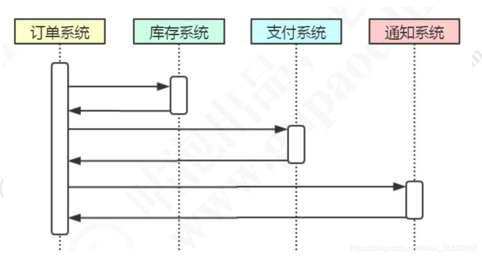
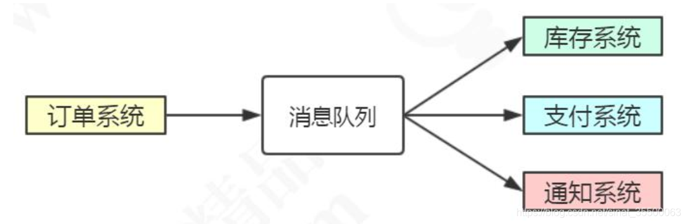
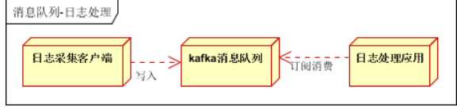
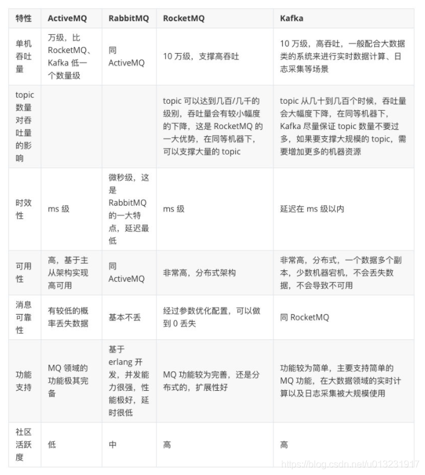

# rabbitmq入门-基础特性

安装...

## 启动服务

查看rabbitmq是否在运行
chkconfig rabbitmq-server on
启动

- service rabbitmq-server start
- rabbitmq-server -detached（以守护进程启动）

关闭
service rabbitmq-server stop
查看状态

- service rabbitmq-server status
- rabbitmqctl status

开启页面管理插件
rabbitmq-plugins enable rabbitmq_management

增加用户（默认的guest用户只能在loacalhost中访问）
rabbitmqctl add_user user1 passwd1
rabbitmqctl set_user_tags user1 administrator

## 前言

### 什么是MQ
message queue，消息队列，又叫消息中间件。
 - 独立运行的服务，平台无关
 - 采用队列数据结构，先进先出
 - 具体发布订阅模型，服务者发布消息，消费者只收到订阅的消息

如果是仅仅消息消费的问题，java中有很多的队列，为什么还需要MQ？
	java中的队列是不能跨进程的，不能再分布式系统中使用，并且没有持久化机制

### MQ使用场景

- 异步通信：异步处理逻辑场景，如跨行转账，提交了请求后收到业务处理中，也就是等待消费者处理消息中
- 系统解耦：将关联的业务动作分别通过mq通知其他系统。如	

基于上述架构，当收到用户退单操作时，需要更新其他三个系统中相关信息，可能会有下述伪代码：

```java
// 伪代码
public void returnGoods(){
	stockService.updateInventory ();
	payService.refund();
	noticeService.notice();
}
```
其实这三个操作关系不是很大，不需要依赖相互的结果，可通过MQ解耦：


- 流量削峰：当系统处理不了高并发的请求时，可通过MQ请求保存下来，系统在它能范围内内消费消息以处理请求
- 日志处理：通过MQ保存日志，相关系统消费消息以处理日志，如基于kafaka的日志处理

- 消息通讯：可用于纯消息通知，如点对点通信，聊天室

使用MQ引发的问题：
 - 系统可用性降低，如MQ单点故障。可通过MQ集群解决
 - 系统复杂度提高
   - 使用学习成本
   - 消息丢失，消息重复消费，可能会引起数据不一致问题


## 主流MQ特性对比




## RabbitMQ

rabbitmq是基于AMQP协议实现的消息队列，它提供了多种特性让你权衡可靠性和性能，包括持久化、发送应答、发布确认以及高可用性。
### AMQP协议

Advanced Message Queuing Protocal，高级消息队列协议。它是一个运行在运用层（五层）中的协议，定义了众多关于消息队列的标准。
rabbitmq支持协议：

 - STOMP
 - MQTT
 - HTTP
 - WebSocket

### 工作模型

1. Broker：代理/中介，也就是rabbitmq服务
2. Connection：producer和consumer与broker之间建立的TCP连接
3. Channel：Connection中的一个虚拟连接，通过创建或者释放channel而不释放tcp连接，可提升系统性能
4. Queue：存储消息的队列，它是一个独立运行的进程，有自己的数据库（Mnesia）。消费者获取消息有两种方式，分别是pull和push，pull模式下可通过时间监听机制获取消息。
5. Exchange：将生产的消息路由到Queue中。常用三种类型：direct、topic、fanout
   - direct：发布到每个derict exchenge的消息，通过一个精确的键与exchenge绑定的消费者才可以消费
   - topic：绑定键可加通配符，*一个单词、#任意个单词，如
     - topic.*：则绑定了topic.first的队列可接受到消息
     - topic.#：则绑定了topic.second、topic.three.four的队列可收到消息
   - fanout：广播类型，不需绑定键，与交换机绑定的队列都可获得消息
6. VHost：virtual host，虚拟域名，每个vhost中的exchange、queue都是隔离的。

### Java API示例
连接工具类：

```java
package com.pac.javaapi;


import com.rabbitmq.client.Connection;
import com.rabbitmq.client.ConnectionFactory;

import java.io.IOException;
import java.util.concurrent.TimeoutException;

public class ConnectionUtils {
    public static ConnectionFactory factory = new ConnectionFactory();

    static {
        factory.setHost("119.23.201.241");
        factory.setPort(5672);
        factory.setVirtualHost("testvhost");
        factory.setUsername("admin");
        factory.setPassword("admin");
    }

    public static Connection getConnection() throws IOException, TimeoutException {
        return factory.newConnection();
    }
}

```

生产者：

```java
package com.pac.javaapi;

import com.rabbitmq.client.Channel;
import com.rabbitmq.client.Connection;
import com.rabbitmq.client.ConnectionFactory;

import java.io.IOException;
import java.util.concurrent.TimeoutException;

public class RabbitMqProducter {

    private final static String SPIMPL_EXCHANGE = "SPIMPL_EXCHANGE";

    public static void main(String[] args) throws IOException, TimeoutException {
        ConnectionFactory factory = new ConnectionFactory();
        //IP
        factory.setHost("119.23.201.241");
        //port
        factory.setPort(5672);
        //虚拟host
        factory.setVirtualHost("testvhost");
        //用户
        factory.setUsername("admin");
        factory.setPassword("admin");

        //创建连接
        Connection connection = factory.newConnection();
        //创建通道
        Channel channel = connection.createChannel();

        //发送消息
        String msg = "Hello,RabbitMQ";
        channel.basicPublish(SPIMPL_EXCHANGE,"simple.demo",null,msg.getBytes());
        channel.close();
        connection.close();
    }

}


```

消费者：

```java
package com.pac.javaapi.topic;


package com.pac.javaapi;


import com.rabbitmq.client.*;

import java.io.IOException;
import java.util.concurrent.TimeoutException;

public class RabbitMqConsumer {
    private final static String SPIMPL_EXCHANGE = "SPIMPL_EXCHANGE";
    private final static String SIMPLE_QUEUE = "SIMPLE_QUEUE";

    public static void main(String[] args) {
        ConnectionFactory factory = new ConnectionFactory();
        factory.setHost("119.23.201.241");
        factory.setPort(5672);
        factory.setVirtualHost("testvhost");
        factory.setUsername("admin");
        factory.setPassword("admin");

        Connection connection = null;
        try {
            connection = factory.newConnection();
            Channel channel = connection.createChannel();

            //声明交换机
            /**
             * type:交换机的参数,direct、topic、fanout中的一种
             * durable:是否持久化，即交换机重启后是否还存在
             * autoDelete:自动删除
             */
            channel.exchangeDeclare(SPIMPL_EXCHANGE,"direct",false,false,null);
            //声明队列
            /**
             * durable:是否持久化，表示服务器重启后队列是否存在
             * exclusive：是否排他性，指是否只能在声明它的connection中使用，同个connection中的多个channel之间可以使用，connectio
             *            断掉后自动删除
             * autoDelete：是否自动删除，队列没有时，即既没人生产，也没人消费
             */
            channel.queueDeclare(SIMPLE_QUEUE,false,false,false,null);
            System.out.println("waiting for message...");

            //绑定队列和交换机
            channel.queueBind(SIMPLE_QUEUE,SPIMPL_EXCHANGE,"simple.demo");

            //创建消费者
            Consumer consumer = new DefaultConsumer(channel){
                @Override
                public void handleDelivery(String consumerTag, Envelope envelope, AMQP.BasicProperties properties, byte[] body) throws IOException {
                    String msg = new String(body,"UTF-8");
                    System.out.println("receive msg:"+msg);
                    System.out.println("consumerTag:"+consumerTag);
                    System.out.println("deliveryTag:"+envelope.getDeliveryTag());
                }
            };

            channel.basicConsume(SIMPLE_QUEUE,true,consumer);

        } catch (IOException e) {
            e.printStackTrace();
        } catch (TimeoutException e) {
            e.printStackTrace();
        }finally {
            if(connection != null){
                try {
                    connection.close();
                } catch (IOException e) {
                    e.printStackTrace();
                }
            }
        }
    }
}


```

#### 队列参数

- x-message-ttl：队列中消息的存活时间，到时间后回到死信队列中
- x-expires：到期时间，到期删除
- x-max-length：队列最大消息数
- x-max-bytes：队列消息最大容量
- x-overflow：当消息队列中消息长度超出最大值时的行为
  - drop-head：删掉头部
  - reject-publish：拒绝生产消息
- x-dead-letter-exchange：队列的死信交换机
- x-dead-letter-routing-key：死信交换机的路由键
- x-max-priority：队列支持的最大优先级，即队列中消息能够支持的最大优先级。 if not set, the queue will not support message priorities.
- x-queue-mode：是否懒加载，即消息使用时才加载到内存
- x-queue-master-locator：集群中会使用到


#### 消息主要参数

```java
// Copyright (c) 2007-Present Pivotal Software, Inc.  All rights reserved.
//
// This software, the RabbitMQ Java client library, is triple-licensed under the
// Mozilla Public License 1.1 ("MPL"), the GNU General Public License version 2
// ("GPL") and the Apache License version 2 ("ASL"). For the MPL, please see
// LICENSE-MPL-RabbitMQ. For the GPL, please see LICENSE-GPL2.  For the ASL,
// please see LICENSE-APACHE2.
//
// This software is distributed on an "AS IS" basis, WITHOUT WARRANTY OF ANY KIND,
// either express or implied. See the LICENSE file for specific language governing
// rights and limitations of this software.
//
// If you have any questions regarding licensing, please contact us at
// info@rabbitmq.com.

package com.rabbitmq.client;

import java.util.Date;
import java.util.Map;

public interface BasicProperties {
    
    /**
     * Retrieve the value in the contentType field.
     * @return contentType field, or null if the field has not been set.
     */
    public abstract String getContentType();
    
    /**
     * Retrieve the value in the contentEncoding field.
     * @return contentEncoding field, or null if the field has not been set.
     */
    public abstract String getContentEncoding();
    
    /**
     * Retrieve the table in the headers field as a map of fields names and
     * values. 
     * @return headers table, or null if the headers field has not been set.
     */
    public abstract Map<String, Object> getHeaders();
    
    /**
     * Retrieve the value in the deliveryMode field.
     * @return deliveryMode field, or null if the field has not been set.
     */
    public abstract Integer getDeliveryMode();
    
    /**
     * Retrieve the value in the priority field.
     * @return priority field, or null if the field has not been set.
     */
    public abstract Integer getPriority();
    
    /**
     * Retrieve the value in the correlationId field.
     * @return correlationId field, or null if the field has not been set.
     */
    public abstract String getCorrelationId();
    
    /**
     * Retrieve the value in the replyTo field.
     * @return replyTo field, or null if the field has not been set.
     */
    public abstract String getReplyTo();
    
    /**
     * Retrieve the value in the expiration field.
     * @return expiration field, or null if the field has not been set.
     */
    public abstract String getExpiration();
    
    /**
     * Retrieve the value in the messageId field.
     * @return messageId field, or null if the field has not been set.
     */
    public abstract String getMessageId();
    
    /**
     * Retrieve the value in the timestamp field.
     * @return timestamp field, or null if the field has not been set.
     */
    public abstract Date getTimestamp();
    
    /**
     * Retrieve the value in the type field.
     * @return type field, or null if the field has not been set.
     */
    public abstract String getType();
    
    /**
     * Retrieve the value in the userId field.
     * @return userId field, or null if the field has not been set.
     */
    public abstract String getUserId();
    
    /**
     * Retrieve the value in the appId field.
     * @return appId field, or null if the field has not been set.
     */
    public abstract String getAppId();

}

```

| 参数                       | 释义                              |
| -------------------------- | --------------------------------- |
| Map<String,Object> headers | 消息的其他自定义参数              |
| Integer deliveryMode       | 2 持久化， 其他： 瞬态            |
| Integer priority           | 消息的优先级                      |
| String correlationId       | 关联 ID， 方便 RPC 相应与请求关联 |
| String replyTo             | 回调队列                          |
| String expiration          | TTL， 消息过期时间， 单位毫秒     |


## Spring AMQP

	spirng amqp是基于AMPQ的消息手法解决方案，它是一个抽象层，不依赖于特定的AMQP Broker实现和客户端的抽象，可以方便更换各种AMQP的实现。


## 常用特性

### TTL

	消息的过期时间，有两种方式设置：

1. 通过队列属性设置

```java
    @Bean("firstQueue")
    public Queue getFirstQueue(){
        Map<String,Object> args = new HashMap<>();
        //过期时间
        args.put("x-message-ttl",6000);
        Queue queue = new Queue("BOOT_FIRST_QUEUE");
        return queue;
    }
```

2. 设置单条消息的过期时间
如果同时设置了Message ttl和Queue ttl，则小的生效

```java
MessageProperties messageProperties = new MessageProperties();
messageProperties.setExpiration("4000"); // 消息的过期属性， 单位 ms
Message message = new Message("这条消息 4 秒后过期".getBytes(), messageProperties);
rabbitTemplate.send("GP_TTL_EXCHANGE", "gupao.ttl", message);
```

### 死信队列
消息在某些情况下会成为死信，队列在创建的时候可以指定死信交换机DLX（Dead Letter Exchange）。死信交换机绑定的队列称为死信队列DLQ（Dead Letter Queue），DLX其实是普通的交换机，DLQ也是普通的队列

什么情况消息会变成私信？
 - 消息过期
 - 消息被消费者拒绝并未设置重回队列：(NACK || Reject ) && requeue == false
 - 队列达到最大长度，超过Max length或者max length bytes，最先入队的消息会先发到私信交换机

```java
package com.demo.config;


import org.springframework.amqp.core.*;
import org.springframework.amqp.core.Queue;
import org.springframework.beans.factory.annotation.Qualifier;
import org.springframework.context.annotation.Bean;
import org.springframework.context.annotation.Configuration;

import java.util.*;

@Configuration
public class DlxConfig {

    @Bean("timeoutExchange")
    public DirectExchange exchange(){
        return new DirectExchange("TIMEOUT_EXCHANGE",true,false,null);
    }

    @Bean("timeoutQueue")
    public Queue queue(){
        Map map = new HashMap();
        //10秒过期
        map.put("x-message-ttl",10000);
        //私信交换机
        map.put("x-dead-letter-exchange","DEAD_LETTER_EXCHANGE");
        return new Queue("TIMEOUT_QUEUE",true,false,false,map);
    }

    @Bean
    public Binding binding(@Qualifier("timeoutQueue") Queue queue,
                           @Qualifier("timeoutExchange") DirectExchange directExchange){
        return BindingBuilder.bind(queue).to(directExchange).with("direct.timeout");
    }


    //死信交换机
    @Bean("deadLetterExchange")
    public TopicExchange getDeadLetterExchange(){
        return new TopicExchange("DEAD_LETTER_EXCHANGE",true,false,new HashMap<>());
    }

    @Bean("deadLetterQueue")
    public Queue deadLetterQueue(){
        return new Queue("DEAD_LATTER_QUEUE",true,false,false,new HashMap<>());
    }

    @Bean
    public Binding deadLetterBind(@Qualifier("deadLetterExchange") TopicExchange topicExchange,
                                  @Qualifier("deadLetterQueue") Queue queue){
        //无条件路由
        return BindingBuilder.bind(queue).to(topicExchange).with("topic.dead.queue");
    }
}

```

消息流转图：


### 延迟队列
用于需要延时发送消息的场景，如未付款的订单，15分钟后关闭
rabbitmq本身不支持死信队列，可有三种方案实现：

 - 先存储到数据库，用定时任务扫描
 - 利用rabbitmq的死信队列实现
 - 利用rabbitmq-delayed-message-exchange插件

#### ttl+dlx的实现
基于前面的死信队列，消费者消费死信队列就行
消息流转过程：
生产者-原交换机-原队列-死信交换机-死信队列-最终消费者

但这种实现方式有缺点：
 - 如果统一用队列的设置消息的ttl，当梯度非常多时，需要创建很多的交换机和队列来路由信息
 - 如果单独设置消息的ttl，则可能会造成队列中的消息阻塞，如前面一条消息ttl是30min，后一条是10min，但是前一条消息未消费完后面的会一直阻塞
 - 可能会存在一定的时间误差

#### 基于延时队列插件的实现
1、进入插件目录
```txt
[root@izwz9c61wsgboaq9aoxis9z rabbitmq]# whereis rabbitmq
rabbitmq: /usr/lib/rabbitmq /etc/rabbitmq

```
2、下载插件
```txt
wget
https://bintray.com/rabbitmq/community-plugins/download_file?file_path=rabbitmq_delayed_message_exchange-0.0.1.ez
```
3、修改名字

```txt
mv download_file\?file_path\=rabbitmq_delayed_message_exchange-0.0.1.ez rabbitmq_delayed_message_exchange-0.0.1.ez
```
4、启用和停用插件
```txt
rabbitmq-plugins enable rabbitmq_delayed_message_exchange
rabbitmq-plugins disable rabbitmq_delayed_message_exchange
```
5、插件使用
通过声明一个类型为x-delayed-message的Exchange来使用delayed-messaging特性

```java
package com.demo.config;

import org.springframework.amqp.core.Binding;
import org.springframework.amqp.core.BindingBuilder;
import org.springframework.amqp.core.Queue;
import org.springframework.amqp.core.TopicExchange;
import org.springframework.beans.factory.annotation.Qualifier;
import org.springframework.context.annotation.Bean;
import org.springframework.context.annotation.Configuration;

import java.util.HashMap;
import java.util.Map;

@Configuration
public class DelayConfig {

    @Bean("delayExchange")
    public TopicExchange exchange(){
        Map map = new HashMap();
        //死信
        map.put("x-delayed-type","direct");
        return new TopicExchange("DELAY_EXCHANGE",true,false,map);
        //return new TopicExchange("DELAY_EXCHANGE");
    }

    @Bean("delayQueue")
    public Queue queue(){
        return new Queue("DELAY_QUEUE",true,false,false,new HashMap<>());
    }

    @Bean
    public Binding bindingDelay(@Qualifier("delayQueue") Queue queue,
                           @Qualifier("delayExchange") TopicExchange topicExchange){
        return BindingBuilder.bind(queue).to(topicExchange).with("delay.#");
    }
}

```

```java
package com.demo.productor;

import org.springframework.amqp.core.AmqpTemplate;
import org.springframework.amqp.core.Message;
import org.springframework.amqp.core.MessageProperties;
import org.springframework.amqp.rabbit.core.RabbitTemplate;
import org.springframework.beans.factory.annotation.Autowired;
import org.springframework.stereotype.Component;

@Component
public class DelayProducer {

    @Autowired
    private RabbitTemplate rabbitTemplate;

    @Autowired
    private AmqpTemplate amqpTemplate;

    public void send(){
        MessageProperties properties = new MessageProperties();
        //延迟的间隔时间
        properties.setHeader("x-delay",10000);
        Message message = new Message("this is a delay msg".getBytes(),properties);
        rabbitTemplate.send("DELAY_EXCHANGE","delay.msg",message);
        //amqpTemplate.convertAndSend("DELAY_EXCHANGE","delay.msg","delay msg");
    }
}

```
### 服务端流控
队列中有两个参数可用来控制队列中的信息容量的
 - x-max-length
 - x-max-length-bytes
可用来控制服务端流量控制？
当这x-max-length达到阈值时，可通过x-overflow=reject-publish实现控制，但x-overflow=drop-dead不行，未消费的消息直接删除了

#### 内存控制
rabbitmq会在启动时检测物理机器的内存值，默认当MQ占用40%以上内存时，mq会抛出一个内存警告并阻塞所有连接。可在配置文件修改：

```txt
[{rabbit, [{vm_memory_high_watermark, 0.4}]}].
```
或者通过命令动态设置：
```
rabbitmqctl set_vm_memory_high_watermark 0.3

```

#### 磁盘控制
另外可通过磁盘来控制消息的发布
指定磁盘的30或者2g，当小于这个容量时限流
```
disk_free_limit.relative = 0.3
disk_free_limit.absolute = 2GB

```

### 消费端限流
设置unached message数，即在客户端中收到的未被处理完的消息数
设置channel参数配置：

```java
channel.basicQos(2); // 如果超过 2 条消息没有发送 ACK， 当前消费者不再接受队列消息
channel.basicConsume(QUEUE_NAME, false, consumer);
```
Spring中的SimpleMessageListenerContainer实现

```java
container.setPrefetchCount(2);
```

springboot配置：

```properties
spring.rabbitmq.listener.simple.prefetch=2
```


# rabbitmq-可靠性投递

## 可靠性投递

	首先明确一个问题，效率和可靠性是无法兼得的。如果一些业务对实时性要求不是特别高，可以牺牲一些可靠性来换取效率。比如日志处理，如果没收到日志，这样不会对业务造成影响，只需重发数据即可。


回顾上述工作模型，考虑rabbitmq在运行中可能会出现的问题：

1. 生产者将消息发送到broker
   - 生产者怎么知道消息已经被broker接收
2. 消息从exchange路由到queue
   - 消息如果没有办法路由到正确的队列，会发生什么？怎么处理？
3. 消息在queue中存储
   - 怎么保证消息在队列中稳定的存储
4. 消费者订阅queue并消费消息
   - 队列怎么知道消费者消费消息成功？或者说接收了消息

### 服务端确认机制

- Transation事务模式

```java
package com.gupaoedu.transaction;

import com.gupaoedu.util.ResourceUtil;
import com.rabbitmq.client.Channel;
import com.rabbitmq.client.Connection;
import com.rabbitmq.client.ConnectionFactory;

public class TransactionProducer {
    private final static String QUEUE_NAME = "ORIGIN_QUEUE";

    public static void main(String[] args) throws Exception {
        ConnectionFactory factory = new ConnectionFactory();
        factory.setUri(ResourceUtil.getKey("rabbitmq.uri"));

        // 建立连接
        Connection conn = factory.newConnection();
        // 创建消息通道
        Channel channel = conn.createChannel();

        String msg = "Hello world, Rabbit MQ";
        // 声明队列（默认交换机AMQP default，Direct）
        // String queue, boolean durable, boolean exclusive, boolean autoDelete, Map<String, Object> arguments
        channel.queueDeclare(QUEUE_NAME, false, false, false, null);

        try {
            //将信道设成事务模式
            channel.txSelect();
            // 发送消息
            // String exchange, String routingKey, BasicProperties props, byte[] body
            channel.basicPublish("", QUEUE_NAME, null, (msg).getBytes());
            // int i =1/0;
            channel.txCommit();
            //前面txCommit方法没报错包使提交成功
            System.out.println("消息发送成功");
        } catch (Exception e) {
            //事务回滚
            channel.txRollback();
            System.out.println("消息已经回滚");
        }

        channel.close();
        conn.close();
    }
}


```

springboot中使用：

```java
rabbitTemplate.setChannelTransacted(true);
```

AMQP抓包示意：


	事务模式中每发送一条消息都需和rabbitmq服务器确认，并且是阻塞的，一条消息没发送完就不能发送下一条，这样会极大损耗rabbitmq服务器性能，不建议使用。

- Confirm确认模式

  - 普通确认模式
  - 批量确认模式

  ```java
  package com.pac.javaapi.confirm;
  
  
  import com.pac.javaapi.ConnectionUtils;
  import com.rabbitmq.client.Channel;
  import com.rabbitmq.client.Connection;
  
  import java.io.IOException;
  import java.util.concurrent.TimeoutException;
  
  public class SynConfirmProducer {
  
      private final static String QUEUE_NAME = "SYN_CONFIRM_QUEUE";
  
      public static void main(String[] args) throws IOException, TimeoutException {
          Connection connection = ConnectionUtils.getConnection();
          Channel channel = connection.createChannel();
  
          String msg = "synchronized confirm";
          //声明队列，没绑定交换机默认是AMQP defalut
          channel.queueDeclare(QUEUE_NAME,false,false,false,null);
  
          try {
              //开启发送方确认模式
              channel.confirmSelect();
  
              //1、普通确认模式，发送一条，确认一条
              channel.basicPublish("",QUEUE_NAME,null,msg.getBytes());
              if(channel.waitForConfirms()){
                  System.out.println("消息发送成功");
              }
  
              //2、批量确认模式
              for(int i = 0; i <5; i++){
                  channel.basicPublish("",QUEUE_NAME,null,(msg+"i").getBytes());
              }
              channel.waitForConfirmsOrDie();
              System.out.println("消息发送成功");
  
  
          } catch (InterruptedException e) {
              System.out.println("消息发送失败");
          }
          channel.close();
          connection.close();
      }
  }
  
  ```

  - 异步确认模式

    ```java
    package com.pac.javaapi.confirm;
    
    
    import com.pac.javaapi.ConnectionUtils;
    import com.rabbitmq.client.Channel;
    import com.rabbitmq.client.ConfirmListener;
    import com.rabbitmq.client.Connection;
    
    import java.io.IOException;
    import java.util.Collections;
    import java.util.SortedSet;
    import java.util.TreeSet;
    import java.util.concurrent.TimeoutException;
    
    public class AsynConfirmProducer {
    
        private final static String QUEUE_NAME = "SYN_CONFIRM_QUEUE";
    
        public static void main(String[] args) throws IOException, TimeoutException {
            Connection connection = ConnectionUtils.getConnection();
            Channel channel = connection.createChannel();
    
            String msg = "synchronized confirm";
            //声明队列，没绑定交换机默认是AMQP defalut
            channel.queueDeclare(QUEUE_NAME,false,false,false,null);
    
            //维护未确认消息的deliveryTag
            final SortedSet<Long> confirmSet = Collections.synchronizedSortedSet(new TreeSet<>());
    
            /**
             * 异步确认消息，broker可能一次确认一条，也可能确认多条
             */
            channel.addConfirmListener(new ConfirmListener() {
    
                @Override
                public void handleAck(long deliveryTag, boolean multiple) throws IOException {
                    System.out.println("broker 已确认消息，标识："+deliveryTag );
                    //确认了多条，表示批量执行了deliveryTag这个值以前（小于deliveryTag的）的所有消息
                    if(multiple){
                        //删除
                        confirmSet.headSet(deliveryTag+1L).clear();
                    }else{ //只确认了单条
                        confirmSet.remove(deliveryTag);
                    }
    
    
                }
    
                @Override
                public void handleNack(long deliveryTag, boolean multiple) throws IOException {
                    System.out.println("broker 未确认消息，标识"+deliveryTag);
                    /*if(multiple){
                        //删除
                        confirmSet.headSet(deliveryTag+1L).clear();
                    }else{ //只确认了单条
                        confirmSet.remove(deliveryTag);
                    }*/
    
                    //可添加重发方法
                }
            });
    
            //开启发送方确认模式
            channel.confirmSelect();
            for(int i = 0; i <10; i++){
                long nextSeqNo = channel.getNextPublishSeqNo();
                channel.basicPublish("",QUEUE_NAME,null,(msg+"i").getBytes());
                confirmSet.add(nextSeqNo);
            }
    
            System.out.println("所有消息："+confirmSet);
    
    
            //这里注释掉的原因是如果先关闭了，可能收不到后面的ACK
    //        channel.close();
    //        connection.close();
        }
    }
    
    ```

    结果：

    ```txt
    所有消息：[1, 2, 3, 4, 5, 6, 7, 8, 9, 10]
    broker 已确认消息，标识：2
    broker 已确认消息，标识：8
    broker 已确认消息，标识：10
    ```

    在spring中的实现：

    ```java
    rabbitTemplate.setConfirmCallback(new RabbitTemplate.ConfirmCallback() {
    @Override
    public void confirm(CorrelationData correlationData, boolean ack, String cause) {
        if (!ack) {
            System.out.println("发送消息失败： " + cause);
            throw new RuntimeException("发送异常： " + cause);
        }
    }
    });
    ```


### 消息从交换机路由到队列

处理无法路由消息方式：

- 服务端重发给生产者

  - 使用mandatory参数和ReturnListener（spring amqp中是ReturnCallback）

    ```java
    rabbitTemplate.setMandatory(true);
    rabbitTemplate.setReturnCallback(new RabbitTemplate.ReturnCallback(){
    	public void returnedMessage(Message message,
            int replyCode,
            String replyText,
            String exchange,
            String routingKey){
            System.out.println("回发的消息： ");
            System.out.println("replyCode: "+replyCode);
            System.out.println("replyText: "+replyText);
            System.out.println("exchange: "+exchange);
            System.out.println("routingKey: "+routingKey);
        }
    })
    ```

- 让交换机路由到另一个备份交换机

  ```java
  Map<String,Object> arguments = new HashMap<String,Object>();
  arguments.put("alternate-exchange","ALTERNATE_EXCHANGE"); // 指定交换机的备份交换机
  
  channel.exchangeDeclare("TEST_EXCHANGE","topic", false, false, false, arguments);
  ```

注意区分exchange和queue的参数，exchange只有一个参数：


### 消息在队列中的存储

rabbitmq的故障可能会导致消息中的内存消失，所以我们需要把消息本身和元数据（exchange、queue、message）都保存到磁盘

解决方案：

- 队列持久化

  ```java
  @Bean("timeoutQueue")
      public Queue queue(){
          Map map = new HashMap();
          //10秒过期
          map.put("x-message-ttl",10000);
          //私信交换机
          map.put("x-dead-letter-exchange","DEAD_LETTER_EXCHANGE");
          /**
           * name
           * durable：是否持久化
           * exclusive：是否排他性，指是否只能在声明它的connection中使用，同个connection中的多个channel之间可以使用，connection
           *            断掉后自动删除
           * autoDelete：是否自动删除，即既没人生产，也没人消费时
           * args
           */
          return new Queue("TIMEOUT_QUEUE",true,false,false,map);
      }
  ```

- 交换机持久化

  ```java
  @Bean("GpExchange")
  public DirectExchange exchange() {
  // exchangeName, durable, exclusive, autoDelete, Properties
  return new DirectExchange("GP_TEST_EXCHANGE", true, false, new HashMap<>());
  }
  ```

- 消息持久化

  ```java
  MessageProperties messageProperties = new MessageProperties();
  //设置为持久化模式
  messageProperties.setDeliveryMode(MessageDeliveryMode.PERSISTENT);
  Message message = new Message("持久化消息".getBytes(), messageProperties);
  rabbitTemplate.send("GP_TEST_EXCHANGE", "gupao.test", message);
  ```

  ```java
  public enum MessageDeliveryMode {
      NON_PERSISTENT,
      PERSISTENT;
      ...
  }
  ```

-  集群：如果只有一个rabbitmq节点，即使元数据都已经持久化，但当当前节点系统崩溃、硬件故障时，数据可能会丢失，这时可以通过加集群增加可用性


### 消息投递到消费者

rabbitmq提供了消费者的消息确认机制以使服务端能够知道消费者是否正确消费了消息：

- 自动ack：消息者收到消息就返回ack，并不管消费者处理消息过程中是否有异常
- 手动ack：

怎么设置和调用：

- javaapi

  ```java
              //创建消费者
              Consumer consumer = new DefaultConsumer(channel){
                  @Override
                  public void handleDelivery(String consumerTag, Envelope envelope, AMQP.BasicProperties properties, byte[] body) throws IOException {
                      String msg = new String(body,"UTF-8");
                      System.out.println("receive msg:"+msg);
                      System.out.println("consumerTag:"+consumerTag);
                      System.out.println("deliveryTag:"+envelope.getDeliveryTag());
  
                      //手动ack
                      channel.basicAck(Long.valueOf(consumerTag),true);
                  }
              };
  			//第二个参数antoAck
              channel.basicConsume(SIMPLE_QUEUE,false,consumer);
  ```

- spring amqp

  设置：

  ```java
  //SimpleRabbitListenerContainerFactory
  factory.setAcknowledgeMode(AcknowledgeMode.MANUAL);
  ```

  调用：

  ```java
  public class SecondConsumer {
      @RabbitHandler
      public void process(String msgContent,Channel channel, Message message) throws IOException {
          System.out.println("Second Queue received msg : " + msgContent );
          //1、返回ack，即成功
          channel.basicAck(message.getMessageProperties().getDeliveryTag(), false);
  
          //2、拒绝
          /**
           * deliveryTag
           * multiple
           * requeue
           */
          channel.basicNack(message.getMessageProperties().getDeliveryTag(),false,false);
  
          /**
           * deliveryTag
           * requeue
           */
          channel.basicReject(message.getMessageProperties().getDeliveryTag(),true);
      }
  }
  ```

  注意拒绝的两种方式：Basic.Nack()和Basic.reject()，requeue参数慎用，若只有一个消费者时可能会无限循环

  properties：

  ```
  spring.rabbitmq.listener.direct.acknowledge-mode=manual
  spring.rabbitmq.listener.simple.acknowledge-mode=manual
  ```

  ```java
  //
  // Source code recreated from a .class file by IntelliJ IDEA
  // (powered by Fernflower decompiler)
  //
  
  package org.springframework.amqp.core;
  
  public enum AcknowledgeMode {
      //自动ack
      NONE,
      //手动ack
      MANUAL,
      AUTO;
  
      private AcknowledgeMode() {
      }
  
      public boolean isTransactionAllowed() {
          return this == AUTO || this == MANUAL;
      }
  
      public boolean isAutoAck() {
          return this == NONE;
      }
  
      public boolean isManual() {
          return this == MANUAL;
      }
  }
  
  ```

  - NONE：自动ack
  - MANUAL：手动ack
  - AUTO
    - 未抛出异常：发送ack
    - 抛出异常
      - AmqpRejectAndDontRequeueException ：消息会被拒绝且不入队
      - ImmediateAcknowledgeAmqpException ：发送ack
      - 其他异常：消息被拒绝，当requeue=true时会重新入队

当服务端没有收到消费者的ACK信息时怎么处理？

- 若有多个消费者且当前消费者断开连接：尝试给其他消费者消费
- 单一消费者：修复故障重启消费者重启消费


### 消费者回调

- 调用生产者API

- 发送相应信息给生产者

  [外链图片转存失败(img-n9GayPc3-1569216134269)(D:\BaiduNetdiskDownload\markdown笔记\rabbitmq(一)].assets\1569214573343.png)

### 补偿机制

如果生产者的API没有被调用，也就是没收到消费者的响应信息，消息到底是处理成功了还是失败？怎么办？

生产者和消费者可约定一个超时时间，比如5分钟，对于规定时间内未收到响应的消息进行重发。


### 消费幂等性

引起消息重复的原因：

- 生产者重复发送：如confirm模式下未收到broker响应重新发送
- 生产者代码或者网络问题

此时消费者端需做幂等处理，同一笔业务有唯一标识


### 最终一致

即约定在某个时间进行各个系统的数据对比，权衡正确性


### 消息的顺序性

消息的顺序性指的是消费者消费消息的顺序应该与生产者生产消息的顺序保持一致。当有多个消费者消费同一队列中的数据时，由于每个消费者消费速率不一样，所以顺序无法保证。所以，当对消息顺序性有要求时，最好一个消费者消费一份队列中的数据。


# 集群和高可用

集群的作用：

- 高可用：当主节点挂了后可以用其他节点代替
- 负载均衡：高并发场景中，单台MQ处理消息能力有限，可以分发到其他节点进行消息处理


## rabbitmq中的集群

rabbitmq时基于erlang开发的，而erlang天生具有分布式特性，所以rabbitma天生支持集群。

集群模式：

- 普通集群模式
- 镜像队列模式

节点类型：

- 磁盘节点：元数据（队列名字属性、交换机的类型名字属性、绑定、vhots）保存在了磁盘
- 内存节点：元数据保存在了内存（其将磁盘的地址放在了磁盘，不然重启后没法同步数据）

注：如果是持久化的消息，会同时放进磁盘和内容

集群中必须有一个节点为磁盘节点用来持久化数据，否则全部内存节点崩溃时数据会丢失。一般情况下应用连接内存节点，磁盘节点用来备份。


集群配置步骤：

1. 配置hosts
2. 同步erlang.cookie
3. 加入集群


### 普通集群

​	普通集群模式下，不同节点之间只会相互同步元数据

.assets\1569225951794.png)

在其中，队列的内容是不会相互同步的

优点：

- 减少了队列数据同步的网络开销
- 达到了线性增加性能和存储容量的目的

缺点：

- 不能保证高可用，如果节点失效将导致队列数据丢失

节点调用过程：

- 假如生产者连接的是节点 3，要将消息通过交换机 A 路由到队列 1，最终消息还是会
  转发到节点 1 上存储，因为队列 1 的内容只在节点 1 上。
- 同理，如果消费者连接是节点 2，要从队列 1 上拉取消息，消息会从节点 1 转发到
  节点 2。其它节点起到一个路由的作用，类似于指针。 


### 镜像队列

镜像队列中，队列中数据也就是消息会互相同步。

优点：

- 可用性更高

缺点：

- 系统性能降低，节点过多情况下同步代价大

| 操作方式              | 命令或步骤                                                   |
| --------------------- | ------------------------------------------------------------ |
| rabbitmqctl (Windows) | rabbitmqctl set_policy ha-all "^ha." "{""ha-mode"":""all""}" |
| HTTP API              | PUT /api/policies/%2f/ha-all {"pattern":"^ha.", "definition":{"ha-mode":"all"}} |
| Web UI                | 1、 avigate to Admin > Policies > Add / update a policy 2、 Name 输入： mirror_image 3、 Pattern 输入： ^（代表匹配所有） 4、 Definition 点击 HA mode， 右边输入： all 5、 Add policy |


高可用的集群架构：

.assets\1569227299207.png)

规划：

- 内存节点1：192.168.8.40 
- 内存节点2：192.168.8.45 
- 磁盘节点：192.168.8.150 
- VIP：192.168.8.220 


# 常见面试题

1. 消息队列的作用与使用场景

   （队列作用：存取消息）

   消息通讯、消息中间件，平台无关的独立服务。

   异步通信、系统解耦、流量削峰、日志处理、消息通讯

2. channel和vhost作用

   channel可认为是一个虚拟连接，可以使得不用重复创建connection，减少tcp的消耗，同时也是最重要的编程接口。

   vhost是虚拟域名，不同vhost中的exchange和queue都是隔离的。它提高了硬件资源利用率，实现资源隔离

3. rabbitmq有哪些路由方式？适合场景分别是什么

   - derect
   - topic
   - fanout

4. 交换机与队列、队列与消费者的绑定关系是什么样的？
   多个消费者监听一个队列时（比如一个服务部署多个实例），消息会重复消
   费吗？
   多对多；
   轮询（平均分发） 

5. 无法被路由的消息，去了哪里？
   直接丢弃。可用备份交换机（alternate-exchange）接收 

6. 消息在什么时候会变成 Dead Letter（死信）？ 

   - 消息过期
   - 队列长度、容量达到最大
   - 被消费者拒绝并未设置重新入队

7. 如果一个项目要从多个服务器接收消息，怎么做？如果一个项目要发送消息到多个服务器，怎么做？ 

   - 定义多个connectionFactory，注入到消费者监听类/Temaplate 

8. rabbitmq怎么实现延时队列

   - 数据库+定时任务
   - 死信队列
   - 延迟队列插件

9. 哪些情况会导致消息丢失？怎么解决？哪些情况会导致消息重复？怎么解决？

   - 消息丢失
     - 生产者发送了，broker实际没收到
       - 解决：事务模式、confirm模式（单个、批量、异步）
     - 交换机没路由到队列
       - 解决：生产者重发、备份交换机
     - 队列中消息丢失
       - 解决：交换机、队列、消息持久化；集群
     - 消息没成功被消费者消费
       - 解决：消费端确认机制：自动ack、手动ack
   - 消息重复
     - 生产者重发：解决方式：消费端的消息幂等

10. 一个队列最多存储多少条消息？

    - 由设置的队列参数（长度、容量）、硬件资源决定

11. 可以用队列的 x-max-length 最大消息数来实现限流吗？例如秒杀场景 。

    - 不能，会删除先入队的消息。

12. 如果提高消费速率？

    - 增加消费者

13. AmqpTemplate 和 RabbitTemplate 的区别？ 

    - Spring AMQP 是 Spring 整合 AMQP 的一个抽象。Spring-Rabbit 是一个实
      现。 就像AMQP是一个标准，rabbitmq是实现

14. 如何动态地创建消费者监听队列？ 

    - 通过 ListenerContainer

      ```java
      com.gupaoedu.amqp.container.ContainerConfig.java
      container.setQueues(getSecondQueue(), getThirdQueue()); //监听的队列 
      ```

15. Spring AMQP 中消息怎么封装？用什么转换？ 

    - Message、MessageConvertor

16. 如何保证消息的顺序性？

    - 一个队列单一消费者

17. rabbitmq集群节点类型？

    - 磁盘节点
    - 内存节点

18. rabbitmq集群类型？

    - 普通集群（只同步元数据，不同步队列消息）
    - 镜像队列

19. 如何保证rabbitmq的高可用？

    - HAProxy（LVS）+keepalive

20. 大量消息堆积怎么办？

    - 重启
    - 多创建几个消费者消费
    - 清空队列，重发消息

21. MQ选型分析

    - 使用和管理
      - API、与 Spring 集成
      - 管理控制台，权限、安全、监控
      - 扩展性
      - 社区支持
    - 性能
      - 并发性
      - 消息吞吐量
      - 消息堆积能力 
    - 功能
      - 事务性消息
      - 顺序性消息
      - 消息重试
      - 死信队列
      - 优先级队列
      - 延迟队列 
    - 可靠+可用
      - 集群
      - 持久化
      - 消息同步 

22. 设计MQ，你的思路是什么？

    - 存储与转发。
    - 存储：内存：用什么数据结构？
    - 磁盘：文件系统？数据库？
    - 通信：通信协议（TCP HTTP AMQP ）？一对一？一对多？
    - 推模式？拉模式？ 

