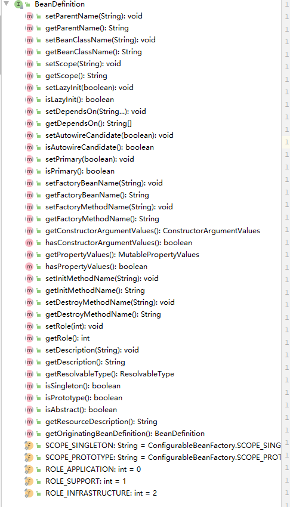
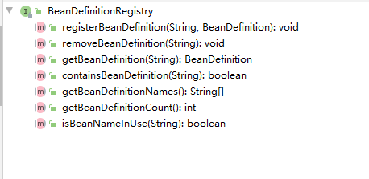

项目：D:\projects\github\personal\spring-learn\think-in-spring


# 总览

## spring中的编程模型


Aware回调

BeanPostProcessor后置处理

```java
//
// Source code recreated from a .class file by IntelliJ IDEA
// (powered by Fernflower decompiler)
//

package org.springframework.beans.factory.config;

import org.springframework.beans.BeansException;
import org.springframework.lang.Nullable;

public interface BeanPostProcessor {
    @Nullable
    default Object postProcessBeforeInitialization(Object bean, String beanName) throws BeansException {
        return bean;
    }

    @Nullable
    default Object postProcessAfterInitialization(Object bean, String beanName) throws BeansException {
        return bean;
    }
}

```

## 面试题


# IOC

IOC主要实现策略

- service locator pattern:服务定位模式，如通过JNDI获得即JAVA EE组件


JAVA EE

J2EE


实现策略主要分为两种类型

- 依赖查找：callback机制？
- 依赖注入
  - 构造器
  - 方法
  - 属性
  - 接口


## IOC容器的职责


## 传统IOC容器的实现

### Java Bean作为IOC容器


# IOC容器概述

## Spring IOC依赖查找

```xml
<?xml version="1.0" encoding="UTF-8"?>
<beans xmlns="http://www.springframework.org/schema/beans"
       xmlns:xsi="http://www.w3.org/2001/XMLSchema-instance"
       xsi:schemaLocation="http://www.springframework.org/schema/beans
        https://www.springframework.org/schema/beans/spring-beans.xsd">

    <bean id="user" class="com.geekbang.ioc.overview.dependency.domain.User">
        <property name="id" value="1" />
        <property name="age" value="18" />
        <property name="name" value="Jack"/>
    </bean>


    <bean id="superUser" class="com.geekbang.ioc.overview.dependency.domain.SuperUser">
        <property name="address" value="SHENZHEN" />
    </bean>


    <bean id="objectFactory" class="org.springframework.beans.factory.config.ObjectFactoryCreatingFactoryBean">
        <property name="targetBeanName" value="user" />
    </bean>

</beans>

```

- 根据Bean名称查找
  - 实时查找
  - 延迟查找
- 根据Bean类型查找
  - 单个Bean
  - 集合Bean
- 根据Bean名称+类型查找
- 根据java注解查找
  - 单个Bean
  - 集合Bean

```java
package com.geekbang.ioc.overview.dependency.lookup;

import com.geekbang.ioc.overview.dependency.annotation.Super;
import com.geekbang.ioc.overview.dependency.domain.User;
import org.springframework.beans.factory.BeanFactory;
import org.springframework.beans.factory.ListableBeanFactory;
import org.springframework.beans.factory.ObjectFactory;
import org.springframework.context.support.ClassPathXmlApplicationContext;

import java.util.Map;

public class DependencyLookupDemo {


    public static void main(String[] args) {
        BeanFactory factory = new ClassPathXmlApplicationContext("classpath:/META-INF/dependency-lookup-context.xml");

        lookupInRealTime(factory);

        lookupInLazy(factory);

        //lookupByType(factory);

        lookupByNameAndType(factory);

        lookupCollectionByType(factory);


        lookByAnnotationType(factory);

    }

    /**
     * 根据名称和类型查找
     * @param factory
     */
    private static void lookupByNameAndType(BeanFactory factory) {
        User user = factory.getBean("user", User.class);
        System.out.println(user);
    }

    /**
     * 根据类型查找集合
     * @param factory
     */
    private static void lookupCollectionByType(BeanFactory factory) {

        if(factory instanceof ListableBeanFactory){
            ListableBeanFactory listableBeanFactory = (ListableBeanFactory) factory;
            Map<String, User> beansOfType = listableBeanFactory.getBeansOfType(User.class);
            System.out.println(beansOfType);
        }

    }

    /**
     * 根据类型查找
     * @param factory
     */
    private static void lookupByType(BeanFactory factory) {
        User bean = factory.getBean(User.class);
        System.out.println(bean);
    }

    /**
     * 根据注解查找
     * @param factory
     */
    private static void lookByAnnotationType(BeanFactory factory) {
        if (factory instanceof ListableBeanFactory){
            ListableBeanFactory beanFactory = (ListableBeanFactory) factory;
            Map<String, Object> beansWithAnnotation = beanFactory.getBeansWithAnnotation(Super.class);
            System.out.println("根据Super注解找到的class：" + beansWithAnnotation);
        }
    }

    /**
     * 延迟查找
     * @param factory
     */
    private static void lookupInLazy(BeanFactory factory) {
        ObjectFactory<User> objectFactory = (ObjectFactory<User>) factory.getBean("objectFactory");
        User object = objectFactory.getObject();
        System.out.println(object);
    }

    /**
     * 实时查找
     * @param factory
     */
    private static void lookupInRealTime(BeanFactory factory) {
        User bean = (User) factory.getBean("user");
        System.out.println(bean);
    }
}

```


ObjectFactory没有生成新的Bean？而FactoryBean有？


## Spring IOC依赖注入

- 根据 Bean 名称注入
- 根据 Bean 类型注入
  - 单个 Bean 对象
  - 集合 Bean 对象
- 注入容器內建 Bean 对象
- 注入非 Bean 对象（内建依赖）
- 注入类型
  - 实时注入
  - 延迟注入  


## Spring IOC依赖来源

- 自定义Bean
- 容器内建Bean
- 容器内建依赖

示例代码：

```java
package com.geekbang.ioc.overview.dependency.repository;

import com.geekbang.ioc.overview.dependency.domain.User;
import org.springframework.beans.factory.BeanFactory;

import java.util.Collection;

/**
 * 用户信息仓库
 */
public class UserRepository {

    private Collection<User> users; //自定义bean

    private BeanFactory beanFactory;


    public Collection<User> getUsers() {
        return users;
    }

    public void setUsers(Collection<User> users) {
        this.users = users;
    }

    public BeanFactory getBeanFactory() {
        return beanFactory;
    }

    public void setBeanFactory(BeanFactory beanFactory) {
        this.beanFactory = beanFactory;
    }
}

```


```xml
<?xml version="1.0" encoding="UTF-8"?>
<beans xmlns="http://www.springframework.org/schema/beans"
       xmlns:xsi="http://www.w3.org/2001/XMLSchema-instance"
       xmlns:util="http://www.springframework.org/schema/util"
       xsi:schemaLocation="
        http://www.springframework.org/schema/beans https://www.springframework.org/schema/beans/spring-beans.xsd
        http://www.springframework.org/schema/util https://www.springframework.org/schema/util/spring-util.xsd">

    <import resource="dependency-lookup-context.xml" />
    
    <bean id="userRepository" class="com.geekbang.ioc.overview.dependency.repository.UserRepository"
    autowire="byType"> <!-- 根据类型自动注入-->
        <!-- 手动配置（硬编码） -->
        <!--<property name="users">
            <util:list>
                <ref bean="user" />
                <ref bean="superUser" />
            </util:list>
        </property>-->
    </bean>

</beans>

```

```java
package com.geekbang.ioc.overview.dependency.injection;

import com.geekbang.ioc.overview.dependency.repository.UserRepository;
import org.springframework.beans.factory.BeanFactory;
import org.springframework.context.ApplicationContext;
import org.springframework.context.support.ClassPathXmlApplicationContext;
import org.springframework.core.env.Environment;

/**
 * 依赖注入
 */
public class DependencyInjectionDemo {

    public static void main(String[] args) {
        BeanFactory beanFactory = new ClassPathXmlApplicationContext("classpath:/META-INF/dependency-injection-context.xml");

        //依赖来源一：自定义对象
        UserRepository userRepository = beanFactory.getBean("userRepository", UserRepository.class);
        System.out.println(userRepository.getUsers());

        //依赖来源二：依赖注入（内建依赖）: 依赖注入的beanFactory和用于依赖查找的BeanFactory并非同一个
        //解答26节
        System.out.println(userRepository.getBeanFactory());
        System.out.println(beanFactory);
        System.out.println(beanFactory == userRepository.getBeanFactory());

        //错误查找，不用在依赖查找中找到BeanFactory
        //System.out.println(beanFactory.getBean(BeanFactory.class));

        //依赖来源三、容器内建Bean
        Environment bean = beanFactory.getBean(Environment.class);
        System.out.println("获取到的Environment类型的Bean：" + bean);

    }

}

```


## Spring IOC配置元信息

- Bean定义配置

  - 基于XML文件
  - 基于properties文件
  - 基于Java注解
  - 基于Java API（专题）
- IOC容器配置
- 基于XML文件
  - 基于Java文件
- 基于Java API（专题）
- 外部化Java配置
  - 基于Java注解


## Spring IOC容器

ApplicationContext和BeanFactory谁才是IOC容器


查看ApplicationContext的继承实现图，可见ApplicationContext实现了BeanFactory接口，可以说两者都是IOC容器，ApplicationContext在BeanFactory的基础上做了一些拓展，其除了作为IOC容器角色外，还提供：

- 面向切面（AOP）
- 配置元信息（Configuration Metadata）
- 资源管理（Resource）
- 事件（Event）
- 国际化（i18n）
- 注解（Annotation）
- Environment抽象（Environment Abstraction）

但是，实际上ApplicationContext依赖查找时，其还是通过其内建实现的一个组合BeanFactory其查找的，毕竟对于Bean的操作基本上包含在BeanFactory及其实现类接口中。

注意ApplicationContext的GetBean方法，其中组建了一个组合BeanFactory，查找依赖时是使用其查找的


## 使用Spring IOC容器

- BeanFactory作为IOC容器

  ```java
  package com.geekbang.ioc.overview.dependency.container;
  
  import com.geekbang.ioc.overview.dependency.domain.User;
  import org.springframework.beans.factory.BeanFactory;
  import org.springframework.beans.factory.ListableBeanFactory;
  import org.springframework.beans.factory.support.DefaultListableBeanFactory;
  import org.springframework.beans.factory.xml.XmlBeanDefinitionReader;
  
  import java.util.Map;
  
  /**
   * {@link BeanFactory} BeanFactory作为IOC容器
   */
  public class BeanFactoryAsIocContainerDemo {
  
      public static void main(String[] args) {
          DefaultListableBeanFactory beanFactory = new DefaultListableBeanFactory();
          XmlBeanDefinitionReader reader = new XmlBeanDefinitionReader(beanFactory);
          String location = "classpath:/META-INF/dependency-lookup-context.xml";
          //加载配置
          int i = reader.loadBeanDefinitions(location);
          System.out.println("查找到的Bean定义数量：" + i);
          //依赖查找集合对象
          lookupCollectionByType(beanFactory);
      }
  
  
      /**
       * 根据类型查找集合
       * @param factory
       */
      private static void lookupCollectionByType(BeanFactory factory) {
  
          if(factory instanceof ListableBeanFactory){
              ListableBeanFactory listableBeanFactory = (ListableBeanFactory) factory;
              Map<String, User> beansOfType = listableBeanFactory.getBeansOfType(User.class);
              System.out.println(beansOfType);
          }
  
      }
  
  }
  
  ```

- ApplicationContext作为IOC容器

  ```java
  package com.geekbang.ioc.overview.dependency.container;
  
  import com.geekbang.ioc.overview.dependency.domain.User;
  import org.springframework.beans.factory.BeanFactory;
  import org.springframework.beans.factory.ListableBeanFactory;
  import org.springframework.context.annotation.AnnotationConfigApplicationContext;
  import org.springframework.context.annotation.Bean;
  import org.springframework.context.annotation.Configuration;
  
  import java.util.Map;
  
  /**
   * {@link org.springframework.context.ApplicationContext} 作为IOC容器
   */
  @Configuration
  public class ApplicationContextAsIocContainerDemo {
  
      public static void main(String[] args) {
          //创建BeanFactory容器
          AnnotationConfigApplicationContext context = new AnnotationConfigApplicationContext();
          //注册配置类
          context.register(ApplicationContextAsIocContainerDemo.class);
          //启动上下文
          context.refresh();
          lookupCollectionByType(context);
          context.close();
      }
  
      @Bean
      public User user (){
          User user = new User();
          user.setName("测试用户");
          user.setAge(18);
          return user;
      }
  
      /**
       * 根据类型查找集合
       * @param factory
       */
      private static void lookupCollectionByType(BeanFactory factory) {
  
          if(factory instanceof ListableBeanFactory){
              ListableBeanFactory listableBeanFactory = (ListableBeanFactory) factory;
              Map<String, User> beansOfType = listableBeanFactory.getBeansOfType(User.class);
              System.out.println(beansOfType);
          }
  
      }
  
  }
  
  ```

  


IDEA UML类图使用

https://blog.csdn.net/zj420964597/article/details/87856758

https://www.cnblogs.com/LDZZDL/p/9061603.html


## Spring IOC容器的生命周期

1. 启动：org.springframework.context.support.AbstractApplicationContext#refresh

   ```java
   	@Override
   	public void refresh() throws BeansException, IllegalStateException {
   		synchronized (this.startupShutdownMonitor) {
   			// Prepare this context for refreshing.
   			prepareRefresh();
   
   			// Tell the subclass to refresh the internal bean factory.
   			ConfigurableListableBeanFactory beanFactory = obtainFreshBeanFactory();
   
   			// Prepare the bean factory for use in this context.
   			prepareBeanFactory(beanFactory);
   
   			try {
   				// Allows post-processing of the bean factory in context subclasses.
   				postProcessBeanFactory(beanFactory);
   
   				// Invoke factory processors registered as beans in the context.
   				invokeBeanFactoryPostProcessors(beanFactory);
   
   				// Register bean processors that intercept bean creation.
   				registerBeanPostProcessors(beanFactory);
   
   				// Initialize message source for this context.
   				initMessageSource();
   
   				// Initialize event multicaster for this context.
   				initApplicationEventMulticaster();
   
   				// Initialize other special beans in specific context subclasses.
   				onRefresh();
   
   				// Check for listener beans and register them.
   				registerListeners();
   
   				// Instantiate all remaining (non-lazy-init) singletons.
   				finishBeanFactoryInitialization(beanFactory);
   
   				// Last step: publish corresponding event.
   				finishRefresh();
   			}
   
   			catch (BeansException ex) {
   				if (logger.isWarnEnabled()) {
   					logger.warn("Exception encountered during context initialization - " +
   							"cancelling refresh attempt: " + ex);
   				}
   
   				// Destroy already created singletons to avoid dangling resources.
   				destroyBeans();
   
   				// Reset 'active' flag.
   				cancelRefresh(ex);
   
   				// Propagate exception to caller.
   				throw ex;
   			}
   
   			finally {
   				// Reset common introspection caches in Spring's core, since we
   				// might not ever need metadata for singleton beans anymore...
   				resetCommonCaches();
   			}
   		}
   	}
   ```

   

2. 运行

3. 停止：org.springframework.context.support.AbstractApplicationContext#close

   ```java
   	@Override
   	public void close() {
   		synchronized (this.startupShutdownMonitor) {
   			doClose();
   			// If we registered a JVM shutdown hook, we don't need it anymore now:
   			// We've already explicitly closed the context.
   			if (this.shutdownHook != null) {
   				try {
   					Runtime.getRuntime().removeShutdownHook(this.shutdownHook);
   				}
   				catch (IllegalStateException ex) {
   					// ignore - VM is already shutting down
   				}
   			}
   		}
   	}
   ```

   > applicationContextd关闭时调用了通用关闭资源的方法，还删除了当前应用中关闭钩子，关于关闭钩子，可参考https://www.cnblogs.com/maxstack/p/9112711.html

   


## 面试题

1. 什么是Spring IOC容器（查看官方解释）

   答：Spring Framework implementation of the Inversion of Control (IoC) principle. IoC is also known as dependency
   injection (DI). It is a process where by objects define their dependencies (that is, the other objects they work with) only
   through constructor arguments, arguments to a factory method, or properties that are set on the object instance after it
   is constructed or returned from a factory method. The container then injects those dependencies when it creates the bean.  

2. BeanFactory和FactoryBean

   答：BeanFactory 是 IoC 底层容器。FactoryBean 是 创建 Bean 的一种方式，帮助实现复杂的初始化逻辑  

3. Spring IOC容器启动时做了哪些准备

   答：IoC 配置元信息读取和解析、IoC 容器生命周期、Spring 事件发布、国际化等，更多答案将在后续专题章节逐一讨论  


# Spring Bean基础

## BeanDefinition接口

beanDefinition接口是Spring FrameWork提供的定义Bean的配置元信息接口，其中包含信息：

- Bean名称
- Bean行为配置元素，如作用域、自动绑定的方式、生命周期的回调等
- 其他Bean引用
  - 合作者（collaborators）
  - 依赖（dependencies）
- 配置设置，如Bean属性（properties）
- 其他




## BeanDefinition元信息

| 属性（Property）         | 说明                                          |
| ------------------------ | --------------------------------------------- |
| Class                    | Bean 全类名，必须是具体类，不能用抽象类或接口 |
| Name                     | Bean 的名称或者 ID                            |
| Scope                    | Bean 的作用域（如：singleton、 prototype 等） |
| Constructor arguments    | Bean 构造器参数（用于依赖注入）               |
| Properties               | Bean 属性设置（用于依赖注入）                 |
| Autowiring mode          | Bean 自动绑定模式（如：通过名称 byName）      |
| Lazy initialization mode | Bean 延迟初始化模式（延迟和非延迟）           |
| Initialization method    | Bean 初始化回调方法名称                       |
| Destruction method       | Bean 销毁回调方法名称                         |

### 原生BeanDefinition创建方式

- 通过 BeanDefinitionBuilder  
- 通过 AbstractBeanDefinition 以及派生类 

```java
package org.geekbang.thinking.in.spring.bean.definition;

import org.geekbang.thinking.in.spring.bean.domain.User;
import org.springframework.beans.MutablePropertyValues;
import org.springframework.beans.factory.config.BeanDefinition;
import org.springframework.beans.factory.support.AbstractBeanDefinition;
import org.springframework.beans.factory.support.BeanDefinitionBuilder;
import org.springframework.beans.factory.support.GenericBeanDefinition;

/**
 * @Description: BeanDefinition创建demo
 *
 */
public class BeanDefinitionGenerationDemo {

    public static void main(String[] args) {
        //1、通过BeanDefinitionBuilder构建
        BeanDefinitionBuilder beanDefinitionBuilder = BeanDefinitionBuilder.genericBeanDefinition(User.class);
        //设置Bean属性
        beanDefinitionBuilder.addPropertyValue("id", 1);
        beanDefinitionBuilder.addPropertyValue("name", "JackMa");
        //获取BeanDefinition
        BeanDefinition beanDefinition = beanDefinitionBuilder.getBeanDefinition();
        System.out.println(beanDefinition.getBeanClassName());


        //2、通过AbstractBeanDefinition构建
        final GenericBeanDefinition genericBeanDefinition = new GenericBeanDefinition();
        genericBeanDefinition.setBeanClass(User.class);
        MutablePropertyValues mutablePropertyValues = new MutablePropertyValues();
        mutablePropertyValues.addPropertyValue("id", 1);
        mutablePropertyValues.addPropertyValue("name", "JackMa");
        genericBeanDefinition.setPropertyValues(mutablePropertyValues);
    }

}
```


### 使用Annotation使上下文自动创建BeanDefinition

```java
package org.geekbang.thinking.in.spring.bean.definition;

import com.geekbang.ioc.overview.dependency.domain.User;
import org.springframework.context.annotation.AnnotationConfigApplicationContext;
import org.springframework.context.annotation.Bean;
import org.springframework.context.annotation.Import;
import org.springframework.stereotype.Component;

/**
 * @Description: 注解BeanDefinition demo
 * @Author :
 * @Date : 15:00 2020/12/16
 */
@Import(AnnotationBeanDefinitionDemo.Config.class)
public class AnnotationBeanDefinitionDemo {

    public static void main(String[] args) {
        //创建Bean容器
        final AnnotationConfigApplicationContext context = new AnnotationConfigApplicationContext();
        //注册配置Bean
        context.register(AnnotationBeanDefinitionDemo.class);
        //启动应用上下文
        context.refresh();
        System.out.println("user 类型的所有Bean：" + context.getBeansOfType(User.class));
        //关闭上下文
        context.close();

    }


    @Component
    public static class Config {

        @Bean
        public User user (){
            User user1 = new User();
            user1.setName("杰克马");
            user1.setAge(35);
            return user1;
        }
        
    }

}

```


## 命名Spring Bean

### Bean名称

每个 Bean 拥有一个或多个标识符（identifiers），这些标识符在 Bean 所在的容器必须是唯一
的。通常，一个 Bean 仅有一个标识符，如果需要额外的，可考虑使用别名（Alias）来扩充。
在基于 XML 的配置元信息中，开发人员可用 id 或者 name 属性来规定 Bean 的 标识符。通常
Bean 的 标识符由字母组成，允许出现特殊字符。如果要想引入 Bean 的别名的话，可在
name 属性使用半角逗号（“,”）或分号（“;”) 来间隔。
Bean 的 id 或 name 属性并非必须制定，如果留空的话，容器会为 Bean 自动生成一个唯一的
名称。Bean 的命名尽管没有限制，不过官方建议采用驼峰的方式，更符合 Java 的命名约定  

通过BeanDefinition生成命名和非命名Bean：

```java
package org.geekbang.thinking.in.spring.bean.definition;

import com.geekbang.ioc.overview.dependency.domain.User;
import org.springframework.beans.factory.support.BeanDefinitionBuilder;
import org.springframework.beans.factory.support.BeanDefinitionReaderUtils;
import org.springframework.beans.factory.support.BeanDefinitionRegistry;
import org.springframework.context.annotation.AnnotationConfigApplicationContext;
import org.springframework.util.StringUtils;

/**
 * @Description: 命名Bean Demo
 * @Author : 
 * @Date : 10:05 2020/12/21
 */
public class NamedBeanDemo {

    public static void main(String[] args) {
        //创建Bean容器
        final AnnotationConfigApplicationContext context = new AnnotationConfigApplicationContext();
        //通过BeanDefinition API注册Bean
        //命名注册Bean
        registerUserBeanDefinition(context, "naming-user");
        //非命名注册Bean
        registerUserBeanDefinition(context, null);
        //启动应用上下文
        context.refresh();
        System.out.println("user 类型的所有Bean：" + context.getBeansOfType(User.class));
        //关闭上下文
        context.close();

    }


    public static void registerUserBeanDefinition(BeanDefinitionRegistry registry, String name){
        final BeanDefinitionBuilder beanDefinitionBuilder = BeanDefinitionBuilder.genericBeanDefinition(User.class);
        beanDefinitionBuilder
                .addPropertyValue("id", 1)
                .addPropertyValue("name", "JackMa");
        if (StringUtils.hasText(name)){
            //命名注册Bean
            registry.registerBeanDefinition(name,beanDefinitionBuilder.getBeanDefinition());
        } else {
            //非命名注册Bean
            BeanDefinitionReaderUtils.registerWithGeneratedName(beanDefinitionBuilder.getBeanDefinition(), registry);
        }
    }

}

```

> user 类型的所有Bean：{naming-user=User{id=1, name='JackMa', age=null}, com.geekbang.ioc.overview.dependency.domain.User#0=User{id=1, name='JackMa', age=null}}


### Bean名称生成器

- org.springframework.beans.factory.support.BeanNameGenerato（since 2.0.3）：

  ```java
  /*
   * Copyright 2002-2007 the original author or authors.
   *
   * Licensed under the Apache License, Version 2.0 (the "License");
   * you may not use this file except in compliance with the License.
   * You may obtain a copy of the License at
   *
   *      https://www.apache.org/licenses/LICENSE-2.0
   *
   * Unless required by applicable law or agreed to in writing, software
   * distributed under the License is distributed on an "AS IS" BASIS,
   * WITHOUT WARRANTIES OR CONDITIONS OF ANY KIND, either express or implied.
   * See the License for the specific language governing permissions and
   * limitations under the License.
   */
  
  package org.springframework.beans.factory.support;
  
  import org.springframework.beans.factory.config.BeanDefinition;
  
  /**
   * Strategy interface for generating bean names for bean definitions.
   *
   * @author Juergen Hoeller
   * @since 2.0.3
   */
  public interface BeanNameGenerator {
  
  	/**
  	 * Generate a bean name for the given bean definition.
  	 * @param definition the bean definition to generate a name for
  	 * @param registry the bean definition registry that the given definition
  	 * is supposed to be registered with
  	 * @return the generated bean name
  	 */
  	String generateBeanName(BeanDefinition definition, BeanDefinitionRegistry registry);
  
  }
  
  ```

  其中generateBeanName()方法中使用的BeanDefinitionRegistry类提供了对容器中BeanDefinition做一些操作的API：

  

  > 一般IOC容器（BeanFactory和ApplicationContext）实现都会实现这个接口

  - org.springframework.beans.factory.support.DefaultBeanNameGenerator（since 2.0.3）：适用于普通的Beandefinition，未指定名称时调用
  - org.springframework.context.annotation.AnnotationBeanNameGenerator（since 2.5）：适用于org.springframework.beans.factory.annotation.AnnotatedBeanDefinition类型的Beandefinition，注解生成的Bean调用


## Bean别名

- Bean 别名（Alias）的价值

  - 复用现有的 BeanDefinition

  - 更具有场景化的命名方法，比如：
    <alias name="myApp-dataSource" alias="subsystemA-dataSource"/>
    <alias name="myApp-dataSource" alias="subsystemB-dataSource"/>  

    ```java
    @Bean(name = {"myApp-dataSource", "subsystemA-dataSource"})
    ```

```xml
<?xml version="1.0" encoding="UTF-8"?>
<beans xmlns="http://www.springframework.org/schema/beans"
       xmlns:xsi="http://www.w3.org/2001/XMLSchema-instance"
       xsi:schemaLocation="http://www.springframework.org/schema/beans
        https://www.springframework.org/schema/beans/spring-beans.xsd">

    <import resource="classpath:/META-INF/dependency-lookup-context.xml"/>
    
    <alias name="user" alias="alias-test-user"/>
    <alias name="user" alias="alias-test-user1" />

    <bean class="com.geekbang.ioc.overview.dependency.domain.User" />

</beans>

```

```java
package org.geekbang.thinking.in.spring.bean.definition;

import com.geekbang.ioc.overview.dependency.domain.User;
import org.springframework.beans.factory.BeanFactory;
import org.springframework.context.support.ClassPathXmlApplicationContext;

import java.util.Arrays;

/**
 * @Description: 别名Bean demo
 * @Author : 
 * @Date : 10:08 2020/12/21
 */
public class BeanAliasDemo {

    public static void main(String[] args) {
        BeanFactory beanFactory = new ClassPathXmlApplicationContext("classpath:/META-INF/bean-definitions-context.xml");
        final User user = beanFactory.getBean("user", User.class);
        //通过别名获取Bean
        final User user1 = beanFactory.getBean("alias-test-user", User.class);
        System.out.println(Arrays.asList(beanFactory.getAliases("user")));
        System.out.println("user == alias-test-user : " + (user == user1));
    }

}

```

> [alias-test-user, alias-test-user1]
> user == alias-test-user : true


## 注册Spring Bean

- Beandefinition注册

  - XML 配置元信息

    -  <bean name=”...” ... />

  -  Java 注解配置元信息

    - @Bean
    - @Component
    - @Import

  -  Java API 配置元信息

    - 命名方式：BeanDefinitionRegistry#registerBeanDefinition(String,BeanDefinition)

    - 非命名方式：BeanDefinitionReaderUtils#registerWithGeneratedName(AbstractBeanDefinition,Be
      anDefinitionRegistry)

    - 配置类方式：AnnotatedBeanDefinitionReader#register(Class...)  

      ```java
      package org.geekbang.thinking.in.spring.bean.definition;
      
      import com.geekbang.ioc.overview.dependency.domain.User;
      import org.springframework.context.annotation.AnnotatedBeanDefinitionReader;
      import org.springframework.context.annotation.AnnotationConfigApplicationContext;
      import org.springframework.context.annotation.Bean;
      import org.springframework.stereotype.Component;
      
      import java.util.Map;
      
      /**
       * AnnotatedBeanDefinitionReader demo
       */
      public class AnnotatedBeanDefinitionReaderDemo {
      
          public static void main(String[] args) {
              AnnotationConfigApplicationContext context = new AnnotationConfigApplicationContext();
              AnnotatedBeanDefinitionReader beanDefinitionReader = new AnnotatedBeanDefinitionReader(context);
              beanDefinitionReader.register(Config.class);
              context.refresh();
              Map<String, User> beansOfType = context.getBeansOfType(User.class);
              System.out.println(beansOfType);
              context.close();
          }
      
      
          @Component
          public static class Config {
      
              @Bean(name = {"user", "user-alias"})
              public User user (){
                  User user1 = new User();
                  user1.setName("杰克马");
                  user1.setAge(35);
                  return user1;
              }
          }
      }
      
      ```

  > {user=User{id=null, name='杰克马', age=35}}

- 外部单例对象注册

  - Java API 配置元信息
    
    - SingletonBeanRegistry#registerSingleton  
    
    ```java
    package org.geekbang.thinking.in.spring.bean.definition;
    
    
    import org.geekbang.thinking.in.spring.bean.factory.DefaultUserFactory;
    import org.geekbang.thinking.in.spring.bean.factory.UserFactory;
    import org.springframework.beans.factory.config.ConfigurableListableBeanFactory;
    import org.springframework.beans.factory.config.SingletonBeanRegistry;
    import org.springframework.context.annotation.AnnotationConfigApplicationContext;
    
    /**
     * 外部化单例Bean注册 demo
     * 即先手动创建Bean，然后注册到Spring上下文中
     */
    public class SingleBeanRegistionDemo {
    
        public static void main(String[] args) {
            AnnotationConfigApplicationContext context = new AnnotationConfigApplicationContext();
            SingletonBeanRegistry beanFactory = context.getBeanFactory();
            UserFactory userFactory = new DefaultUserFactory();
    
            //注册外部单例对象，外部单例指外部手动创建的、不由IOC控制创建（通过BeanDefinition创建）过程的Bean
            beanFactory.registerSingleton("userFactory", userFactory);
    
            context.refresh();
    
            UserFactory bean = context.getBean(UserFactory.class);
            System.out.println(bean);
            System.out.println("bean == userFactory : " + (bean == userFactory));
    
            context.close();
        }
    
    }
    
    ```
    
    > org.geekbang.thinking.in.spring.bean.factory.DefaultUserFactory@150c158
    > bean == userFactory : true


## 实例化Bean

- 常规方式

  - 通过构造器（配置元信息：XML、Java 注解和 Java API  )
    - XML方式
    - JAVA注解
    - JAVA API
  - 通过静态工厂方法（配置元信息：XML和 Java API  )
  - 通过Bean（实例化）工厂方法（配置元信息：XML和 Java API  )
  - 通过FactoryBean（配置元信息：XML、Java 注解和 Java API  )

  User.class：

  ```java
  package com.geekbang.ioc.overview.dependency.domain;
  
  public class User {
  
      private Integer id;
  
      private String name;
  
      private Integer age;
  
      public Integer getId() {
          return id;
      }
  
      public void setId(Integer id) {
          this.id = id;
      }
  
      public String getName() {
          return name;
      }
  
      public void setName(String name) {
          this.name = name;
      }
  
      public Integer getAge() {
          return age;
      }
  
      public void setAge(Integer age) {
          this.age = age;
      }
  
      public static User createUser(){
          User user = new User();
          user.setName("Tom Cat");
          user.setId(10);
          user.setAge(12);
          return user;
      }
  
      @Override
      public String toString() {
          return "User{" +
                  "id=" + id +
                  ", name='" + name + '\'' +
                  ", age=" + age +
                  '}';
      }
  }
  
  ```

  UserFactory接口：

  ```java
  package org.geekbang.thinking.in.spring.bean.factory;
  
  import com.geekbang.ioc.overview.dependency.domain.User;
  
  public interface UserFactory {
  
      default User createUser(){
          return User.createUser();
      }
  
  }
  
  ```

  UserFactory接口实现类：

  ```java
  package org.geekbang.thinking.in.spring.bean.factory;
  
  import com.geekbang.ioc.overview.dependency.domain.User;
  
  public class DefaultUserFactory implements UserFactory {
  }
  
  ```

  

  UserFactoryBean：

  ```java
  package org.geekbang.thinking.in.spring.bean.factory;
  
  import com.geekbang.ioc.overview.dependency.domain.User;
  import org.springframework.beans.factory.FactoryBean;
  
  public class UserFactoryBean implements FactoryBean<User> {
      @Override
      public User getObject() throws Exception {
          return User.createUser();
      }
  
      @Override
      public Class<?> getObjectType() {
          return User.class;
      }
  }
  
  ```

  

  

  ```xml
  <?xml version="1.0" encoding="UTF-8"?>
  <beans xmlns="http://www.springframework.org/schema/beans"
         xmlns:xsi="http://www.w3.org/2001/XMLSchema-instance"
         xsi:schemaLocation="http://www.springframework.org/schema/beans
          https://www.springframework.org/schema/beans/spring-beans.xsd">
  
      <!-- 构造器实例化 -->
      <bean id="user-by-constructor-method" class="com.geekbang.ioc.overview.dependency.domain.User"/>
  
      <!-- 静态工厂实例化 -->
      <bean id = "user-by-static-method" class="com.geekbang.ioc.overview.dependency.domain.User" factory-method="createUser" />
  
      <!-- 实例（bean）方法实例化bean -->
      <bean id="user-by-instance-bean" factory-bean="userFactory" factory-method="createUser" />
  
      <!-- 根据factorybean实例化 -->
      <bean id = "user-by-factory-bean" class="org.geekbang.thinking.in.spring.bean.factory.UserFactoryBean" />
  
  
      <bean id="userFactory" class="org.geekbang.thinking.in.spring.bean.factory.DefaultUserFactory" />
  
  
  </beans>
  ```

  ```java
  package org.geekbang.thinking.in.spring.bean.definition;
  
  import com.geekbang.ioc.overview.dependency.domain.User;
  import org.springframework.beans.factory.BeanFactory;
  import org.springframework.context.support.ClassPathXmlApplicationContext;
  
  /**
   * Bean实例化 demo
   */
  public class BeanInstantiationDemo {
  
      public static void main(String[] args) {
          BeanFactory factory = new ClassPathXmlApplicationContext
                  ("classpath:/META-INF/bean-instantination-context.xml");
  
          User userByConstructorMethod = factory.getBean("user-by-constructor-method", User.class);
          User userByStaticMethod = factory.getBean("user-by-static-method", User.class);
          User userByInstanceBean = factory.getBean("user-by-instance-bean", User.class);
          User userByFactoryBean = factory.getBean("user-by-factory-bean", User.class);
  
          System.out.println(userByConstructorMethod);
          System.out.println(userByStaticMethod);
          System.out.println(userByInstanceBean);
          System.out.println(userByFactoryBean);
  
          System.out.println(userByStaticMethod == userByInstanceBean);
          System.out.println(userByStaticMethod == userByFactoryBean);
  
      }
  
  }
  
  ```

  >User{id=null, name='null', age=null}
  >User{id=10, name='Tom Cat', age=12}
  >User{id=10, name='Tom Cat', age=12}
  >User{id=10, name='Tom Cat', age=12}
  >false
  >false

- 特殊方式

  - 通过 ServiceLoaderFactoryBean（配置元信息：XML、Java 注解和 Java API ）  
  - 通过 AutowireCapableBeanFactory#createBean(java.lang.Class, int, boolean)  
  - 通过 BeanDefinitionRegistry#registerBeanDefinition(String,BeanDefinition)  

  示例：

  classpath:/META-INF/services路径下新增文件org.geekbang.thinking.in.spring.bean.factory.UserFactory：

  ```txt
  org.geekbang.thinking.in.spring.bean.factory.DefaultUserFactory
  org.geekbang.thinking.in.spring.bean.factory.DefaultUserFactory
  org.geekbang.thinking.in.spring.bean.factory.DefaultUserFactoryTwo
  ```

  special-bean-instantination-context.xml：

  ```xml
  <?xml version="1.0" encoding="UTF-8"?>
  <beans xmlns="http://www.springframework.org/schema/beans"
         xmlns:xsi="http://www.w3.org/2001/XMLSchema-instance"
         xsi:schemaLocation="http://www.springframework.org/schema/beans
          https://www.springframework.org/schema/beans/spring-beans.xsd">
  
      <bean id = "userFactoryServiceLoader" class="org.springframework.beans.factory.serviceloader.ServiceLoaderFactoryBean" >
          <property name="serviceType" value="org.geekbang.thinking.in.spring.bean.factory.UserFactory"/>
          <property name="singleton" value="true" />
      </bean>
  
  
  </beans>
  
  ```

  ```java
  package org.geekbang.thinking.in.spring.bean.definition;
  
  import org.geekbang.thinking.in.spring.bean.factory.DefaultUserFactory;
  import org.geekbang.thinking.in.spring.bean.factory.UserFactory;
  import org.springframework.beans.factory.config.AutowireCapableBeanFactory;
  import org.springframework.context.ApplicationContext;
  import org.springframework.context.support.ClassPathXmlApplicationContext;
  
  import java.util.Iterator;
  import java.util.ServiceLoader;
  
  /**
   * 特殊Bean实例化demo
   */
  public class SpecialBeanInstantiationDemo {
  
      public static void main(String[] args) {
  
          //通过jdk api @{java.util.ServiceLoader} 查找 ServiceLoader
          ServiceLoader serviceLoader = demoServiceLoader();
  
          //将ServiceLoader交给Spring IOC管理
          ApplicationContext context = new ClassPathXmlApplicationContext("classpath:/META-INF/special-bean-instantination-context.xml");
  
          ServiceLoader<UserFactory> userFactoryServiceLoader = context.getBean("userFactoryServiceLoader", ServiceLoader.class);
          ServiceLoader<UserFactory> userFactoryServiceLoaderTwo = context.getBean("userFactoryServiceLoader", ServiceLoader.class);
          System.out.println(userFactoryServiceLoader == userFactoryServiceLoaderTwo);
          displayServiceLoader(userFactoryServiceLoader);
  
          System.out.println(serviceLoader == userFactoryServiceLoader);
  
  
          //通过 AutowireCapableBeanFactory#createBean(java.lang.Class, int, boolean)实例化
          AutowireCapableBeanFactory autowireCapableBeanFactory = context.getAutowireCapableBeanFactory();
          UserFactory bean = autowireCapableBeanFactory.createBean(DefaultUserFactory.class);
          System.out.println(bean.createUser());
  
      }
  
      private static ServiceLoader demoServiceLoader() {
          ServiceLoader<UserFactory> serviceLoader = ServiceLoader.load(UserFactory.class, Thread.currentThread().getContextClassLoader());
          displayServiceLoader(serviceLoader);
          return serviceLoader;
      }
  
      private static void displayServiceLoader(ServiceLoader<UserFactory> userFactoryServiceLoader) {
  
          Iterator<UserFactory> iterator = userFactoryServiceLoader.iterator();
          while (iterator.hasNext()){
              UserFactory next = iterator.next();
              System.out.println(next.createUser());
          }
  
      }
  
  }
  
  ```

  >User{id=10, name='Tom Cat', age=12}
  >User{id=10, name='Tom Cat', age=12}
  >true
  >User{id=10, name='Tom Cat', age=12}
  >User{id=10, name='Tom Cat', age=12}
  >false
  >User{id=10, name='Tom Cat', age=12}

  

## 初始化Bean

- Bean初始化

  - @PostConstruct（javax.annotation.PostConstruct）标注方法：在完成依赖注入后执行，java11中已被废弃（具体从什么版本废弃有待查阅）
  - 实现`org.springframework.beans.factory.InitializingBean`接口的afterPropertiesSet()   方法
  - 自定义初始化方法
    - XML 配置：<bean init-method=”init” ... />  
    - Java 注解：@Bean(initMethod=”init”)  
    - Java API：AbstractBeanDefinition#setInitMethodName(String)  

  思考：假设以上三种方式均在同一 Bean 中定义，那么这些方法的执行顺序是怎样？  

- Bean延迟初始化

  - XML 配置：<bean lazy-init=”true” ... />  
  - Java 注解：@Lazy(true)  

  思考：当某个 Bean 定义为延迟初始化，那么，Spring 容器返回的对象与非延迟的对象存在怎样的差异？  （延迟初始化，在获取Bean之前Bean是否已经实例化？是。见源码`org.springframework.beans.factory.support.AbstractAutowireCapableBeanFactory#doCreateBean`）

  ```java
  package org.geekbang.thinking.in.spring.bean.factory;
  
  import com.geekbang.ioc.overview.dependency.domain.User;
  import org.springframework.beans.factory.InitializingBean;
  
  import javax.annotation.PostConstruct;
  
  public class DefaultUserFactory implements UserFactory, InitializingBean {
  
      @PostConstruct
      public void init(){
          System.out.println("@PostConstruct：UserFactory初始化中...");
      }
  
      /**
       * 自定义初始化方法
       */
      public void initUserFactory(){
          System.out.println("自定义初始化方法initUserFactory()：UserFactory初始化中...");
      }
  
      @Override
      public void afterPropertiesSet() throws Exception {
          System.out.println("InitializingBean#afterPropertiesSet：UserFactory初始化中...");
      }
  }
  
  ```

  ```java
  package org.geekbang.thinking.in.spring.bean.definition;
  
  import org.geekbang.thinking.in.spring.bean.factory.DefaultUserFactory;
  import org.geekbang.thinking.in.spring.bean.factory.UserFactory;
  import org.springframework.context.annotation.AnnotationConfigApplicationContext;
  import org.springframework.context.annotation.Bean;
  import org.springframework.context.annotation.Configuration;
  import org.springframework.context.annotation.Lazy;
  
  /**
   * Bean初始化 demo
   */
  @Configuration
  public class InitializationDemo {
  
      public static void main(String[] args) {
          AnnotationConfigApplicationContext context = new AnnotationConfigApplicationContext();
          context.register(InitializationDemo.class);
  
          context.refresh();
          System.out.println("spring应用上下文已启动...");
  
          UserFactory bean = context.getBean(UserFactory.class);
          System.out.println(bean);
  
          System.out.println("spring上下文准备关闭");
          context.close();
          System.out.println("spring上下文已关闭");
      }
  
      @Bean(initMethod = "initUserFactory")
      @Lazy(value = true)
      public UserFactory userFactory(){
          return new DefaultUserFactory();
      }
  
  }
  
  ```

  延迟初始化效果：
  
  ```txt
  spring应用上下文已启动...
  @PostConstruct：UserFactory初始化中...
  InitializingBean#afterPropertiesSet：UserFactory初始化中...
  自定义初始化方法initUserFactory()：UserFactory初始化中...
  org.geekbang.thinking.in.spring.bean.factory.DefaultUserFactory@709ba3fb
  spring上下文准备关闭
  spring上下文已关闭
  ```
  
  非延迟初始化效果：
  
  ```txt
  @PostConstruct：UserFactory初始化中...
  InitializingBean#afterPropertiesSet：UserFactory初始化中...
  自定义初始化方法initUserFactory()：UserFactory初始化中...
  spring应用上下文已启动...
  org.geekbang.thinking.in.spring.bean.factory.DefaultUserFactory@7364985f
  spring上下文准备关闭
  spring上下文已关闭
  ```
  
  > 可见延迟初始化时，在获取Bean的时候初始化方法才会执行，在初始化方法中未执行。而非延迟情况下，在注册Bean且在上下文启动时初始化方法就执行了

详细源码参照：

- org.springframework.beans.factory.support.AbstractBeanFactory#doGetBean
- org.springframework.beans.factory.support.AbstractAutowireCapableBeanFactory#initializeBean(java.lang.String, java.lang.Object, org.springframework.beans.factory.support.RootBeanDefinition)

```java
	protected Object initializeBean(final String beanName, final Object bean, @Nullable RootBeanDefinition mbd) {
		if (System.getSecurityManager() != null) {
			AccessController.doPrivileged((PrivilegedAction<Object>) () -> {
				invokeAwareMethods(beanName, bean);
				return null;
			}, getAccessControlContext());
		}
		else {
			invokeAwareMethods(beanName, bean);
		}

		Object wrappedBean = bean;
		if (mbd == null || !mbd.isSynthetic()) {
			wrappedBean = applyBeanPostProcessorsBeforeInitialization(wrappedBean, beanName);
		}

		try {
			invokeInitMethods(beanName, wrappedBean, mbd);
		}
		catch (Throwable ex) {
			throw new BeanCreationException(
					(mbd != null ? mbd.getResourceDescription() : null),
					beanName, "Invocation of init method failed", ex);
		}
		if (mbd == null || !mbd.isSynthetic()) {
			wrappedBean = applyBeanPostProcessorsAfterInitialization(wrappedBean, beanName);
		}

		return wrappedBean;
	}
```

最终调用方法：

```java
	protected void invokeInitMethods(String beanName, final Object bean, @Nullable RootBeanDefinition mbd)
			throws Throwable {

		boolean isInitializingBean = (bean instanceof InitializingBean);
		if (isInitializingBean && (mbd == null || !mbd.isExternallyManagedInitMethod("afterPropertiesSet"))) {
			if (logger.isTraceEnabled()) {
				logger.trace("Invoking afterPropertiesSet() on bean with name '" + beanName + "'");
			}
			if (System.getSecurityManager() != null) {
				try {
					AccessController.doPrivileged((PrivilegedExceptionAction<Object>) () -> {
						((InitializingBean) bean).afterPropertiesSet();
						return null;
					}, getAccessControlContext());
				}
				catch (PrivilegedActionException pae) {
					throw pae.getException();
				}
			}
			else {
				((InitializingBean) bean).afterPropertiesSet();
			}
		}

		if (mbd != null && bean.getClass() != NullBean.class) {
			String initMethodName = mbd.getInitMethodName();
			if (StringUtils.hasLength(initMethodName) &&
					!(isInitializingBean && "afterPropertiesSet".equals(initMethodName)) &&
					!mbd.isExternallyManagedInitMethod(initMethodName)) {
				invokeCustomInitMethod(beanName, bean, mbd);
			}
		}
	}
```

从源码可见init方法调用顺序：InitializingBean的实现方法 -> 自定义初始化方法


## 销毁Spring Bean

- @PreDestroy 标注方法
- 实现 DisposableBean 接口的 destroy() 方法
- 自定义销毁方法
  - XML 配置：<bean destroy=”destroy” ... />
  - Java 注解：@Bean(destroy=”destroy”)
  - Java API：AbstractBeanDefinition#setDestroyMethodName(String)

DefaultFactory中增加销毁方法：

```java
package org.geekbang.thinking.in.spring.bean.factory;

import com.geekbang.ioc.overview.dependency.domain.User;
import org.springframework.beans.factory.DisposableBean;
import org.springframework.beans.factory.InitializingBean;
import org.springframework.beans.factory.SmartInitializingSingleton;

import javax.annotation.PostConstruct;
import javax.annotation.PreDestroy;

public class DefaultUserFactory implements UserFactory, InitializingBean, SmartInitializingSingleton, DisposableBean {

    @PostConstruct
    public void init(){
        System.out.println("@PostConstruct：UserFactory初始化中...");
    }

    /**
     * 自定义初始化方法
     */
    public void initUserFactory(){
        System.out.println("自定义初始化方法initUserFactory()：UserFactory初始化中...");
    }

    @Override
    public void afterPropertiesSet() throws Exception {
        System.out.println("InitializingBean#afterPropertiesSet：UserFactory初始化中...");
    }

    @Override
    public void afterSingletonsInstantiated() {
        System.out.println("SmartInitializingSingleton#afterSingletonsInstantiated: UserFactoryy已经初始化中");
    }

    @PreDestroy
    public void destory(){
        System.out.println("@PreDestroy：UserFactory销毁中...");
    }

    @Override
    public void destroy() throws Exception {
        System.out.println("DisposableBean#destroy：UserFactory销毁中...");
    }

    public void destroyMethod(){
        System.out.println("DefaultUserFactory#destroyMethod：UserFactory销毁中...");
    }

}

```

```java
package org.geekbang.thinking.in.spring.bean.definition;

import org.geekbang.thinking.in.spring.bean.factory.DefaultUserFactory;
import org.geekbang.thinking.in.spring.bean.factory.UserFactory;
import org.springframework.context.annotation.AnnotationConfigApplicationContext;
import org.springframework.context.annotation.Bean;
import org.springframework.context.annotation.Configuration;
import org.springframework.context.annotation.Lazy;

/**
 * Bean初始化 demo
 */
@Configuration
public class InitializationDemo {

    public static void main(String[] args) {
        AnnotationConfigApplicationContext context = new AnnotationConfigApplicationContext();
        context.register(InitializationDemo.class);

        context.refresh();
        System.out.println("spring应用上下文已启动...");

        UserFactory bean = context.getBean(UserFactory.class);
        System.out.println(bean);

        System.out.println("spring上下文准备关闭");
        context.close();
        System.out.println("spring上下文已关闭");
    }

    @Bean(initMethod = "initUserFactory", destroyMethod = "destroyMethod")
    @Lazy(value = false)
    public UserFactory userFactory(){
        return new DefaultUserFactory();
    }

}

```

运行结果：

```txt
@PostConstruct：UserFactory初始化中...
InitializingBean#afterPropertiesSet：UserFactory初始化中...
自定义初始化方法initUserFactory()：UserFactory初始化中...
SmartInitializingSingleton#afterSingletonsInstantiated: UserFactoryy已经初始化中
spring应用上下文已启动...
org.geekbang.thinking.in.spring.bean.factory.DefaultUserFactory@3d36e4cd
spring上下文准备关闭
@PreDestroy：UserFactory销毁中...
DisposableBean#destroy：UserFactory销毁中...
DefaultUserFactory#destroyMethod：UserFactory销毁中...
spring上下文已关闭
```

思考：假设以上三种方式均在同一 Bean 中定义，那么这些方法的执行顺序是怎样？  

> 可见，类似初始方法：@PreDestroy -> DisposableBean接口实现方法 -> 自定义销毁方法


## 垃圾回收Bean（GC）

1. 关闭 Spring 容器（应用上下文）
2. 执行 GC
3. Spring Bean 覆盖的 finalize() 方法被回调  

```java
package org.geekbang.thinking.in.spring.bean.factory;

import com.geekbang.ioc.overview.dependency.domain.User;
import org.springframework.beans.factory.DisposableBean;
import org.springframework.beans.factory.InitializingBean;
import org.springframework.beans.factory.SmartInitializingSingleton;

import javax.annotation.PostConstruct;
import javax.annotation.PreDestroy;

public class DefaultUserFactory implements UserFactory, InitializingBean, SmartInitializingSingleton, DisposableBean {

    @PostConstruct
    public void init(){
        System.out.println("@PostConstruct：UserFactory初始化中...");
    }

    /**
     * 自定义初始化方法
     */
    public void initUserFactory(){
        System.out.println("自定义初始化方法initUserFactory()：UserFactory初始化中...");
    }

    @Override
    public void afterPropertiesSet() throws Exception {
        System.out.println("InitializingBean#afterPropertiesSet：UserFactory初始化中...");
    }

    @Override
    public void afterSingletonsInstantiated() {
        System.out.println("SmartInitializingSingleton#afterSingletonsInstantiated: UserFactoryy已经初始化中");
    }

    @PreDestroy
    public void destory(){
        System.out.println("@PreDestroy：UserFactory销毁中...");
    }

    @Override
    public void destroy() throws Exception {
        System.out.println("DisposableBean#destroy：UserFactory销毁中...");
    }

    public void destroyMethod(){
        System.out.println("DefaultUserFactory#destroyMethod：UserFactory销毁中...");
    }

    @Override
    protected void finalize() throws Throwable {
        System.out.println("当前对象DefaultUserFactory正在回收中.......");
    }
}

```

```java
package org.geekbang.thinking.in.spring.bean.definition;

import org.springframework.context.annotation.AnnotationConfigApplicationContext;

/**
 * Bean 垃圾回收示例
 */
public class BeanGarbageCollectionDemo {

    public static void main(String[] args) throws InterruptedException {
        AnnotationConfigApplicationContext context = new AnnotationConfigApplicationContext();
        context.register(InitializationDemo.class);
        context.refresh();
        context.close();
        Thread.sleep(5000L);
        //强制gc，确保finalize()方法能被执行
        System.gc();
        Thread.sleep(5000L);
    }

}

```

> 注意finalize()方法只是有概率执行，不确保一定执行


## 面试题

### 如何注册一个 Spring Bean？  

答：通过 BeanDefinition 和外部单体对象来注册  


### 什么是 Spring BeanDefinition？  

答：回顾“定义 Spring Bean” 和 “BeanDefinition 元信息”


### Spring 容器是怎样管理注册 Bean  

答：答案将在后续专题章节详细讨论，如：IoC 配置元信息读取和解析、依赖
查找和注入以及 Bean 生命周期等。  


学习：深入到规范，如JSR规范、Servlet规范等


# Spring IOC依赖查找

## 依赖查找今生前世


org.springframework.beans.factory.ObjectProvider

org.springframework.beans.factory.ObjectFactory


> 通过Bean名称去查找Bean是否存在，而不是直接getBean，因为直接getBean会使得Bean初始化

- org.springframework.beans.factory.ListableBeanFactory#getBeansOfType(java.lang.Class<T>, boolean, boolean)
- org.springframework.beans.factory.ListableBeanFactory#getBeanNamesForType(java.lang.Class<?>)


## 单一类型依赖查找

Beanfactory接口

- 根据 Bean 名称查找

  - getBean(String)
  - Spring 2.5 覆盖默认参数：getBean(String,Object...)

  ```java
  package com.geekbang.dependency.lookup;
  
  
  import com.geekbang.ioc.overview.dependency.domain.User;
  import org.springframework.context.annotation.AnnotationConfigApplicationContext;
  import org.springframework.context.annotation.Bean;
  import org.springframework.context.annotation.Configuration;
  import org.springframework.context.support.ClassPathXmlApplicationContext;
  
  /**
   * 单一类型查找示例
   */
  @Configuration
  public class SingleTypeLookupDemo {
  
      public static void main(String[] args) {
          //ApplicationContext context = new ClassPathXmlApplicationContext("classpath:/META-INF/dependency-lookup-context.xml");
          AnnotationConfigApplicationContext context = new AnnotationConfigApplicationContext();
          context.register(SingleTypeLookupDemo.class);
          context.refresh();
          Object user = context.getBean(User.class, 1, "Jack", 30);
          System.out.println(user);
          context.close();
      }
  
      @Bean
      public User user(){
          User user = new User(2, "Tom", 29);
          return user;
      }
  
  }
  
  ```

  ```txt
  User{id=2, name='Tom', age=29}
  ```

  > 关于覆盖参数，实际调用没什么效果，具体原因未知

-  根据 Bean 类型查找

  - Bean 实时查找

    - Spring 3.0 getBean(Class)
    - Spring 4.1 覆盖默认参数：getBean(Class,Object...)

  - Spring 5.1 Bean 延迟查找

    - getBeanProvider(Class)
    - getBeanProvider(ResolvableType)：不常用（暂时发现）

    ```java
    package com.geekbang.dependency.lookup;
    
    import com.geekbang.ioc.overview.dependency.domain.User;
    import org.springframework.beans.factory.ObjectProvider;
    import org.springframework.context.annotation.AnnotationConfigApplicationContext;
    import org.springframework.context.annotation.Bean;
    import org.springframework.context.annotation.Primary;
    
    public class ObjectProviderDemo {
    
        public static void main(String[] args) {
            AnnotationConfigApplicationContext context = new AnnotationConfigApplicationContext();
            context.register(ObjectProviderDemo.class);
            context.refresh();
    
            lookupByObjectProvider(context);
    
            lookupByStreamOps(context);
    
            context.close();
        }
    
        /**
         * 查找集合
         * @param context
         */
        private static void lookupByStreamOps(AnnotationConfigApplicationContext context) {
            ObjectProvider<String> beanProvider = context.getBeanProvider(String.class);
            beanProvider.stream().forEach(System.out::println);
        }
    
        @Bean
        public String hello(){
            return "Hello World";
        }
    
        @Bean
        @Primary
        public String message(){
            return "message";
        }
    
        @Bean
        public User user(){
            User user = new User();
            user.setName("Tom");
            user.setAge(80);
            return user;
        }
    
        private static void lookupByObjectProvider(AnnotationConfigApplicationContext context) {
    
            ObjectProvider<String> beanProvider = context.getBeanProvider(String.class);
            System.out.println(beanProvider.getIfAvailable());
    
            ObjectProvider<User> beanProvider1 = context.getBeanProvider(User.class);
            System.out.println(beanProvider1.getIfAvailable());
    
        }
    
    
    }
    
    ```

    ```txt
    message
    User{id=null, name='Tom', age=80}
    Hello World
    message
    ```

- 根据 Bean 名称 + 类型查找：getBean(String,Class)  


## 集合类型查找

ListableBeanFactory接口

- 根据 Bean 类型查找
  - 获取同类型 Bean 名称列表
    - getBeanNamesForType(Class)
    - Spring 4.2 getBeanNamesForType(ResolvableType)
  - 获取同类型 Bean 实例列表
    - getBeansOfType(Class) 以及重载方法
- 通过注解类型查找
  - Spring 3.0 获取标注类型 Bean 名称列表
    - getBeanNamesForAnnotation(Class<? extends Annotation>)
  - Spring 3.0 获取标注类型 Bean 实例列表
    - getBeansWithAnnotation(Class<? extends Annotation>)
  - Spring 3.0 获取指定名称 + 标注类型 Bean 实例（貌似错了）
    - findAnnotationOnBean(String,Class<? extends Annotation>)  


注意`ConfigurableListableBeanFactory`的依赖关系：


> 可见，ConfiguratableListbleBeanFactory具备单一类型（BeanFactory）、集合类型（ListableBeanFactory）、层次性类型（HierarchicalBeanFactory）的查找能力。


## 层次性依赖查找

HierarchiclaBeanFactory接口

- 双亲 BeanFactory：getParentBeanFactory()

- 层次性查找

  - 根据 Bean 名称查找

    - 基于 containsLocalBean 方法实现

    ```java
    package com.geekbang.dependency.lookup;
    
    import org.springframework.beans.factory.HierarchicalBeanFactory;
    import org.springframework.beans.factory.config.ConfigurableListableBeanFactory;
    import org.springframework.beans.factory.support.DefaultListableBeanFactory;
    import org.springframework.beans.factory.xml.XmlBeanDefinitionReader;
    import org.springframework.context.annotation.AnnotationConfigApplicationContext;
    
    /**
     * 层次性依赖查找示例
     */
    public class HierarchicalDependencyLookupDemo {
    
        public static void main(String[] args) {
            AnnotationConfigApplicationContext context = new AnnotationConfigApplicationContext();
            context.register(HierarchicalDependencyLookupDemo.class);
    
            //1. 获取 HierarchicalBeanFactory <- ConfigurableBeanFactory <- ConfigurableListableBeanFactory
            ConfigurableListableBeanFactory beanFactory = context.getBeanFactory();
            System.out.println(beanFactory.getParentBeanFactory());
    
            //2.设置parent BeanFactory
            HierarchicalBeanFactory hierarchicalBeanFactory = createHierarchicalBeanFactory();
            beanFactory.setParentBeanFactory(hierarchicalBeanFactory);
            System.out.println(beanFactory.getParentBeanFactory());
    
            //3.使用containsLocalBean方法查找Bean
            displayContainsLocalBean(beanFactory, "user");
            displayContainsLocalBean(hierarchicalBeanFactory, "user");
    
            //4.使用containBean方法查找Bean
            displayContainsBean(beanFactory, "user");
            displayContainsBean(hierarchicalBeanFactory, "user");
    
            context.refresh();
            context.close();
        }
    
        private static void displayContainsBean(HierarchicalBeanFactory beanFactory, String beanName) {
            System.out.printf("当前BeanFactory[%s]是否包含Local Bean [%s] : %s\n", beanFactory, beanName,
                    beanFactory.containsBean(beanName));
        }
    
        private static void displayContainsLocalBean(HierarchicalBeanFactory beanFactory, String beanName) {
            System.out.printf("当前BeanFactory[%s]是否包含Local Bean [%s] : %s\n", beanFactory, beanName,
                    beanFactory.containsLocalBean(beanName));
        }
    
        /**
         * 创建BeanFactory容器（层次性）
         * @return
         */
        private static HierarchicalBeanFactory createHierarchicalBeanFactory() {
            DefaultListableBeanFactory beanFactory = new DefaultListableBeanFactory();
            XmlBeanDefinitionReader reader = new XmlBeanDefinitionReader(beanFactory);
            String location = "classpath:/META-INF/dependency-lookup-context.xml";
            reader.loadBeanDefinitions(location);
            return beanFactory;
        }
    
    }
    
    ```

    ```txt
    null
    
    org.springframework.beans.factory.support.DefaultListableBeanFactory@5f375618: defining beans [user,superUser,objectFactory]; root of factory hierarchy
    
    当前BeanFactory[org.springframework.beans.factory.support.DefaultListableBeanFactory@36d4b5c: defining beans [org.springframework.context.annotation.internalConfigurationAnnotationProcessor,org.springframework.context.annotation.internalAutowiredAnnotationProcessor,org.springframework.context.annotation.internalCommonAnnotationProcessor,org.springframework.context.event.internalEventListenerProcessor,org.springframework.context.event.internalEventListenerFactory,hierarchicalDependencyLookupDemo]; parent: org.springframework.beans.factory.support.DefaultListableBeanFactory@5f375618]是否包含Local Bean [user] : false
    
    当前BeanFactory[org.springframework.beans.factory.support.DefaultListableBeanFactory@5f375618: defining beans [user,superUser,objectFactory]; root of factory hierarchy]是否包含Local Bean [user] : true
    
    当前BeanFactory[org.springframework.beans.factory.support.DefaultListableBeanFactory@36d4b5c: defining beans [org.springframework.context.annotation.internalConfigurationAnnotationProcessor,org.springframework.context.annotation.internalAutowiredAnnotationProcessor,org.springframework.context.annotation.internalCommonAnnotationProcessor,org.springframework.context.event.internalEventListenerProcessor,org.springframework.context.event.internalEventListenerFactory,hierarchicalDependencyLookupDemo]; parent: org.springframework.beans.factory.support.DefaultListableBeanFactory@5f375618]是否包含Local Bean [user] : true
    
    当前BeanFactory[org.springframework.beans.factory.support.DefaultListableBeanFactory@5f375618: defining beans [user,superUser,objectFactory]; root of factory hierarchy]是否包含Local Bean [user] : true
    ```

    `BeanFactory#containsBean`方法实现：

    org.springframework.beans.factory.support.AbstractBeanFactory#containsBean

    ```java
    	@Override
    	public boolean containsBean(String name) {
    		String beanName = transformedBeanName(name);
    		if (containsSingleton(beanName) || containsBeanDefinition(beanName)) {
    			return (!BeanFactoryUtils.isFactoryDereference(name) || isFactoryBean(name));
    		}
    		// Not found -> check parent.
    		BeanFactory parentBeanFactory = getParentBeanFactory();
    		return (parentBeanFactory != null && parentBeanFactory.containsBean(originalBeanName(name)));
    	}
    ```

    

  - 根据 Bean 类型查找实例列表

    - 单一类型：BeanFactoryUtils#beanOfType
    - 集合类型：BeanFactoryUtils#beansOfTypeIncludingAncestors

  - 根据 Java 注解查找名称列表

    - BeanFactoryUtils#beanNamesForTypeIncludingAncestors  


## 延迟依赖查找

Bean延迟依赖查找接口

- org.springframework.beans.factory.ObjectFactory

  ```java
  /*
   * Copyright 2002-2018 the original author or authors.
   *
   * Licensed under the Apache License, Version 2.0 (the "License");
   * you may not use this file except in compliance with the License.
   * You may obtain a copy of the License at
   *
   *      https://www.apache.org/licenses/LICENSE-2.0
   *
   * Unless required by applicable law or agreed to in writing, software
   * distributed under the License is distributed on an "AS IS" BASIS,
   * WITHOUT WARRANTIES OR CONDITIONS OF ANY KIND, either express or implied.
   * See the License for the specific language governing permissions and
   * limitations under the License.
   */
  
  package org.springframework.beans.factory;
  
  import org.springframework.beans.BeansException;
  
  /**
   * Defines a factory which can return an Object instance
   * (possibly shared or independent) when invoked.
   *
   * <p>This interface is typically used to encapsulate a generic factory which
   * returns a new instance (prototype) of some target object on each invocation.
   *
   * <p>This interface is similar to {@link FactoryBean}, but implementations
   * of the latter are normally meant to be defined as SPI instances in a
   * {@link BeanFactory}, while implementations of this class are normally meant
   * to be fed as an API to other beans (through injection). As such, the
   * {@code getObject()} method has different exception handling behavior.
   *
   * @author Colin Sampaleanu
   * @since 1.0.2
   * @param <T> the object type
   * @see FactoryBean
   */
  @FunctionalInterface
  public interface ObjectFactory<T> {
  
  	/**
  	 * Return an instance (possibly shared or independent)
  	 * of the object managed by this factory.
  	 * @return the resulting instance
  	 * @throws BeansException in case of creation errors
  	 */
  	T getObject() throws BeansException;
  
  }
  
  ```

- org.springframework.beans.factory.ObjectProvider（继承了ObjectFactory，增加了一些安全的查找方式）

  - Spring 5 对 Java 8 特性扩展
    - 函数式接口
      - getIfAvailable(Supplier)
      - ifAvailable(Consumer)
    - Stream 扩展 - stream()  

示例见前面代码ObjectProviderDemo

```java
    private static void lookupByObjectProvider(AnnotationConfigApplicationContext context) {

        ObjectProvider<String> beanProvider = context.getBeanProvider(String.class);
        System.out.println(beanProvider.getIfAvailable());

        ObjectProvider<User> beanProvider1 = context.getBeanProvider(User.class);
        System.out.println(beanProvider1.getIfAvailable());

    }
```


## 安全依赖查找

| 依赖查找类型                  | 代表实现                           | 是否安全 |
| ----------------------------- | ---------------------------------- | -------- |
| 单一类型查找                  | BeanFactory#getBean                | 否       |
| ObjectFactory#getObject       | 否                                 |          |
| ObjectProvider#getIfAvailable | 是                                 |          |
| 集合类型查找                  | ListableBeanFactory#getBeansOfType | 是       |
| ObjectProvider#stream         | 是                                 |          |

```java
package com.geekbang.dependency.lookup;

import com.geekbang.ioc.overview.dependency.domain.User;
import org.springframework.beans.factory.ObjectFactory;
import org.springframework.beans.factory.ObjectProvider;
import org.springframework.beans.factory.config.ConfigurableListableBeanFactory;
import org.springframework.context.annotation.AnnotationConfigApplicationContext;

/**
 * 类型安全地依赖查找
 */
public class TypeSafetyDependencyLookupDemo {

    public static void main(String[] args) {
        AnnotationConfigApplicationContext context = new AnnotationConfigApplicationContext();
        context.register(TypeSafetyDependencyLookupDemo.class);
        context.refresh();

        //演示BeanFactory#getBean方法安全性
        displayBeanFactoryGetBean(context);

        //演示ObjectFactory#getObject方法安全性
        displayObjectFactoryGetBean(context);

        //演示ObjectProvider#getIfAvailable方法安全性
        displayObjectProviderGetIfAvailable(context);

        //演示ListableBeanFactory#getBeansOfType方法安全性
        displayListableBeanFactoryGetBeansOfType(context);

        //演示ObjectProvider#stream 方法安全性
        displayObjectProviderStream(context);

        context.close();
    }

    private static void displayObjectProviderStream(AnnotationConfigApplicationContext context) {
        ObjectProvider<User> beanProvider = context.getBeanProvider(User.class);
        printBeansException("displayObjectProviderStream", () -> beanProvider.stream().forEach(System.out::println));
    }

    private static void displayListableBeanFactoryGetBeansOfType(AnnotationConfigApplicationContext context) {
        ConfigurableListableBeanFactory beanFactory = context.getBeanFactory();
        printBeansException("displayListableBeanFactoryGetBeansOfType", () -> beanFactory.getBeansOfType(User.class));
    }

    private static void displayObjectProviderGetIfAvailable(AnnotationConfigApplicationContext context) {
        ObjectProvider<User> beanProvider = context.getBeanProvider(User.class);
        printBeansException("displayObjectProviderGetIfAvailable", () -> beanProvider.getIfAvailable());
    }

    private static void displayObjectFactoryGetBean(AnnotationConfigApplicationContext context) {
        //ObjectProvider is ObjectFactory
        ObjectFactory<User> objectFactory = context.getBeanProvider(User.class);
        printBeansException("displayObjectFactoryGetBean", () -> objectFactory.getObject());
    }

    private static void displayBeanFactoryGetBean(AnnotationConfigApplicationContext context) {
        printBeansException("displayBeanFactoryGetBean", ()->context.getBean(User.class));
    }


    public static void printBeansException(String source, Runnable runnable) {
        System.err.println("===========================");
        System.err.printf("source from %s\n", source);
        try {
            runnable.run();
        } catch (Exception e) {
            e.printStackTrace();
        } finally {
            System.err.println("\n");
        }
    }
}

```

```properties
===========================
source from displayBeanFactoryGetBean
org.springframework.beans.factory.NoSuchBeanDefinitionException: No qualifying bean of type 'com.geekbang.ioc.overview.dependency.domain.User' available
	at org.springframework.beans.factory.support.DefaultListableBeanFactory.getBean(DefaultListableBeanFactory.java:351)
	at org.springframework.beans.factory.support.DefaultListableBeanFactory.getBean(DefaultListableBeanFactory.java:342)
	at org.springframework.context.support.AbstractApplicationContext.getBean(AbstractApplicationContext.java:1126)
	at com.geekbang.dependency.lookup.TypeSafetyDependencyLookupDemo.lambda$displayBeanFactoryGetBean$4(TypeSafetyDependencyLookupDemo.java:59)
	at com.geekbang.dependency.lookup.TypeSafetyDependencyLookupDemo.printBeansException(TypeSafetyDependencyLookupDemo.java:67)
	at com.geekbang.dependency.lookup.TypeSafetyDependencyLookupDemo.displayBeanFactoryGetBean(TypeSafetyDependencyLookupDemo.java:59)
	at com.geekbang.dependency.lookup.TypeSafetyDependencyLookupDemo.main(TypeSafetyDependencyLookupDemo.java:20)


===========================
source from displayObjectFactoryGetBean
org.springframework.beans.factory.NoSuchBeanDefinitionException: No qualifying bean of type 'com.geekbang.ioc.overview.dependency.domain.User' available
	at org.springframework.beans.factory.support.DefaultListableBeanFactory$1.getObject(DefaultListableBeanFactory.java:370)
	at com.geekbang.dependency.lookup.TypeSafetyDependencyLookupDemo.lambda$displayObjectFactoryGetBean$3(TypeSafetyDependencyLookupDemo.java:55)
	at com.geekbang.dependency.lookup.TypeSafetyDependencyLookupDemo.printBeansException(TypeSafetyDependencyLookupDemo.java:67)
	at com.geekbang.dependency.lookup.TypeSafetyDependencyLookupDemo.displayObjectFactoryGetBean(TypeSafetyDependencyLookupDemo.java:55)
	at com.geekbang.dependency.lookup.TypeSafetyDependencyLookupDemo.main(TypeSafetyDependencyLookupDemo.java:23)


===========================
source from displayObjectProviderGetIfAvailable


===========================
source from displayListableBeanFactoryGetBeansOfType


===========================
source from displayObjectProviderStream

```


## 内建可查找依赖

AbstractApplicationContext 内建可查找的依赖  

| Bean 名称                   | Bean 实例                         | 使用场景                |
| --------------------------- | --------------------------------- | ----------------------- |
| environment                 | Environment 对象                  | 外部化配置以及 Profiles |
| systemProperties            | java.util.Properties 对象         | Java 系统属性           |
| systemEnvironment           | java.util.Map 对象                | 操作系统环境变量        |
| messageSource               | MessageSource 对象                | 国际化文案              |
| lifecycleProcessor          | LifecycleProcessor 对象           | Lifecycle Bean 处理器   |
| applicationEventMulticaster | ApplicationEventMulticaster 对 象 | Spring 事件广播器       |


注解驱动 Spring 应用上下文内建可查找的依赖  

| Bean 名称                                                    | Bean 实例                                    | 使用场景                                               |
| ------------------------------------------------------------ | -------------------------------------------- | ------------------------------------------------------ |
| org.springframework.context.annotation.internalConfigu rationAnnotationProcessor | ConfigurationClassPostProcesso r 对象        | 处理 Spring 配置类                                     |
| org.springframework.context.annotation.internalAutowir edAnnotationProcessor | AutowiredAnnotationBeanPostP rocessor 对象   | 处理 @Autowired 以及 @Value 注解                       |
| org.springframework.context.annotation.internalCommo nAnnotationProcessor | CommonAnnotationBeanPostPr ocessor 对象      | （条件激活）处理 JSR-250 注解， 如 @PostConstruct 等   |
| org.springframework.context.event.internalEventListener Processor | EventListenerMethodProcessor 对象            | 处理标注 @EventListener 的 Spring 事件监听方法         |
| org.springframework.context.event.internalEventListener Factory | DefaultEventListenerFactory 对 象            | @EventListener 事件监听方法适 配为 ApplicationListener |
| org.springframework.context.annotation.internalPersiste nceAnnotationProcessor | PersistenceAnnotationBeanPost Processor 对象 | （条件激活）处理 JPA 注解场景                          |


## 依赖查找中的经典异常

BeansException 子类型  

| 异常类型                        | 触发条件（举例）                            | 场景举例                                    |
| ------------------------------- | ------------------------------------------- | ------------------------------------------- |
| NoSuchBeanDefinitionException   | 当查找 Bean 不存在于 IoC 容器时             | BeanFactory#getBean ObjectFactory#getObject |
| NoUniqueBeanDefinitionException | 类型依赖查找时，IoC 容器存在多 个 Bean 实例 | BeanFactory#getBean(Cla ss)                 |
| BeanInstantiationException      | 当 Bean 所对应的类型非具体类时              | BeanFactory#getBean                         |
| BeanCreationException           | 当 Bean 初始化过程中                        | Bean 初始化方法执行异常 时                  |
| BeanDefinitionStoreException    | 当 BeanDefinition 配置元信息非法 时         | XML 配置资源无法打开时                      |


## 面试题

1. ObjectFactory 与 BeanFactory 的区别？

   答：两者都提供依赖查找能力，ObjectFactory是延迟查找，BeanFactory是实时查找。ObjectFactory只关注一个或一种类型的Bean依赖查找（其子类ObjectProvider关注单一类型、集合类型），而BeanFactory提供了单一类型、集合类型以及层次性等多种依赖查找方式。其次，ObjectFactory借助于BeanFactory进行依赖查找。

   可见源码：org.springframework.beans.factory.support.DefaultListableBeanFactory#getBeanProvider(org.springframework.core.ResolvableType)

   ```java
   	@SuppressWarnings("unchecked")
   	@Override
   	public <T> ObjectProvider<T> getBeanProvider(ResolvableType requiredType) {
   		return new BeanObjectProvider<T>() {
   			@Override
   			public T getObject() throws BeansException {
                   //解析Bean,最终是通过BeanFactory进行依赖查找
   				T resolved = resolveBean(requiredType, null, false);
   				if (resolved == null) {
   					throw new NoSuchBeanDefinitionException(requiredType);
   				}
   				return resolved;
   			}
   			@Override
   			public T getObject(Object... args) throws BeansException {
   				T resolved = resolveBean(requiredType, args, false);
   				if (resolved == null) {
   					throw new NoSuchBeanDefinitionException(requiredType);
   				}
   				return resolved;
   			}
   			@Override
   			@Nullable
   			public T getIfAvailable() throws BeansException {
   				return resolveBean(requiredType, null, false);
   			}
   			@Override
   			@Nullable
   			public T getIfUnique() throws BeansException {
   				return resolveBean(requiredType, null, true);
   			}
   			@Override
   			public Stream<T> stream() {
   				return Arrays.stream(getBeanNamesForTypedStream(requiredType))
   						.map(name -> (T) getBean(name))
   						.filter(bean -> !(bean instanceof NullBean));
   			}
   			@Override
   			public Stream<T> orderedStream() {
   				String[] beanNames = getBeanNamesForTypedStream(requiredType);
   				Map<String, T> matchingBeans = new LinkedHashMap<>(beanNames.length);
   				for (String beanName : beanNames) {
   					Object beanInstance = getBean(beanName);
   					if (!(beanInstance instanceof NullBean)) {
   						matchingBeans.put(beanName, (T) beanInstance);
   					}
   				}
   				Stream<T> stream = matchingBeans.values().stream();
   				return stream.sorted(adaptOrderComparator(matchingBeans));
   			}
   		};
   	}
   ```

   

2. BeanFactory.getBean 操作是否线程安全？

   是线程安全的。

   其中一处代码：org.springframework.beans.factory.support.DefaultSingletonBeanRegistry#getSingleton(java.lang.String, boolean)

   ```java
   	@Nullable
   	protected Object getSingleton(String beanName, boolean allowEarlyReference) {
   		Object singletonObject = this.singletonObjects.get(beanName);
   		if (singletonObject == null && isSingletonCurrentlyInCreation(beanName)) {
   			synchronized (this.singletonObjects) {
   				singletonObject = this.earlySingletonObjects.get(beanName);
   				if (singletonObject == null && allowEarlyReference) {
   					ObjectFactory<?> singletonFactory = this.singletonFactories.get(beanName);
   					if (singletonFactory != null) {
   						singletonObject = singletonFactory.getObject();
   						this.earlySingletonObjects.put(beanName, singletonObject);
   						this.singletonFactories.remove(beanName);
   					}
   				}
   			}
   		}
   		return singletonObject;
   	}
   ```

   

3. 劝退面试题 - Spring 依赖查找与注入在来源上的区别? 

   答：答案将《Spring IoC依赖注入》以及《Spring IoC依赖来源》章节中继续讨论。  


# Spring IOC依赖注入

## 依赖注入的模式和类型

- 依赖注入模式

  - 手动模式：配置或者编程的方式，提前安排注入规则  
    - XML 资源配置元信息
    - Java 注解配置元信息
    - API 配置元信息  
  - 自动模式：实现方提供依赖自动关联的方式，按照內建的注入规则  
    - Autowiring（自动绑定）  

- 依赖注入类型

  | 依赖注入类型 | 配置元数据举例                                   |
  | ------------ | ------------------------------------------------ |
  | Setter 方法  | <proeprty name="user" ref="userBean"/>           |
  | 构造器       | <constructor-arg name="user" ref="userBean" />   |
  | 字段         | @Autowired User user;                            |
  | 方法         | @Autowired public void user(User user) { ... }   |
  | 接口回调     | class MyBean implements BeanFactoryAware { ... } |


## 自动绑定（Autowiring）

- 官方说明
  The Spring container can autowire relationships between collaborating beans. You can let Spring
  resolve collaborators (other beans) automatically for your bean by inspecting the contents of the
  ApplicationContext.

-  优点

  - Autowiring can significantly reduce the need to specify properties or constructor arguments.
  - Autowiring can update a configuration as your objects evolve.  

- 自动绑定模式

  | 模式        | 说明                                                         |
  | ----------- | ------------------------------------------------------------ |
  | no          | 默认值，未激活 Autowiring，需要手动指定依赖注入对象。        |
  | byName      | 根据被注入属性的名称作为 Bean 名称进行依赖查找，并将对象设置到该 属性。 |
  | byType      | 根据被注入属性的类型作为依赖类型进行查找，并将对象设置到该属性。 |
  | constructor | 特殊 byType 类型，用于构造器参数。                           |

  参考枚举：org.springframework.beans.factory.annotation.Autowire  

  ```java
  /*
   * Copyright 2002-2009 the original author or authors.
   *
   * Licensed under the Apache License, Version 2.0 (the "License");
   * you may not use this file except in compliance with the License.
   * You may obtain a copy of the License at
   *
   *      https://www.apache.org/licenses/LICENSE-2.0
   *
   * Unless required by applicable law or agreed to in writing, software
   * distributed under the License is distributed on an "AS IS" BASIS,
   * WITHOUT WARRANTIES OR CONDITIONS OF ANY KIND, either express or implied.
   * See the License for the specific language governing permissions and
   * limitations under the License.
   */
  
  package org.springframework.beans.factory.annotation;
  
  import org.springframework.beans.factory.config.AutowireCapableBeanFactory;
  
  /**
   * Enumeration determining autowiring status: that is, whether a bean should
   * have its dependencies automatically injected by the Spring container using
   * setter injection. This is a core concept in Spring DI.
   *
   * <p>Available for use in annotation-based configurations, such as for the
   * AspectJ AnnotationBeanConfigurer aspect.
   *
   * @author Rod Johnson
   * @author Juergen Hoeller
   * @since 2.0
   * @see org.springframework.beans.factory.annotation.Configurable
   * @see org.springframework.beans.factory.config.AutowireCapableBeanFactory
   */
  public enum Autowire {
  
  	/**
  	 * Constant that indicates no autowiring at all.
  	 */
  	NO(AutowireCapableBeanFactory.AUTOWIRE_NO),
  
  	/**
  	 * Constant that indicates autowiring bean properties by name.
  	 */
  	BY_NAME(AutowireCapableBeanFactory.AUTOWIRE_BY_NAME),
  
  	/**
  	 * Constant that indicates autowiring bean properties by type.
  	 */
  	BY_TYPE(AutowireCapableBeanFactory.AUTOWIRE_BY_TYPE);
  
  
  	private final int value;
  
  
  	Autowire(int value) {
  		this.value = value;
  	}
  
  	public int value() {
  		return this.value;
  	}
  
  	/**
  	 * Return whether this represents an actual autowiring value.
  	 * @return whether actual autowiring was specified
  	 * (either BY_NAME or BY_TYPE)
  	 */
  	public boolean isAutowire() {
  		return (this == BY_NAME || this == BY_TYPE);
  	}
  
  }
  
  ```


### 自动绑定（Autowiring）的限制和不足

参考官方文档：https://docs.spring.io/spring-framework/docs/5.2.2.RELEASE/spring-framework-reference/core.html#beans-autowired-exceptions

与@Autowired注解有关系不？


## Setter方法注入

- 实现方法
  - 手动模式
    - XML 资源配置元信息
    - Java 注解配置元信息
    - API 配置元信息
  - 自动模式
    - byName
    - byType  


## 构造器注入


# Spring IOC依赖来源


# Spring Bean作用域（Scope）


# Spring Bean生命周期（Bean Lifecycle）


# Spring Bean配置元信息（Configuration Metadata）


# Spring资源管理（Resource）


# Spring中的事务

## Spring事务传播机制

https://zhuanlan.zhihu.com/p/148504094

org.springframework.transaction.annotation.Propagation：

- REQUIRED：没有事务创建新事务，有则使用原有事务。
- SUPPORTS：有事务使用原事务，没有则不使用事务执行。
- MANDATORY：有事务使用原事务，没有则抛出异常
- REQUIRED_NEW：新增一个平行的事务，挂起已存在的事务。一个事务的回滚不会引起另外个事务的回滚。
- NOT_SUPPORTED：不以事务执行，挂起已有事务。
- NEVER：不以事务执行，有事务则抛出异常。
- NESTED：嵌套性事务。嵌套性事务是指在原有事务基础上嵌套一个子事务。子事务回滚并不会引起父事务回滚，而父事务回滚同时会引起子事务回滚。