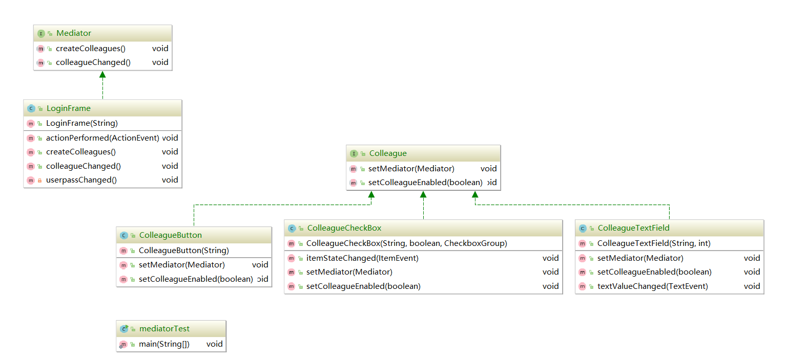

# 图解设计模式读书笔记

## 6大设计原则
### 单一职责原则

There should never be more than one reason for a class to change.即一个类的设计尽量做到只有一个原因引起变化。


### 接口隔离原则

接口分为两种：

- 实例接口：即class类
- 类接口：即interface类

其有两种定义：

- Clients should not be forced to depend upon interfaces that  they don't use.（客户端不应该依赖它不需要的接口）
- The dependency of one class to another one should depend on the smallest possible interface.（类间的依赖关系应该建立在最小的接口上。）


### 迪米特法则

Law of Demeter,LoD.也称最少知识原则（Least Knowledge Principle，LKP），即一个对象应该对其他对象有最少的了解。通俗的说，一个类应该对自己需要耦合或调用的类知道得最少，你的内部是如何复杂都和我没关系，那是你的事，我就知道你提供的这么多public方法，我就调用这么多，其他一概不关心。


### 里氏替换原则（子类与父类的使用）

两种定义：

- If for each object o1 of type S there is an object o2 of type T such that fot all programs P defined in terms of T, the behavior of P is unchanged when o1 is substituted for o2 then S is a subtyoe of T.（如果对每一个类型为S的对象o1，都有类型为T的对象o2，使得以T定义的所有程序P在所有的对象o1都替换为o2时，程序P的行为没有发生变化，那么类型S是类型T的子类型）
- Functions that use pointers or references to base classes must be able to use objects of derived classed without knowing it.（所有引用基类的地方必须能透明地使用其子类的对象。）


### 依赖倒置原则

Dependence Inversion Principle,DIP.原始定义：

High level modules should not depend upon low level modules. Both should depend upon abstractions. Abstractions should not depend upon details. Details should depend upon adbtractions.

- 高层模块不应该依赖底层模块，两者都应该依赖其抽象；
- 抽象不应该依赖细节
- 细节应该依赖抽象


### 开闭原则（OCP）

Sofeware entities like classes,modules and functions should be open for extension but closed for modifications.

对拓展开放，对修改关闭


## 单例模式


## iterator迭代模式
迭代模式常用于遍历类似数组这样的变量。它是把for循环中的变量的作用进行抽象化、通用化后形成的模式。

例子：书架和遍历书籍

集合接口：

```java
package scheme.iterator;

public interface Aggregate {
    public Iterator iterator();
    public int getLength();
    public Object get(int index);
    public void append(Object o);
}

```

书籍类：

```java
package scheme.iterator;

public class Book {
    private String name;

    public Book(String name) {
        this.name = name;
    }

    public String getName() {
        return name;
    }

}

```

实现集合接口的书架：

```java
package scheme.iterator;

import java.util.ArrayList;
import java.util.List;

public class BookShelf implements Aggregate{

    private List books;

    public BookShelf() {
        this.books = new ArrayList();
    }

    @Override
    public int getLength(){
        return books.size();
    }

    @Override
    public Object get(int index) {
        return (Book) books.get(index);
    }

    @Override
    public void append(Object o) {
        books.add(o);
    }

    @Override
    public Iterator iterator() {
        return new BookShelfIterator<Book>(this);
    }
}


```
迭代器接口：

```java
package scheme.iterator;

public interface Iterator {
    public abstract boolean hasNext();
    public abstract Object next();
}

```
具体实现的迭代器：

```java
package scheme.iterator;

public class BookShelfIterator<T> implements Iterator{

    private Aggregate bookShelf;
    private int index;

    public BookShelfIterator(BookShelf bookShelf) {
        this.bookShelf = bookShelf;
        this.index = 0;
    }

    @Override
    public boolean hasNext() {
        if(index < bookShelf.getLength()){
            return true;
        }
        return false;
    }

    @Override
    public Object next() {
        T t = (T) bookShelf.get(index);
        index++;
        return t;
    }
}

```
测试类：

```java
package scheme.iterator;

public class IteratorTest {

    public static void main(String[] args) {
        Aggregate bookShelf = new BookShelf();
        bookShelf.append(new Book("A man"));
        bookShelf.append(new Book("B Boy"));
        bookShelf.append(new Book("C Girl"));
        bookShelf.append(new Book("D Dog"));
        Iterator iterator = bookShelf.iterator();
        while(iterator.hasNext()){
            Book book = (Book) iterator.next();
            System.out.println(book.getName());
        }
    }
}

```
运行结果：

```
A man
B Boy
C Girl
D Dog
```


## Adapter适配器模式

Adapter模式又叫Wrapper（包装）模式，一般用于填补“现有的程序”和“所需程序”之间的差异。如笔记本电脑需要一个适配器以把120v的交流电转化为12v的直流电。


Adapter模式有两种：
- 类适配器模式（使用继承的适配器）
- 对象适配器模式（使用委托的适配器）

实例（书中练习题2-2），分别用类适配器和对象适配器实现

通用类：

```
package scheme.adapter;

import java.io.IOException;

/**
 * Created by zwz on 2019/3/10.
 */
public interface FileIo {
    public void readFromFile(String fileName) throws IOException;
    public void writeToFile(String fileName) throws IOException;
    public String getValue(String key);
    public void setValue(String key,String value);
}

```
类适配器模式实现：

```
package scheme.adapter;

import java.io.*;
import java.util.Enumeration;
import java.util.Properties;

/**
 * Created by zwz on 2019/3/10.
 */
public class FilePropertiresForClass extends Properties implements FileIo{

    @Override
    public void readFromFile(String fileName) throws IOException {
        InputStream in = null;
        try{
            in = new BufferedInputStream(new FileInputStream(fileName));
            this.load(in);
            Enumeration enumeration = this.propertyNames();
            while(enumeration.hasMoreElements()){
                String key = (String) enumeration.nextElement();
                System.out.println(this.getValue(key));
            }
        } finally {
            if(in != null){
                in.close();
            }
        }

    }

    @Override
    public void writeToFile(String fileName) throws IOException {
        this.store(new FileOutputStream(fileName),"save");
    }

    @Override
    public String getValue(String key) {
        return this.getProperty(key);
    }

    @Override
    public void setValue(String key, String value) {
        this.setProperty(key,value);
    }
}

```
对象适配器实现：

```
package scheme.adapter;

import java.io.*;
import java.util.Enumeration;
import java.util.Properties;

/**
 * Created by zwz on 2019/3/10.
 */
public class FilePropertiesForObject implements FileIo{
    private Properties properties;

    public FilePropertiesForObject(Properties properties) {
        this.properties = properties;
    }

    @Override
    public void readFromFile(String fileName) throws IOException {
        InputStream in = null;
        try{
            in = new BufferedInputStream(new FileInputStream(fileName));
            properties.load(in);
            Enumeration enumeration = properties.propertyNames();
            while(enumeration.hasMoreElements()){
                String key = (String) enumeration.nextElement();
                System.out.println(this.getValue(key));
            }
        } finally {
            if(in != null){
                in.close();
            }
        }

    }

    @Override
    public void writeToFile(String fileName) throws IOException {
        properties.store(new FileOutputStream(fileName),"save");
    }

    @Override
    public String getValue(String key) {
        return properties.getProperty(key);
    }

    @Override
    public void setValue(String key, String value) {
        properties.setProperty(key,value);
    }

}

```
测试类：

```
package scheme.adapter;

import java.io.IOException;
import java.util.Properties;

/**
 * Created by zwz on 2019/3/10.
 */
public class AdapterTest {
    public static void main(String[] args) throws IOException {
        //FileIo properties = new FilePropertiresForClass();
        FileIo properties = new FilePropertiesForObject(new Properties());
        properties.setValue("Jack","21");
        properties.setValue("Mary","22");
        properties.setValue("Tom","23");
        properties.setValue("Tony","24");
        properties.writeToFile("test.properties");
        properties.readFromFile("test.properties");
    }
}

```
运行结果：

```
22
23
24
21
```


## Temple(模板) Method模式
在模板模式中，父类定义了组成模板的方法，即某种流程的具体方法，而实现交给了字类，流程的执行顺序（具体方法的执行流程）则是在父类中定义实现了，所以父类一般是抽象类。

## Factory Method（工厂方法）模式
它是Temple method的典型运用，用于生成某种对象，生成的可能会用到模板方法。

工厂模式有三种形式：
- 简单工厂：又叫静态工厂，一把抓，什么产品都在一个方法中创建。
- 工厂方法：每需要生产一个产品就要一个新工厂，创建产品的实现交给实现类。拓展通过增加是实现类，容易造成代码泛滥。
- 抽象工厂：抽象父类中定义了生产各种产品的方法，实现交给字类。拓展需同时改变抽象类和实现类。

抽象类虽然不能实例化，但可以有构造函数，这样其字类便可通过调用抽象类的构造函数对其实例化。

## strategy策略模式
对于不同的问题用不同的算法去解决，这就是策略模式
实例：猜拳游戏

## Composite混合模式
能够把容器与内容具有一致性，创造出递归结构的模式就是Composite模式。如文件加和文件就具有一致性，可以被统称为“目录条目”。
实例程序：文件和文件夹


## decorator装饰着模式
即不断地对一个对象装饰（增加显示效果、功能等）的设计模式

示例程序：给文字增加装饰边框

显示抽象类：

```java
package scheme.decorator;

public abstract class Display {
    //获取横向字符数
    public abstract int getColumns();
    //获取行
    public abstract int getRows();
    //获取每一行的字符串
    public abstract String getRowText(int row);
    public void show(){
        int row = getRows();
        for(int i = 0; i<row; i++){
            System.out.println(getRowText(i));
        }
    }
}

```
显示字符串：

```java
package scheme.decorator;

public class StringDisplay extends Display{
    private String string;

    public StringDisplay(String string) {
        this.string = string;
    }

    @Override
    public int getColumns() {
        return string.getBytes().length;
    }

    @Override
    public int getRows() {
        //StringDisplay只显示一行
        return 1;
    }

    @Override
    public String getRowText(int row) {
        if(row == 0){
            return string;
        }
        return null;
    }
}

```
装饰类抽象类：其中包含了被装饰物，他同时也是Display类型，类似composite模式

```java
package scheme.decorator;

public abstract class Border extends Display{
    //被装饰物
    protected Display display;

    public Border(Display display) {
        this.display = display;
    }
}

```
装饰实现类：只在左右两边装饰的类

```java
package scheme.decorator;

/**
 * 只在左右两侧装饰的装饰类
 */
public class SideBorder extends Border{
    //装饰字符
    private char decorateChar;
    public SideBorder(Display display,char ch) {
        super(display);
        this.decorateChar = ch;
    }

    @Override
    public int getColumns() {
        return 1 + display.getColumns() + 1;
    }

    @Override
    public int getRows() {
        return display.getRows();
    }

    @Override
    public String getRowText(int row) {
        return decorateChar + display.getRowText(row) + decorateChar;
    }
}

```
装饰实现类，上下左右都装饰的类
```java
package scheme.decorator;

/**
 * 上下左右都装饰的装饰类
 */
public class FullBorder extends Border{
    public FullBorder(Display display) {
        super(display);
    }

    @Override
    public int getColumns() {
        return 1 + display.getColumns() + 1;
    }

    @Override
    public int getRows() {
        return 1 + display.getRows() + 1;
    }

    @Override
    public String getRowText(int row) {
        if(row == 0 || row == display.getRows() + 1){
            //首行
            return "+" + makeLine('-', display.getColumns()) + "+";
        } else{
            return "|" + display.getRowText(row - 1) + "|";
        }
    }

    /**
     * 重复出现多次的装饰字段
     * @param ch
     * @param time
     * @return
     */
    private String makeLine(char ch, int time){
        StringBuilder builder = new StringBuilder();
        for(int i = 0; i<time; i++){
            builder.append(ch);
        }
        return builder.toString();
    }
}

```
测试类：

```java
package scheme.decorator;

/**
 * Created by zwz on 2019/3/14.
 */
public class DecoratorTest {
    public static void main(String[] args) {
        Display d1 = new StringDisplay("Hello World");
        d1.show();

        Display d2 = new SideBorder(d1,'#');
        d2.show();

        Display d3 = new FullBorder(d2);
        d3.show();

        Display d4 = new SideBorder(
                new FullBorder(
                        new FullBorder(
                        new SideBorder(
                                new FullBorder(
                                        new StringDisplay("你好，世界。")),'*'))),'/');
        d4.show();
    }
}

```
运行结果：

```properties
Hello World
#Hello World#
+-------------+
|#Hello World#|
+-------------+
/+------------------------+/
/|+----------------------+|/
/||*+------------------+*||/
/||*|你好，世界。|*||/
/||*+------------------+*||/
/|+----------------------+|/
/+------------------------+/
```
与composite相比，虽然它们都体现了一致性，但decorator模式重在为对象增加新功能，而compisite模式重在体现一致性。java.io包中就使用了decorator模式，如BufferInputstream、FileInputStream等都是对InputStream装饰而来的。

习题：增加显示多行字符串的类：

```java
package scheme.decorator;

import java.util.ArrayList;
import java.util.List;

/**
 * Created by zwz on 2019/3/16.
 */
public class MutiStringDisplay extends Display{
    private List<String> strings;

    public MutiStringDisplay() {
        this.strings = new ArrayList<String>();
    }

    public void add(String string){
        this.strings.add(string);
    }

    @Override
    public int getColumns() {
        int col = 0;
        int length;
        for(int i = 0; i< strings.size(); i++){
            length = strings.get(i).getBytes().length;
            if(length > col){
                col = length;
            }
        }
        return col;
    }

    @Override
    public int getRows() {
        return strings.size();
    }

    @Override
    public String getRowText(int row) {
        return strings.get(row);
    }
}

```
运行结果：

```properties
hello
i am jack
how are you
#hello#
#i am jack#
#how are you#
+-----------+
|hello|
|i am jack|
|how are you|
+-----------+
```


## **Visitor模式**

在visitor访问者模式中，数据结构和处理被分开来。通常会有一个“访问者”的类来访问数据结构中的元素，并把各对各元素的处理交给访问者类。

示例程序，访问composite模式中用到的文件和文件夹。

Visitor接口：访问者需实现

```java
package scheme.visitor;

public abstract class Visitor {
    public abstract void visit(File fil);
    public abstract void visit(Diretory file);
}
```

Element接口：定义了accept方法，数据结构类实现，以接受访问本数据结构类

```java
package scheme.visitor;

public interface Element{
    public void accept(Visitor visitor);
}
```


Entry抽象类：定义了数据结构类需实现的方法

```java
package scheme.visitor;


import java.util.Iterator;

public abstract class Entry implements Element{
    public abstract String getName();
    public abstract int getSize();

    public void add(Entry entry) throws FileTreatmentAException{
        throw new FileTreatmentAException();
    }

    public Iterator iterator(){
        throw new FileTreatmentAException();
    }

    @Override
    public String toString(){
        return getName() + "(" + getSize() + ")";
    }
}
```


File类：

```java
package scheme.visitor;


public class File extends Entry{
    private String name;
    private int size;

    public File(String name, int size) {
        this.name = name;
        this.size = size;
    }

    /**
     * 提供一个api用于接受访问本数据结构
     * @param visitor
     */
    @Override
    public void accept(Visitor visitor) {
        visitor.visit(this);
    }

    @Override
    public String getName() {
        return this.name;
    }

    @Override
    public int getSize() {
        return this.size;
    }
}
```


Diretory类：

```java
package scheme.visitor;

import java.util.ArrayList;
import java.util.Iterator;
import java.util.List;

public class Diretory extends Entry{

    private String name;
    private List<Entry> dir = new ArrayList<Entry>();

    public Diretory(String name) {
        this.name = name;
    }

    /**
     * 提供一个api用于接受访问本数据结构
     * @param visitor
     */
    @Override
    public void accept(Visitor visitor) {
        visitor.visit(this);
    }

    @Override
    public String getName() {
        return this.name;
    }

    @Override
    public int getSize() {
        int size = 0;
        Iterator it = dir.iterator();
        while(it.hasNext()){
            Entry entry = (Entry) it.next();
            size += entry.getSize();
        }
        return size;
    }

    @Override
    public void add(Entry entry){
        dir.add(entry);
    }

    public Iterator iterator() {
        return dir.iterator();
    }
}
```


自定义异常：

```java
package scheme.visitor;

public class FileTreatmentAException extends RuntimeException{

    public FileTreatmentAException() {
    }

    public FileTreatmentAException(String message) {
        super(message);
    }
}
```


Visitor实现类（真正的访问者）：

```java
package scheme.visitor;

import java.util.Iterator;


public class ListVisitor extends Visitor{
    private String currDiretory = "";

    public ListVisitor() {
    }

    @Override
    public void visit(File file) {
        System.out.println(currDiretory + "/" + file);
    }

    @Override
    public void visit(Diretory diretory) {
        System.out.println(currDiretory + "/" + diretory);
        String saveDir = currDiretory;
        currDiretory = currDiretory + "/" + diretory.getName();
        Iterator iterator = diretory.iterator();
        while(iterator.hasNext()){
            Entry entry = (Entry) iterator.next();
            entry.accept(this);
        }
        currDiretory = saveDir;
    }
}
```


测试类：

```java
package scheme.visitor;

public class VisitorTest {
    public static void main(String[] args) {
        System.out.println("making root entries...");
        Diretory rootDir = new Diretory("root");
        Diretory bindDir = new Diretory("bind");
        Diretory tmpDir = new Diretory("tmp");
        Diretory usrDir = new Diretory("usr");

        rootDir.add(bindDir);
        rootDir.add(tmpDir);
        rootDir.add(usrDir);

        bindDir.add(new File("001",1000));
        bindDir.add(new File("002",2000));
        rootDir.accept(new ListVisitor());

        System.out.println("making use entries...");
        Diretory yuki = new Diretory("yuki");
        Diretory hanako = new Diretory("hanoko");
        Diretory tomura = new Diretory("tomura");
        usrDir.add(yuki);
        usrDir.add(hanako);
        usrDir.add(tomura);
        yuki.add(new File("index.html",1000));
        yuki.add(new File("head.xml",2000));
        hanako.add(new File("too.js",2000));
        tomura.add(new File("composite.java",10));
        tomura.add(new File("hahah",1000));
        usrDir.accept(new ListVisitor());
    }
}
```


运行结果：

```properties
making root entries...
/root(3000)
/root/bind(3000)
/root/bind/001(1000)
/root/bind/002(2000)
/root/tmp(0)
/root/usr(0)
making use entries...
/usr(6010)
/usr/yuki(3000)
/usr/yuki/index.html(1000)
/usr/yuki/head.xml(2000)
/usr/hanoko(2000)
/usr/hanoko/too.js(2000)
/usr/tomura(1010)
/usr/tomura/composite.java(10)
/usr/tomura/hahah(1000)
```

> 由代码中可以看出，对于数据结构的处理是交给Visitor的，也就是说数据结构类本身不做处理，它只保存自身的特性，具体要干什么由Visitor决定，这是Visitor模式重要的一点。


## **chain of responsibility责任链模式**

当一个人被要求做某件事情时，如果它自己能处理就处理，如果不能就交给下一个人处理，这就是责任链模式。

示例程序：Support为处理问题类要实现的接口，具体实现类处理特定形式的问题

类图：


问题类：

```java
package scheme.chain;

public class Trouble {
    //问题编号
    private int num;
    
    public Trouble(int num) {
        this.num = num;
    }

    public int getNum() {
        return num;
    }

    @Override
    public String toString() {
        return "Trouble{" +
                "num=" + num +
                '}';
    }
}
```


Support抽象类：解决问题的类需实现的类

```java
package scheme.chain;

public abstract class Support {
    private String name;
    private Support next;

    public Support(String name) {
        this.name = name;
    }

    /**
     * 设置推卸给的人
     * @param support
     * @return
     */
    public Support setNext(Support support){
        this.next = support;
        return next;
    }

    public final void support(Trouble trouble){
        if(resolve(trouble)){
            done(trouble);
        } else if(next != null){
            next.support(trouble);
        } else {
            fail(trouble);
        }
    }

    //解决问题的方法
    protected abstract boolean resolve(Trouble trouble);

    protected void done(Trouble trouble){
        System.out.println(trouble + "is done by" + this + ".");
    }

    protected void fail(Trouble trouble){
        System.out.println(trouble + "can not be rosolved");
    }

    @Override
    public String toString() {
        return "[" + name + "]";
    }
}
```


support方法的循环实现：


NoSupport类：不解决问题

```java
package scheme.chain;

public class NoSupport extends Support{
    public NoSupport(String name) {
        super(name);
    }

    @Override
    protected boolean resolve(Trouble trouble) {
        return false;
    }
}
```


OddSupport类：只解决基数编号的类

```java
package scheme.chain;

public class OddSupport extends Support{
    public OddSupport(String name) {
        super(name);
    }

    @Override
    protected boolean resolve(Trouble trouble) {
        if((trouble.getNum() & 1) == 1){
            return true;
        }
        return false;
    }
}
```


LimitSupport类：只解决限制编号内的问题

```java
package scheme.chain;

public class LimitSupport extends Support{
    private int limit;

    public LimitSupport(String name, int limit) {
        super(name);
        this.limit = limit;
    }

    @Override
    protected boolean resolve(Trouble trouble) {
        if(trouble.getNum() < limit){
            return true;
        }else {
            return false;
        }
    }
}
```


SpecialSupport类：解决特定编号问题的类

```java
package scheme.chain;

public class SpecialSupport extends Support{
    private int num;
    public SpecialSupport(String name, int num) {
        super(name);
        this.num = num;
    }

    @Override
    protected boolean resolve(Trouble trouble) {
        if(trouble.getNum() == num){
            return true;
        }
        return false;
    }
}
```


测试类：

```java
package scheme.chain;

public class ChainResponsibilityTest {
    public static void main(String[] args) {
        Support s1 = new NoSupport("s1");
        Support s2 = new LimitSupport("s2",100);
        Support s3 = new OddSupport("s3");
        Support s4 = new SpecialSupport("s4",429);
        Support s5 = new LimitSupport("s5",200);
        Support s6 = new LimitSupport("s6",300);
        s1.setNext(s2).setNext(s4).setNext(s5).setNext(s3).setNext(s6);
        for(int i = 0; i < 500; i++){
            s1.support(new Trouble(i));
        }
    }
}
```


## Facede（简单窗口）模式


## Mediator（仲裁者）模式

类图：当一个团队里面有各个成员一起工作时，情况会变得很杂乱无章，这时需要一个中间人，它负责去**接收各组员的报告，并下达指令给各组员。**

### 例子：

GUI实现的登陆界面，对于界面中的各个组件（文本、按钮、单选框等）变化时，将情况反馈给仲裁者，下一步的动作完全由mediator仲裁者决定



#### Colleague接口：组员需实现

```

```

#### ColleagueButton类：Button类型组员

```java
package scheme.mediator;

import java.awt.*;

/**
 * Created by zwz on 2019/3/20.
 */
public class ColleagueButton extends Button implements Colleague{

    private Mediator mediator;

    public ColleagueButton(String label) {
        super(label);
    }

    @Override
    public void setMediator(Mediator mediator) {
        this.mediator = mediator;
    }

    @Override
    public void setColleagueEnabled(boolean b) {
        //设置控件按钮是否可被按下
        setEnabled(b);
    }
}

```

#### ColleagueCheckBox类：CheckBox组员

```
package scheme.mediator;

import java.awt.*;
import java.awt.event.ItemEvent;
import java.awt.event.ItemListener;

/**
 * Created by zwz on 2019/3/20.
 */
public class ColleagueCheckBox extends Checkbox implements Colleague,ItemListener{

    private Mediator mediator;

    public ColleagueCheckBox(String label, boolean state, CheckboxGroup group) throws HeadlessException {
        super(label, state, group);
    }

    /**
     * 通知仲裁者组员有变化
     * @param e
     */
    @Override
    public void itemStateChanged(ItemEvent e) {
        mediator.colleagueChanged();
    }

    @Override
    public void setMediator(Mediator mediator) {
        this.mediator = mediator;
    }

    @Override
    public void setColleagueEnabled(boolean b) {
        setEnabled(b);
    }
}

```

#### ColleagueTextField类：Text组员

```java
package scheme.mediator;

import java.awt.*;
import java.awt.event.TextEvent;
import java.awt.event.TextListener;

/**
 * Created by zwz on 2019/3/20.
 */
public class ColleagueTextField extends TextField implements Colleague,TextListener{
    private Mediator mediator;

    public ColleagueTextField(String text, int column) throws HeadlessException {
        super(text,column);
    }

    @Override
    public void setMediator(Mediator mediator) {
        this.mediator = mediator;
    }

    @Override
    public void setColleagueEnabled(boolean b) {
        //设置是否可用
        setEnabled(b);
        //可用白色背景，不可用灰色背景
        setBackground(b ? Color.white : Color.lightGray);
    }

    /**
     * 文本值变化监听事件
     * @param e
     */
    @Override
    public void textValueChanged(TextEvent e) {
        //通知仲裁者组员有变化
        mediator.colleagueChanged();
    }
}

```

#### Mediator：仲裁者实现接口

```
package scheme.mediator;

/**
 * Created by zwz on 2019/3/20.
 */
public interface Mediator {
    public abstract void createColleagues();
    public abstract void colleagueChanged();
}

```

#### LoginFrame：实际的仲裁者

```
package scheme.mediator;

import java.awt.*;
import java.awt.event.ActionEvent;
import java.awt.event.ActionListener;

/**
 * 实际的仲裁者
 * Created by zwz on 2019/3/20.
 */
public class LoginFrame extends Frame implements ActionListener,Mediator{

    private ColleagueCheckBox checkGuest;
    private ColleagueCheckBox checkLogin;
    private ColleagueTextField textUser;
    private ColleagueTextField textPass;
    private ColleagueButton buttonOk;
    private ColleagueButton buttonCancel;

    //构造函数
    //生成各个colleague后并显示对话框
    public LoginFrame(String title){
        super(title);
        setBackground(Color.lightGray);
        setLayout(new GridLayout(4,2));
        //生成各个colleague
        createColleagues();
        //配置
        add(checkGuest);
        add(checkLogin);
        add(new Label("UserName:"));
        add(textUser);
        add(new Label("Password:"));
        add(textPass);
        add(buttonOk);
        add(buttonCancel);
        //设置初始各组件的启用状态
        colleagueChanged();
        //显示
        pack();
        show();
    }

    @Override
    public void actionPerformed(ActionEvent e) {
        System.out.println(e.toString());
        System.exit(0);
    }

    @Override
    public void createColleagues() {
        CheckboxGroup g = new CheckboxGroup();
        checkGuest = new ColleagueCheckBox("Guest",true,g);
        checkLogin = new ColleagueCheckBox("Login",false,g);
        textUser = new ColleagueTextField("",10);
        textPass = new ColleagueTextField("",10);
        textPass.setEchoChar('*');
        buttonOk = new ColleagueButton("OK");
        buttonCancel = new ColleagueButton("Cancel");
        //设置mediator
        checkGuest.setMediator(this);
        checkLogin.setMediator(this);
        textUser.setMediator(this);
        textPass.setMediator(this);
        buttonOk.setMediator(this);
        buttonCancel.setMediator(this);
        //设置Listener
        checkGuest.addItemListener(checkGuest);
        checkLogin.addItemListener(checkLogin);
        textUser.addTextListener(textUser);
        textPass.addTextListener(textPass);
        buttonOk.addActionListener(this);
        buttonCancel.addActionListener(this);

    }

    @Override
    public void colleagueChanged() {
        if(checkGuest.getState()){
            //guest mode
            textUser.setColleagueEnabled(false);
            textPass.setColleagueEnabled(false);
            buttonOk.setColleagueEnabled(true);
        }else{
            textUser.setColleagueEnabled(true);
            userpassChanged();
        }
    }

    private void userpassChanged() {
        if(textUser.getText().length()>0){
            textPass.setColleagueEnabled(true);
            if(textPass.getText().length()>0){
                buttonOk.setColleagueEnabled(true);
            } else {
                buttonOk.setColleagueEnabled(false);
            }
        } else {
            textPass.setColleagueEnabled(false);
            buttonOk.setColleagueEnabled(false);
        }

    }
}
```

#### 测试类：

```
package scheme.mediator;

/**
 * Created by zwz on 2019/3/21.
 */
public class mediatorTest {
    public static void main(String[] args) {
        new LoginFrame("Mediator Sample");
    }
}

```


### 与其它设计模式对比

#### 对比Facede

​	在mediator中，mediator角色和Colleegues角色互相交互，而在Facade模式中，Facade单方面使用其他角色来对外提供高层接口（API）。即mediator模式时双向的，Facade模式是单向的。

#### 对比Observer模式

​	有时Observer模式用于实现mediator和colleague角色之间的通信。


## Memonto模式


## State模式


## Command命令模式


# 管理状态

## Observer模式


- Observer：订阅者，非java内部实现
- NumberGenerator：发布者


### 对比java中实现