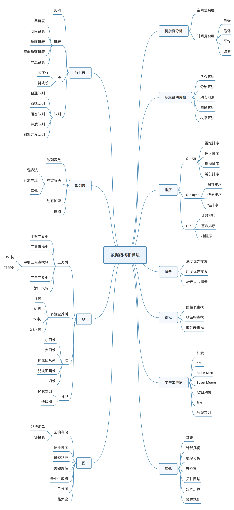

# 基础知识

- 操作系统
- 计算机网络
- 编译原理
- 数据结构和算法

是什么、为什么、怎么做

# 数据结构和算法

## 20个常用基础的数据结构和算法

- 数据结构：数组、链表、栈、队列、散列表、二叉树、堆、跳表、图、Trie 树
- 算法：递归、排序、二分查找、搜索、哈希算法、贪心算法、分治算法、回溯算法、动态规划、字符串匹配算法

重点掌握：来历、自身的特点、适合解决的问题、实际的运用场景

学习技巧

- 边学边练、适度刷题
- 多问、多思考、多互动
- 打怪升级学习法：在一个课程中设立一个切实可行的目标去执行
- 知识需要沉淀，切忌浮躁

# 复杂度分析

时间复杂度分类

- 最好、最坏情况时间复杂度
- 最坏情况时间复杂度
- 平均情况时间复杂度
- 均摊时间复杂度

